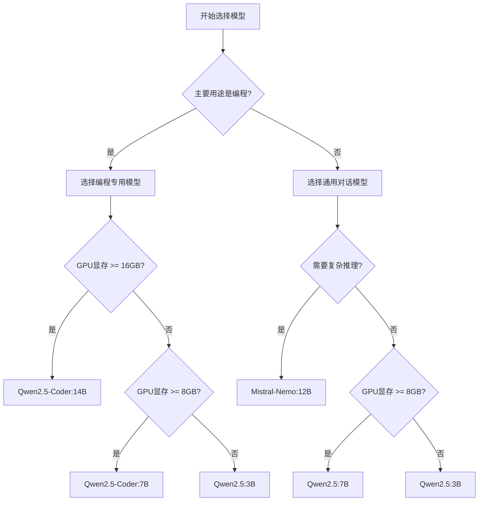

---
tags:
  - opencode
  - ollama
  - models
  - configuration
  - guide
created: 2026-01-15
---

# OpenCode 模型选择与配置指南

## 🎯 推荐模型对比

### 编程专用模型（强烈推荐）

| 模型 | 参数量 | 上下文 | 编程能力 | 工具调用 | 硬件要求 |
|------|--------|--------|----------|----------|----------|
| **Qwen2.5-Coder** | 7B/14B | 32K | ⭐⭐⭐⭐⭐ | ✅ | 中等 |
| **DeepSeek-Coder-V2** | 6.7B/16B | 32K | ⭐⭐⭐⭐ | ✅ | 中等 |
| **CodeLlama** | 7B/13B/34B | 16K | ⭐⭐⭐ | ❌ | 中高 |

### 通用对话模型

| 模型 | 参数量 | 上下文 | 编程能力 | 推理能力 | 硬件要求 |
|------|--------|--------|----------|----------|----------|
| **Qwen2.5** | 3B/7B/14B | 32K | ⭐⭐⭐ | ⭐⭐⭐⭐ | 低-中等 |
| **Mistral-Nemo** | 12B | 128K | ⭐⭐⭐ | ⭐⭐⭐⭐⭐ | 中等 |
| **Llama3.1** | 8B/70B | 128K | ⭐⭐ | ⭐⭐⭐⭐ | 中-高 |

## 📊 硬件要求矩阵

| GPU 显存 | 推荐模型 | 预期性能 | 适用场景 |
|---------|----------|----------|----------|
| 4GB | Qwen2.5:1.5B | 40-60 tok/s | 基础编程辅助 |
| 8GB | Qwen2.5:3B | 25-40 tok/s | 轻量级开发 |
| 16GB | Qwen2.5-Coder:7B | 15-25 tok/s | 通用编程任务 |
| 24GB+ | Qwen2.5-Coder:14B | 8-15 tok/s | 复杂项目开发 |

## 🌲 模型选择决策树



## ⚙️ 模型下载命令

```bash
# 推荐模型下载
ollama pull qwen2.5-coder:7b           # 编程专用，推荐
ollama pull qwen2.5:7b                 # 通用模型，平衡
ollama pull mistral-nemo:12b           # 推理能力强
ollama pull qwen2.5:3b                 # 轻量级选择

# 创建自定义上下文版本
ollama run qwen2.5-coder:7b
/set parameter num_ctx 16384
/save qwen2.5-coder:7b-16k
/bye

# 验证已安装模型
ollama list
```

## 🔧 OpenCode 高级配置

### 完整配置示例

```json
{
  "$schema": "https://opencode.ai/config.json",
  "model": "ollama/qwen2.5-coder:7b",
  "provider": {
    "ollama": {
      "npm": "@ai-sdk/openai-compatible",
      "name": "Ollama (Local)",
      "options": {
        "baseURL": "http://localhost:11434/v1",
        "timeout": 120000,
        "maxRetries": 3,
        "headers": {
          "Connection": "keep-alive"
        }
      },
      "models": {
        "qwen2.5-coder:7b": {
          "name": "Qwen2.5-Coder 7B (Local)",
          "options": {
            "temperature": 0.1,
            "top_p": 0.9,
            "extraBody": {
              "num_ctx": 8192,
              "num_batch": 512,
              "repeat_penalty": 1.1
            }
          },
          "limit": {
            "context": 8192,
            "output": 4096
          }
        },
        "qwen2.5-coder:7b-16k": {
          "id": "qwen2.5-coder:7b",
          "name": "Qwen2.5-Coder 7B (16K)",
          "options": {
            "extraBody": {
              "num_ctx": 16384
            }
          },
          "limit": {
            "context": 16384,
            "output": 8192
          }
        }
      }
    }
  },
  "plugin": ["@opencode/file-operations"],
  "tools": {
    "timeout": 60000,
    "maxParallel": 3
  }
}
```

### 环境变量设置

```bash
# ~/.bashrc 或 ~/.zshrc
export OLLAMA_HOST=0.0.0.0:11434
export OLLAMA_ORIGINS=*
export OLLAMA_MODELS=/path/to/models
export OLLAMA_KEEP_ALIVE=24h
export OLLAMA_MAX_LOADED_MODELS=2

# 应用配置
source ~/.bashrc
```

### 系统服务配置

```ini
# /etc/systemd/system/ollama.service
[Unit]
Description=Ollama Service
After=network-online.target

[Service]
ExecStart=/usr/local/bin/ollama serve
User=ollama
Group=ollama
Restart=always
RestartSec=3
Environment="OLLAMA_HOST=0.0.0.0:11434"
Environment="OLLAMA_KEEP_ALIVE=24h"

[Install]
WantedBy=multi-user.target
```

## 🔗 相关文档

- [[OpenCode快速开始]] - 基础安装配置
- [[OpenCode性能优化]] - 量化与加速技巧
- [[OpenCode配置文件模板]] - 可复用的配置示例

## 📚 外部资源

- [Qwen Models](https://huggingface.co/Qwen)
- [Ollama Library](https://ollama.ai/library)
- [Hugging Face Models](https://huggingface.co/models)
