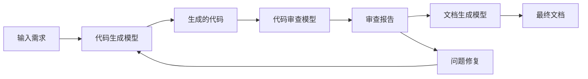

---
tags:
  - opencode
  - ollama
  - advanced
  - cicd
  - docker
  - guide
created: 2026-01-15
---

# OpenCode 高级应用与 CI/CD 集成

## 🎯 多模型协作

### 模型切换策略

```javascript
// 根据任务类型自动选择模型
function selectOptimalModel(task) {
    const modelMap = {
        'code-generation': 'qwen2.5-coder:7b',
        'code-review': 'deepseek-coder:6.7b',
        'documentation': 'mistral-nemo:12b',
        'debugging': 'qwen2.5-coder:7b',
        'refactoring': 'qwen2.5-coder:14b'
    };

    return modelMap[task] || 'qwen2.5:7b';
}
```

### 多模型协作管道

```bash
#!/bin/bash
# 多模型协作管道

INPUT_FILE=$1
echo "阶段 1: 代码生成 (Qwen2.5-Coder)"
opencode run "生成实现功能的代码" --model ollama/qwen2.5-coder:7b "$INPUT_FILE" > stage1.py

echo "阶段 2: 代码审查 (DeepSeek-Coder)"
opencode run "审查代码品质和安全性" --model ollama/deepseek-coder:6.7b stage1.py > stage2_review.txt

echo "阶段 3: 文档生成 (Mistral-Nemo)"
opencode run "生成代码文档" --model ollama/mistral-nemo:12b stage1.py > stage3_docs.md

echo "协作完成！"
```

### 模型集成工作流



## 🔧 自定义技能开发

### OpenCode 技能定义

```json
{
  "name": "local-code-review",
  "description": "本地代码审查技能",
  "parameters": {
    "file_path": {
      "type": "string",
      "description": "要审查的文件路径"
    },
    "review_type": {
      "type": "string",
      "enum": ["security", "performance", "style", "logic"],
      "description": "审查类型"
    }
  },
  "handler": "local-code-review.js"
}
```

### 自定义技能实现

```javascript
// local-code-review.js
module.exports = async function(params, context) {
    const { file_path, review_type } = params;

    // 读取文件内容
    const content = await context.readFile(file_path);

    // 构建审查提示
    const prompt = `请审查这段代码的${review_type}方面：

文件路径: ${file_path}

代码内容:
\`\`\`
${content}
\`\`\`

请提供：
1. 发现的问题列表
2. 严重程度评估
3. 改进建议
4. 代码示例`;

    // 调用本地模型
    const result = await context.ai.generate(prompt, {
        model: 'qwen2.5-coder:7b',
        temperature: 0.1
    });

    return {
        review: result.text,
        suggestions: extractSuggestions(result.text),
        score: calculateScore(result.text),
        timestamp: new Date().toISOString()
    };
};

function extractSuggestions(text) {
    // 提取建议的解析逻辑
    return text.match(/建议: (.*)/g) || [];
}

function calculateScore(text) {
    // 计算代码质量的简单评分
    const issues = (text.match(/问题:/g) || []).length;
    return Math.max(0, 100 - issues * 5);
}
```

### 技能注册与使用

```bash
# 注册技能
opencode skill install local-code-review

# 使用技能
opencode skill run local-code-review --file_path ./src/app.py --review_type security
```

## 🔄 CI/CD 集成

### GitHub Actions 工作流

```yaml
name: Local AI Code Review

on:
  pull_request:
    types: [opened, synchronize, reopened]
  workflow_dispatch:

jobs:
  ai-review:
    runs-on: ubuntu-latest

    steps:
      - name: Checkout code
        uses: actions/checkout@v4
        with:
          fetch-depth: 0

      - name: Setup Ollama
        run: |
          curl -fsSL https://ollama.ai/install.sh | sh
          ollama serve &
          sleep 5
          ollama pull qwen2.5-coder:7b

      - name: Setup OpenCode
        run: |
          npm install -g @opencode-ai/cli
          mkdir -p ~/.config/opencode
          cat > ~/.config/opencode/opencode.json <<EOF
          {
            "$schema": "https://opencode.ai/config.json",
            "provider": {
              "ollama": {
                "npm": "@ai-sdk/openai-compatible",
                "options": {
                  "baseURL": "http://localhost:11434/v1"
                }
              }
            }
          }
          EOF

      - name: AI Code Review
        id: review
        run: |
          # 获取变更文件
          CHANGED_FILES=$(git diff --name-only origin/main HEAD | grep "\.py$" | head -5)

          if [ -z "$CHANGED_FILES" ]; then
            echo "没有 Python 文件变更"
            exit 0
          fi

          # 对每个文件进行审查
          for file in $CHANGED_FILES; do
            echo "## 审查文件: $file" >> review.md
            opencode run "审查这段 Python 代码的安全性、性能和代码质量" --model ollama/qwen2.5-coder:7b "$file" >> review.md
            echo "---" >> review.md
          done

      - name: Comment PR
        uses: actions/github-script@v7
        with:
          script: |
            const fs = require('fs');
            const review = fs.readFileSync('review.md', 'utf8');
            github.rest.issues.createComment({
              issue_number: context.issue.number,
              owner: context.repo.owner,
              repo: context.repo.repo,
              body: review
            });
```

### GitLab CI 配置

```yaml
stages:
  - ai-review

ai-code-review:
  stage: ai-review
  image: ubuntu:22.04
  before_script:
    - apt-get update && apt-get install -y curl npm
    - curl -fsSL https://ollama.ai/install.sh | sh
    - npm install -g @opencode-ai/cli
    - ollama serve &
    - sleep 5
    - ollama pull qwen2.5-coder:7b
  script:
    - |
      for file in $(git diff --name-only $CI_MERGE_REQUEST_DIFF_BASE_SHA HEAD | grep "\.py$"); do
        echo "Reviewing $file"
        opencode run "审查代码质量" --model ollama/qwen2.5-coder:7b "$file"
      done
  only:
    - merge_requests
```

## 🐳 Docker 部署

### Dockerfile

```dockerfile
FROM nvidia/cuda:12.1-devel-ubuntu22.04

# 安装依赖
RUN apt-get update && apt-get install -y \
    curl \
    git \
    python3 \
    python3-pip \
    nodejs \
    npm \
    && rm -rf /var/lib/apt/lists/*

# 安装 Ollama
RUN curl -fsSL https://ollama.ai/install.sh | sh

# 安装 OpenCode
RUN npm install -g @opencode-ai/cli

# 下载模型
RUN ollama pull qwen2.5-coder:7b

# 配置
RUN mkdir -p /root/.config/opencode

COPY opencode.json /root/.config/opencode/
COPY entrypoint.sh /entrypoint.sh
RUN chmod +x /entrypoint.sh

EXPOSE 11434
HEALTHCHECK --interval=30s --timeout=10s --start-period=5s --retries=3 \
  CMD curl -f http://localhost:11434/api/tags || exit 1

ENTRYPOINT ["/entrypoint.sh"]
```

### entrypoint.sh

```bash
#!/bin/bash
set -e

# 启动 Ollama 服务
ollama serve &
sleep 5

# 检查服务健康
until curl -f http://localhost:11434/api/tags > /dev/null 2>&1; do
    echo "Waiting for Ollama to be ready..."
    sleep 2
done

echo "Ollama is ready!"

# 如果有参数，执行 OpenCode
if [ $# -gt 0 ]; then
    exec opencode "$@"
else
    # 否则保持服务运行
    wait
fi
```

### Docker Compose

```yaml
version: '3.8'

services:
  opencode-ollama:
    build:
      context: .
      dockerfile: Dockerfile
    container_name: opencode-ollama
    ports:
      - "11434:11434"
    volumes:
      - ./models:/root/.ollama
      - ./config:/root/.config/opencode
      - ./work:/workspace
    environment:
      - OLLAMA_HOST=0.0.0.0:11434
      - OLLAMA_GPU_MEMORY_FRACTION=0.8
      - OLLAMA_KEEP_ALIVE=24h
    deploy:
      resources:
        reservations:
          devices:
            - driver: nvidia
              count: 1
              capabilities: [gpu]
    restart: unless-stopped
    healthcheck:
      test: ["CMD", "curl", "-f", "http://localhost:11434/api/tags"]
      interval: 30s
      timeout: 10s
      retries: 3
      start_period: 40s

networks:
  default:
    name: opencode-network
```

### Kubernetes 部署

```yaml
apiVersion: v1
kind: ConfigMap
metadata:
  name: opencode-config
data:
  opencode.json: |
    {
      "provider": {
        "ollama": {
          "npm": "@ai-sdk/openai-compatible",
          "options": {
            "baseURL": "http://localhost:11434/v1"
          }
        }
      }
    }
---
apiVersion: apps/v1
kind: Deployment
metadata:
  name: opencode-ollama
spec:
  replicas: 1
  selector:
    matchLabels:
      app: opencode-ollama
  template:
    metadata:
      labels:
        app: opencode-ollama
    spec:
      containers:
      - name: opencode-ollama
        image: opencode-ollama:latest
        ports:
        - containerPort: 11434
        volumeMounts:
        - name: models
          mountPath: /root/.ollama
        - name: config
          mountPath: /root/.config/opencode
        resources:
          limits:
            nvidia.com/gpu: 1
      volumes:
      - name: models
        persistentVolumeClaim:
          claimName: ollama-models-pvc
      - name: config
        configMap:
          name: opencode-config
---
apiVersion: v1
kind: Service
metadata:
  name: opencode-ollama-service
spec:
  selector:
    app: opencode-ollama
  ports:
  - port: 11434
    targetPort: 11434
  type: LoadBalancer
```

## 🚀 性能监控与告警

### Prometheus 监控

```yaml
# prometheus.yml
scrape_configs:
  - job_name: 'opencode-ollama'
    static_configs:
      - targets: ['localhost:11434']
    metrics_path: '/metrics'
```

### 自定义监控脚本

```bash
#!/bin/bash
# 健康检查脚本

# 检查 Ollama 服务
if ! curl -f http://localhost:11434/api/tags > /dev/null 2>&1; then
    echo "ERROR: Ollama service is down"
    exit 1
fi

# 检查 GPU 使用率
GPU_USAGE=$(nvidia-smi --query-gpu=utilization.gpu --format=csv,noheader,nounits | awk '{print $1}')
if [ $GPU_USAGE -gt 95 ]; then
    echo "WARNING: GPU usage is high: ${GPU_USAGE}%"
fi

# 检查内存使用
MEMORY_USAGE=$(free | grep Mem | awk '{printf "%.0f", $3/$2 * 100}')
if [ $MEMORY_USAGE -gt 90 ]; then
    echo "WARNING: Memory usage is high: ${MEMORY_USAGE}%"
fi

echo "Health check passed"
exit 0
```

## 🔗 相关文档

- [[OpenCode快速开始]] - 基础安装配置
- [[OpenCode实际应用场景]] - 常见使用场景
- [[OpenCode性能优化]] - 性能调优技巧

## 📚 外部资源

- [OpenCode Documentation](https://opencode.ai/docs)
- [Docker Hub](https://hub.docker.com/)
- [Kubernetes Documentation](https://kubernetes.io/docs/)
- [GitHub Actions](https://docs.github.com/en/actions)
