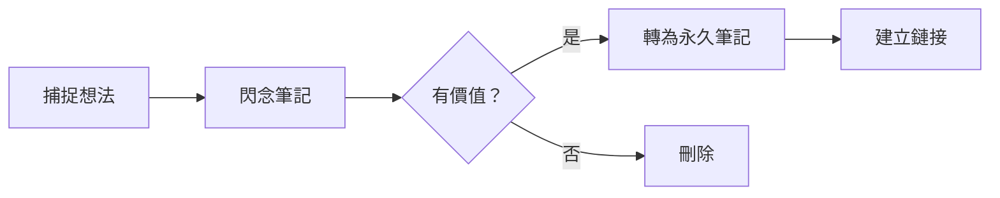

---
aliases:
  - 閃念筆記
  - Fleeting Notes
tags:
  - zettelkasten
  - fleeting
type: structure
---

# 💡 閃念筆記 / Fleeting Notes

> [!info] 定義
> 閃念筆記是快速記錄想法和靈感的臨時筆記，需要定期處理——轉換為永久筆記或刪除。

---

## 📝 什麼是閃念筆記？

閃念筆記是 Zettelkasten 系統的**起點**，用於：

- 🎯 **捕捉靈感**：隨時記錄閃現的想法
- 📌 **臨時存放**：等待進一步處理的內容
- 🔄 **過渡狀態**：不是最終形態，需轉化

### 特點

| 特性 | 說明 |
|------|------|
| **快速** | 不求完美，先記下來 |
| **臨時** | 不會永久保留 |
| **未加工** | 原始想法，待整理 |

---

## 🔄 處理流程



### 處理時機

- **每日回顧**：審閱昨天的閃念筆記
- **週度整理**：清理超過一週的閃念筆記
- **建議週期**：不超過 7 天

---

## 📊 當前閃念筆記

### 按分類瀏覽

```dataview
TABLE WITHOUT ID
  file.folder AS 分類,
  length(rows) AS 數量
FROM "5 Zettels/💡 fleeting"
WHERE file.name != this.file.name
GROUP BY file.folder
SORT length(rows) DESC
```

### 所有閃念筆記

```dataview
TABLE
  file.link AS 筆記,
  dateformat(file.ctime, "YYYY-MM-DD") AS 創建日期,
  length(file.outlinks) AS 鏈接數
FROM "5 Zettels/💡 fleeting"
WHERE file.name != this.file.name
SORT file.ctime DESC
```

### 待處理筆記（超過 7 天）

```dataview
TABLE
  file.link AS 筆記,
  dateformat(file.ctime, "YYYY-MM-DD") AS 創建日期,
  (date(today) - file.ctime).days AS 天數
FROM "5 Zettels/💡 fleeting"
WHERE file.name != this.file.name AND (date(today) - file.ctime).days > 7
SORT file.ctime ASC
```

---

## 🎯 創建指南

### 命名規範

```
閃念-主題.md
範例：閃念-深度工作.md
```

### 內容建議

```markdown
---
title: 筆記標題
created: YYYY-MM-DD
tags: [相關標籤]
status: fleeting
---

# 主題

> 想法的核心內容...

## 靈感來源
- 來自哪裡？（閱讀、對話、思考）

## 後續思考
- 可以發展成什麼？

## 相關鏈接
- [[]]
```

---

## ✅ 維護清單

- [ ] 處理超過 7 天的閃念筆記
- [ ] 將有價值的筆記轉換為永久筆記
- [ ] 刪除不再需要的筆記
- [ ] 確保每張筆記都有相關鏈接

---

## 🔗 相關連結

- [[5 Zettels|Zettels 系統首頁]]
- [[5 Zettels/📌 permanent/📌 permanent|永久筆記]]
- [[5 Zettels/📚 literature/📚 literature|文獻筆記]]

---

## 📌 注意事項

> [!warning] 重要提醒
> 閃念筆記是**過渡性**的，不應長期保留。定期處理是保持系統健康的關鍵。

> [!tip] 最佳實踐
> 建議使用 QuickAdd 或快捷鍵快速創建閃念筆記，減少記錄阻力。
