---
tags:
  - opencode
  - ollama
  - local-ai
  - guide
  - tutorial
created: 2026-01-15
---

# 闪念：如何在OpenCode中使用本地大模型

## 🌟 概述 / Overview

本地大模型正在彻底改变开发者与AI的交互方式。通过将OpenCode与Ollama等本地模型提供者集成，您可以建立一个完全私有、零成本、离线可用的AI编程环境。

### 🎯 为什么选择本地模型？

| 特性 | 本地模型 | 云端模型 |
|------|----------|----------|
| **隐私保护** | ✅ 100%本地处理 | ❌ 数据上传到云端 |
| **成本控制** | ✅ 一次性硬件投入 | ❌ 按使用量付费 |
| **离线使用** | ✅ 无需网络连接 | ❌ 依赖网络 |
| **自定义** | ✅ 可微调和定制 | ❌ 依赖服务商 |
| **响应速度** | ⚡ 硬件限制 | ⚡ 云端强大 |

### 🎪 适用场景

#### ✅ 推荐使用场景
- **敏感代码项目** - 不愿上传到云端的代码库
- **离线开发环境** - 无网络或网络受限的环境
- **成本敏感项目** - 长期使用降低成本
- **学习研究** - 深入理解AI模型工作原理

#### ⚠️ 不推荐场景
- **快速原型开发** - 需要最高性能和最新模型
- **企业级部署** - 需要稳定性和SLA保证
- **初学者入门** - 配置复杂度较高

---

## 🚀 5分钟快速开始 / Quick Start (5 Minutes)

> [!important] 前置条件检查 / Prerequisites Check
> - **操作系统**: Windows 10/11, macOS, Linux
> - **内存**: 至少16GB RAM
> - **GPU**: 推荐NVIDIA GPU (8GB+ VRAM)
> - **存储**: 至少20GB可用空间
> - **网络**: 首次安装需要下载模型

### 步骤 1: 安装OpenCode

```bash
# 方法1: 官方安装脚本（推荐）
curl -fsSL https://opencode.ai/install | bash

# 方法2: 通过npm安装
npm install -g @opencode-ai/cli

# 方法3: 通过yarn安装  
yarn global add @opencode-ai/cli
```

### 步骤 2: 安装Ollama

```bash
# macOS/Linux
curl -fsSL https://ollama.ai/install.sh | sh

# Windows (PowerShell)
iwr -useb https://ollama.ai/install.ps1 | iex

# 验证安装
ollama --version
```

### 步骤 3: 下载推荐模型

```bash
# 启动Ollama服务
ollama serve

# 下载最适合编程的模型（推荐）
ollama pull qwen2.5-coder:7b

# 或者下载更小的模型（硬件要求低）
ollama pull qwen2.5:3b
```

### 步骤 4: 基础配置验证

创建配置文件 `~/.config/opencode/opencode.json`：

```json
{
  "$schema": "https://opencode.ai/config.json",
  "provider": {
    "ollama": {
      "npm": "@ai-sdk/openai-compatible",
      "name": "Ollama (local)",
      "options": {
        "baseURL": "http://localhost:11434/v1"
      },
      "models": {
        "qwen2.5-coder:7b": {
          "name": "Qwen2.5-Coder 7B (Local)"
        }
      }
    }
  },
  "model": "ollama/qwen2.5-coder:7b"
}
```

### 步骤 5: 首次测试

```bash
# 启动OpenCode
opencode

# 在OpenCode界面中
/models  # 选择模型
创建一个简单的Python函数
```

> [!success] 成功标志 / Success Indicators
> - ✅ OpenCode启动无错误
> - ✅ 能看到本地模型选项
> - ✅ 成功生成代码
> - ✅ 工具调用正常工作

---

## 🔧 完整配置指南 / Complete Configuration Guide

### 系统要求详解

#### 硬件要求矩阵

| GPU内存 | 推荐模型 | 预期性能 | 适用场景 |
|---------|----------|----------|----------|
| 4GB | Qwen2.5:1.5B | 40-60 tok/s | 基础编程辅助 |
| 8GB | Qwen2.5:3B | 25-40 tok/s | 轻量级开发 |
| 16GB | Qwen2.5-Coder:7B | 15-25 tok/s | 通用编程任务 |
| 24GB+ | Qwen2.5-Coder:14B | 8-15 tok/s | 复杂项目开发 |

#### 软件环境要求

```bash
# Node.js版本要求
node --version  # 需要 v18.0.0 或更高

# Python版本（某些模型需要）
python --version  # 需要 v3.8 或更高

# CUDA支持（NVIDIA GPU）
nvidia-smi  # 检查CUDA版本
```

### OpenCode深度配置

#### 高级配置选项

```json
{
  "$schema": "https://opencode.ai/config.json",
  "model": "ollama/qwen2.5-coder:7b",
  "provider": {
    "ollama": {
      "npm": "@ai-sdk/openai-compatible",
      "name": "Ollama (Local)",
      "options": {
        "baseURL": "http://localhost:11434/v1",
        "timeout": 120000,
        "maxRetries": 3,
        "headers": {
          "Connection": "keep-alive"
        }
      },
      "models": {
        "qwen2.5-coder:7b": {
          "name": "Qwen2.5-Coder 7B (Local)",
          "options": {
            "temperature": 0.1,
            "top_p": 0.9,
            "extraBody": {
              "num_ctx": 8192,
              "num_batch": 512,
              "repeat_penalty": 1.1
            }
          },
          "limit": {
            "context": 8192,
            "output": 4096
          }
        },
        "qwen2.5-coder:7b-16k": {
          "id": "qwen2.5-coder:7b",
          "name": "Qwen2.5-Coder 7B (16K)",
          "options": {
            "extraBody": {
              "num_ctx": 16384
            }
          },
          "limit": {
            "context": 16384,
            "output": 8192
          }
        }
      }
    }
  },
  "plugin": ["@opencode/file-operations"],
  "tools": {
    "timeout": 60000,
    "maxParallel": 3
  }
}
```

### Ollama服务配置

#### 环境变量设置

```bash
# ~/.bashrc 或 ~/.zshrc
export OLLAMA_HOST=0.0.0.0:11434
export OLLAMA_ORIGINS=*
export OLLAMA_MODELS=/path/to/models
export OLLAMA_KEEP_ALIVE=24h
export OLLAMA_MAX_LOADED_MODELS=2

# 重新加载配置
source ~/.bashrc
```

#### 系统服务配置（Linux）

```ini
# /etc/systemd/system/ollama.service
[Unit]
Description=Ollama Service
After=network-online.target

[Service]
ExecStart=/usr/local/bin/ollama serve
User=ollama
Group=ollama
Restart=always
RestartSec=3
Environment="OLLAMA_HOST=0.0.0.0:11434"
Environment="OLLAMA_KEEP_ALIVE=24h"

[Install]
WantedBy=multi-user.target
```

---

## 🤖 推荐模型与选择 / Recommended Models & Selection

### 模型分类与选择

#### 🏆 编程专用模型（强烈推荐）

| 模型 | 参数量 | 上下文 | 编程能力 | 工具调用 | 硬件要求 |
|------|--------|--------|----------|----------|----------|
| **Qwen2.5-Coder** | 7B/14B | 32K | ⭐⭐⭐⭐⭐ | ✅ | 中等 |
| **DeepSeek-Coder-V2** | 6.7B/16B | 32K | ⭐⭐⭐⭐ | ✅ | 中等 |
| **CodeLlama** | 7B/13B/34B | 16K | ⭐⭐⭐ | ❌ | 中高 |

#### 🎯 通用对话模型（适合基础任务）

| 模型 | 参数量 | 上下文 | 编程能力 | 推理能力 | 硬件要求 |
|------|--------|--------|----------|----------|----------|
| **Qwen2.5** | 3B/7B/14B | 32K | ⭐⭐⭐ | ⭐⭐⭐⭐ | 低-中等 |
| **Mistral-Nemo** | 12B | 128K | ⭐⭐⭐ | ⭐⭐⭐⭐⭐ | 中等 |
| **Llama3.1** | 8B/70B | 128K | ⭐⭐ | ⭐⭐⭐⭐ | 中-高 |

### 模型选择决策树

```mermaid
graph TD
    A[开始选择模型] --> B{主要用途是编程?}
    B -->|是| C[选择编程专用模型]
    B -->|否| D[选择通用对话模型]
    
    C --> E{GPU内存 >= 16GB?}
    E -->|是| F[Qwen2.5-Coder:14B]
    E -->|否| G{GPU内存 >= 8GB?}
    G -->|是| H[Qwen2.5-Coder:7B]
    G -->|否| I[Qwen2.5:3B]
    
    D --> J{需要复杂推理?}
    J -->|是| K[Mistral-Nemo:12B]
    J -->|否| L{GPU内存 >= 8GB?}
    L -->|是| M[Qwen2.5:7B]
    L -->|否| N[Qwen2.5:3B]
```



### 模型下载与配置

```bash
# 推荐模型下载命令
ollama pull qwen2.5-coder:7b           # 编程专用，推荐
ollama pull qwen2.5:7b                 # 通用模型，平衡
ollama pull mistral-nemo:12b            # 推理能力强
ollama pull qwen2.5:3b                 # 轻量级选择

# 创建大上下文版本
ollama run qwen2.5-coder:7b
/set parameter num_ctx 16384
/save qwen2.5-coder:7b-16k
/bye

# 验证模型
ollama list
```

---

## 💡 实际应用场景 / Practical Use Cases

### 场景1: 基础代码生成

#### 示例请求
```
创建一个Python函数，用于计算斐波那契数列的前n项，包含错误处理和性能优化
```

#### 预期输出
```python
def fibonacci(n):
    """
    计算斐波那契数列的前n项
    
    Args:
        n (int): 要计算的项数
        
    Returns:
        list: 斐波那契数列
        
    Raises:
        ValueError: 当n不是正整数时
    """
    if not isinstance(n, int) or n <= 0:
        raise ValueError("n必须是正整数")
    
    if n == 1:
        return [0]
    elif n == 2:
        return [0, 1]
    
    fib_sequence = [0, 1]
    for i in range(2, n):
        fib_sequence.append(fib_sequence[-1] + fib_sequence[-2])
    
    return fib_sequence
```

### 场景2: 文件重构与修改

#### 工作流程
1. 打开需要重构的文件
2. 使用OpenCode读取文件内容
3. 指定重构要求
4. 应用修改建议

#### 示例请求
```
分析当前文件，找出可以优化的代码模式，并应用以下改进：
1. 提取重复代码为函数
2. 改进错误处理
3. 添加类型提示
4. 优化算法性能
```

### 场景3: 项目级代码理解

#### 多文件分析
```bash
# 分析整个项目结构
opencode run "分析这个项目的架构，识别主要模块和依赖关系"

# 生成项目文档
opencode run "为这个项目生成README文档，包括安装说明和使用示例"
```

### 场景4: 批处理自动化

#### 批量代码审查脚本
```bash
#!/bin/bash
# 批量代码审查脚本

for file in $(find . -name "*.py" -type f | head -10); do
    echo "审查文件: $file"
    opencode run "审查这个Python文件的代码质量，指出潜在问题" "$file"
    echo "---"
done
```

---

## 🔗 Obsidian集成工作流 / Obsidian Integration Workflow

### QuickAdd配置

参考配置文件：`./配置文件/opencode-ollama.quickadd.json`

### Templater模板

集成模板位于：`./Obsidian模板/`

- **OpenCode 请求.md** - 主要请求模板
- **批处理操作.md** - 批量操作模板  
- **模型配置.md** - 配置向导模板

### 与PARA系统集成

#### 项目管理集成
```markdown
---
para: project
domain: 
  - "[[AI Development]]"
created: 2026-01-15
status: active
tags:
  - ai
  - local-models
  - opencode
---

# 🤖 OpenCode本地模型集成项目

## 项目目标
建立完整的本地AI编程环境，实现隐私保护的代码助手

## 期望成果
- [x] 完整的安装指南
- [x] 配置文件模板
- [x] Obsidian集成工作流
- [ ] 性能优化方案
- [ ] 故障排除手册
```

---

## ⚡ 性能优化技巧 / Performance Optimization

### 模型量化配置

#### 量化级别选择
| 量化级别 | 模型大小 | 性能影响 | 质量损失 |
|----------|----------|----------|----------|
| **FP16** | 100% | 基准 | 无 |
| **INT8** | 50% | +20-30% | 微小 |
| **INT4** | 25% | +50-80% | 明显 |

#### 量化命令示例
```bash
# 使用Ollama自动量化（推荐）
ollama run qwen2.5-coder:7b

# 手动量化（高级用户）
ollama create qwen2.5-coder:7b-quantized -f ./quantized_model.gguf
```

### GPU加速配置

#### NVIDIA GPU优化
```bash
# 检查CUDA支持
nvidia-smi
export CUDA_VISIBLE_DEVICES=0

# 设置GPU内存分配
export OLLAMA_GPU_MEMORY_FRACTION=0.8
```

#### Apple Silicon优化
```bash
# macOS Metal性能设置
export OLLAMA_METAL=1
export OLLAMA_MAX_QUEUE=512
```

### 上下文管理策略

#### 动态上下文调整
```json
{
  "models": {
    "qwen2.5-coder:7b-adaptive": {
      "options": {
        "extraBody": {
          "num_ctx": "auto",
          "ctx_size": "adaptive"
        }
      }
    }
  }
}
```

#### 内容分块处理
```javascript
// 大文件自动分块处理
function chunkContent(content, maxTokens = 4000) {
    const estimatedTokens = content.length / 4;
    if (estimatedTokens <= maxTokens) return [content];
    
    const chunks = [];
    const chunkSize = maxTokens * 4;
    
    for (let i = 0; i < content.length; i += chunkSize) {
        chunks.push(content.slice(i, i + chunkSize));
    }
    
    return chunks;
}
```

---

## 🐛 故障排除手册 / Troubleshooting Guide

### 快速诊断清单

#### 启动问题
- [ ] OpenCode无法启动
- [ ] Ollama服务未运行
- [ ] 模型加载失败
- [ ] 配置文件错误

#### 性能问题
- [ ] 响应速度过慢
- [ ] 内存使用过高
- [ ] GPU未启用
- [ ] 模型推理中断

#### 功能问题
- [ ] 工具调用失败
- [ ] 文件修改错误
- [ ] 上下文截断
- [ ] 输出格式异常

### 常见问题与解决方案

#### 问题1: "Model not found"错误

**症状**：OpenCode报告找不到模型

**原因**：
- 模型未正确下载
- 配置中的模型名称不匹配
- Ollama服务路径问题

**解决方案**：
```bash
# 检查已安装模型
ollama list

# 重新下载模型
ollama pull qwen2.5-coder:7b

# 验证配置文件
cat ~/.config/opencode/opencode.json

# 重启Ollama服务
pkill ollama && ollama serve &
```

#### 问题2: 工具调用不工作

**症状**：模型无法执行文件操作

**原因**：
- 使用了不支持工具调用的模型
- 配置中工具选项未启用
- 权限设置问题

**解决方案**：
```bash
# 检查模型工具支持
ollama show qwen2.5-coder:7b | grep "tool"

# 更换为支持工具的模型
opencode run "测试工具功能" --model ollama/qwen2.5-coder:7b

# 验证工具配置
grep -A 10 '"tools"' ~/.config/opencode/opencode.json
```

#### 问题3: 性能过慢

**症状**：生成速度明显低于预期

**原因**：
- CPU模式运行（GPU未启用）
- 内存不足频繁交换
- 模型量化不当

**解决方案**：
```bash
# 检查GPU使用情况
nvidia-smi

# 强制使用GPU
export OLLAMA_GPU=1

# 调整批处理大小
export OLLAMA_NUM_BATCH=256

# 监控资源使用
htop  # CPU和内存
nvtop  # GPU使用
```

#### 问题4: 上下文窗口不足

**症状**：大文件处理时内容被截断

**原因**：
- 模型默认上下文窗口太小
- 配置中未设置大上下文

**解决方案**：
```bash
# 创建大上下文模型变体
ollama run qwen2.5-coder:7b
/set parameter num_ctx 16384
/save qwen2.5-coder:7b-16k

# 在配置中指定
{
  "models": {
    "qwen2.5-coder:7b-16k": {
      "options": {
        "extraBody": {
          "num_ctx": 16384
        }
      }
    }
  }
}
```

### 调试工具与命令

#### 日志启用
```bash
# OpenCode详细日志
export DEBUG=opencode:*
opencode --verbose

# Ollama调试日志
export OLLAMA_DEBUG=1
ollama serve
```

#### 连接测试
```bash
# 测试Ollama API
curl http://localhost:11434/api/tags

# 测试模型响应
curl -X POST http://localhost:11434/api/generate \
  -H "Content-Type: application/json" \
  -d '{"model": "qwen2.5-coder:7b", "prompt": "Hello"}'
```

#### 性能基准测试
```bash
# 简单性能测试
time opencode run "生成一个简单的Python函数" --model ollama/qwen2.5-coder:7b

# 内存使用监控
watch -n 1 'ps aux | grep ollama'
```

---

## 🔮 高级应用 / Advanced Applications

### 多模型工作流

#### 模型切换策略
```javascript
// 根据任务类型自动选择模型
function selectOptimalModel(task) {
    const modelMap = {
        'code-generation': 'qwen2.5-coder:7b',
        'code-review': 'deepseek-coder:6.7b',
        'documentation': 'mistral-nemo:12b',
        'debugging': 'qwen2.5-coder:7b',
        'refactoring': 'qwen2.5-coder:14b'
    };
    
    return modelMap[task] || 'qwen2.5:7b';
}
```

#### 模型集成管道
```bash
#!/bin/bash
# 多模型协作管道

INPUT_FILE=$1
echo "阶段1: 代码生成 (Qwen2.5-Coder)"
opencode run "生成实现功能的代码" --model ollama/qwen2.5-coder:7b "$INPUT_FILE" > stage1.py

echo "阶段2: 代码审查 (DeepSeek-Coder)"
opencode run "审查代码质量和安全性" --model ollama/deepseek-coder:6.7b stage1.py > stage2_review.txt

echo "阶段3: 文档生成 (Mistral-Nemo)"
opencode run "生成代码文档" --model ollama/mistral-nemo:12b stage1.py > stage3_docs.md
```

### 自定义技能开发

#### OpenCode技能定义
```json
{
  "name": "local-code-review",
  "description": "本地代码审查技能",
  "parameters": {
    "file_path": {
      "type": "string",
      "description": "要审查的文件路径"
    },
    "review_type": {
      "type": "string",
      "enum": ["security", "performance", "style", "logic"],
      "description": "审查类型"
    }
  },
  "handler": "local-code-review.js"
}
```

#### 自定义技能实现
```javascript
// local-code-review.js
module.exports = async function(params, context) {
    const { file_path, review_type } = params;
    
    // 读取文件内容
    const content = await context.readFile(file_path);
    
    // 构建审查提示
    const prompt = `请审查这个代码的${review_type}方面：\n\n${content}`;
    
    // 调用本地模型
    const result = await context.ai.generate(prompt, {
        model: 'qwen2.5-coder:7b',
        temperature: 0.1
    });
    
    return {
        review: result.text,
        suggestions: extractSuggestions(result.text),
        score: calculateScore(result.text)
    };
};
```

### CI/CD集成

#### GitHub Actions配置
```yaml
name: Local AI Code Review
on: [pull_request]

jobs:
  ai-review:
    runs-on: ubuntu-latest
    steps:
      - uses: actions/checkout@v2
      
      - name: Setup Ollama
        run: |
          curl -fsSL https://ollama.ai/install.sh | sh
          ollama serve &
          ollama pull qwen2.5-coder:7b
          
      - name: Setup OpenCode
        run: |
          npm install -g @opencode-ai/cli
          echo '{"provider":{"ollama":{"npm":"@ai-sdk/openai-compatible","options":{"baseURL":"http://localhost:11434/v1"}}}}' > ~/.config/opencode/opencode.json
          
      - name: AI Code Review
        run: |
          opencode run "审查这个PR的代码变更" --model ollama/qwen2.5-coder:7b
```

### 企业级部署方案

#### Docker容器化部署
```dockerfile
FROM nvidia/cuda:12.1-devel-ubuntu22.04

# 安装依赖
RUN apt-get update && apt-get install -y \
    curl \
    git \
    python3 \
    nodejs \
    npm

# 安装Ollama
RUN curl -fsSL https://ollama.ai/install.sh | sh
RUN ollama serve &

# 下载模型
RUN ollama pull qwen2.5-coder:7b

# 安装OpenCode
RUN npm install -g @opencode-ai/cli

# 配置
COPY opencode.json /root/.config/opencode/
COPY entrypoint.sh /entrypoint.sh
RUN chmod +x /entrypoint.sh

EXPOSE 11434
ENTRYPOINT ["/entrypoint.sh"]
```

#### Docker Compose配置
```yaml
version: '3.8'
services:
  opencode-ollama:
    build: .
    ports:
      - "11434:11434"
    volumes:
      - ./models:/root/.ollama
      - ./config:/root/.config/opencode
    environment:
      - OLLAMA_HOST=0.0.0.0:11434
      - OLLAMA_GPU_MEMORY_FRACTION=0.8
    deploy:
      resources:
        reservations:
          devices:
            - driver: nvidia
              count: 1
              capabilities: [gpu]
```

---

## 📚 参考资源 / Reference Resources

### 📖 官方文档

- **[OpenCode Documentation](https://opencode.ai/docs)** - 完整的官方文档
- **[Ollama Documentation](https://github.com/ollama/ollama)** - Ollama使用指南
- **[Qwen Models](https://huggingface.co/Qwen)** - Qwen模型系列
- **[AI SDK Documentation](https://ai-sdk.dev/)** - AI开发工具包

### 🛠️ 工具与资源

#### 模型下载站点
- **[Hugging Face](https://huggingface.co/models)** - 开源模型库
- **[Ollama Library](https://ollama.ai/library)** - Ollama官方模型库
- **[ModelScope](https://modelscope.cn/)** - 阿里云模型库

#### 性能监控工具
- **[nvtop](https://github.com/Syllo/nvtop)** - GPU监控
- **[htop](https://htop.dev/)** - 系统资源监控
- **[Glances](https://nicolargo.github.io/glances/)** - 综合监控工具

### 🌐 社区资源

#### 讨论社区
- **[OpenCode Discord](https://opencode.ai/discord)** - 官方Discord社区
- **[Ollama GitHub](https://github.com/ollama/ollama/discussions)** - GitHub讨论
- **[Reddit r/LocalLLaMA](https://reddit.com/r/LocalLLaMA)** - 本地模型讨论

#### 教程与指南
- **[Local AI Course](https://github.com/danielmiessler/fabric)** - 本地AI课程
- **[AI at Home](https://github.com/matttwj/ai-at-home)** - 家庭AI指南

### 🔧 开发工具

#### 配置生成器
- **[OpenCode Config Generator](https://opencode.ai/config-generator)** - 在线配置生成
- **[Ollama Web UI](https://github.com/ollama-webui/ollama-webui)** - Web界面

#### 调试工具
- **[Model Inspector](https://huggingface.co/spaces/Xenova/model-inspector)** - 模型检查器
- **[LLM Playground](https://huggingface.co/spaces/Xenova/LLM-Playground)** - 模型测试平台

---

## 📊 更新日志与版本兼容性 / Changelog & Compatibility

### 版本兼容性矩阵

| OpenCode版本 | Ollama版本 | 推荐模型 | 状态 |
|-------------|------------|----------|------|
| v1.0.x | v0.1.x | Qwen2.5-Coder | ✅ 稳定 |
| v1.1.x | v0.2.x | Qwen2.5-Coder | ✅ 稳定 |
| v1.2.x | v0.3.x | Qwen2.5-Coder | 🔄 测试中 |

### 模型更新记录

#### 2026年1月更新
- **新增**: Qwen2.5-Coder系列模型支持
- **改进**: 上下文窗口管理算法
- **修复**: 工具调用在某些模型上的兼容性问题

#### 2025年12月更新
- **新增**: DeepSeek-Coder-V2支持
- **优化**: GPU内存使用效率
- **改进**: 批处理性能

### 未来发展路线图

#### Q1 2026计划
- **多模态支持** - 图像+文本处理
- **分布式推理** - 多GPU并行处理
- **模型热切换** - 运行时无缝切换模型

#### Q2 2026计划
- **自适应量化** - 动态调整模型精度
- **智能缓存** - 上下文智能缓存机制
- **企业功能** - 团队协作和权限管理

---

## 🎓 最佳实践总结 / Best Practices Summary

### 💡 配置最佳实践

1. **选择合适的模型** - 根据硬件和需求平衡性能与质量
2. **优化上下文窗口** - 避免不必要的内存浪费
3. **启用GPU加速** - 最大化硬件性能
4. **定期更新模型** - 跟踪最新改进

### 🛡️ 安全最佳实践

1. **本地运行** - 确保数据不离开本地网络
2. **定期更新** - 保持软件和模型的安全更新
3. **网络隔离** - 在受限环境中运行敏感项目
4. **数据备份** - 定期备份重要配置和模型

### 🚀 性能最佳实践

1. **量化模型** - 在质量和速度间找到平衡
2. **批量处理** - 合并相似任务提高效率
3. **缓存策略** - 重用常见查询结果
4. **资源监控** - 持续监控和优化资源使用

### 🔧 维护最佳实践

1. **配置版本控制** - 跟踪配置变更历史
2. **日志记录** - 保持详细的使用日志
3. **定期清理** - 清理不用的模型和缓存
4. **文档更新** - 及时更新使用文档

---

## 🔗 相关文档链接 / Related Documentation Links

### 在本文档中
- **[[opencode.json]]** - OpenCode主配置文件
- **[[OpenCode 请求]]** - 主要请求模板
- **[[opencode-ollama.quickadd.json]]** - QuickAdd配置

### 在本仓库中
- **[[AGENTS.md]]** - AI代理操作指南
- **[[_meta_使用手册/使用指南.md]]** - 完整使用指南
- **[[6️⃣ Claude Code 集成工作流]]** - Claude Code集成参考

### 外部资源
- **[OpenCode官网](https://opencode.ai)** - 官方网站和文档
- **[Ollama官网](https://ollama.ai)** - Ollama模型库和文档
- **[Hugging Face](https://huggingface.co)** - 开源模型库

---

> [!tip] 💭 最后思考
> 本地AI模型代表着编程辅助的未来方向。虽然目前性能和便利性可能不如云端方案，但隐私保护、成本控制和离线使用的优势使其成为特定场景下的最佳选择。随着硬件性能提升和模型优化，本地模型将会越来越强大。

> 选择本地模型不仅是技术决策，更是对数据主权和隐私保护的重视。希望这个指南能帮助您成功建立自己的本地AI编程环境。

---

*本文档持续更新中，欢迎反馈和贡献建议。*

**最后更新**: 2026-01-15  
**文档版本**: v1.0.0  
**维护者**: OpenCode本地模型集成项目