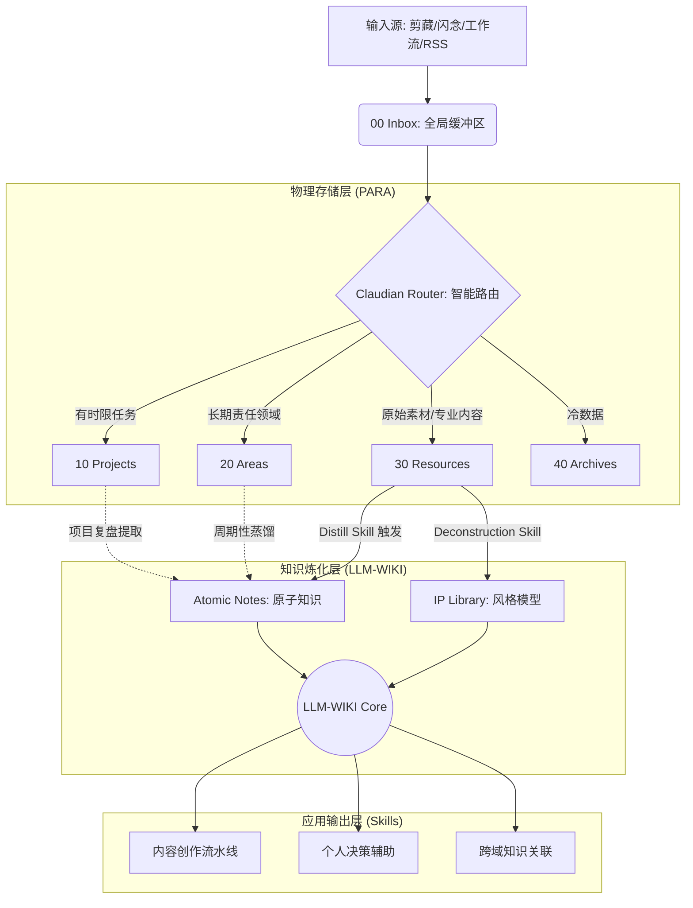

一只阿木木 *2026年5月24日 10:02*

## PARA + LLM-WIKI 架构，实现个人知识与生活管理的自动化革命

如果你想构建一套 **真正意义上的个人 AI 操作系统** ，请继续往下读。

## 一、传统笔记法的终结：为什么手动管理必然走向混乱？

在讨论解决方案之前，我们需要先把问题说清楚。

过去十年，PKM（Personal Knowledge Management）领域经历了数次范式迭代：从 Evernote 的"收藏箱"模式，到 Roam Research 的"双向链接"模式，再到 Obsidian 的"本地图谱"模式。每一次迭代都在解决上一个时代的痛点，却又带来新的问题。

**当前最主要的结构性矛盾，并不是"工具不够好"，而是"管理范式本身出了问题"。**

### 1.1 信息过载与检索精度的不可调和

我们面对的信息输入，本质上是 **异构的** ：

| 信息类型 | 属性 | 时效性 | 密度 |
| --- | --- | --- | --- |
| 专业知识 | 结构化、有体系 | 长期有效 | 高 |
| 工作任务 | 碎片化、有时限 | 短期有效 | 中 |
| 生活琐事 | 随机、低结构 | 即时有效 | 低 |
| 创作素材 | 半结构化 | 中长期 | 中高 |

这四类信息被混入同一个系统后，会产生一个关键问题： **语义污染（Semantic Pollution）** 。

当你使用 RAG（检索增强生成）让 AI 辅助写作时，检索到的上下文里夹杂着"明天接孩子放学"和"Transformer 注意力机制"，AI 的输出质量会急剧下降。这不是 AI 的问题，而是输入数据的问题。

**垃圾进，垃圾出（Garbage In, Garbage Out）** ——这个道理在个人知识系统里同样成立。

### 1.2 多库方案的本质缺陷

很多人的应对方式是"分库管理"：专业知识一个库，工作任务一个库，生活系统一个库。

这个方案在初期有效，但存在两个根本性缺陷：

**第一，库间隔离导致关联断裂。** 你在"工作任务"库里记录的一个项目，可能恰好是你"专业知识"库里某个理论的最佳实践案例——但跨库的双向链接是不存在的，这个关联永远无法被发现。

**第二，切换成本侵蚀心流。** 人类的工作记忆容量是有限的。每一次库切换都会产生上下文切换成本（Context Switching Cost），打断你的深度思考状态。

### 1.3 范式转移的方向：从"管理工具"到"AI 操作系统"

真正的解决方案不是在现有范式内打补丁，而是 **完成一次范式转移** ：

> **旧范式：** 人管理工具 → 工具存储信息 → 人检索使用。
> 
> **新范式：** 人输入信息 → AI 治理分流 → 系统自动代谢 → 知识主动服务人。

这就是本文要介绍的核心架构： **以 PARA 为物理骨架，以 LLM-WIKI 为知识内核，以 Claudian 为智能中枢的个人 AI 操作系统。**

---

## 二、路由、存储、萃取、应用：我的全量信息处理引擎

整个系统分为四个解耦层级。解耦的核心价值在于： **每一层都可以独立升级，不会因为某一层的变化导致整体崩溃。**




### 2.1 感知层：全渠道、无摩擦的信息捕获

系统的质量上限由输入质量决定。但更重要的原则是： **输入的摩擦必须趋近于零。**

任何需要"先整理好再存入"的系统，都会在日常执行中逐渐被放弃。我的输入原则是：

> **所有信息，无论质量高低，无论来自何处，先进 Inbox，不做任何手动判断。**

技术实现上，Inbox 对接了以下输入渠道：

- **Obsidian Mobile：** 随手记录闪念，语音转文字直接落库。
- **浏览器插件（Markdownload）：** 剪藏网页时自动附上来源 URL 和剪藏时间。
- **Telegram Bot：** 转发任何聊天内容到 Inbox，保留原始上下文。
- **RSS 聚合：** 关注源的高质量文章定时推送入库。

所有进入 Inbox 的内容，都会自动被赋予一个基础标签： `status: raw` 。这是整个处理链条的起点。

### 2.2 逻辑层：Claudian 路由协议与元数据架构

这是整个系统的神经中枢。

**元数据协议（Metadata Schema）** 是让 AI 能够精准理解和操作你的笔记库的关键底层设计。我定义了以下标准化的 YAML Frontmatter 结构：

YAML

```
---
title: 笔记标题
date: 2024-01-15
type: concept          # task / concept / material / diary / ip-style
layer: Knowledge       # Life / Work / Knowledge
status: raw            # raw / processing / distilled / archived
strength: 3            # 1-5，知识权重与召回优先级
source: ""             # 来源 URL 或参考文献
related: []            # 关联笔记
project: ""            # 归属项目（若有）
area: ""               # 归属领域（若有）
distilled_to: ""       # 若已炼化，指向原子笔记
---
```

这套协议的设计逻辑是： **不只给人看，更要给机器读。** 每一个字段都有其在 AI 处理链条中的具体用途：

| 字段 | 人的用途 | AI 的用途 |
| --- | --- | --- |
| `type` | 快速识别内容性质 | 决定路由方向 |
| `layer` | 区分生活/工作/知识 | 过滤 RAG 检索范围 |
| `status` | 追踪处理进度 | 触发代谢机制 |
| `strength` | 主观标注重要性 | 调整向量召回权重 |
| `related` | 手动建立关联 | 图谱遍历的边 |

**Claudian 路由逻辑（Router Logic）** 的核心 Prompt 框架如下：

text

```
你是一个个人知识管理系统的路由器。
当我输入一段新内容时，你需要：

1. 识别其核心属性（type）：
   - 包含截止时间或行动指令 → task
   - 包含可复用的概念/框架/规律 → concept  
   - 包含他人观点/案例/数据 → material
   - 包含个人情绪/生活记录 → diary
   - 包含特定风格的表达样本 → ip-style

2. 判断其归属层（layer）：
   - 与个人生活/情绪/健康相关 → Life
   - 与工作项目/职业发展相关 → Work
   - 具有普遍适用性的知识 → Knowledge

3. 建议 PARA 归位：
   - task → 10 Projects/[对应项目]
   - concept/material（Knowledge层）→ 30 Resources/Raw
   - diary → 20 Areas/Daily
   - ip-style → 30 Resources/IP-Library/[对应IP名称]

4. 输出一个完整的 YAML Frontmatter，等待确认。
```

用户的操作极度简化： **你只需要把内容丢进去，点一次"确认"，路由完成。**

## 三、解决 RAG 污染：如何构建一个无噪声的专业知识子库？

这是整个架构中技术含量最高，也是最能产生差异化价值的部分。

### 3.1 为什么"直接对全库做 RAG"会失败？

RAG（Retrieval-Augmented Generation）的核心逻辑是：通过语义向量检索，找到与当前问题最相关的笔记片段，作为 LLM 的上下文输入，从而生成更准确的答案。

这个原理本身没有问题。问题在于 **检索对象的质量** 。

当你的库里混有以下内容时：

- "第一性原理的本质是从物理学角度出发的还原论思维"（高纯度知识）
- "明天的会议记得带充电器"（低价值任务）
- "今天心情有点差，感觉最近压力太大"（个人情绪）

一个关于"AI 战略决策"的问题，可能在语义上与"压力"和"决策"都产生关联，从而把情绪日记混入知识检索的上下文——这就是 **RAG 污染** 。

解决方案不是让 AI 更聪明，而是 **从数据架构层面隔离噪声。**

### 3.2 LLM-WIKI 的物理结构设计

LLM-WIKI 是一个 **虚实结合** 的概念：

- **物理上** ，它对应 `30 Resources/LLM-WIKI/` 这个文件夹路径。
- **逻辑上** ，它是通过 `layer: Knowledge` + `status: distilled` 双重过滤出来的笔记集合。

text

```
30 Resources/
├── Raw/                    ← 未处理的原始素材（污染区，不参与高精度 RAG）
├── LLM-WIKI/
│   ├── Concepts/           ← 原子知识库（核心 RAG 数据源）
│   │   ├── 认知科学/
│   │   ├── 商业策略/
│   │   ├── AI 技术/
│   │   └── ...
│   ├── IP-Library/         ← IP 风格模型库
│   │   ├── [IP名称A]-style.md
│   │   ├── [IP名称B]-style.md
│   │   └── ...
│   └── MOC/                ← 知识地图（Map of Content）
│       ├── 全局索引.md
│       └── [领域]-MOC.md
└── Processing/             ← 正在被 AI 处理中的中间状态文件
```

### 3.3 自动化炼化流程（Distillation Workflow）

这是"数字炼金术"的核心机制。

**触发条件：** 当 `30 Resources/Raw/` 某个子话题下， `status: raw` 的笔记数量 ≥ 5 篇，或者单篇被引用次数 ≥ 3 次。

**炼化步骤：**

text

```
Phase 1: 聚类扫描
Claudian 扫描 Raw 区，对笔记进行主题聚类，
识别哪些笔记在讨论同一个底层概念。

Phase 2: 去噪提纯
对同组笔记执行 Distill Skill：
- 识别重复表达，保留最精炼的版本
- 剔除与主题无关的上下文
- 提取底层逻辑（而非表面现象）

Phase 3: 原子化输出
生成一篇符合以下结构的原子笔记：
  [核心定义] → 这个概念是什么
  [底层逻辑] → 它为什么成立
  [适用边界] → 它在哪些情况下失效
  [关联节点] → 它与哪些概念相互印证
  [实践案例] → 它在现实中如何显现

Phase 4: 索引更新
将新生成的原子笔记写入对应 MOC，
更新全局知识地图。
原始 Raw 笔记状态更新为 distilled_to: [原子笔记路径]
```

**一个具体的例子：**

我曾经在 Raw 区积累了 7 篇关于"注意力经济"的碎片：

- 一篇关于 TikTok 算法的分析
- 两篇关于广告业衰退的行业报告摘录
- 一篇关于注意力稀缺的学术论文摘要
- 三篇不同博主关于内容创作"钩子设计"的拆解

Distill Skill 扫描后，提炼出一篇原子笔记： **《注意力经济的底层结构：稀缺性制造与成瘾回路设计》** ——这篇笔记只有 800 字，却包含了 7 篇碎片素材中所有有效的底层逻辑。

当我之后写任何关于内容创作、平台策略、用户心理的文章时，这篇原子笔记会被精准召回，而那 7 篇原始碎片则"退休"到 Archive 区，不再干扰高精度检索。

### 3.4 IP 风格建模：构建可复用的"写作 DNA"

IP Library 的建立遵循以下流程：

**Step 1：语料收集** 收集目标 IP 的 50-100 篇代表性内容，全部打上 `type: ip-style` 标签，存入对应文件夹。

**Step 2：Deconstruction Skill 解析** 对语料库执行解构分析，输出风格 DNA 文件，包含以下维度：

YAML

```
---
ip_name: "[IP名称]"
style_type: "理性分析型"  # 情感叙事型 / 理性分析型 / 犀利批判型 / 温暖陪伴型
---

## 句式特征
- 平均句长：[X] 字
- 长短句比例：长句 [X]% / 短句 [X]%
- 常用句式开头：["但是"/"所以"/"你有没有想过"/...]

## 论证结构
- 宏观逻辑：[结论先行 / 问题导向 / 故事引入]
- 微观逻辑：[三段论 / 对比法 / 案例归纳]

## 词汇特征
- 高频词汇 Top20：[...]
- 专业术语密度：[高/中/低]
- 情绪词汇倾向：[理性克制/情绪外露/反讽犀利]

## 结构模板
- 标题公式：[...]
- 开头公式：[...]
- 金句分布：[...]
- 结尾公式：[...]
```

这个文件一旦建立，就成为"永久可挂载的写作外脑"。

### 3.5 语义关联发现：让 AI 成为你的"洞察引擎"

现有工具（如 Graphify、gBrain、Smart Connections）的核心价值是"发现显性链接"。

我的进阶设计在此基础上增加了一层： **让 AI 发现隐性的跨域关联，并解释其底层共性。**

这个机制被我称为 **"跨域洞察扫描（Cross-Domain Insight Scan）"** ，每周执行一次：

text

```
扫描逻辑：
1. 随机选取 LLM-WIKI/Concepts 中本周新增的原子笔记
2. 对每一篇笔记提取"底层逻辑关键词"
3. 与库内所有已有笔记进行语义相似度计算
4. 若相似度 > 阈值且无现有 Related 链接，则：
   - 生成一段"关联洞察"解释
   - 在两篇笔记的 related 字段中互相建立链接
   - 在对应 MOC 页面记录这条新发现的知识边
```

这让你的知识图谱不再是一棵你主动搭建的树，而是一张 **AI 参与共同编织的网** 。知识间的连接越密，系统对你的理解就越深，输出的质量就越高。

## 四、从零散语料到高质量产出的"黑灯工厂"

### 4.1 为什么"单个 Skill"不够用？

单一 Skill 的能力上限是有限的。它只能完成一个明确定义的子任务。

真正的内容创作是一个 **复杂的多步骤过程** ，涉及：选题判断、素材检索、逻辑架构、风格适配、语言生成、自我校对……每一步都需要不同的能力配置。

**Skill Chaining（技能链）** 的本质是：把一个复杂任务拆解为若干子任务，每个子任务对应一个专精 Skill，通过 **有序串联** 完成整体工作流。

### 4.2 四级 Skill 串联：内容创作流水线设计

text

```
┌─────────────────────────────────────────────────────────┐
│                     CONTENT PIPELINE                     │
├──────────┬──────────┬──────────┬──────────┬─────────────┤
│  Level 1 │  Level 2 │  Level 3 │  Level 4 │   Level 5  │
│  选题    │  素材    │  结构    │  风格    │   校对     │
│  Skill   │  Skill   │  Skill   │  Skill   │   Skill    │
├──────────┼──────────┼──────────┼──────────┼─────────────┤
│从LLM-WIKI│检索相关  │基于知识点│挂载IP    │ 价值观校验 │
│识别可写  │原子笔记  │生成逻辑  │风格DNA   │ + 自适应   │
│选题方向  │+案例素材 │骨架大纲  │填充草稿  │   优化     │
└──────────┴──────────┴──────────┴──────────┴─────────────┘
         ↓             ↓             ↓             ↓
     选题清单      素材卡片组     结构化大纲     完整初稿
```

**一次完整的流水线实例：**

**输入指令：**

> 「用\[某财经博主\]的风格，针对\[我的内容创作者\]受众，写一篇关于'AI 如何重塑知识工作者竞争力'的深度文章，字数 2000 字。」

**Level 1 — 选题 Skill 执行：**

- 从 LLM-WIKI 检索"AI + 知识工作 + 竞争力"相关原子笔记
- 识别 3 个可以支撑 2000 字论述的核心角度
- 输出：选题方向确认单（需人工选择）

**Level 2 — 素材 Skill 执行：**

- 基于选定角度，从 Concepts 区调取相关知识点 4-6 个
- 从 IP Library 调取该博主风格 DNA 文件
- 从历史文章库中匹配类似主题的素材卡片
- 输出：结构化素材包

**Level 3 — 结构 Skill 执行：**

- 根据素材包内容，参考目标博主的论证结构偏好
- 生成符合其宏观逻辑（如：问题导向 + 三段论展开）的大纲
- 输出：带论点的详细大纲（7-10 个节点）

**Level 4 — 风格 Skill 执行：**

- 按照大纲逐节填充内容
- 实时对照风格 DNA，调整句式长短比例、词汇密度、情绪基调
- 输出：符合目标 IP 风格的完整草稿

**Level 5 — 校对 Skill 执行：**

- 检查文章是否包含与我价值观相悖的表述
- 基于我过往修改记录，标注可优化的高频问题（如：转折句过密、专业词汇堆砌）
- 输出：带批注的终稿 + 修改建议清单

**全程人工介入点：仅两次。** 第一次在选题确认（30 秒），第二次在终稿审阅（5-10 分钟）。

### 4.3 Human-in-the-Loop：系统越用越懂你

这个流水线并非静态的。每一次你在终稿上的修改行为，都会被系统记录：

text

```
修改记录 → Claudian 分析修改模式 → 更新 Style Preference Profile
                                    ↓
                          下一次生成时，Level 4 Skill
                          自动应用最新的偏好参数
```

这意味着： **你和系统之间存在持续的双向训练。** 你教会系统你的偏好，系统的输出越来越接近你的风格，你的修改量越来越少，系统对你的理解越来越深。

这是一个正向的飞轮，而非一次性的配置。

## 五、系统的自清洁与防退化机制

任何系统都面临熵增问题。如果不设计主动的对抗机制，即使是最精良的架构也会随着时间退化。

### 5.1 三级代谢机制

**一级代谢（日级）：** Inbox 清零

每天，Claudian 自动扫描 Inbox，对所有 `status: raw` 且已超过 24 小时的笔记执行路由判断，完成物理分流。Inbox 应当在每天结束时清空。

**二级代谢（周级）：** 知识炼化

每周，触发一次 Distill 扫描。检查 Raw 区的素材积累情况，满足阈值的触发炼化，生成原子笔记，更新 MOC。

**三级代谢（月级）：** 系统减脂

每月，执行一次全库健康检查：

- `status: raw` 且超过 30 天未被引用 → 建议归档
- 已完结的 Project → 提取知识点后整体归档
- 重复度 > 80% 的笔记 → 建议合并或删除
- 未被任何 MOC 收录的孤立笔记 → 建议分类或删除

### 5.2 质量控制：Strength 字段的动态更新机制

笔记的 `strength` （重要性权重）不应是一个固定值，而应当随使用情况动态更新：

text

```
被 Skill 引用一次 → strength + 0.1
被手动 Related 链接 → strength + 0.2
被 MOC 收录 → strength + 0.3
超过 60 天未被调用 → strength - 0.1
被手动标记为"已过时" → strength = 1（最低权重）
```

这确保了 RAG 检索时， **高质量、高频使用的知识节点会被优先召回** ，而老旧、边缘的内容会自然退出主检索范围。

## 六、技术栈配置建议

这套架构并不需要部署复杂的技术栈，但以下配置能显著提升系统的运行效率：

### 核心层

| 组件 | 工具 | 作用 |
| --- | --- | --- |
| 笔记存储 | Obsidian（本地库） | 全量信息的物理容器 |
| AI 中枢 | Claudian（自研优化） | 路由、炼化、创作 |
| 自动化触发 | QuickAdd + Templater | Inbox 路由快捷命令 |
| 结构化视图 | Dataview | 多态视图的动态生成 |

### 增强层

| 组件 | 工具 | 作用 |
| --- | --- | --- |
| 语义检索 | Smart Connections / 本地向量库 | 高精度 RAG 召回 |
| 图谱可视化 | Graphify / gBrain | 知识关联的直观呈现 |
| 数据库视图 | DB Folder / Meta Bind | Metadata 的可视化编辑 |
| 自动化脚本 | Python（本地服务） | Skill Chain 的调度中转 |

### 关于隐私与成本

这是读者最常见的两个顾虑，直接给出答案：

**隐私：** Obsidian 本地存储，数据不上云。Claudian 调用 API 时，只传输当前处理的笔记片段，不传输全库内容。敏感内容可设置 `private: true` 标签，路由器自动将其排除在 AI 处理范围之外。

**API 成本：** 日常路由操作（短文本分类）每次消耗 Token 极少，每月成本可控在几十元人民币以内。Distill Skill（长文本处理）频率低，成本主要集中于此。整体来看，这套系统的运行成本远低于购买任何一款订阅制 SaaS 工具。

## 七、未来竞争力的核心：你的私有语料库与 Skills 库

我们正处于一个知识工作被 AI 大规模重构的历史节点。

在这个节点上，有两种面对 AI 的方式：

**第一种：被动使用者。** 把 AI 当成随时可以调用的外部工具，每次使用都从零开始建立上下文。这种方式永远在"借用"AI 的通用能力，输出的内容缺乏个人风格，竞争力低。

**第二种：系统构建者。** 持续投入时间和精力，构建一个 **私有的、持续进化的、高度个性化的 AI 知识基础设施** 。随着时间积累，你的 LLM-WIKI 越来越反映你的思维方式，你的 Skills 库越来越契合你的工作风格，你的 IP Library 越来越精准还原你的表达偏好。

**这个基础设施，才是 AI 时代真正意义上的个人核心资产。**

它不会因为某个 AI 公司倒闭而消失，不会因为某个 SaaS 工具涨价而受制于人，不会因为某个竞争者使用了同款 AI 而失去差异化。

因为 **数据是你的，逻辑是你的，风格是你的，系统是你的。**

### 三步启动路径（Minimal Viable System）

如果你已经被这套架构说服，但不知道从哪里开始，以下是最低阻力的启动路径：

**W1：建立物理骨架** 合并所有分散库，建立标准 PARA 五级文件夹，安装 Dataview 和 QuickAdd 插件。不要求完美，只要"有"就够了。

**W2：激活元数据协议** 用 Templater 配置三个基础模板（任务模板、知识模板、日记模板），每个模板预填 YAML 框架。从这一刻起，所有新笔记都进入标准化流程。

**W3：部署第一个 Router Skill** 配置 Claudian 的分流能力，接入 QuickAdd 快捷命令。不需要完美，先能用就行。系统的智能化程度会随着你的使用而自然增长。

**W4 起：让系统开始自己生长** 当你的 Raw 区第一次触发 Distill 条件，亲眼见证你的第一篇原子笔记被自动生成，你就会真正理解这套系统的价值所在。

## 结语：停止搬运，开始构建

知识管理领域有一个长期流传的误区： **"我只要存得足够多，就能变得足够聪明。"**

但你我都清楚，收藏从未停止，成长从未发生。

这不是意志力问题，不是工具问题，而是 **系统范式问题** 。

当你的系统只能"存"而不会"炼"，当你的 AI 只能"答"而不会"治"，当你的知识只能"积累"而不会"代谢"——无论存了多少，都只是一座没有生命的数字博物馆。

**PARA + LLM-WIKI 架构要解决的，正是这个范式层面的根本问题。**

让 PARA 负责信息的物理安置，让 LLM-WIKI 负责知识的深度萃取，让 Claudian 负责两者之间的智能调度，让 Skills 负责知识向产出的自动化转化—— **四层系统各司其职，协同驱动一个真正意义上的个人 AI 操作系统。**

这不是终点，而是起点。

真正的竞争优势，在于你愿意比别人早几年，开始构建这套属于自己的知识基础设施。

*本文所有架构设计均可落地实施，欢迎在评论区留言你在搭建过程中遇到的具体问题，我会持续更新优化方案。*

