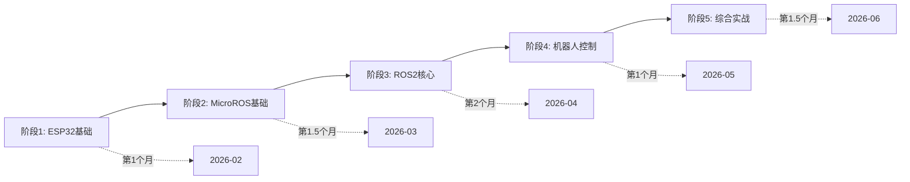

# MicroROS-Board学习项目

> **项目目标**: 系统学习MicroROS-Board机器人控制板，掌握ROS2机器人开发技能。

---

## 📋 项目概览

### 项目信息
- **项目类型**: 技能学习项目
- **时间周期**: 6个月（2026-02-19 至 2026-06-30）
- **投入时间**: 平均每天1-2小时
- **预期成果**: 能够独立完成ROS2机器人项目开发

### 学习目标
- ✅ 掌握ESP32嵌入式开发基础
- ✅ 理解ROS/MicroROS架构和通信机制
- ✅ 学会使用ROS2进行机器人控制
- ✅ 能够独立完成机器人控制项目

---

## 🎯 学习路径



---

## 📅 阶段规划

### 阶段1: ESP32基础开发（2026-02-19 至 2026-03-15）

**学习时长**: 约3-4周

#### 里程碑
- ✅ 搭建ESP32-IDF开发环境
- ✅ 掌握ESP32基础GPIO操作
- ✅ 理解电机驱动和编码器读取
- ✅ 掌握UART和WiFi通信

#### 检查清单
- [ ] **环境搭建**
  - [ ] 安装ESP32-IDF
  - [ ] 配置flash-tool
  - [ ] 测试第一个Hello World程序

- [ ] **基础外设**
  - [ ] LED灯控制
  - [ ] 按键检测
  - [ ] 蜂鸣器驱动
  - [ ] PWM舵机控制

- [ ] **电机控制**
  - [ ] 驱动编码器电机
  - [ ] 读取编码器数据
  - [ ] PID速度控制
  - [ ] 机器人运动学理论

- [ ] **传感器**
  - [ ] IMU数据读取
  - [ ] 雷达数据读取
  - [ ] 电池电压检测

- [ ] **通信**
  - [ ] 串口通讯
  - [ ] WiFi联网
  - [ ] 蓝牙通讯
  - [ ] Flash数据存储

---

### 阶段2: MicroROS基础（2026-03-16 至 2026-04-15）

**学习时长**: 约1个月

#### 里程碑
- ✅ 理解MicroROS架构
- ✅ 掌握话题发布订阅机制
- ✅ 能够通过MicroROS控制硬件

#### 检查清单
- [ ] **MicroROS环境**
  - [ ] 安装ESP32-microros组件
  - [ ] 配置microROS代理
  - [ ] 测试MicroROS通信

- [ ] **话题通信**
  - [ ] 发布话题
  - [ ] 订阅话题
  - [ ] 多话题订阅发布
  - [ ] 自定义传输方式

- [ ] **硬件集成**
  - [ ] 订阅蜂鸣器话题
  - [ ] 订阅PWM舵机话题
  - [ ] 订阅速度控制话题
  - [ ] 发布速度话题
  - [ ] 发布IMU数据
  - [ ] 发布雷达数据

---

### 阶段3: ROS2核心学习（2026-04-16 至 2026-05-15）

**学习时长**: 约1个月

#### 里程碑
- ✅ 掌握ROS2核心概念
- ✅ 学会使用ROS2工具
- ✅ 理解ROS2坐标变换

#### 检查清单
- [ ] **ROS2基础**
  - [ ] ROS2安装（Humble）
  - [ ] ROS2工作空间
  - [ ] ROS2功能包
  - [ ] ROS2节点

- [ ] **通信机制**
  - [ ] 话题通讯（发布/订阅）
  - [ ] 服务通讯（服务端/客户端）
  - [ ] 动作通讯（服务端/客户端）
  - [ ] 自定义接口消息

- [ ] **高级特性**
  - [ ] 参数服务
  - [ ] 元功能包
  - [ ] 分布式通讯
  - [ ] DDS中间件
  - [ ] 时间相关API

- [ ] **工具链**
  - [ ] Rviz2可视化
  - [ ] Rqt工具箱
  - [ ] Launch文件（Python/Xml/Yaml）
  - [ ] 录制回放工具

- [ ] **建模与仿真**
  - [ ] URDF模型
  - [ ] Gazebo仿真
  - [ ] TF2坐标变换

---

### 阶段4: 机器人控制实践（2026-05-16 至 2026-06-15）

**学习时长**: 约1个月

#### 里程碑
- ✅ 实现机器人基础控制
- ✅ 完成传感器数据融合
- ✅ 实现机器人URDF模型

#### 检查清单
- [ ] **准备工作**
  - [ ] 烧录出厂固件
  - [ ] 配置虚拟机
  - [ ] 配置控制板参数
  - [ ] 连接microROS代理

- [ ] **基础控制**
  - [ ] 机器人信息发布
  - [ ] 键盘控制
  - [ ] 手柄控制

- [ ] **高级功能**
  - [ ] 机器人状态估计
  - [ ] 线速度标定
  - [ ] 角速度标定
  - [ ] URDF模型建立

---

### 阶段5: 综合实战项目（2026-06-16 至 2026-06-30）

**学习时长**: 约2周

#### 实战项目选择（可选其一）

**项目1: 自主导航小车**
- 功能: 激光雷达建图、路径规划、自主导航
- 技术栈: ROS2 Navigation Stack、SLAM、MicroROS

**项目2: 视觉跟随机器人**
- 功能: 目标检测、视觉跟踪、运动控制
- 技术栈: OpenCV、YOLO、ROS2、MicroROS

**项目3: 遥操作机械臂**
- 功能: 手柄控制、运动学解算、力反馈
- 技术栈: MoveIt、手柄输入、MicroROS

---

## 📊 进度追踪

### 总体进度

| 阶段 | 状态 | 进度 | 完成日期 |
|------|------|------|----------|
| ESP32基础 | 🟡 进行中 | 0% | |
| MicroROS基础 | ⚪ 未开始 | 0% | |
| ROS2核心 | ⚪ 未开始 | 0% | |
| 机器人控制 | ⚪ 未开始 | 0% | |
| 综合实战 | ⚪ 未开始 | 0% | |

### 本周任务

| 日期 | 学习内容 | 练习任务 | 完成状态 |
|------|----------|----------|----------|
| 周一 | | | |
| 周二 | | | |
| 周三 | | | |
| 周四 | | | |
| 周五 | | | |
| 周六 | | | |
| 周日 | | | |

---

## 🛠️ 开发环境

### 硬件要求
- MicroROS-Board控制板
- 树莓派5 或 Jetson（作为ROS主控）
- USB转串口模块
- WiFi模块（板载）
- 电源供应（电池或适配器）

### 软件环境

```yaml
ESP32开发:
  IDE: VS Code + ESP-IDF插件
  工具链: ESP-IDF v5.x
  调试: flash-tool + 串口监视器

ROS2开发:
  系统: Ubuntu 22.04 LTS (虚拟机或树莓派)
  ROS版本: ROS2 Humble Hawksbill
  开发工具: VS Code + ROS2插件
  可视化: Rviz2 + Rqt

MicroROS:
  代理: micro-ros-agent
  组件: ESP32-micro-ros-component
```

---

## 📚 学习资源

### 官方资料
- [[3 Resources/01-Tech/智能小车/MicroROS机器人控制板]] - 产品资料汇总
- 亚博智能官网课程资料
- ESP32-IDF官方文档
- ROS2官方文档

### 推荐资源
- 《ROS机器人编程实践》- ROS2教程
- ESP32官方教程
- MicroROS官方文档
- ROS2 Navigation教程

---

## 🎯 成功标准

### 技能指标
- ✅ **ESP32开发**: 能够独立完成嵌入式项目开发
- ✅ **ROS2应用**: 掌握ROS2核心概念和常用工具
- ✅ **机器人控制**: 能够实现基础机器人控制功能
- ✅ **系统集成**: 能够完成完整的机器人系统开发

### 项目成果
- ✅ 完成至少5个ESP32基础实验
- ✅ 完成10个MicroROS通信实验
- ✅ 完成1个机器人控制综合项目
- ✅ 完成技术文档和代码整理

---

## 📝 学习笔记

### 技术笔记
- [[ESP32开发基础]] - ESP32开发相关
- [[ROS2基础概念]] - ROS2核心概念笔记
- [[机器人控制笔记]] - 机器人控制实践

### 问题记录
- MicroROS问题记录 - 开发中遇到的问题和解决方案

---

## 🔄 每周反思

### 反思模板
```markdown
## 第X周学习反思

### 主要成就
-

### 困难点
-

### 解决方案
-

### 下周计划
-
```

---

## 🔗 相关链接

### 内部链接
- [[技术学习]] - 技术学习总览（2 Areas/05-Learning/技术學習.md）

### 外部链接
- [ESP32官方文档](https://docs.espressif.com/projects/esp-idf/)
- [ROS2官方文档](https://docs.ros.org/en/humble/)
- [MicroROS官方](https://micro.ros.org/)

---

*分类: 1 Projects/01-Learning*
*创建时间: 2026-02-19*
