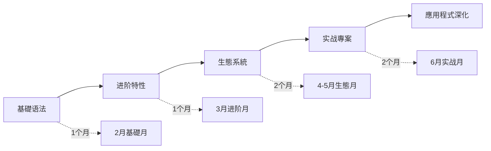

# 🐍 Python學習專案

> 🎯 **專案目標**：6个月内系統學習Python編程，从零基礎达到中级開發水平。

## 📋 專案概览

### 專案类型
- **技能提升培训**：系統化Python編程學習
- **時間期限**：6个月（2024年2月1日 - 2024年6月30日）
- **投入時間**：平均每天1-2小时
- **预期成果**：能夠独立完成Python開發專案

### 學習路徑


## 🎯 里程碑規劃

### 🥉 里程碑1：Python基礎掌握（第1个月）
**時間**：2026-02-01 至 2026-03-01

**目標**：
- ✅ 掌握Python基礎语法和數據类型
- ✅ 熟悉控制流和函数編程
# 管理
- ✅ 搭建完整的開發環境

**驗收標準**：
- [ ] 通過基礎语法測試（90%以上准确率）
- [ ] 完成5个基礎編程练习
- [ ] 搭建Python開發環境并熟练使用

### 🥈 里程碑2：Python进阶特性（第2个月）
**時間**：2026-03-01 至 2026-04-01

**目標**：
- ✅ 掌握面向对象編程
- ✅ 理解函数式編程特性
- ✅ 学会异常處理和除錯
- ✅ 掌握檔案操作和數據處理

**驗收標準**：
- [ ] 独立完成一个OOP專案的代碼架構設計
- [ ] 掌握至少3个Python高级特性
- [ ] 能夠除錯和優化基礎代碼效能

### 🥇 里程碑3：生態系統掌握（第3-4个月）
**時間**：2026-04-01 至 2026-05-01

**目標**：
# 分析
- ✅ 掌握Web開發框架（Flask或Django基礎）
- ✅ 了解AI/ML基礎库（TensorFlow入门）
- ✅ 学会API整合和數據處理

**驗收標準**：
# 分析
- [ ] 開發一个简单的Web應用程式
- [ ] 整合第三方API获取和處理數據

### 🏆 里程碑4：综合实战應用程式（第5-6个月）
**時間**：2026-05-01 至 2026-06-30

**目標**：
- ✅ 完成一个中等复杂度的完整專案
- ✅ 掌握代碼優化和效能调优
# 部署
- ✅ 建立个人技術博客和學習社區参与

**驗收標準**：
- [ ] 專案代碼品質达到生产環境標準
# 部署
- [ ] 通過專案掌握至少2个专业方向技能

## 📚 詳細學習計劃

### 第1階段：Python基礎（2月）

#### 第1周：環境搭建和基礎语法
```mermaid
gantt
    title 第1周學習計劃
    dateFormat  YYYY-MM-DD
    section 環境搭建
    安裝Python環境        :env1, 2024-02-01, 2d
# 配置
    section 基礎语法  
    变量和數據类型       :syntax1, after env2, 3d
    基礎運算和表达式     :syntax2, after syntax1, 2d
    练习和測試           :practice, after syntax2, 2d
```

**每日任務**：
| 日期 | 學習內容 | 练习任務 | 预期成果 |
|------|----------|----------|----------|
# 配置
# 配置
| 2/3 | 变量和數據类型基礎 | 編寫简单程式 | 掌握數據类型 |
| 2/4 | 数字運算和字符串操作 | 练习計算题 | 基礎運算能力 |
| 2-5 | 容器类型學習 | 數據结构练习 | 掌握list/tuple/set |
# 知識

#### 第2周：控制流和函数
**重点內容**：
- 条件语句和循环
- 函数定义和調用
- 作用域和闭包基礎
- 递归和迭代概念

# 管理
**重点內容**：
- 模块导入和使用
# 管理
# 管理
- 專案结构组织

#### 第4周：檔案操作和异常處理
**重点內容**：
- 檔案读写操作
- 异常處理機制
- 標準库常用模块
- 除錯技巧和工具

### 第2階段：Python进阶（3月）

#### 第5周：面向对象編程基礎
**重点內容**：
- 类和对象概念
# 方法
- 继承和多态
# 方法

#### 第6周：面向对象进阶
**重点內容**：
- 私有属性和封装
- 抽象类和接口
- 設計模式簡介
# 方法

#### 第7周：函数式編程特性
**重点內容**：
- 高阶函数
- Lambda函数和闭包
- 装饰器基礎
- 迭代器和生成器

#### 第8周：异步編程入门
**重点內容**：
- async/await语法
- 异步I/O操作
- 并发編程概念
# 分析

### 第3-4階段：生態系統和实战（4月-5月）

# 分析
- **第9-10周**：NumPy和Pandas
- **第11周**：Matplotlib可视化
# 分析

#### Web開發方向  
- **第9周**：Flask基礎
- **第10周**：資料庫整合
- **第11周**：前端模板和静态檔案
- **第12周**：Web應用程式專案

### 第5-6階段：实战應用程式（6月）

#### 專案選擇（二选一）
# 分析
- 數據获取和清洗
# 分析
- 可视化和報告生成
- 预测模型初步

**Web開發專案**：
- REST API設計
- 資料庫設計和操作
- 使用者认证和授权
# 部署

## 🛠️ 開發工具链

### 開發環境
```python
tools_config = {
    "editor": "VS Code",
    "extensions": [
        "Python",
        "Python Docstring Generator", 
        "Python Extended",
        "Live Share",
        "Bookmarks"
    ],
    "linter_formatter": [
        "pylint",
        "black", 
        "isort",
        "autopep8"
    ],
    "debugger": "Python Debugger for VS Code"
}
```

# 版本
```bash
# 管理
git init project_name
git add .
git commit -m "Initial commit"
git remote add origin origin_url
git push -u origin main
```

# 管理
```bash
# 基礎虚拟環境
python -m venv venv
source venv/bin/activate  # Linux/Mac
# venv\Scripts\activate    # Windows

# 管理
pip install poetry
poetry init
poetry add requests
poetry install
poetry shell
```

## 📊 學習进度追踪

# 知識

### Python基礎
- [x] 变量和數據类型
- [x] 運算符和表达式  
- [x] 字符串處理
- [x] 控制流语句
- [x] 函数定义和調用
# 管理
- [ ] 檔案操作和异常處理

### 面向对象編程
- [ ] 类和对象概念
# 方法
- [ ] 继承和多态
- [ ] 封装和私有属性
- [ ] 抽象类和接口
# 方法

# 分析
- [ ] NumPy基礎操作
- [ ] Pandas數據處理
- [ ] Matplotlib可视化
- [ ] 數據清洗和转换
# 分析

### Web開發
- [ ] HTTP协议基礎
- [ ] Flask框架入门
- [ ] 路由和视图函数
- [ ] 模板和静态檔案
- [ ] 資料庫操作
- [ ] 使用者认证

### 技进阶
- [ ] 效能優化技巧
# 管理
- [ ] 并发編程基礎
- [ ] 網路編程
- [ ] 測試和除錯

### 代碼品質評估
```python
def evaluate_code_quality():
    metrics = {
        "readability": 0.8,      # 代碼可读性
        "maintainability": 0.7,  # 可維護性  
        "test_coverage": 0.6,    # 測試覆盖率
        "performance": 0.7,      # 效能评分
        "documentation": 0.8     # 文檔完整性
    }
    return sum(metrics.values()) / len(metrics)

print(f"当前代碼品質评分: {evaluate_code_quality():.2f}/1.0")
```

## 🎯 實踐專案計劃

# 管理
# 管理

**技術棧**：
- 數據儲存：SQLite資料庫
- 數據處理：Pandas
- 數據可视化：Matplotlib
- 使用者界面：终端/命令行

**學習價值**：
# 知識
# 分析
- 專案架構設計經驗

### 專案2：简单Web爬虫
**功能**：網站數據抓取、數據清洗、數據儲存

**技術棧**：
- 網路请求：Requests
- HTML解析：BeautifulSoup
- 數據儲存：CSV/JSON/資料庫
- 调度执行：APScheduler

**學習價值**：
- 網路編程基礎
- 并发編程概念
- 數據處理流程

### 專案3：API客户端開發
**功能**：第三方服务整合、數據處理自動化、报表生成

**技術棧**：
- API調用：Requests
- 數據處理：Pandas
- 數據可视化：Plotly
# 部署

**學習價值**：
- API設計和使用
- 數據整合能力
- 现代化開發實踐

## 📚 學習資源

### 必读文檔
- [Python官方文檔](https://docs.python.org/3/)（权威參考）
# 指南
# 教程

### 推荐书籍
- 《Python編程：从入门到實踐》- 入门首选
- 《流畅的Python》- 进阶必读
- 《Python Cookbook》- 实用技巧集

### 線上資源
# 教程
- [Python Weekly](https://www.pythonweekly.com/) - 周刊資訊
- [HackerRank Python](https://www.hackerrank.com/domains/python) - 編程练习

### 练习平台
- [LeetCode](https://leetcode.com/) - 算法练习
- [Codewars](https://www.codewars.com/) - 技能挑戰
- [Pycheck](https://py.checkio.org/) - 游戏化學習

# 管理

### 每日學習計劃
```python
daily_schedule = {
    "早晨（30分钟）": {
# 教程
        "時間": "07:00-07:30"
    },
    "晚上（45分钟）": {
        "內容": "實踐編寫 - 练习、小專案",
        "時間": "20:00-20:45"
    },
    "周末（2-3小时）": {
        "內容": "深度學習 - 专题研究、專案開發",
        "時間": "周六日灵活安排"
    }
}
```

### 學習节奏调整
```python
def adjust_learning_rhythm(week_number):
    if week_number <= 4:
        return "基礎階段：注重概念理解和基礎练习"
    elif week_number <= 8:
        return "进阶階段：加强專案實踐和深度思考"
    elif week_number <= 12:
        return "應用程式階段：專注特定方向的專案開發"
    else:
        return "巩固階段：代碼優化和最佳實踐"
```

## 🤝 社區参与

### 技術社區
- **Stack Overflow**：提问和回答技術問題
# 分享
- **GitHub**：關注優秀專案，學習代碼风格
- **本地Python使用者组**：線下學習和交流

# 知識
- **技術博客**：每周写一篇學習總結
- **代碼開源**：将练习代碼發佈到GitHub
- **線上讨论**：参与Python技術論壇讨论

## 🎯 成功標準

### 技術能力指标
- ✅ **语法掌握**：95%以上基礎语法准确應用程式
- **代碼品質**：通過linter檢查，符合PEP 8規範
# 分析
- **專案經驗**：完成1-2个完整的Python專案

# 效率
- ✅ **時間投入**：平均每天學習60分钟以上
- ✅ **實踐比例**：理论學習与實踐時間比3:7
# 知識
- ✅ **社區参与**：每月参与2-3次技術社區讨论

### 專案成果指标
- ✅ **代碼行数**：累计編寫有效代碼5000行以上
- ✅ **專案数量**：完成至少3个不同类型的專案
- ✅ **技術深度**：掌握1-2个专业方向的深入技能
- ✅ **代碼品質**：專案代碼达到可生产環境標準

## 🧪 測試与評估

### 技能測試
```python
def skill_assessment_test():
    """Python技能評估測試"""
    tests = [
        "basic_syntax",        # 基礎语法測試
        "data_structures",    # 數據结构測試  
        "oop_concepts",       # 面向对象測試
        "problem_solving",    # 問題解決測試
        "code_quality"         # 代碼品質測試
    ]
    
    results = {}
    for test in tests:
        score = run_assessment(test)  # 0-100分
        results[test] = score
    
    return results

# 每月底進行技能評估
monthly_assessment = skill_assessment_test()
```

### 專案評估標準
每个專案完成後，从以下维度評估：

| 维度 | 评分標準 | 說明 |
|------|----------|------|
| 功能完整性 | 0-100分 | 是否實現所有需求功能 |
| 代碼品質 | 0-100分 | 代碼規範性、可读性 |
| 技術复杂度 | 0-100分 | 技術难度和實現复杂度 |
| 學習收获 | 0-100分 | 通過專案学到的技能 |
# 部署

## 📝 反思日志

### 每周反思要點
```markdown
# 第X周學習反思

## 主要成就
- 
- 
- 

## 困难点
- 
- 
- 

## 解決方案
- 
- 
- 

## 下周計劃
- 
- 
- 

## 學習心得
```

### 月度總結
```markdown
# 2026年X月學習總結

## 目標完成情况
- ✅ 已完成
- 🔄 進行中  
- ❌ 未完成

## 具体成就
- 
- 
- 

## 技能提升
- 
- 
- 

## 經驗教训
- 
- 
- 

## 下月调整計劃
- 
- 
- 
```

## 🎉 專案成果预期

### 6个月后达到的水平
- **編程技能**：能夠独立開發中等复杂度的Python應用程式
# 管理
- **技術视野**：了解Python生態系統的主流工具和框架
# 方法

### 长期發展路徑
- **7-12个月**：深入特定應用程式领域专业化
- **1-2年**：成为Python某领域的专业開發者
- **2-3年**：具备技術领导和架構設計能力
- **长期**：成为Python技術专家和社區贡献者

## 🔗 相關資源

### 學習資源
- [[Python知識庫導航]] - 完整學習資源体系
# 指南
# 知識
- [[面向对象編程]] - OOP編程范式

### 專案資源
# 管理
# 指南
- [[API客户端開發]] - 整合技術實踐

### 學習社區
- [Python官方社區](https://www.python.org/community/)
- [PyPI包索引](https://pypi.org/)
- [Python Reddit](https://www.reddit.com/r/python/)
- [Stack Overflow Python標籤](https://stackoverflow.com/questions/tagged/python)

---
*創建時間: 2026-02-01*  
# 更新
*分類: 1 Projects*