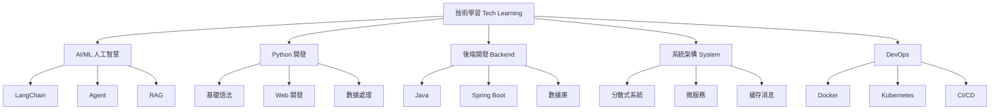

> [!note] 專案 / Project
> 有明確目標和截止日期的短期努力
> A short-term effort with clear goals and deadlines

---

## 專案目標 Project Goals

### 總體目標 Overall Goal

**成為全棧技術開發者，專注於 AI/ML 應用開發**
Become a full-stack developer, focusing on AI/ML application development

### 階段目標 Phase Goals

| 階段 Phase | 時間 Time | 主題 Topic | 目標 Goal |
|-----------|----------|-----------|----------|
| Q1 | Jan-Mar | Python + AI Basics | 掌握基礎，建立項目 |
| Q2 | Apr-Jun | Backend + System Design | 實踐項目，系統設計 |
| Q3 | Jul-Sep | DevOps + Cloud | 部署上線，雲原生 |
| Q4 | Oct-Dec | 深度專項 | 專業化，輸出成果 |

---

## 基本資訊 Basic Information

| 項目 | 內容 |
|------|------|
| 創建日期 | 2026-02-16 |
| 截止日期 | 2026-12-31 |
| 狀態 | 🟢 In Progress |
| 優先級 | 🔴 High |

---

## 學習範疇 Learning Scope

### 技術領域 Tech Domains



---

## 任務清單 Task List

### 📅 Q1 (Jan-Mar) - Python + AI

- [ ] Python 基礎複習
  - [x] 環境搭建
  - [x] 基礎語法
  - [ ] 面向對象
  - [ ] 函數式編程
- [ ] LangChain 學習
  - [x] 基礎概念
  - [ ] Chains 深入
  - [ ] Agents 開發
  - [ ] Memory 機制
- [ ] 實踐項目
  - [x] AI 助手系統
  - [ ] RAG 知識庫
  - [ ] 多代理系統

### 📅 Q2 (Apr-Jun) - Backend

- [ ] Java 開發
  - [ ] 集合框架
  - [ ] 多線程
  - [ ] IO/NIO
- [ ] Spring Boot
  - [ ] 入門教程
  - [ ] RESTful API
  - [ ] 數據庫整合
- [ ] 實踐項目
  - [ ] 微服務項目
  - [ ] API 設計

### 📅 Q3 (Jul-Sep) - DevOps

- [ ] Docker
  - [ ] 基礎語法
  - [ ] Docker Compose
  - [ ] 鏡像優化
- [ ] Kubernetes
  - [ ] 基礎概念
  - [ ] 部署實踐
- [ ] CI/CD
  - [ ] GitHub Actions
  - [ ] 自動化流水線

### 📅 Q4 (Oct-Dec) - 深度專項

- [ ] 專項深入
  - [ ] AI Agent 進階
  - [ ] 系統設計
  - [ ] 雲原生
- [ ] 輸出成果
  - [ ] 技術博客
  - [ ] 開源項目
  - [ ] 項目作品集

---

## 里程碑 Milestones

| 里程碑 Milestone | 目標日期 Target Date | 狀態 Status | 備註 Notes |
|-----------------|---------------------|------------|-----------|
| 🎯 Python 基礎完成 | 2026-02-28 | 🟡 進行中 | 複習中 |
| 🎯 LangChain 項目 | 2026-03-31 | ⬜ | AI 助手 |
| 🎯 Java 基礎完成 | 2026-04-30 | ⬜ | |
| 🎯 Spring Boot 項目 | 2026-06-30 | ⬜ | RESTful API |
| 🎯 Docker 部署 | 2026-09-30 | ⬜ | 容器化部署 |
| 🎯 項目作品集 | 2026-12-31 | ⬜ | 完整輸出 |

---

## 進度追蹤 Progress Tracking

### 本週進度 This Week

| 日期 Date | 主題 Topic | 時長 Hours | 筆記 Notes |
|----------|-----------|-----------|-----------|
| 週一 | | | |
| 週二 | | | |
| 週三 | | | |
| 週四 | | | |
| 週五 | | | |
| 週末 | | | |

**本週總時長**: ___ 小時

### 技能評估 Skills Assessment

```python
# 技能評估函數
def assess_skills():
    skills = {
        "Python": {
            "level": "intermediate",
            "progress": 0.7,
            "focus": ["async", "OOP"]
        },
        "AI/ML": {
            "level": "beginner",
            "progress": 0.4,
            "focus": ["LangChain", "Agent"]
        },
        "Backend": {
            "level": "beginner",
            "progress": 0.2,
            "focus": ["Java", "Spring Boot"]
        },
        "DevOps": {
            "level": "beginner",
            "progress": 0.1,
            "focus": ["Docker"]
        }
    }
    return skills
```

---

## 資源連結 Resources

### 相關筆記 Related Notes

- [[技術學習]] - 技術學習總覽
- [[AI-ML 領域]] - AI/ML 領域
- [[後端開發]] - 後端開發領域
- [[DevOps 運維]] - DevOps 領域
- [[持續學習]] - 學習方法論
- [[技術學習資源]] - 學習資源庫

### 外部資源 External Resources

- [Python Documentation](https://docs.python.org/3/)
- [LangChain Docs](https://python.langchain.com/)
- [Spring Boot Docs](https://spring.io/projects/spring-boot)
- [Docker Docs](https://docs.docker.com/)

---

## 筆記與記錄 Notes

### 重要資訊 Key Information

> 2026-02-16: 專案啟動，創建技術學習專案結構

### 技術棧 Tech Stack

```python
tech_stack = {
    "languages": ["Python", "Java", "JavaScript"],
    "ai_ml": ["LangChain", "OpenAI", "Hugging Face"],
    "backend": ["Spring Boot", "FastAPI", "PostgreSQL"],
    "devops": ["Docker", "Kubernetes", "GitHub Actions"],
    "tools": ["Git", "VS Code", "Obsidian"]
}
```

### 遇到的問題 Issues

| 問題 Issue | 解決方案 Solution | 日期 Date | 狀態 Status |
|-----------|------------------|----------|------------|
| | | | |

---

## 回顧 Review

### 每週回顧 Weekly Review

#### 週次 W?

**本週總結**:
- 完成項目:
- 學習內容:
- 問題:

**下週計劃**:
- [ ]

### 每月回顧 Monthly Review

#### 月份 Month

**目標達成**:
- [ ] 目標 1
- [ ] 目標 2

**技能提升**:
- 新技能:
- 改進:

**調整計劃**:

---

## 專案驗收 Project Acceptance

> 專案完成後填寫 / Fill after project completion

### 完成總結 Completion Summary

### 經驗教訓 Lessons Learned

### 下一步行動 Next Steps

---

## 更新日誌 Update Log

### 2026-02-16
- ✅ 創建技術學習專案
- ✅ 定義 Q1-Q4 學習目標
- ✅ 建立任務清單
- ✅ 整合相關資源連結

---

> [!tip] 快速指令 Quick Commands
> - 使用 `/search` 搜索相關筆記
> - 使用 `[[技術學習]]` 訪問技術學習總覽
> - 使用 `[[持續學習]]` 訪問學習方法論
