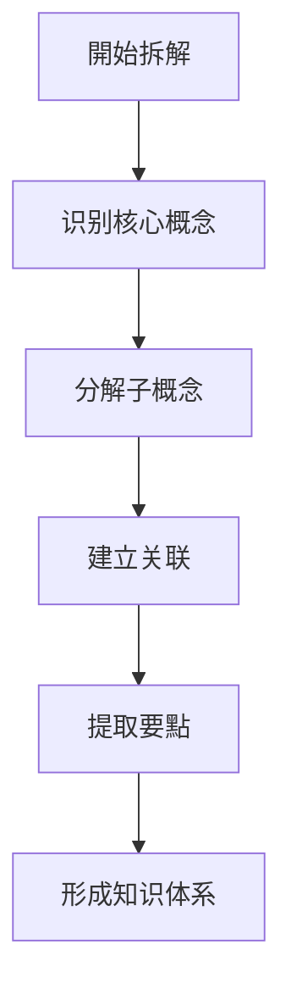
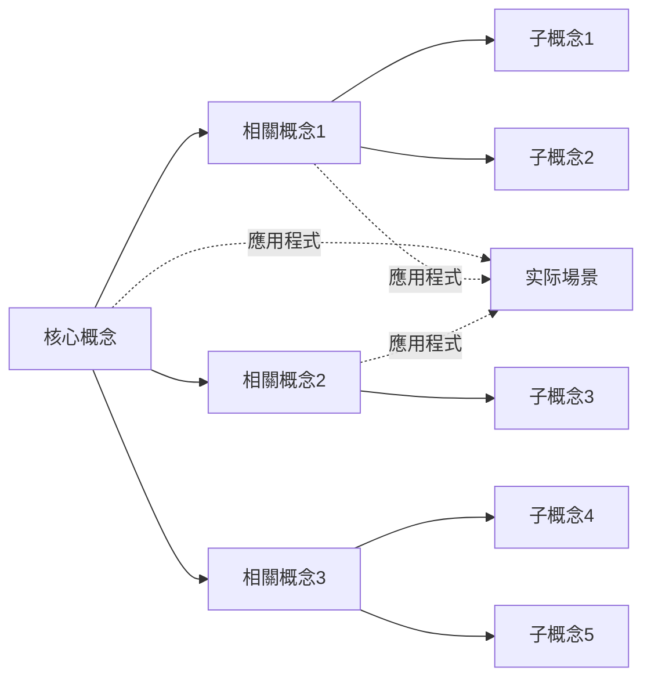

# 阅读分析拆解工作流

> [!abstract] 概述
这是一个系统化的阅读分析工作流，帮助您高效获取、处理和输出知识内容。工作流包含四个核心階段：准备階段、阅读階段、分析階段和输出階段。

---

## 📋 快速导航

### 🎯 核心章节
- [📖 阅读階段](#二阅读階段) - 四步阅读法详解
- [🔍 分析階段](#三分析階段) - 内容深度拆解
- [📝 输出模板](#五輸出模板) - 筆記模板库
- [🎨 工具与技巧](#六工具与技巧) - 实用工具集
- [🚀 應用程式場景](#七應用程式場景) - 不同內容类型應用程式

### 📊 速查指南
- [📝 快速參考表](#📝-快速參考表) - 常用流程速查
- [⌨️ Obsidian 快捷键](#⌨️-obsidian-核心快捷键) - 提升效率
- [🗂️ PARA 資料夾定位](#🗂️-para-資料夾快速定位) - 文件管理

### 🌱 新手建議
1. 从「快速捕获」开始，建立收集习惯
2. 先掌握「四步阅读法」基本流程
3. 根据內容类型，選擇「應用程式場景」中的对应流程
4. 定期回顾和优化个人工作流

---

## 🔄 整体工作流设计

### 1.1 完整流程图

```mermaid
graph TD
    subgraph 📥 准備階段 (Input)
        A[明确目標] --> B[收集资料]
        B --> C[初步瀏覽]
        C --> D[选择模板]
    end

    subgraph 📖 核心階段 (Processing)
        D --> E[四步阅读法]
        E --> F[內容拆解]
        F --> G[要點提炼]
        G --> H[深度思考]
    end

    subgraph 📝 輸出階段 (Output)
        H --> I[整理输出]
        I --> J[建立連結]
        J --> K[應用程式]
        K --> L[歸檔整理]
    end

    subgraph 🔄 持續改进
        L --> M[定期回顧]
        M --> A
    end
```

### 1.2 核心原则

| 原则 | 說明 | 实践方法 |
|------|------|----------|
| **目标导向** | 明确阅读目的和预期产出 | 阅读前设定問題清单 |
| **主动阅读** | 带着問題阅读，积极思考 | 边读边问，標記重点 |
| **输出驱动** | 以输出倒逼输入 | 强制做筆記、写摘要 |
| **迭代优化** | 多轮阅读，逐步深入 | 初读→精读→重读 |

### 1.3 三階段模型

```
┌─────────────────────────────────────────────────────────┐
│                    知识处理流程                          │
├─────────────┬─────────────────────┬─────────────────────┤
│  (Input)   │   (Processing)     │   (Output)         │
├─────────────┼─────────────────────┼─────────────────────┤
│ • 收集信息  │ • 逻辑梳理         │ • 概念拆解         │
│ • 初步筛选  │ • 关联发现         │ • 总结输出         │
│ • 设定目标  │ • 批判思考         │ • 行动计划         │
│ • 选择方法  │ • 深度理解         │ • 应用实践         │
└─────────────┴─────────────────────┴─────────────────────┘
```

---

## 📖 二、阅读階段

### 2.1 四步阅读法

#### 第一步：預覽 (Preview)

> [!tip] 預覽要點
> 在正式阅读前快速了解內容全貌，建立整體认知框架。

| 預覽內容 | 具体操作 | 時間建議 |
|----------|----------|----------|
| **标题副标题** | 识别主題和核心概念 | 30秒 |
| **目錄结构** | 瀏覽章节安排 | 1-2分钟 |
| **摘要/导语** | 阅读內容摘要 | 1分钟 |
| **圖表标题** | 快速瀏覽视觉元素 | 1分钟 |
| **结论/總結** | 預覽主要结论 | 1-2分钟 |
| **首尾段落** | 阅读开头和结尾 | 1分钟 |

**預覽产出**：形成初步印象，识别重点章节

#### 第二步：略读 (Skimming)

> [!tip] 略读策略
> 快速瀏覽全文，识别核心论点和關鍵資訊。

| 略读策略 | 具体操作 | 优先级 |
|----------|----------|--------|
| **识别主題句** | 每段首句或末句 | ★ 核心观点 |
| **發現關鍵词** | 重复出现的概念 | ● 關鍵词 |
| **追踪论证** | 寻找"因为→所以" | → 因果链 |
| **定位重点** | 圖表、數據、引用 | ■ 重点數據 |
| **發現疑问** | 不理解或有疑问处 | ? 待解答 |

**略读产出**：標記重点页码，形成問題清單

#### 第三步：精读 (Intensive Reading)

> 逐段深入阅读，全面理解內容细节。

| 精读策略 | 具体操作 | 适用場景 |
|----------|----------|----------|
| **批判思考** | 評估论据的充分性 | 观点类文章 |
| **上下文关联** | 理解概念间的联系 | 技術文檔 |
| **筆記記錄** | 边读边記錄要點 | 學習型阅读 |
| **提问解答** | 自问自答加深理解 | 复杂材料 |

**精读产出**：詳細筆記、問題答案、概念理解

#### 第四步：回顧 (Review)

> [!tip] 回顧要點
> 阅读結束后回顧總结，巩固记忆和理解。

| 回顧策略 | 具体操作 | 時间安排 |
|----------|----------|----------|
| **核心论点** | 用自己的话复述 | 当天 |
| **關鍵概念** | 制作概念卡片 | 当天 |
| **應用程式場景** | 思考实际應用程式 | 1周内 |
| **未知领域** | 標記待深入点 | 1周内 |

### 2.2 阅读速度调节

| 材料类型 | 阅读速度 | 阅读策略 | 重点 |
|----------|----------|----------|------|
| **新聞資訊** | 快 (500+字/分) | 略读为主 | 标题、导语、结论 |
| **通俗文章** | 中 (300-500字/分) | 略读+精读 | 核心观点、案例 |
| **经典著作** | 很慢 (50-150字/分) | 反复阅读 | 思想、论证、语言 |

### 2.3 阅读品質檢查

```
阅读品質評估清單：
├── □ 是否理解了核心论点？
├── □ 是否识别了關鍵概念？
├── □ 是否理清了逻辑结构？
├── □ 是否产生了新的問題？
├── □ 是否可以简要复述？
└── □ 是否知道如何應用程式？
```

---

## 🔍 三、分析階段

### 3.1 内容结构分析

#### 结构类型识别

| 结构类型 | 特点 | 适用场景 |
|----------|------|----------|
| **总分结构** | 总→分→总 | 核心论点→分论点→總結 |
| **并列结构** | 各部分平等 | 多個并列观点/案例 |
| **递进结构** | 逐步深入 | 层次递进、难度递增 |
| **因果结构** | 原因→结果 | 问题分析、现象解释 |
| **对比结构** | A vs B | 观点对比、方案选择 |

#### 详细分析维度

| 分析维度 | 具体内容 | 工具方法 |
|----------|----------|----------|
| **段落结构** | 主題句+展开句+结论句 | 提取每段核心 |
| **句子关系** | 转折、因果、并列、递进 | 识别連接词 |
| **資訊密度** | 核心資訊vs辅助資訊 | 区分主干和枝叶 |
| **概念层级** | 上位概念vs下位概念 | 建立概念树 |

### 3.2 逻辑分析

#### 论证基本结构

```
论证基本结构：
┌─────────────────────────────────────┐
│           结论/论点                  │
│    ┌─────────────────────────┐      │
│    │     论据/证据/數據       │      │
│    │     (支持结论的材料)     │      │
│    └─────────────────────────┘      │
│    ┌─────────────────────────┐      │
│    │     推理/论证過程        │      │
│    │   (从论据到结论的逻辑)   │      │
│    └─────────────────────────┘      │
└─────────────────────────────────────┘
```

#### 逻辑谬误识别

| 谬误类型 | 說明 | 檢查方法 |
|----------|------|----------|
| **以偏概全** | 小样本→大结论 | 檢查样本量 |
| **稻草人谬误** | 曲解对方观点 | 還原原始观点 |
| **诉诸权威** | 仅凭权威背书 | 檢查证据本身 |
| **滑坡谬误** | 一连串推理 | 檢查每步逻辑 |
| **非黑即白** | 忽略中间选项 | 考虑其他可能 |
| **相關当因果** | 相關→因果 | 檢查因果证据 |

### 3.3 品質評估

#### 資訊品質評估

| 評估维度 | 說明 | 檢查方法 |
|----------|------|----------|
| **可靠性** | 資訊来源可信度 | 查证来源、作者资质 |
| **准确性** | 數據、事实准确性 | 多源比对、查证 |
| **时效性** | 資訊是否最新 | 檢查發佈日期、引用 |
| **完整性** | 是否覆盖全面 | 与同类资料比较 |
| **一致性** | 内部是否自洽 | 檢查逻辑矛盾 |

#### 品質评分標準

| 评分 | 等级 | 標準 |
|------|------|------|
| **5分** | 優秀 | 高可靠、高准确、高價值 |
| **4分** | 良好 | 可靠性高、基本准确 |
| **3分** | 中等 | 一般可靠、部分有價值 |
| **2分** | 较差 | 可靠性低或过时 |
| **1分** | 很差 | 不可靠或有害 |

---

## 💎 四、内容拆解階段

### 4.1 拆解流程



### 4.2 核心概念提取

#### 概念提取方法

| 方法 | 說明 | 适用场景 |
|------|------|----------|
| **高频词法** | 识别出现频率高的词 | 快速抓重点 |
| **定义句法** | 找"是..."的定义句 | 概念性材料 |
| **标题提取法** | 从各级标题提取 | 结构化材料 |
| **圖表法** | 从圖表标题提取 | 數據类材料 |
| **問題法** | 从问句中提取 | 问答类材料 |

#### 概念层级梳理

```
一级概念（核心）
├── 二级概念（分支）
│   ├── 三级概念（细分）
│   └── 三级概念（细分）
└── 二级概念（分支）
    ├── 三级概念（细分）
    └── 三级概念（细分）
```

### 4.3 要點提炼技術

| 技术 | 說明 | 示例 |
|------|------|------|
| **一句话總結** | 用一句话概括段落 | "X导致Y" |
| **問題-答案法** | 将內容转为Q&A | Q: 原因？A: ... |
| **类比法** | 用熟悉概念类比 | "像...一样" |
| **删减法** | 刪除辅助词保留主干 | 保留主谓宾 |
| **可视化** | 转为圖表形式 | 流程图、表格 |

### 4.4 知识卡片制作

#### 卡片类型分类

| 卡片类型 | 內容要素 | 用途 |
|----------|----------|------|
| **概念卡** | 定义、特征、例子 | 理解概念 |
| **观点卡** | 观点、论据、局限 | 記錄观点 |
| **案例卡** | 背景、過程、結果 | 积累案例 |
| **數據卡** | 数值、来源、時間 | 儲存數據 |
| **金句卡** | 原文、页码、感悟 | 积累素材 |

#### 知识网络构建



---

## 📝 五、輸出模板

### 5.1 读书筆記模板

```markdown
---
title: 【书名】读书筆記
date: YYYY-MM-DD
tags: [读书筆記, 书籍, 主題]
author: 你的名字
rating: ★★★★☆
status: completed
---

# 【书名】读书筆記

## 📖 基本資訊
- **书名**：[书名全称]
- **作者**：[作者名]
- **出版社**：[出版社]
- **出版年**：20XX年
- **阅读日期**：20XX年XX月
- **阅读时长**：XX小时
- **类型**：虚构/非虚构/专业/...

## 🎯 阅读目標
- 目標1：_______________
- 目標2：_______________
- 目標3：_______________

## 📝 核心內容

### 主題概述
[用2-3段话概述本书核心主題]

### 主要观点
| 观点 | 页码 | 核心內容 |
|------|------|----------|
| 观点1 | Pxx | ___________ |
| 观点2 | Pxx | ___________ |
| 观点3 | Pxx | ___________ |

### 關鍵概念
| 概念 | 定义 | 我的理解 |
|------|------|----------|
| 概念1 | ______ | ___________ |
| 概念2 | ______ | ___________ |

## 💡 最有價值的点

### 1. [第一有價值的点]
**原文摘录**：
> "引用原文"

**个人感悟**：
[写下你的理解和感悟]

**行动計劃**：
- [ ] 具体的行动步骤

### 2. [第二有價值的点]
...

### 3. [第三有價值的点]
...

## 🤔 批判性思考

### 优点
- ___________

### 局限/不足
- ___________

### 与其他观点的冲突
- ___________

## 🔗 关联与延伸
- 关联到[[另一筆記]]：___________
- 关联到[[另一筆記]]：___________

### 待深入的主題
- ___________

### 延伸阅读推荐
- ___________

## 📋 行動計劃

### 即刻行动（本周）
- [ ] ___________

### 短期計劃（本月）
- [ ] ___________

### 长期應用程式
- [ ] ___________

## 📊 評價与反思

### 阅读體驗
- 难度：易懂/适中/较难
- 收获：大/中/小
- 推荐：强烈推荐/推荐/一般/不推荐

### 反思
[阅读過程中的思考和反思]

---
**相關筆記**：
- [[书名相關筆記1]]
- [[书名相關筆記2]]
```

### 5.2 快速捕获模板

```markdown
---
title: 📥 [来源] - [日期]
date: YYYY-MM-DD
tags: [inbox, 阅读捕获, 待處理]
status: pending
source_type: article/paper/book/video
source_url: ""
estimated_time: ""
priority: high/medium/low
---

# [标题]

## 📋 基本資訊
- **来源**: ___________
- **連結**: ___________
- **类型**: □ 文章 □ 论文 □ 书籍 □ 視訊 □ 文檔
- **作者**: ___________
- **捕获日期**: ___________
- **预估阅读時間**: ___ 分钟

## 🎯 預覽評估

### 核心主題
_______________

### 吸引点
- _______________
- _______________

### 预估價值
- 对我的價值: ⭐⭐⭐⭐⭐
- 阅读優先級: □ 高 □ 中 □ 低
- 阅读方式: □ 精读 □ 略读 □ 跳读

## ✅ 下一步行动
- [ ] 完整阅读并做筆記
- [ ] 快速略读提取要點
- [ ] 放入待读清單
- [ ] 不相關，直接刪除

## 🔗 相關內容
- 相關主題: [[]]
```

---

## 🎨 六、工具与技巧

### 6.1 阅读辅助工具

| 工具类型 | 推荐工具 | 用途 |
|----------|----------|------|
| **思维导图** | XMind, MindMaster, Obsidian Excalidraw | 结构梳理 |
| **标注工具** | PDF Expert, GoodNotes, MarginNote | 文檔标注 |
| **摘录工具** | Readwise, Kindle highlights, Obsidian | 摘录收集 |
| **笔记软件** | Obsidian, Notion, Logseq | 知识管理 |

### 6.2 高效阅读技巧

#### SQ3R阅读法

| 階段 | 全称 | 關鍵动作 |
|------|------|----------|
| **S** | Survey | 預覽、瀏覽目錄 |
| **Q** | Question | 列出問題 |
| **R1** | Read | 带着問題阅读 |
| **R2** | Recite | 复述、總結 |
| **R3** | Review | 回顧、复习 |

#### PQRST阅读法

| 階段 | 全称 | 關鍵动作 |
|------|------|----------|
| **P** | Preview | 預覽內容 |
| **Q** | Question | 设定問題 |
| **R** | Read | 仔细阅读 |
| **S** | State | 陈述要點 |
| **T** | Test | 測試记忆 |

### 6.3 深度思考技巧

#### 5Why分析法

```
問題：_______________
    ↓
为什么1？→ _______________
    ↓
为什么2？→ _______________
    ↓
为什么3？→ _______________
    ↓
为什么4？→ _______________
    ↓
为什么5？→ 根本原因
```

#### 矩阵分析法

| | 重要 | 不重要 |
|---|---|---|
| **紧急** | ① 立即處理<br>紧急且重要 | ③ 可委托<br>紧急但不重要 |
| **不紧急** | ② 計劃處理<br>重要但不紧急 | ④ 可刪除<br>不紧急不重要 |

### 6.4 记忆巩固技巧

| 技巧 | 說明 | 适用场景 |
|------|------|----------|
| **间隔重复** | 按遗忘曲线复习 | 概念记忆 |
| **费曼學習** | 用简单语言解釋 | 深度理解 |
| **联想记忆** | 建立概念间联系 | 知识网络 |
| **可视化记忆** | 转为图像记忆 | 抽象概念 |

---

## 🚀 七、應用程式場景

### 7.1 书籍阅读流程

```
┌─────────────────────────────────────────────────────────────────┐
├─────────────────────────────────────────────────────────────────┤
│  1️⃣ 快速捕获階段 (Inbox)                                         │
│     ├─ 快捷键: Ctrl+N 創建新筆记                                │
│     ├─ 使用: [[快速捕获模板]]                                    │
│     ├─ 記錄: 来源、标题、初步印象                                │
│     └─ 目標: 快速收集，稍后處理                                  │
│                                                                 │
│  2️⃣ 深度阅读階段 (Reading)                                      │
│     ├─ 選擇: 根据內容类型選擇模板                                │
│     ├─ 打開: Ctrl+E 进入阅读模式                                │
│     ├─ 标注: 使用高亮颜色分類                                    │
│     │   ├─ 🟡 黄色: 核心观点/论点                                │
│     │   ├─ 🔵 蓝色: 數據/证据/事实                               │
│     │   └─ 🔴 红色: 质疑/待查证/争议                             │
│     └─ 筆記: 边读边記錄關鍵思考                                  │
│                                                                 │
│  3️⃣ 分析整理階段 (Analysis)                                     │
│     ├─ 结构: 使用嵌套列表梳理层级                                │
│     ├─ 連結: 使用 [[ ]] 建立关联                                │
│     └─ 思考: 批判性分析和延伸思考                                │
│                                                                 │
│  4️⃣ 輸出整合階段 (Output)                                       │
│     ├─ 整理: 使用模板輸出筆记                                    │
│     └─ 歸檔: 移动到对应的 PARA 資料夾                            │
│                                                                 │
└─────────────────────────────────────────────────────────────────┘
```

### 7.2 不同內容类型應用程式

| 內容类型 | 阅读策略 | 输出重点 | 适用模板 |
|----------|----------|----------|----------|
| **新聞資訊** | 預覽+略读 | 核心观点+要點摘录 | 快速捕获模板 |
| **技術文檔** | 精读+實踐 | 操作步骤+應用程式案例 | 技术分析模板 |
| **经典著作** | 多轮精读 | 深度筆记+思考感悟 | 读书筆記模板 |
| **学术论文** | 批判性阅读 | 研究方法+数据+结论 | 学术分析模板 |
| **网络文章** | 快速筛选 | 关键信息+个人见解 | 快速总结模板 |

### 7.3 PARA系統應用

```
📁 1 Projects (專案)
   └─ 当前正在進行的專案 (有明确目標和期限)
     - 閱讀專案/
     - 研究專案/

📁 2 Areas (领域)
   └─ 持續維護的生活领域 (没有完成狀態)
     - 01-Health (健康)
     - 02-Career (职业)
     - 03-Finance (财务)
     - 04-Relationships (人际关系)
     - 05-Learning (學習) ← 阅读相关内容
     - 06-Lifestyle (生活方式)

📁 3 Resources (資源)
   └─ 有兴趣的主題和參考资料
     - 阅读方法/
     - 工具推荐/
     - 理论基础/

📁 4 Archives (歸檔)
   └─ 已完成或不再活跃的內容
     - 已完成的读书筆記/
     - 过时的资料/

📁 0 Inbox (收件箱)
   └─ 新收集的內容、待處理
```

---

## ⚡ 八、效率提升技巧

### 8.1 批量处理策略

1. **批量處理**: 集中時間处理同一类型的阅读內容
2. **模板化**: 使用模板快速創建筆记，减少重复劳动
3. **快捷键**: 记住常用快捷键，大幅提升操作速度
4. **專注模式**: 阅读时關閉其他應用程式，提高專注度
5. **時間盒**: 为每个阅读階段设定時間限制，避免拖延
6. **及时記錄**: 不要等读完再記錄，边读边写

### 8.2 Obsidian 核心快捷键

| 操作 | Windows | Mac | 說明 |
|------|---------|-----|------|
| 創建新筆记 | `Ctrl+N` | `Cmd+N` | 新建空白筆记 |
| 命令面板 | `Ctrl+P` | `Cmd+P` | 执行所有命令 |
| 搜尋 | `Ctrl+Shift+F` | `Cmd+Shift+F` | 全局搜尋 |
| 切換阅读模式 | `Ctrl+E` | `Cmd+E` | 預覽/編輯切換 |
| Wiki連結 | `[[` | `[[` | 創建内部連結 |
| 高亮文本 | `Ctrl+点击` | `Cmd+点击` | 标注重要內容 |
| 複製块引用 | `Ctrl+Shift+H` | `Cmd+Shift+H` | 複製引用連結 |
| 最近檔案 | `Ctrl+Tab` | `Ctrl+Tab` | 切换最近打開的檔案 |

### 8.3 看板管理設置

**阅读看板設置**:
```dataview
LIST
FROM "0 Inbox" OR "1 Projects"
WHERE status = "reading"
SORT date DESC
```

看板列:
- 📥 待读 (to-read)
- 📖 阅读中 (reading)
- ⏸️ 暫停 (paused)
- ✅ 已完成 (completed)
- ❌ 放弃 (abandoned)

---

## 🔁 九、定期回顧機制

### 9.1 日常检查清單 (5分钟)

```markdown
□ 今天是否有新增阅读筆记？
□ Inbox 中是否有待處理內容？
□ 是否記錄了阅读时长？
□ 是否使用模板整理输出？
```

### 9.2 每周回顧 (30分钟)

```markdown
□ 本周新增阅读筆记: ____ 篇
□ 本周完成阅读: ____ 篇
□ 清理 Inbox 待處理內容
□ 規劃下周阅读計劃
□ 复习重点內容
```

### 9.3 每月总结 (1小时)

```markdown
1. 統計數據
   - 本月阅读量統計
   - 阅读时间分析
   - 收获和成果

2. 系統优化
   - 调整模板和流程
   - 優化資料夾结构
   - 更新工具配置

3. 长期规划
   - 制定下月目标
   - 识别需要深入的主題
   - 规划專案和领域
```

---

## 📚 十、相关资源

### 10.1 外部资源
- [Obsidian 官方文檔](https://help.obsidian.md/)
- [Templater 外掛文檔](https://github.com/SilentVoid13/Templater)
- [Dataview 文檔](https://blacksmithgu.github.io/obsidian-dataview/)
- [QuickAdd 外掛](https://github.com/chhoumann/quickadd)
- [Obsidian 中文論壇](https://forum-zh.obsidian.md/)

### 10.2 內部連結
- [[高效阅读技巧]] - 阅读技巧合集
- [[知识管理方法]] - 知识系统构建
- [[思维导图工具]] - 可视化工具推荐
- [[写作模板库]] - 输出模板集合

---

## 📝 快速參考表

### 📖 四步阅读法速查

| 階段 | 時间 | 核心目標 | 關鍵动作 |
|------|------|----------|----------|
| **1. 預覽** | 5-10分钟 | 建立整體认知 | 读标题→看目錄→读摘要→看圖表→读结论 |
| **2. 略读** | 15-30分钟 | 识别核心資訊 | 找主題句→标關鍵词→追论证→定重点→记疑问 |
| **3. 精读** | 1-2小时 | 深度理解內容 | 批判思考→上下文关联→筆記記錄→提问解答 |
| **4. 回顧** | 30分钟-1小时 | 巩固记忆理解 | 复述论点→制卡片→绘导图→思應用程式→记疑问 |

### 🎨 高亮颜色编码系統

| 颜色 | 用途 | 示例內容 |
|------|------|----------|
| 🟡 黄色 | 核心观点/主要论点 | "使用者體驗是产品成功的關鍵" |
| 🔵 蓝色 | 數據/证据/事实 | "转化率提升了 45%" |
| 🔴 红色 | 质疑/待查证/矛盾 | "这一结论需要更多數據支持" |
| 🟣 紫色 | 金句/重要引用 | "重要的不是你说了什么，而是你做到了什么" |

### 📊 不同內容类型應用程式

| 內容类型 | 阅读策略 | 时间投入 | 推荐方法 |
|----------|----------|----------|----------|
| **新聞資訊** | 預覽+略读 | 5-10分钟 | 核心观点+要點摘录 |
| **技術文檔** | 精读+實踐 | 2-4小时 | 操作步骤+應用程式案例 |
| **经典著作** | 多轮精读 | 数天-数周 | 深度筆记+思考感悟 |

### 📝 阅读品質自检清單

```
□ 是否理解了核心论点？
□ 是否识别了關鍵概念？
□ 是否理清了逻辑结构？
□ 是否产生了新的問題？
□ 是否可以简要复述？
□ 是否知道如何應用程式？
```

---

## 🔄 持续改进循环


**持续改进原则**:
- **记录过程**: 記录每次阅读的體驗和收获
- **分析效率**: 分析时间分配和效果
- **調整方法**: 根据效果调整策略
- **迭代优化**: 不断优化个人工作流

> [!success] 使用提示
> 保持輸出习惯，以輸出倒逼輸入。阅读是輸入，思考是加工，輸出是深化。

---

## 🎯 总结

这个阅读分析工作流为您提供了一个系统化的知识获取和处理方法。通过准备、阅读、分析、输出四个階段的循环，您可以：
1. **高效获取知识** - 有选择地阅读和收集
2. **深度理解內容** - 通过拆解和分析实现深度理解
3. **系统化输出** - 形成个人化的知识体系
4. **持续改进** - 通过反馈和优化不断提升

记住，最好的工作流是适合您个人需求的工作流。请根据实际情况调整和完善这个工作流，让它成为您知识管理的强大工具。