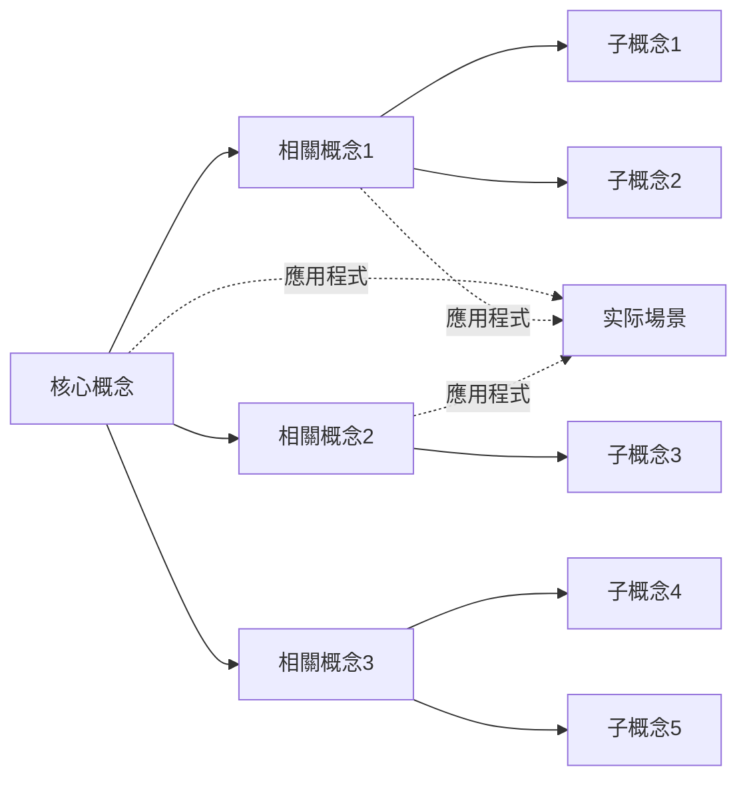

---
# 工作流
aliases:
# 工作流
# 知識
# 分析
created: 2026-01-25
tags:
  - reading
  - analysis
  - workflow
  - learning-method
cssclasses:
  - workflow
  - learning-method
status: active
source: 原创
para: projects
language: zh-cn
---

# 工作流

> [!abstract] 概述
# 知識

---

## 📋 快速导航

### 核心章节
# 工作流
- [二、阅读階段](#二阅读階段) - 四步阅读法详解
# 分析
# 知識
- [五、輸出模板](#五輸出模板) - 筆記模板库
# 方法
- [七、應用程式場景](#七應用程式場景) - 不同內容类型應用程式

# 指南
# 指南
- [📝 快速參考表](#📝-快速參考表) - 常用流程速查

### 🎯 新手建議
# 工作流
# 工作流
# 方法
3. 根据你的內容类型，選擇「應用程式場景」中的对应流程
# 指南

---

# 工作流

### 1.1 整體流程图

```mermaid
graph TD
    subgraph 准备階段
    A[明确目標] --> B[收集资料]
    B --> C[初步瀏覽]
    end

    subgraph 核心階段
# 分析
    E --> F[內容拆解]
    F --> G[要點提炼]
    end

    subgraph 輸出階段
# 知識
    I --> J[回顧應用程式]
    end

    A --> D
    G --> H
```

# 工作流

# 方法
|------|------|----------|
| **目標导向** | 明确阅读目的和预期产出 | 阅读前设定問題清單 |
| **主动阅读** | 带着問題阅读，积极思考 | 边读边问，標記重点 |
# 分析
| **輸出驅動程式** | 以輸出倒逼輸入 | 强制做筆記、写摘要 |
| **迭代優化** | 多轮阅读，逐步深入 | 初读→精读→重读 |

### 1.3 三階段模型

```
┌─────────────────────────────────────────────────────────┐
# 工作流
├─────────────┬─────────────────────┬─────────────────────┤
# 分析
│  (Input)    │   (Processing)      │   (Output)         │
├─────────────┼─────────────────────┼─────────────────────┤
# 分析
│ • 略读      │ • 逻辑梳理          │ • 概念拆解          │
# 知識卡片
│ • 回顧      │ • 关联發現          │ • 總結輸出          │
└─────────────┴─────────────────────┴─────────────────────┘
```

---

## 二、阅读階段

### 2.1 四步阅读法

#### 第一步：預覽 (Preview)

> [!tip] 預覽要點
> 在正式阅读前快速了解內容全貌，建立整體认知框架。

| 預覽內容 | 具体操作 | 時間建議 |
|----------|----------|----------|
| **标题副标题** | 识别主題和核心概念 | 30秒 |
| **目錄结构** | 瀏覽章节安排 | 1-2分钟 |
| **摘要/导语** | 阅读內容摘要 | 1分钟 |
| **圖表标题** | 快速瀏覽视觉元素 | 1分钟 |
| **结论/總結** | 預覽主要结论 | 1-2分钟 |
| **首尾段落** | 阅读开头和结尾 | 1分钟 |

**預覽产出**：形成初步印象，识别重点章节

#### 第二步：略读 (Skimming)

> [!tip] 略读策略
> 快速瀏覽全文，识别核心论点和關鍵資訊。

# 方法
|----------|----------|----------|
| **识别主題句** | 每段首句或末句 | ★ 核心观点 |
| **發現關鍵词** | 重复出现的概念 | ● 關鍵词 |
| **追踪论证** | 寻找"因为→所以" | → 因果链 |
| **定位重点** | 圖表、數據、引用 | ■ 重点數據 |
| **發現疑问** | 不理解或有疑问处 | ? 待解答 |

**略读产出**：標記重点页码，形成問題清單

#### 第三步：精读 (Intensive Reading)

# 方法
> 逐段深入阅读，全面理解內容细节。

| 精读策略 | 具体操作 | 适用場景 |
|----------|----------|----------|
# 分析
| **批判思考** | 評估论据的充分性 | 观点类文章 |
| **上下文关联** | 理解概念间的联系 | 技術文檔 |
| **筆記記錄** | 边读边記錄要點 | 學習型阅读 |
| **提问解答** | 自问自答加深理解 | 复杂材料 |

**精读产出**：詳細筆記、問題答案、概念理解

#### 第四步：回顧 (Review)

> [!tip] 回顧要點
> 阅读結束后回顧總結，巩固记忆和理解。

# 方法
|----------|----------|--------|
| **核心论点** | 用自己的话复述 | 当天 |
| **關鍵概念** | 制作概念卡片 | 当天 |
# 知識
| **應用程式場景** | 思考实际應用程式 | 1周内 |
| **未知领域** | 標記待深入点 | 1周内 |

### 2.2 阅读速度调节

| 材料类型 | 阅读速度 | 阅读策略 | 重点 |
|----------|----------|----------|------|
| **新聞資訊** | 快 (500+字/分) | 略读为主 | 标题、导语、结论 |
| **通俗文章** | 中 (300-500字/分) | 略读+精读 | 核心观点、案例 |
# 方法
# 分析
| **经典著作** | 很慢 (50-150字/分) | 反复阅读 | 思想、论证、语言 |

### 2.3 阅读品質檢查

```
阅读品質評估清單：
├── □ 是否理解了核心论点？
├── □ 是否识别了關鍵概念？
├── □ 是否理清了逻辑结构？
# 知識
├── □ 是否产生了新的問題？
├── □ 是否可以简要复述？
└── □ 是否知道如何應用程式？
```

---

# 分析

# 分析

```mermaid
graph TD
# 分析
# 分析
# 分析
# 分析
# 分析

    B --> B1[层次结构]
    B --> B2[组织方式]
    B --> B3[資訊密度]

    C --> C1[论证逻辑]
    C --> C2[因果关系]
    C --> C3[推理链条]

    D --> D1[核心观点]
    D --> D2[立场倾向]
    D --> D3[假设前提]

    E --> E1[论据充分性]
    E --> E2[數據可靠性]
    E --> E3[结论有效性]

    F --> F1[实用價值]
    F --> F2[創新程度]
    F --> F3[适用边界]
```

# 分析

# 分析

# 分析
|----------|------|----------|
| **总分结构** | 总→分→总 | 核心论点→分论点→總結 |
| **并列结构** | 各部分平等 | 多個并列观点/案例 |
| **递进结构** | 逐步深入 | 层次递进、难度递增 |
# 分析
# 分析
# 分析

# 分析

# 方法
|----------|----------|----------|
| **段落结构** | 主題句+展开句+结论句 | 提取每段核心 |
| **句子关系** | 转折、因果、并列、递进 | 识别連接词 |
| **資訊密度** | 核心資訊vs辅助資訊 | 区分主干和枝叶 |
| **概念层级** | 上位概念vs下位概念 | 建立概念树 |

# 分析

# 分析

```
论证基本结构：
┌─────────────────────────────────────┐
│           结论/论点                  │
│    ┌─────────────────────────┐      │
│    │     论据/证据/數據       │      │
│    │     (支持结论的材料)     │      │
│    └─────────────────────────┘      │
│    ┌─────────────────────────┐      │
│    │     推理/论证過程        │      │
│    │   (从论据到结论的逻辑)   │      │
│    └─────────────────────────┘      │
└─────────────────────────────────────┘
```

#### 逻辑谬误识别

# 方法
|----------|----------|----------|
| **以偏概全** | 小样本→大结论 | 檢查样本量 |
| **稻草人谬误** | 曲解对方观点 | 還原原始观点 |
| **诉诸权威** | 仅凭权威背书 | 檢查证据本身 |
| **滑坡谬误** | 一连串推理 | 檢查每步逻辑 |
| **非黑即白** | 忽略中间选项 | 考虑其他可能 |
| **相關当因果** | 相關→因果 | 檢查因果证据 |

# 分析

#### 观点提取模板

# 分析
|----------|----------|----------|
| **核心观点** | 作者最想表达什么 | 一句话概括 |
| **立场态度** | 作者倾向什么 | 正/负/中立 |
| **假设前提** | 作者默认什么 | 列出隐含假设 |
| **论证方式** | 如何支持观点 | 证据类型 |
| **潜在偏见** | 可能的偏颇 | 识别盲点 |
| **适用边界** | 何时不适用 | 限定条件 |

### 3.5 品質評估

#### 資訊品質評估

# 方法
|----------|----------|----------|
| **可靠性** | 資訊来源可信度 | 查证来源、作者资质 |
| **准确性** | 數據、事实准确性 | 多源比对、查证 |
| **时效性** | 資訊是否最新 | 檢查發佈日期、引用 |
# 分析
| **完整性** | 是否覆盖全面 | 与同类资料比较 |
| **一致性** | 内部是否自洽 | 檢查逻辑矛盾 |

#### 品質评分標準

| 评分 | 等级 | 標準 |
|------|------|------|
| **5分** | 優秀 | 高可靠、高准确、高價值 |
| **4分** | 良好 | 可靠性高、基本准确 |
| **3分** | 中等 | 一般可靠、部分有價值 |
| **2分** | 较差 | 可靠性低或过时 |
| **1分** | 很差 | 不可靠或有害 |

---

# 方法

# 知識

```mermaid
graph TD
    A[開始拆解] --> B[识别核心概念]
    B --> C[分解子概念]
    C --> D[建立关联]
    D --> E[提取要點]
# 知識卡片
# 知識
```

### 4.2 核心概念提取

# 方法

# 方法
|------|----------|----------|
| **高频词法** | 识别出现频率高的词 | 快速抓重点 |
| **定义句法** | 找"是..."的定义句 | 概念性材料 |
| **标题提取法** | 从各级标题提取 | 结构化材料 |
| **圖表法** | 从圖表标题提取 | 數據类材料 |
| **問題法** | 从问句中提取 | 问答类材料 |

#### 概念层级梳理

```
一级概念（核心）
├── 二级概念（分支）
│   ├── 三级概念（细分）
│   └── 三级概念（细分）
└── 二级概念（分支）
    ├── 三级概念（细分）
    └── 三级概念（细分）
```

# 方法

#### 要點提炼技術

| 技術 | 說明 | 示例 |
|------|------|------|
| **一句话總結** | 用一句话概括段落 | "X导致Y" |
| **問題-答案法** | 将內容转为Q&A | Q: 原因？A: ... |
| **类比法** | 用熟悉概念类比 | "像...一样" |
| **删减法** | 刪除辅助词保留主干 | 保留主谓宾 |
| **可视化** | 转为圖表形式 | 流程图、表格 |

#### 要點記錄格式

```
【要點编号】
━━━━━━━━━━━━━━━
內容：_______________
来源：_______________
页码：_______________
關鍵词：_______________
关联：_______________
應用程式：_______________
━━━━━━━━━━━━━━━
```

# 知識

# 知識卡片

| 卡片类型 | 內容要素 | 用途 |
|----------|----------|------|
| **概念卡** | 定义、特征、例子 | 理解概念 |
| **观点卡** | 观点、论据、局限 | 記錄观点 |
# 方法
| **案例卡** | 背景、過程、結果 | 积累案例 |
| **數據卡** | 数值、来源、時間 | 儲存數據 |
| **金句卡** | 原文、页码、感悟 | 积累素材 |

# 知識



### 4.5 深度拆解模板

#### 完整拆解模板

```
━━━━━━━━━━━━━━━━━━━━━━━━━━━━━━━━━━━━
文檔拆解報告
━━━━━━━━━━━━━━━━━━━━━━━━━━━━━━━━━━━━

【基本資訊】
文檔标题：_______________
来源：_______________
作者：_______________
阅读日期：_______________
阅读时长：_______________

【一、內容概览】
核心主題：_______________
主要观点：_______________
目標读者：_______________
预计價值：_______________

# 分析
整體结构：_______________
各部分关系：_______________
逻辑主线：_______________

【三、核心要點】
要點1：_______________
  - 解釋：_______________
  - 证据：_______________
  - 例子：_______________
  - 关联：_______________

要點2：_______________
  - ...

【四、概念拆解】
概念1：_______________
  定义：_______________
  特征：_______________
  例子：_______________
  边界：_______________

# 分析
观点1：_______________
  立场：_______________
  论据：_______________
  評價：_______________
  局限：_______________

【六、批判思考】
优点：_______________
不足：_______________
质疑：_______________
延伸：_______________

# 知識
# 知識
可以連結的筆記：_______________
待學習的相關主題：_______________

【八、應用程式思考】
实际應用程式場景：_______________
行动計劃：_______________
待實踐检验：_______________

【九、輸出成果】
已完成輸出：_______________
計劃輸出：_______________

━━━━━━━━━━━━━━━━━━━━━━━━━━━━━━━━━━━━
```

---

## 五、輸出模板

### 5.1 读书筆記模板

```
---
title: 【书名】读书筆記
date: YYYY-MM-DD
tags: [读书筆記, 书籍, 主題]
author: 你的名字
rating: ★★★★☆
status: completed
---

# 【书名】读书筆記

## 📖 基本資訊
- **书名**：[书名全称]
- **作者**：[作者名]
- **出版社**：[出版社]
- **出版年**：20XX年
- **阅读日期**：20XX年XX月
- **阅读时长**：XX小时
- **类型**：虚构/非虚构/专业/...

## 🎯 阅读目標
- 目標1：_______________
- 目標2：_______________
- 目標3：_______________

## 📝 核心內容

### 主題概述
[用2-3段话概述本书核心主題]

### 主要观点
| 观点 | 页码 | 核心內容 |
|------|------|----------|
| 观点1 | Pxx | ___________ |
| 观点2 | Pxx | ___________ |
| 观点3 | Pxx | ___________ |

### 關鍵概念
| 概念 | 定义 | 我的理解 |
|------|------|----------|
| 概念1 | ______ | ___________ |
| 概念2 | ______ | ___________ |

## 💡 最有價值的点

# 方法
**原文摘录**：
> "引用原文"

**个人感悟**：
[写下你的理解和感悟]

**行动計劃**：
- [ ] 具体的行动步骤

### 2. [第二有價值的点]
...

### 3. [第三有價值的点]
...

## 🤔 批判性思考

### 优点
- ___________

### 局限/不足
- ___________

### 与其他观点的冲突
- ___________

## 🔗 关联与延伸

# 知識
- 关联到[[另一筆記]]：___________
- 关联到[[另一筆記]]：___________

### 待深入的主題
- ___________

### 延伸阅读推荐
- ___________

## 📋 行动計劃

### 即刻行动（本周）
- [ ] ___________

### 短期計劃（本月）
- [ ] ___________

### 长期應用程式
- [ ] ___________

## 📊 評價与反思

### 阅读體驗
- 难度：易懂/适中/较难
- 收获：大/中/小
- 推荐：强烈推荐/推荐/一般/不推荐

### 反思
[阅读過程中的思考和反思]

---
**相關筆記**：
- [[书名相關筆記1]]
- [[书名相關筆記2]]
```

# 分析

```
---
# 分析
date: YYYY-MM-DD
# 分析
citation: |
  作者. (年份). 标题. 期刊名, 卷(期), 页码.
doi: xxxxxx
---

# 分析

## 📋 基本資訊
| 專案 | 內容 |
|------|------|
| 标题 | ___________ |
| 作者 | ___________ |
| 期刊 | ___________ |
| 年份 | 20XX年 |
| 卷期 | Vol.XX, No.X |
| 页码 | PP.XX-XX |
| DOI | ___________ |

## 🎯 研究概述

### 研究問題
本文獻研究的核心問題：_______________

### 研究假设
- 假设1：_______________
- 假设2：_______________

# 方法
# 方法
- 样本量：N=____
- 數據收集：_______________
# 方法

## 📊 核心發現

### 主要结论
1. ___________
2. ___________
3. ___________

### 關鍵數據
| 变量/指标 | 数值 | 显著性 |
|-----------|------|--------|
| _________ | ____ | p<.05  |
| _________ | ____ | p<.01  |

# 分析

### 优点
- ___________

### 局限
- ___________

### 潜在問題
- ___________

## 🔗 文獻关联

### 理论基礎
- 基于_______________理论

### 与其他文獻的关系
- 擴展了[[某文獻]]的研究
- 与[[某文獻]]结论一致/相反

### 引用了该文獻
- [[引用该文獻的筆記]]

## 💡 对我的启示

### 理论價值
- ___________

### 實踐應用程式
- ___________

### 研究启发
- ___________

## 📝 要點摘录

### 關鍵段落1
> "引用原文"

### 關鍵段落2
> "引用原文"
```

# 知識卡片

```
---
# 知識卡片
date: YYYY-MM-DD
# 知識卡片
aliases: [别名1, 别名2]
---

# 知識卡片

## 📌 基本資訊
- **概念名称**：_______________
- **英文名称**：_______________
- **学科领域**：_______________
- **相關概念**：[[概念1]], [[概念2]]

## 📖 定义
> 概念的精確定义

## 🔍 深入理解

### 核心特征
1. 特征1
2. 特征2
3. 特征3

### 边界与限定
- 适用情况：_______________
- 不适用情况：_______________
- 相關但不同的概念：_______________

### 举例說明
| 例子 | 說明 |
|------|------|
| 例子1 | ___________ |
| 例子2 | ___________ |

## 📚 来源与參考
- 首次提出：_______________
- 代表性文獻：_______________
- 相關理论：_______________

# 知識

### 上位概念（更抽象）
- [[上位概念1]]

### 下位概念（更具体）
- [[下位概念1]]
- [[下位概念2]]

### 平行概念（相關）
- [[平行概念1]]

## 💡 應用程式場景
1. 場景1：_______________
2. 場景2：_______________

## 📝 个人筆記
### 我的理解
_______________

### 實踐應用程式
_______________

### 待解決問題
_______________
```

---

## 六、工具与技巧

### 6.1 阅读辅助工具

| 工具类型 | 推荐工具 | 用途 |
|----------|----------|------|
# 知識庫
| **思维导图** | XMind, MindMaster | 结构梳理 |
# 整理
| **标注工具** | PDF Expert, GoodNotes | 文檔标注 |
# 管理
| **摘录工具** | Readwise, Kindle | 摘录收集 |

### 6.2 高效阅读技巧

#### SQ3R阅读法

| 階段 | 全称 | 關鍵动作 |
|------|------|----------|
| **S** | Survey | 預覽、瀏覽目錄 |
| **Q** | Question | 列出問題 |
| **R1** | Read | 带着問題阅读 |
| **R2** | Recite | 复述、總結 |
| **R3** | Review | 回顧、复习 |

#### PQRST阅读法

| 階段 | 全称 | 關鍵动作 |
|------|------|----------|
| **P** | Preview | 預覽內容 |
| **Q** | Question | 设定問題 |
| **R** | Read | 仔细阅读 |
| **S** | State | 陈述要點 |
| **T** | Test | 測試记忆 |

### 6.3 深度思考技巧

# 分析

```
問題：_______________
    ↓
为什么1？→ _______________
    ↓
为什么2？→ _______________
    ↓
为什么3？→ _______________
    ↓
为什么4？→ _______________
    ↓
为什么5？→ 根本原因
```

# 分析

| | 重要 | 不重要 |
|---|---|---|
| **紧急** | ① 立即處理<br>紧急且重要 | ③ 可委托<br>紧急但不重要 |
| **不紧急** | ② 計劃處理<br>重要但不紧急 | ④ 可刪除<br>不紧急不重要 |

### 6.4 记忆巩固技巧

# 方法
|------|------|----------|
| **间隔重复** | 按遗忘曲线复习 | 概念记忆 |
| **费曼學習** | 用简单语言解釋 | 深度理解 |
# 知識
# 知識
# 知識

---

## 七、應用程式場景

# 工作流

```
┌──────────────────────────────────────────────────────────┐
# 工作流
├──────────────────────────────────────────────────────────┤
│ 1. 預覽 (10-15分钟)                                      │
│    ├── 读封面、标题、作者                                 │
│    ├── 看目錄、大纲                                       │
│    ├── 读前言、结论                                       │
│    └── 瀏覽章节标题                                       │
├──────────────────────────────────────────────────────────┤
│ 2. 略读 (30-60分钟)                                      │
│    ├── 快速翻阅每章                                       │
│    ├── 標記重点章节                                       │
│    └── 识别核心论点                                       │
├──────────────────────────────────────────────────────────┤
│ 3. 精读 (数小时-数天)                                    │
│    ├── 逐章詳細阅读                                       │
│    ├── 做阅读筆記                                         │
│    └── 标注有價值的段落                                   │
├──────────────────────────────────────────────────────────┤
# 整理
# 整理
│    ├── 绘制思维导图                                       │
│    └── 写读书筆記                                         │
├──────────────────────────────────────────────────────────┤
│ 5. 輸出 (1-2小时)                                        │
│    ├── 写书评/读后感                                      │
# 知識卡片
│    └── 制定行动計劃                                       │
└──────────────────────────────────────────────────────────┘
```

# 工作流

| 階段 | 目標 | 時間 | 關鍵問題 |
|------|------|------|----------|
| **預覽** | 判斷價值 | 5分钟 | 值得读吗？ |
| **略读** | 把握框架 | 15分钟 | 讲什么？ |
| **精读** | 理解內容 | 1-2小时 | 怎么讲的？ |
# 分析
# 知識

# 工作流

```
┌────────────────────────────────────────────────────────┐
# 分析
└────────────────────────────────────────────────────────┘
                         │
                         ▼
              ┌──────────────┐
              │ 文檔类型？    │
              └──────┬───────┘
                     │
        ┌────────────┼────────────┐
        ▼            ▼            ▼
   ┌─────────┐  ┌─────────┐  ┌─────────┐
   │ 說明文檔 │  │ 報告文檔 │  │ 论文文獻 │
   └────┬────┘  └────┬────┘  └────┬────┘
        │            │            │
        ▼            ▼            ▼
   ┌─────────┐  ┌─────────┐  ┌─────────┐
   │ 操作→   │  │ 數據→   │  │ 论证→   │
   │ 步骤    │  │ 圖表    │  │ 逻辑    │
# 分析
   └─────────┘  └─────────┘  └─────────┘
```

# 工作流

# 方法
|------|------|----------|
| 1 | 儲存原文 | 印象筆記、Notion |
| 2 | 标注重点 | 瀏覽器标注功能 |
| 3 | 提取要點 | 手動摘录 |
# 知識庫
# 知識
| 6 | 定期回顧 | 纳入复习計劃 |

---

# 工作流

# 效率

| 维度 | 指标 | 目標值 |
|------|------|--------|
# 效率
# 分析
# 知識
# 知識
| **時間投入** | 单位內容處理時間 | 合理分配 |

### 持續改进

```
# 效率
# 方法
     ↑                                                          │
     └──────────────────────────────────────────────────────────┘
```

---

## 🔗 相關文檔連結

# 工作流
# 知識

> [!info] 其他連結
# 方法

---

> [!success] 使用提示
# 工作流
> - 保持輸出习惯，以輸出倒逼輸入
# 方法
# 知識

%% 阅读是輸入，思考是加工，輸出是深化 %%
# 方法

---

## 📝 快速參考表

# 工作流

### 📖 四步阅读法速查

| 階段 | 時間 | 核心目標 | 關鍵动作 |
|------|------|----------|----------|
| **1. 預覽** | 5-10分钟 | 建立整體认知 | 读标题→看目錄→读摘要→看圖表→读结论 |
| **2. 略读** | 15-30分钟 | 识别核心資訊 | 找主題句→标關鍵词→追论证→定重点→记疑问 |
# 分析
| **4. 回顧** | 30分钟-1小时 | 巩固记忆理解 | 复述论点→制卡片→绘导图→思應用程式→记疑问 |

# 工作流

# 工作流
|----------|------------|----------|----------|
| **新聞資訊** | 預覽+略读 | 5-10分钟 | 核心观点+要點摘录 |
# 知識卡片
# 分析
| **技術文檔** | 精读+實踐 | 2-4小时 | 操作步骤+應用程式案例 |
| **经典著作** | 多轮精读 | 数天-数周 | 深度筆記+思考感悟 |
# 知識卡片

# 分析

```
# 分析
# 分析
# 分析
# 分析
# 分析
```

### 💡 高亮颜色编码系統

| 颜色 | 用途 | 示例內容 |
|------|------|----------|
| 🟡 黄色 | 核心观点/主要论点 | "使用者體驗是产品成功的關鍵" |
# 方法
| 🔵 蓝色 | 數據/证据/事实 | "转化率提升了 45%" |
| 🔴 红色 | 质疑/待查证/矛盾 | "这一结论需要更多數據支持" |
# 知識

# 指南

| 場景 | 推荐模板 | 檔案名 |
|------|----------|--------|
| 初次收集內容 | 快速捕获模板 | `_template-快速捕获.md` |
| 深度阅读一本书 | 阅读筆記模板 | `_template-阅读筆記.md` |
# 分析
# 知識卡片
# 分析

### ⌨️ Obsidian 核心快捷键

| 操作 | Windows | Mac | 說明 |
|------|---------|-----|------|
| 創建新筆記 | `Ctrl+N` | `Cmd+N` | 新建空白筆記 |
| 命令面板 | `Ctrl+P` | `Cmd+P` | 执行所有命令 |
| 搜尋 | `Ctrl+Shift+F` | `Cmd+Shift+F` | 全局搜尋 |
| 切換阅读模式 | `Ctrl+E` | `Cmd+E` | 預覽/編輯切換 |
| Wiki連結 | `[[` | `[[` | 創建内部連結 |
| 高亮文本 | `Ctrl+点击` | `Cmd+点击` | 标注重要內容 |
| 複製块引用 | `Ctrl+Shift+H` | `Cmd+Shift+H` | 複製引用連結 |
| 最近檔案 | `Ctrl+Tab` | `Ctrl+Tab` | 切換最近打開的檔案 |

# 分析

```
What (什么): 核心內容是什么？
Who (谁): 作者/对象是谁？
When (何时): 時間背景？
Where (何地): 地点/環境？
Why (为什么): 原因/目的？
# 方法
```

### 📊 阅读品質自检清單

```
□ 是否理解了核心论点？
□ 是否识别了關鍵概念？
□ 是否理清了逻辑结构？
# 知識
□ 是否产生了新的問題？
□ 是否可以简要复述？
□ 是否知道如何應用程式？
```

### 🔄 持續改进循环

```
# 分析
     ↑                                           │
     └───────────────────────────────────────────┘
```

# 方法

# 方法
|------|------|------|----------|
| **SQ3R** | 系統完整 | 時間投入大 | 学术學習、教材學習 |
| **PQRST** | 注重理解 | 需要记忆測試 | 专业文獻學習 |
# 知識
| **略读法** | 快速高效 | 理解不深 | 資訊收集、篩選 |
| **精读法** | 理解深刻 | 耗时较长 | 核心內容深度學習 |

# 知識卡片

| 卡片类型 | 內容要素 | 應用程式場景 | 示例 |
|----------|----------|----------|------|
# 知識
| **观点卡** | 观点、论据、局限 | 記錄观点 | "深度學習不会取代人类" |
# 方法
| **案例卡** | 背景、過程、結果 | 积累案例 | "Netflix 推荐系統案例" |
| **數據卡** | 数值、来源、時間 | 儲存數據 | "2024年 AI 市场规模" |
# 知識

### 🗂️ PARA 資料夾快速定位

```
📁 1 Projects (專案)
   └─ 当前正在進行的專案 (有明确目標和期限)
# 工作流

📁 2 Areas (领域)
   └─ 持續維護的生活领域 (没有完成狀態)
   - 01-Health (健康)
   - 02-Career (职业)
   - 03-Finance (财务)
   - 04-Relationships (人际关系)
   - 05-Learning (學習) ← 阅读相關內容
   - 06-Lifestyle (生活方式)

📁 3 Resources (資源)
   └─ 有兴趣的主題和參考资料
# 方法

📁 4 Archives (歸檔)
   └─ 已完成或不再活跃的內容
   示例：已完成的读书筆記、过时的资料

📁 0 Inbox (收件箱)
   └─ 新收集的內容、待處理
# 整理

# 指南
```

# 效率

1. **批量處理**: 集中時間處理同一类型的阅读內容
2. **模板化**: 使用模板快速創建筆記，减少重复劳动
3. **快捷键**: 记住常用快捷键，大幅提升操作速度
# 配置
5. **專注模式**: 阅读时關閉其他應用程式，提高專注度
6. **時間盒**: 为每个阅读階段设定時間限制，避免拖延
7. **及时記錄**: 不要等读完再記錄，边读边写
# 整理

# 工作流

**開始阅读前**:
```
□ 明确阅读目標
□ 選擇合适的模板
□ 准备好環境 (安静、專注)
```

**阅读過程中**:
```
□ 預覽內容 (5-10分钟)
□ 使用高亮颜色分類标注
□ 記錄思考和疑问
# 知識
```

**阅读結束后**:
```
□ 完成模板填寫
# 知識卡片
# 更新
□ 規劃後續行动
```

**定期維護**:
```
□ 每日: 清理 Inbox
# 整理
# 知識
```

---

## 🔗 相關文檔快速索引

# 工作流
# 工作流
# 知識
# 指南

> [!info] 其他連結
# 管理

# 方法
# 方法
- [[高效阅读技巧]] - 阅读技巧合集
# 方法

### 實踐工具
# 管理
# 效率
# 配置

### 案例示例
- [[3 Resources/Obsidian/Obsidian/Obsidian.md#📝-範例範本]] - 实际筆記模板和示例
# 知識卡片

---

# 版本
# 版本
# 更新
# 更新
> - 優化文檔结构和导航
# 指南
> - 新增完整的模板库
> - 新增快速參考表
> - 完善示例和用例

# 工作流

---

# 工作流

### 从捕获到歸檔的完整流程

```
┌─────────────────────────────────────────────────────────────────┐
# 工作流
├─────────────────────────────────────────────────────────────────┤
│                                                                 │
│  1️⃣ 快速捕获階段 (Inbox)                                         │
│     ├─ 快捷键: Ctrl+N 創建新筆記                                │
│     ├─ 使用: [[快速捕获模板]]                                    │
│     ├─ 記錄: 来源、标题、初步印象                                │
│     └─ 目標: 快速收集，稍后處理                                  │
│                                                                 │
│  2️⃣ 深度阅读階段 (Reading)                                      │
│     ├─ 選擇: 根据內容类型選擇模板                                │
│     ├─ 打開: Ctrl+E 进入阅读模式                                │
│     ├─ 标注: 使用高亮颜色分類                                    │
│     │   ├─ 🟡 黄色: 核心观点/论点                                │
# 方法
│     │   ├─ 🔵 蓝色: 數據/证据/事实                               │
│     │   └─ 🔴 红色: 质疑/待查证/争议                             │
│     └─ 筆記: 边读边記錄關鍵思考                                  │
│                                                                 │
# 分析
│     ├─ 结构: 使用嵌套列表梳理层级                                │
# 知識卡片
│     ├─ 連結: 使用 [[ ]] 建立关联                                │
# 分析
│                                                                 │
│  4️⃣ 輸出整合階段 (Output)                                       │
# 整理
# 知識
# 查看
│     └─ 歸檔: 移动到对应的 PARA 資料夾                            │
│                                                                 │
└─────────────────────────────────────────────────────────────────┘
```

---

## 🎯 二、核心操作详解

### 2.1 使用 Templater 創建阅读筆記

**操作步骤**:
```bash
1. 按 Ctrl+P 打開命令面板
2. 輸入 "Templater" 或選擇 "Templater: 選擇模板"
3. 从列表中選擇合适的模板:
   - 快速捕获模板 (用于初次收集)
   - 阅读筆記模板 (用于深度阅读)
# 分析
# 知識卡片
4. Obsidian 将自動創建带有模板內容的新筆記
```

**模板存放位置建議**:
```
.obsidian/
├── templates/
│   ├── _template-快速捕获.md
│   ├── _template-阅读筆記.md
# 分析
# 知識卡片
│   └── _template-文檔拆解.md
```

### 2.2 核心操作步骤速查表

| 步骤 | 操作 | Obsidian 功能 | Windows 快捷键 | Mac 快捷键 |
|------|------|---------------|----------------|------------|
| 創建筆記 | 使用模板創建 | Templater | `Ctrl+P` | `Cmd+P` |
| 預覽瀏覽 | 切換阅读/編輯 | Reading View | `Ctrl+E` | `Cmd+E` |
| 标注重点 | 高亮重要文本 | Highlights | `Ctrl+点击` | `Cmd+点击` |
| 摘录引用 | 複製块引用 | Copy block ref | `Ctrl+Shift+H` | `Cmd+Shift+H` |
| 建立連結 | 創建 wiki 連結 | Wiki-link | `[[` | `[[` |
| 搜尋內容 | 全局搜尋 | Search | `Ctrl+Shift+F` | `Cmd+Shift+F` |
| 切換檔案 | 最近檔案 | Recent files | `Ctrl+Tab` | `Ctrl+Tab` |
| 插入圖片 | 貼上圖片 | Drag & Drop | `Ctrl+V` | `Cmd+V` |

---

## 🎨 三、Obsidian 高级功能應用程式

### 3.1 阅读模式与高亮标注

**應用程式場景**: 預覽、略读、精读階段

**操作流程**:
```
1. 打開 PDF 或 Markdown 文檔
2. 按 Ctrl+E (Mac: Cmd+E) 切換到阅读模式
3. 使用鼠标选中文本 → Ctrl+点击 (Mac: Cmd+点击)
4. 選擇高亮颜色:
   🟡 黄色 (Yellow) - 核心观点/主要论点
# 方法
   🔵 蓝色 (Blue) - 數據/证据/支撑材料
   🔴 红色 (Red) - 质疑/待查证/矛盾处
   🟣 紫色 (Purple) - 金句/重要引用
5. 高亮会自動儲存并生成 block-id
```

**快速摘录高亮內容**:
```markdown
在筆記中引用高亮:
![[文檔名#^block-id]]

示例:
![[深度學習论文.pdf#^highlight-123]]
```

### 3.2 双向連結系統

# 知識

**基礎連結創建**:
```
选中關鍵词 → 按 [[ → 輸入或選擇筆記名
```

**三种連結类型**:

| 类型 | 语法 | 用途 | 示例 |
|------|------|------|------|
# 管理
# 方法
| 块引用 | `[[筆記名#^block-id]]` | 連結到特定段落 | `[[论文A#^highlight-1]]` |

**在筆記末尾新增相關連結区域**:
```markdown
---

## 🔗 相關連結

### 内部連結
- [[相關筆記1]] - 关联說明
- [[相關筆記2#章节名]] - 具体关联

### 外部資源
- [标题](URL) - 說明
```

### 3.3 嵌入与模板复用

**嵌入语法**:
```markdown
![[嵌入的檔案]]

嵌入特定区域:
![[筆記名#标题]]
![[圖片檔案.png]]
![[思维导图.excalidraw]]
```

**模板嵌入示例**:
```markdown
# 知識卡片
![[.obsidian/templates/_template-知識卡片]]
```

# 配置

# 顯示
```dataview
TABLE
  dateformat(date, "YYYY-MM-DD") AS "阅读日期",
  tags,
  rating AS "评分"
FROM "4 Archives/读书筆記"
WHERE contains(tags, "读书筆記")
SORT date DESC
LIMIT 10
```

# 顯示
```dataview
TABLE
  rows.title AS "筆記",
  rows.dateformat(rows.date, "MM-DD") AS "日期"
FROM "5 Zettels"
GROUP BY type
```

**待處理內容查詢**:
```dataview
TASK
FROM "0 Inbox"
WHERE !completed
GROUP BY file.link
```

---

# 工作流

### 4.1 快速捕获模板

```markdown
---
title: 📥 [来源] - [日期]
date: 2026-01-26
tags: [inbox, 阅读捕获, 待處理]
status: pending
source_type: article/paper/book/video
source_url: ""
estimated_time: ""
priority: high/medium/low
---

# [标题]

## 📋 基本資訊
- **来源**: ___________
- **連結**: ___________
- **类型**: □ 文章 □ 论文 □ 书籍 □ 視訊 □ 文檔
- **作者**: ___________
- **捕获日期**: ___________
- **预估阅读時間**: ___ 分钟

## 🎯 預覽評估

### 核心主題
_______________

### 吸引点
- _______________
- _______________

### 预估價值
- 对我的價值: ⭐⭐⭐⭐⭐
- 阅读優先級: □ 高 □ 中 □ 低
- 阅读方式: □ 精读 □ 略读 □ 跳读

## ✅ 下一步行动
- [ ] 完整阅读并做筆記
- [ ] 快速略读提取要點
- [ ] 放入待读清單
- [ ] 不相關，直接刪除

## 🔗 相關內容
# 知識
- 相關主題: [[]]
```

### 4.2 阅读筆記模板 (深度阅读)

```markdown
---
title: 📖 [标题] - 阅读筆記
date: 2026-01-26
tags: [阅读筆記, 核心主題]
source: ""
author: ""
read_date: ""
read_duration: ""
rating: ⭐⭐⭐⭐⭐
status: reading/completed
---

# [标题]

## 📋 基本資訊
| 專案 | 內容 |
|------|------|
| **来源** | ___________ |
| **連結** | ___________ |
| **作者** | ___________ |
| **發佈日期** | ___________ |
| **阅读日期** | ___________ |
| **阅读时长** | ___ 小时 |
| **阅读方式** | 精读/略读/跳读 |
| **难度評估** | 简单/中等/困难 |

## 🎯 阅读目標
- 目標1: _______________
- 目標2: _______________
- 目標3: _______________

## 📝 內容概览

### 核心主題
[用 2-3 段话概括內容的核心主題和主要观点]

### 文章结构
- 第一部分: _______________
- 第二部分: _______________
- 第三部分: _______________

## 💡 核心要點

### 要點 1: [要點标题]
> 原文摘录或關鍵描述

**我的理解**:
_______________

**相關案例**:
_______________

**應用程式場景**:
_______________

### 要點 2: [要點标题]
> 原文摘录或關鍵描述

**我的理解**:
_______________

**相關案例**:
_______________

**應用程式場景**:
_______________

## 🔑 關鍵概念

| 概念 | 定义 | 我的理解 |
|------|------|----------|
| 概念1 | ___________ | ___________ |
| 概念2 | ___________ | ___________ |

## 🤔 批判性思考

### 优点
- _______________
- _______________

### 局限/疑问
- _______________
- _______________

### 与其他观点的對比
- _______________

# 知識

# 知識
- 关联到 [[相關筆記]]: _______________
- 擴展了 [[另一个筆記]] 的观点

### 待深入的主題
- _______________

### 由此想到
_______________

## ✅ 行动計劃

### 即刻行动 (本周)
- [ ] _______________
- [ ] _______________

### 短期應用程式 (本月)
- [ ] _______________
- [ ] _______________

### 长期實踐
- [ ] _______________
- [ ] _______________

## 📊 評價与反思

### 阅读體驗
- **理解难度**: 简单 / 适中 / 困难
- **收获大小**: 大 / 中 / 小
- **推荐指数**: ⭐⭐⭐⭐⭐

### 關鍵收获
1. _______________
2. _______________
3. _______________

### 值得记住的金句
> "值得引用的原话"

---

## 🔗 相關連結

### 来源連結
- [[0 Inbox/捕获筆記連結]] - 原始捕获

# 知識卡片
- [[知識卡片1]]
- [[知識卡片2]]

### 相關主題
- [[相關主題1]]
- [[相關主題2]]

### 延伸阅读
- [文章标题](URL) - 推荐理由
```

# 分析

```markdown
---
# 分析
date: 2026-01-26
# 分析
citation: |
  作者. (年份). 标题. 期刊名, 卷(期), 页码.
doi: ""
status: completed
---

# [论文标题]

## 📋 基本資訊

| 專案 | 內容 |
|------|------|
| **标题** | ___________ |
| **作者** | ___________ |
| **期刊** | ___________ |
| **年份** | 20XX |
| **卷期** | Vol.XX, No.X |
| **页码** | PP.XX-XX |
| **DOI** | ___________ |
| **連結** | ___________ |
| **阅读日期** | ___________ |

## 🎯 研究概述

### 研究問題
本文獻试图解決的核心問題是什么？
_______________

### 研究假设
- 假设1: _______________
- 假设2: _______________

### 研究背景
_______________

# 方法

# 方法
# 方法

### 研究設計
_______________

### 样本与數據
- **样本量**: N = ______
- **样本特征**: _______________
- **數據收集**: _______________

# 方法
_______________

## 📊 核心發現

### 主要结论
1. _______________
2. _______________
3. _______________

### 關鍵數據

| 变量/指标 | 結果 | 統計显著性 |
|-----------|------|------------|
| _________ | ____ | p < .05   |
| _________ | ____ | p < .01   |
| _________ | ____ | p < .001  |

### 圖表要點
- 圖表1: _______________
- 圖表2: _______________

# 分析

### 研究优点
- _______________
- _______________
- _______________

### 研究局限
- _______________
- _______________
- _______________

### 潜在問題
- _______________
- _______________

## 🔗 文獻关联

### 理论基礎
基于 _______________ 理论

### 与其他文獻的关系
- 擴展了 [[某文獻]] 的研究
- 与 [[某文獻]] 结论一致
- 与 [[某文獻]] 结论相反/不同

### 引用了该文獻的筆記
- [[引用该文獻的筆記1]]
- [[引用该文獻的筆記2]]

## 💡 对我的启示

### 理论價值
- _______________
- _______________

### 實踐應用程式
- _______________
- _______________

### 研究启发
- _______________
- _______________

## 📝 重要摘录

### 關鍵段落 1
> "原文引用"

**重要原因**: _______________

### 關鍵段落 2
> "原文引用"

**重要原因**: _______________

## ✅ 後續行动

- [ ] 應用程式到实际專案中
- [ ] 引用到自己的论文/報告
- [ ] 进一步深入研究
# 分析

---

## 🔗 相關連結

- [[同一领域的其他文獻]]
- [[相關理论]]
- [[應用程式場景相關筆記]]
```

# 知識卡片

```markdown
---
# 知識卡片
date: 2026-01-26
# 知識卡片
aliases: [别名1, 别名2]
type: concept
created_from: [[来源筆記]]
---

# [概念名]

## 📌 基本資訊
- **中文名**: ___________
- **英文名**: ___________
- **学科领域**: ___________
- **提出者/来源**: ___________
- **首次出现**: ___________

## 📖 定义

### 標準定义
> 一句话的精確定义

### 我的理解
[用通俗语言重新解釋這個概念]

## 🔍 深入理解

### 核心特征
1. 特征1: _______________
2. 特征2: _______________
3. 特征3: _______________

### 边界与限定
- **适用情况**: _______________
- **不适用情况**: _______________
- **常见误解**: _______________
- **相關但不同的概念**:
  - 与 [[概念A]] 的区别: _______________
  - 与 [[概念B]] 的区别: _______________

### 举例說明

| 例子 | 說明 | 适用性 |
|------|------|--------|
| 例子1 | ___________ | ✓ / ✗ |
| 例子2 | ___________ | ✓ / ✗ |
| 例子3 | ___________ | ✓ / ✗ |

## 📚 来源与參考

### 首次提出
- 文獻: ___________
- 年份: ___________

### 代表性文獻
1. ___________
2. ___________
3. ___________

### 相關理论
- [[相關理论1]]
- [[相關理论2]]

# 知識

### 上位概念 (更抽象的类别)
- [[上位概念1]]: 关系說明
- [[上位概念2]]: 关系說明

### 下位概念 (更具体的例子)
- [[下位概念1]]
- [[下位概念2]]

### 平行概念 (相關的其他概念)
- [[平行概念1]]
- [[平行概念2]]

### 对立概念 (相反的概念)
- [[对立概念]]: 对立原因

## 💡 應用程式場景

### 理论應用程式
1. 場景1: _______________
2. 場景2: _______________

### 實踐應用程式
1. 場景1: _______________
2. 場景2: _______________

# 工作流
# 工作流

## 📝 个人筆記

### 我的理解
[用自己的话重新表达這個概念]

### 學習筆記
- 學習日期: ___________
- 难度: 简单/适中/困难
- 掌握程度: 了解/理解/精通

### 實踐應用程式
- 已應用程式的場景: _______________
- 計劃應用程式的場景: _______________

### 待解決的問題
1. _______________
2. _______________

### 有疑问的点
1. _______________
2. _______________

---

## 🔗 連結彙總

**来源**: [[原始阅读筆記]]
**相關**: [[相關概念1]], [[相關概念2]]
**應用程式**: [[應用程式案例]], [[專案筆記]]
```

# 分析

```markdown
---
title: 📑 [文檔标题] - 拆解報告
date: 2026-01-26
# 分析
source: ""
source_type: ""
analysis_date: ""
analysis_duration: ""
status: completed
---

# [文檔标题] - 拆解報告

## 📋 基本資訊
| 專案 | 內容 |
|------|------|
| **文檔标题** | ___________ |
| **来源** | ___________ |
| **連結** | ___________ |
| **作者/發佈者** | ___________ |
| **文檔类型** | 书籍/论文/文章/文檔/網頁 |
| **页数/字数** | ___________ |
# 分析
# 分析

---

## 📊 一、內容概览

### 核心主題
[用 2-3 段话概述文檔的核心主題]

### 主要观点
1. 观点1: _______________
2. 观点2: _______________
3. 观点3: _______________

### 目標读者
_______________

### 预期價值
- 对读者的帮助: _______________
- 对我的價值: _______________
- 推荐程度: ⭐⭐⭐⭐⭐

---

# 分析

### 整體结构类型
□ 总分结构 □ 并列结构 □ 递进结构
□ 對比结构 □ 因果结构 □ 問題解決

### 结构图解
```
文檔结构:
├── 第一部分 (约 __%)
│   ├── 章节1
│   └── 章节2
├── 第二部分 (约 __%)
│   ├── 章节3
│   └── 章节4
└── 第三部分 (约 __%)
    └── 章节5
```

### 各部分关系
_______________

### 逻辑主线
[描述文檔的论证/叙述逻辑]
_______________

---

## 💡 三、核心要點

### 要點 1: [要點标题]
> 原文要點描述或引用

**詳細解釋**:
_______________

**支撑证据/數據**:
_______________

**相關案例/例子**:
_______________

**与其他內容的关联**:
_______________

**應用程式價值**:
_______________

### 要點 2: [要點标题]
> 原文要點描述或引用

**詳細解釋**:
_______________

**支撑证据/數據**:
_______________

**相關案例/例子**:
_______________

**与其他內容的关联**:
_______________

**應用程式價值**:
_______________

---

## 🎓 四、概念拆解

### 核心概念提取
| 概念名 | 定义 | 重要性 | 理解程度 |
|--------|------|--------|----------|
| 概念1 | ___________ | ⭐⭐⭐⭐⭐ | 了解/理解/精通 |
| 概念2 | ___________ | ⭐⭐⭐⭐ | 了解/理解/精通 |
| 概念3 | ___________ | ⭐⭐⭐ | 了解/理解/精通 |

### 概念 1: [概念名]
**定义**:
_______________

**特征**:
_______________

**例子**:
_______________

**边界**:
_______________

**相關筆記**: [[知識卡片-概念名]]

---

# 分析

### 观点 1: [观点标题]
**作者立场**: 正向 / 负向 / 中立

**核心论点**:
_______________

**论证方式**:
# 分析

**支撑证据**:
_______________

**我的評價**:
- 可信度: 高 / 中 / 低
- 合理性: 高 / 中 / 低
- 新颖性: 高 / 中 / 低

**可能的局限或偏见**:
_______________

### 观点 2: [观点标题]
[同上结构]

---

## ⚖️ 六、批判性思考

### 优点
1. _______________
2. _______________
3. _______________

### 不足
1. _______________
2. _______________
3. _______________

### 我的质疑
1. _______________
2. _______________

### 延伸思考
1. _______________
2. _______________

---

# 知識

# 知識
- 关联到 [[筆記A]]: _______________
- 擴展了 [[筆記B]] 的內容: _______________
- 与 [[筆記C]] 的观点一致/不同: _______________

### 待學習的相關主題
1. _______________
2. _______________

# 知識
# 知識
- 上位: [[更高层级的主題]]
- 下位: [[更具体的內容]]
- 平行: [[相關的其他內容]]

---

## 🎯 八、應用程式思考

### 实际應用程式場景
1. 場景1: _______________
2. 場景2: _______________

### 行动計劃
#### 即刻行动 (本周)
- [ ] _______________
- [ ] _______________

#### 短期計劃 (本月)
- [ ] _______________
- [ ] _______________

#### 长期應用程式
- [ ] _______________
- [ ] _______________

### 待實踐检验的想法
1. _______________
2. _______________

---

## 📦 九、輸出成果

### 已完成輸出
- [x] 阅读筆記: [[文檔标题-阅读筆記]]
# 知識卡片
- [x] 思维导图: ![[思维导图檔案]]
- [x] 摘要/總結: _______________

### 計劃輸出
# 分析
- [ ] 應用程式實踐記錄
- [ ] 相關主題學習

---

## 📊 十、總結評價

### 學習成果
# 知識
_______________

**技能提升**:
_______________

**认知改变**:
_______________

# 分析
- 預覽: ___ 分钟
- 略读: ___ 分钟
- 精读: ___ 分钟
# 分析
- 輸出: ___ 分钟
- **总计**: ___ 分钟

# 效率
# 效率
# 知識
- 時間利用率: ⭐⭐⭐⭐⭐

---

## 🔗 連結彙總

**原始筆記**: [[文檔标题-原始筆記]]
# 知識卡片
**相關主題**: [[主題A]], [[主題B]]
**延伸阅读**: [[相關文檔1]], [[相關文檔2]]
```

---

# 效率

# 配置

**宏命令 1: 快速捕获**
```
# 配置
1. QuickAdd → Manage Macro → Create
2. Macro name: "快速捕获"
3. 新增动作:
   - Capture: 選擇快速捕获模板
   - Copy: 複製当前剪贴板內容
4. 绑定快捷键: Ctrl+Shift+N
```

**宏命令 2: 創建阅读筆記**
```
1. Macro name: "創建阅读筆記"
2. 新增动作:
   - Prompt: 輸入标题
   - Template: 選擇阅读筆記模板
3. 绑定快捷键: Ctrl+Shift+R
```

# 知識卡片
```
# 知識卡片
2. 新增动作:
   - Selection: 选中当前高亮文本
   - Prompt: 輸入概念名
# 知識卡片
3. 绑定快捷键: Ctrl+Shift+C
```

# 管理

**阅读看板設置**:
```markdown
```dataview
LIST
FROM "0 Inbox" OR "1 Projects"
WHERE status = "reading"
SORT date DESC
```

看板列:
- 📥 待读 (to-read)
- 📖 阅读中 (reading)
- ⏸️ 暫停 (paused)
- ✅ 已完成 (completed)
- ❌ 放弃 (abandoned)
```

### 5.3 自動化腳本

**Templater 腳本示例 - 自動插入日期和標籤**:
```javascript
<%*
let today = moment().format('YYYY-MM-DD');
let title = await tp.system.prompt("请輸入标题");
tR += `---
title: ${title}
date: ${today}
tags: [阅读筆記]
status: reading
---
`;
%>
```

---

## 🔄 六、定期回顧機制

### 每日檢查清單 (5分钟)
```markdown
□ 今天是否有新增阅读筆記？
□ Inbox 中是否有待處理內容？
# 知識
□ 是否記錄了阅读时长？
```

### 每周回顧 (30分钟)
```markdown
□ 本周新增阅读筆記: ____ 篇
□ 本周完成阅读: ____ 篇
# 知識卡片
□ 清理 Inbox 待處理內容
# 知識卡片
# 更新
□ 規劃下周阅读計劃
```

# 知識
```markdown
1. 統計數據
   - 本月阅读量統計
# 知識卡片
# 分析

# 整理
# 知識卡片
# 知識
   - 歸檔已完成的筆記

# 知識
# 知識
   - 识别需要深入的主題
# 知識

4. 系統優化
# 工作流
   - 调整模板和流程
   - 優化資料夾结构
```

---

## 📚 七、相關資源

### 内部連結
# 知識
# 工作流
# 方法
# 管理

### 外部資源
- [Obsidian 官方文檔](https://help.obsidian.md/)
- [Templater 外掛文檔](https://github.com/SilentVoid13/Templater)
- [Dataview 文檔](https://blacksmithgu.github.io/obsidian-dataview/)
- [QuickAdd 外掛](https://github.com/chhoumann/quickadd)

### 社區資源
- [Obsidian 中文論壇](https://forum-zh.obsidian.md/)
- [Obsidian Hub](https://publish.obsidian.md/hub/)
- [Awesome Obsidian](https://github.com/obsidianmd/awesome-obsidian)

