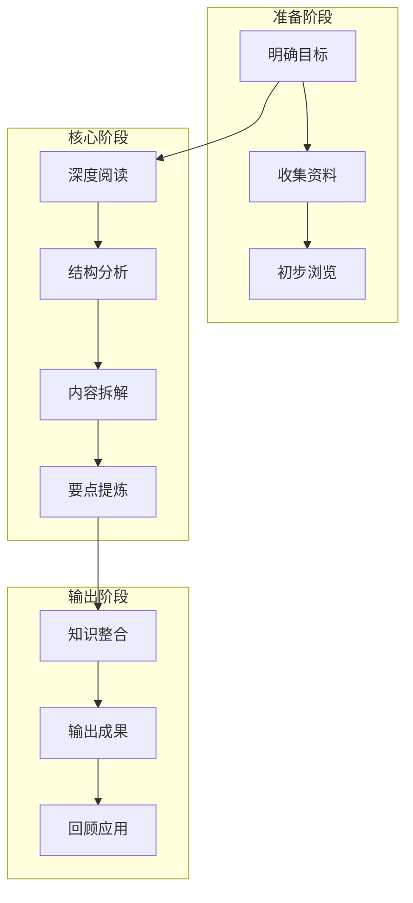
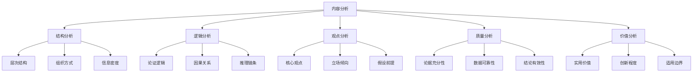
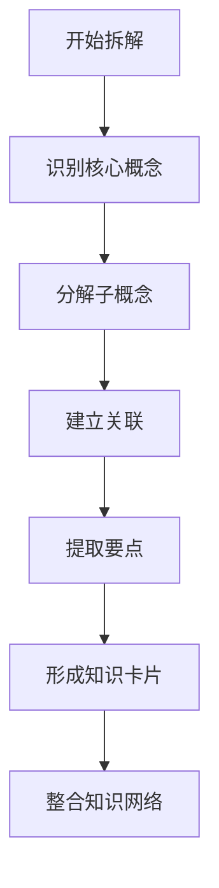
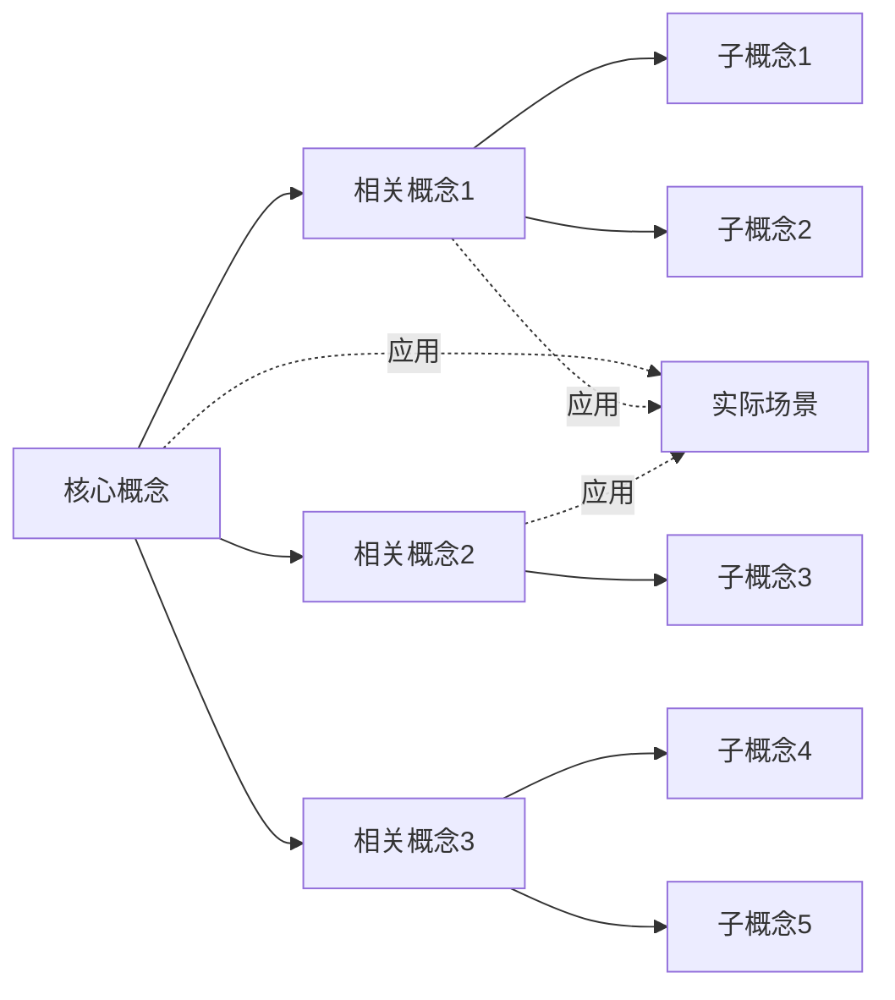

# 阅读分析拆解工作流

> [!abstract] 概述
> 本文档提供一套系统化的阅读、分析与拆解工作流，适用于学术文献、书籍、文档、网页等多种内容形式的深度学习与知识提取。通过结构化的流程，帮助您高效获取核心信息、提炼知识要点、建立个人知识体系。

---

## 📋 快速导航

### 核心章节
- [一、工作流概览](#一工作流概览) - 整体框架和原则
- [二、阅读阶段](#二阅读阶段) - 四步阅读法详解
- [三、分析框架](#三分析框架) - 内容分析维度
- [四、拆解方法](#四拆解方法) - 知识提取技巧
- [五、输出模板](#五输出模板) - 笔记模板库
- [六、工具与技巧](#六工具与技巧) - 效率提升方法
- [七、应用场景](#七应用场景) - 不同内容类型应用

### 实践指南
- [🚀 Obsidian 实践指南](#🚀-obsidian-实践指南) - 在 Obsidian 中的具体操作
- [📝 快速参考表](#📝-快速参考表) - 常用流程速查

### 🎯 新手建议
如果你是第一次使用本工作流，建议按以下顺序阅读：
1. 先看「工作流概览」了解整体框架
2. 再看「四步阅读法」掌握核心方法
3. 根据你的内容类型，选择「应用场景」中的对应流程
4. 在实践中，使用「Obsidian 实践指南」进行操作

---

## 一、工作流概览

### 1.1 整体流程图



### 1.2 工作流核心原则

| 原则 | 说明 | 应用方法 |
|------|------|----------|
| **目标导向** | 明确阅读目的和预期产出 | 阅读前设定问题清单 |
| **主动阅读** | 带着问题阅读，积极思考 | 边读边问，标记重点 |
| **结构化分析** | 从整体到局部，层次分明 | 使用思维导图/大纲 |
| **输出驱动** | 以输出倒逼输入 | 强制做笔记、写摘要 |
| **迭代优化** | 多轮阅读，逐步深入 | 初读→精读→重读 |

### 1.3 三阶段模型

```
┌─────────────────────────────────────────────────────────┐
│                    阅读分析拆解工作流                      │
├─────────────┬─────────────────────┬─────────────────────┤
│   阅读阶段   │      分析阶段        │      拆解阶段        │
│  (Input)    │   (Processing)      │   (Output)         │
├─────────────┼─────────────────────┼─────────────────────┤
│ • 预览      │ • 结构分析          │ • 要点提炼          │
│ • 略读      │ • 逻辑梳理          │ • 概念拆解          │
│ • 精读      │ • 观点评估          │ • 知识卡片          │
│ • 回顾      │ • 关联发现          │ • 总结输出          │
└─────────────┴─────────────────────┴─────────────────────┘
```

---

## 二、阅读阶段

### 2.1 四步阅读法

#### 第一步：预览 (Preview)

> [!tip] 预览要点
> 在正式阅读前快速了解内容全貌，建立整体认知框架。

| 预览内容 | 具体操作 | 时间建议 |
|----------|----------|----------|
| **标题副标题** | 识别主题和核心概念 | 30秒 |
| **目录结构** | 浏览章节安排 | 1-2分钟 |
| **摘要/导语** | 阅读内容摘要 | 1分钟 |
| **图表标题** | 快速浏览视觉元素 | 1分钟 |
| **结论/总结** | 预览主要结论 | 1-2分钟 |
| **首尾段落** | 阅读开头和结尾 | 1分钟 |

**预览产出**：形成初步印象，识别重点章节

#### 第二步：略读 (Skimming)

> [!tip] 略读策略
> 快速浏览全文，识别核心论点和关键信息。

| 略读任务 | 操作方法 | 标记符号 |
|----------|----------|----------|
| **识别主题句** | 每段首句或末句 | ★ 核心观点 |
| **发现关键词** | 重复出现的概念 | ● 关键词 |
| **追踪论证** | 寻找"因为→所以" | → 因果链 |
| **定位重点** | 图表、数据、引用 | ■ 重点数据 |
| **发现疑问** | 不理解或有疑问处 | ? 待解答 |

**略读产出**：标记重点页码，形成问题清单

#### 第三步：精读 (Intensive Reading)

> [!tip] 精读方法
> 逐段深入阅读，全面理解内容细节。

| 精读策略 | 具体操作 | 适用场景 |
|----------|----------|----------|
| **逐段分析** | 识别主题句和支持句 | 学术论文 |
| **批判思考** | 评估论据的充分性 | 观点类文章 |
| **上下文关联** | 理解概念间的联系 | 技术文档 |
| **笔记记录** | 边读边记录要点 | 学习型阅读 |
| **提问解答** | 自问自答加深理解 | 复杂材料 |

**精读产出**：详细笔记、问题答案、概念理解

#### 第四步：回顾 (Review)

> [!tip] 回顾要点
> 阅读结束后回顾总结，巩固记忆和理解。

| 回顾内容 | 回顾方法 | 时间点 |
|----------|----------|--------|
| **核心论点** | 用自己的话复述 | 当天 |
| **关键概念** | 制作概念卡片 | 当天 |
| **知识结构** | 绘制思维导图 | 3天内 |
| **应用场景** | 思考实际应用 | 1周内 |
| **未知领域** | 标记待深入点 | 1周内 |

### 2.2 阅读速度调节

| 材料类型 | 阅读速度 | 阅读策略 | 重点 |
|----------|----------|----------|------|
| **新闻资讯** | 快 (500+字/分) | 略读为主 | 标题、导语、结论 |
| **通俗文章** | 中 (300-500字/分) | 略读+精读 | 核心观点、案例 |
| **专业文献** | 慢 (150-300字/分) | 精读为主 | 方法、结论、数据 |
| **技术文档** | 慢 (100-200字/分) | 逐段分析 | 步骤、代码、参数 |
| **经典著作** | 很慢 (50-150字/分) | 反复阅读 | 思想、论证、语言 |

### 2.3 阅读质量检查

```
阅读质量评估清单：
├── □ 是否理解了核心论点？
├── □ 是否识别了关键概念？
├── □ 是否理清了逻辑结构？
├── □ 是否发现了知识关联？
├── □ 是否产生了新的问题？
├── □ 是否可以简要复述？
└── □ 是否知道如何应用？
```

---

## 三、分析框架

### 3.1 内容分析维度



### 3.2 结构分析

#### 宏观结构分析

| 结构类型 | 特征 | 分析要点 |
|----------|------|----------|
| **总分结构** | 总→分→总 | 核心论点→分论点→总结 |
| **并列结构** | 各部分平等 | 多个并列观点/案例 |
| **递进结构** | 逐步深入 | 层次递进、难度递增 |
| **对比结构** | 正反对比 | 对比分析、优劣比较 |
| **因果结构** | 因→果 | 原因分析、结果推导 |
| **问题解决** | 问题→分析→方案 | 问题定义→解决方案 |

#### 微观结构分析

| 分析维度 | 分析内容 | 分析方法 |
|----------|----------|----------|
| **段落结构** | 主题句+展开句+结论句 | 提取每段核心 |
| **句子关系** | 转折、因果、并列、递进 | 识别连接词 |
| **信息密度** | 核心信息vs辅助信息 | 区分主干和枝叶 |
| **概念层级** | 上位概念vs下位概念 | 建立概念树 |

### 3.3 逻辑分析

#### 论证结构分析

```
论证基本结构：
┌─────────────────────────────────────┐
│           结论/论点                  │
│    ┌─────────────────────────┐      │
│    │     论据/证据/数据       │      │
│    │     (支持结论的材料)     │      │
│    └─────────────────────────┘      │
│    ┌─────────────────────────┐      │
│    │     推理/论证过程        │      │
│    │   (从论据到结论的逻辑)   │      │
│    └─────────────────────────┘      │
└─────────────────────────────────────┘
```

#### 逻辑谬误识别

| 谬误类型 | 识别标志 | 应对方法 |
|----------|----------|----------|
| **以偏概全** | 小样本→大结论 | 检查样本量 |
| **稻草人谬误** | 曲解对方观点 | 还原原始观点 |
| **诉诸权威** | 仅凭权威背书 | 检查证据本身 |
| **滑坡谬误** | 一连串推理 | 检查每步逻辑 |
| **非黑即白** | 忽略中间选项 | 考虑其他可能 |
| **相关当因果** | 相关→因果 | 检查因果证据 |

### 3.4 观点分析

#### 观点提取模板

| 分析维度 | 分析内容 | 记录方式 |
|----------|----------|----------|
| **核心观点** | 作者最想表达什么 | 一句话概括 |
| **立场态度** | 作者倾向什么 | 正/负/中立 |
| **假设前提** | 作者默认什么 | 列出隐含假设 |
| **论证方式** | 如何支持观点 | 证据类型 |
| **潜在偏见** | 可能的偏颇 | 识别盲点 |
| **适用边界** | 何时不适用 | 限定条件 |

### 3.5 质量评估

#### 信息质量评估

| 评估维度 | 评估标准 | 评估方法 |
|----------|----------|----------|
| **可靠性** | 信息来源可信度 | 查证来源、作者资质 |
| **准确性** | 数据、事实准确性 | 多源比对、查证 |
| **时效性** | 信息是否最新 | 检查发布日期、引用 |
| **客观性** | 是否带有偏见 | 分析立场倾向 |
| **完整性** | 是否覆盖全面 | 与同类资料比较 |
| **一致性** | 内部是否自洽 | 检查逻辑矛盾 |

#### 质量评分标准

| 评分 | 等级 | 标准 |
|------|------|------|
| **5分** | 优秀 | 高可靠、高准确、高价值 |
| **4分** | 良好 | 可靠性高、基本准确 |
| **3分** | 中等 | 一般可靠、部分有价值 |
| **2分** | 较差 | 可靠性低或过时 |
| **1分** | 很差 | 不可靠或有害 |

---

## 四、拆解方法

### 4.1 知识拆解流程



### 4.2 核心概念提取

#### 概念识别方法

| 方法 | 操作步骤 | 适用场景 |
|------|----------|----------|
| **高频词法** | 识别出现频率高的词 | 快速抓重点 |
| **定义句法** | 找"是..."的定义句 | 概念性材料 |
| **标题提取法** | 从各级标题提取 | 结构化材料 |
| **图表法** | 从图表标题提取 | 数据类材料 |
| **问题法** | 从问句中提取 | 问答类材料 |

#### 概念层级梳理

```
一级概念（核心）
├── 二级概念（分支）
│   ├── 三级概念（细分）
│   └── 三级概念（细分）
└── 二级概念（分支）
    ├── 三级概念（细分）
    └── 三级概念（细分）
```

### 4.3 要点提炼方法

#### 要点提炼技术

| 技术 | 说明 | 示例 |
|------|------|------|
| **一句话总结** | 用一句话概括段落 | "X导致Y" |
| **问题-答案法** | 将内容转为Q&A | Q: 原因？A: ... |
| **类比法** | 用熟悉概念类比 | "像...一样" |
| **删减法** | 删除辅助词保留主干 | 保留主谓宾 |
| **可视化** | 转为图表形式 | 流程图、表格 |

#### 要点记录格式

```
【要点编号】
━━━━━━━━━━━━━━━
内容：_______________
来源：_______________
页码：_______________
关键词：_______________
关联：_______________
应用：_______________
━━━━━━━━━━━━━━━
```

### 4.4 知识结构化

#### 知识卡片法

| 卡片类型 | 内容要素 | 用途 |
|----------|----------|------|
| **概念卡** | 定义、特征、例子 | 理解概念 |
| **观点卡** | 观点、论据、局限 | 记录观点 |
| **方法卡** | 步骤、要点、注意事项 | 学习方法 |
| **案例卡** | 背景、过程、结果 | 积累案例 |
| **数据卡** | 数值、来源、时间 | 保存数据 |
| **金句卡** | 原文、页码、感悟 | 积累素材 |

#### 知识图谱法



### 4.5 深度拆解模板

#### 完整拆解模板

```
━━━━━━━━━━━━━━━━━━━━━━━━━━━━━━━━━━━━
文档拆解报告
━━━━━━━━━━━━━━━━━━━━━━━━━━━━━━━━━━━━

【基本信息】
文档标题：_______________
来源：_______________
作者：_______________
阅读日期：_______________
阅读时长：_______________

【一、内容概览】
核心主题：_______________
主要观点：_______________
目标读者：_______________
预计价值：_______________

【二、结构分析】
整体结构：_______________
各部分关系：_______________
逻辑主线：_______________

【三、核心要点】
要点1：_______________
  - 解释：_______________
  - 证据：_______________
  - 例子：_______________
  - 关联：_______________

要点2：_______________
  - ...

【四、概念拆解】
概念1：_______________
  定义：_______________
  特征：_______________
  例子：_______________
  边界：_______________

【五、观点分析】
观点1：_______________
  立场：_______________
  论据：_______________
  评价：_______________
  局限：_______________

【六、批判思考】
优点：_______________
不足：_______________
质疑：_______________
延伸：_______________

【七、知识关联】
与已有知识的关联：_______________
可以链接的笔记：_______________
待学习的相关主题：_______________

【八、应用思考】
实际应用场景：_______________
行动计划：_______________
待实践检验：_______________

【九、输出成果】
已完成输出：_______________
计划输出：_______________

━━━━━━━━━━━━━━━━━━━━━━━━━━━━━━━━━━━━
```

---

## 五、输出模板

### 5.1 读书笔记模板

```
---
title: 【书名】读书笔记
date: YYYY-MM-DD
tags: [读书笔记, 书籍, 主题]
author: 你的名字
rating: ★★★★☆
status: completed
---

# 【书名】读书笔记

## 📖 基本信息
- **书名**：[书名全称]
- **作者**：[作者名]
- **出版社**：[出版社]
- **出版年**：20XX年
- **阅读日期**：20XX年XX月
- **阅读时长**：XX小时
- **类型**：虚构/非虚构/专业/...

## 🎯 阅读目标
- 目标1：_______________
- 目标2：_______________
- 目标3：_______________

## 📝 核心内容

### 主题概述
[用2-3段话概述本书核心主题]

### 主要观点
| 观点 | 页码 | 核心内容 |
|------|------|----------|
| 观点1 | Pxx | ___________ |
| 观点2 | Pxx | ___________ |
| 观点3 | Pxx | ___________ |

### 关键概念
| 概念 | 定义 | 我的理解 |
|------|------|----------|
| 概念1 | ______ | ___________ |
| 概念2 | ______ | ___________ |

## 💡 最有价值的点

### 1. [最有价值的观点/方法]
**原文摘录**：
> "引用原文"

**个人感悟**：
[写下你的理解和感悟]

**行动计划**：
- [ ] 具体的行动步骤

### 2. [第二有价值的点]
...

### 3. [第三有价值的点]
...

## 🤔 批判性思考

### 优点
- ___________

### 局限/不足
- ___________

### 与其他观点的冲突
- ___________

## 🔗 关联与延伸

### 与已有知识的关联
- 关联到[[另一笔记]]：___________
- 关联到[[另一笔记]]：___________

### 待深入的主题
- ___________

### 延伸阅读推荐
- ___________

## 📋 行动计划

### 即刻行动（本周）
- [ ] ___________

### 短期计划（本月）
- [ ] ___________

### 长期应用
- [ ] ___________

## 📊 评价与反思

### 阅读体验
- 难度：易懂/适中/较难
- 收获：大/中/小
- 推荐：强烈推荐/推荐/一般/不推荐

### 反思
[阅读过程中的思考和反思]

---
**相关笔记**：
- [[书名相关笔记1]]
- [[书名相关笔记2]]
```

### 5.2 文献分析模板

```
---
title: 【文献标题】文献分析
date: YYYY-MM-DD
tags: [文献分析, 学术, 主题]
citation: |
  作者. (年份). 标题. 期刊名, 卷(期), 页码.
doi: xxxxxx
---

# 【文献标题】文献分析

## 📋 基本信息
| 项目 | 内容 |
|------|------|
| 标题 | ___________ |
| 作者 | ___________ |
| 期刊 | ___________ |
| 年份 | 20XX年 |
| 卷期 | Vol.XX, No.X |
| 页码 | PP.XX-XX |
| DOI | ___________ |

## 🎯 研究概述

### 研究问题
本文献研究的核心问题：_______________

### 研究假设
- 假设1：_______________
- 假设2：_______________

### 研究方法
- 方法类型：定量/定性/混合
- 样本量：N=____
- 数据收集：_______________
- 分析方法：_______________

## 📊 核心发现

### 主要结论
1. ___________
2. ___________
3. ___________

### 关键数据
| 变量/指标 | 数值 | 显著性 |
|-----------|------|--------|
| _________ | ____ | p<.05  |
| _________ | ____ | p<.01  |

## 🔍 批判性分析

### 优点
- ___________

### 局限
- ___________

### 潜在问题
- ___________

## 🔗 文献关联

### 理论基础
- 基于_______________理论

### 与其他文献的关系
- 扩展了[[某文献]]的研究
- 与[[某文献]]结论一致/相反

### 引用了该文献
- [[引用该文献的笔记]]

## 💡 对我的启示

### 理论价值
- ___________

### 实践应用
- ___________

### 研究启发
- ___________

## 📝 要点摘录

### 关键段落1
> "引用原文"

### 关键段落2
> "引用原文"
```

### 5.3 知识卡片模板

```
---
title: 【概念名】知识卡片
date: YYYY-MM-DD
tags: [知识卡片, 概念, 主题]
aliases: [别名1, 别名2]
---

# 【概念名】知识卡片

## 📌 基本信息
- **概念名称**：_______________
- **英文名称**：_______________
- **学科领域**：_______________
- **相关概念**：[[概念1]], [[概念2]]

## 📖 定义
> 概念的精确定义

## 🔍 深入理解

### 核心特征
1. 特征1
2. 特征2
3. 特征3

### 边界与限定
- 适用情况：_______________
- 不适用情况：_______________
- 相关但不同的概念：_______________

### 举例说明
| 例子 | 说明 |
|------|------|
| 例子1 | ___________ |
| 例子2 | ___________ |

## 📚 来源与参考
- 首次提出：_______________
- 代表性文献：_______________
- 相关理论：_______________

## 🔗 关联知识

### 上位概念（更抽象）
- [[上位概念1]]

### 下位概念（更具体）
- [[下位概念1]]
- [[下位概念2]]

### 平行概念（相关）
- [[平行概念1]]

## 💡 应用场景
1. 场景1：_______________
2. 场景2：_______________

## 📝 个人笔记
### 我的理解
_______________

### 实践应用
_______________

### 待解决问题
_______________
```

---

## 六、工具与技巧

### 6.1 阅读辅助工具

| 工具类型 | 推荐工具 | 用途 |
|----------|----------|------|
| **笔记管理** | Obsidian, Notion | 知识库建设 |
| **思维导图** | XMind, MindMaster | 结构梳理 |
| **大纲工具** | Dynalist, Workflowy | 层次整理 |
| **标注工具** | PDF Expert, GoodNotes | 文档标注 |
| **引用管理** | Zotero, EndNote | 文献管理 |
| **摘录工具** | Readwise, Kindle | 摘录收集 |

### 6.2 高效阅读技巧

#### SQ3R阅读法

| 阶段 | 全称 | 关键动作 |
|------|------|----------|
| **S** | Survey | 预览、浏览目录 |
| **Q** | Question | 列出问题 |
| **R1** | Read | 带着问题阅读 |
| **R2** | Recite | 复述、总结 |
| **R3** | Review | 回顾、复习 |

#### PQRST阅读法

| 阶段 | 全称 | 关键动作 |
|------|------|----------|
| **P** | Preview | 预览内容 |
| **Q** | Question | 设定问题 |
| **R** | Read | 仔细阅读 |
| **S** | State | 陈述要点 |
| **T** | Test | 测试记忆 |

### 6.3 深度思考技巧

#### 5Why分析法

```
问题：_______________
    ↓
为什么1？→ _______________
    ↓
为什么2？→ _______________
    ↓
为什么3？→ _______________
    ↓
为什么4？→ _______________
    ↓
为什么5？→ 根本原因
```

#### 四象限分析法

| | 重要 | 不重要 |
|---|---|---|
| **紧急** | ① 立即处理<br>紧急且重要 | ③ 可委托<br>紧急但不重要 |
| **不紧急** | ② 计划处理<br>重要但不紧急 | ④ 可删除<br>不紧急不重要 |

### 6.4 记忆巩固技巧

| 技巧 | 方法 | 适用场景 |
|------|------|----------|
| **间隔重复** | 按遗忘曲线复习 | 概念记忆 |
| **费曼学习** | 用简单语言解释 | 深度理解 |
| **联想记忆** | 建立关联和想象 | 事实类知识 |
| **图像记忆** | 转化为视觉形象 | 列表类知识 |
| **故事记忆** | 嵌入故事情境 | 流程类知识 |

---

## 七、应用场景

### 7.1 书籍阅读工作流

```
┌──────────────────────────────────────────────────────────┐
│ 书籍阅读工作流                                            │
├──────────────────────────────────────────────────────────┤
│ 1. 预览 (10-15分钟)                                      │
│    ├── 读封面、标题、作者                                 │
│    ├── 看目录、大纲                                       │
│    ├── 读前言、结论                                       │
│    └── 浏览章节标题                                       │
├──────────────────────────────────────────────────────────┤
│ 2. 略读 (30-60分钟)                                      │
│    ├── 快速翻阅每章                                       │
│    ├── 标记重点章节                                       │
│    └── 识别核心论点                                       │
├──────────────────────────────────────────────────────────┤
│ 3. 精读 (数小时-数天)                                    │
│    ├── 逐章详细阅读                                       │
│    ├── 做阅读笔记                                         │
│    └── 标注有价值的段落                                   │
├──────────────────────────────────────────────────────────┤
│ 4. 整理 (1-2小时)                                        │
│    ├── 整理笔记                                           │
│    ├── 绘制思维导图                                       │
│    └── 写读书笔记                                         │
├──────────────────────────────────────────────────────────┤
│ 5. 输出 (1-2小时)                                        │
│    ├── 写书评/读后感                                      │
│    ├── 制作知识卡片                                       │
│    └── 制定行动计划                                       │
└──────────────────────────────────────────────────────────┘
```

### 7.2 论文阅读工作流

| 阶段 | 目标 | 时间 | 关键问题 |
|------|------|------|----------|
| **预览** | 判断价值 | 5分钟 | 值得读吗？ |
| **略读** | 把握框架 | 15分钟 | 讲什么？ |
| **精读** | 理解内容 | 1-2小时 | 怎么讲的？ |
| **分析** | 批判思考 | 30分钟 | 对在哪？错在哪？ |
| **整理** | 归档知识 | 30分钟 | 有什么用？ |

### 7.3 文档分析工作流

```
┌────────────────────────────────────────────────────────┐
│ 文档分析决策树                                           │
└────────────────────────────────────────────────────────┘
                         │
                         ▼
              ┌──────────────┐
              │ 文档类型？    │
              └──────┬───────┘
                     │
        ┌────────────┼────────────┐
        ▼            ▼            ▼
   ┌─────────┐  ┌─────────┐  ┌─────────┐
   │ 说明文档 │  │ 报告文档 │  │ 论文文献 │
   └────┬────┘  └────┬────┘  └────┬────┘
        │            │            │
        ▼            ▼            ▼
   ┌─────────┐  ┌─────────┐  ┌─────────┐
   │ 操作→   │  │ 数据→   │  │ 论证→   │
   │ 步骤    │  │ 图表    │  │ 逻辑    │
   │ 拆解    │  │ 分析    │  │ 评估    │
   └─────────┘  └─────────┘  └─────────┘
```

### 7.4 网页内容工作流

| 步骤 | 操作 | 工具/方法 |
|------|------|----------|
| 1 | 保存原文 | 印象笔记、Notion |
| 2 | 标注重点 | 浏览器标注功能 |
| 3 | 提取要点 | 手动摘录 |
| 4 | 分类归档 | 放入知识库相应文件夹 |
| 5 | 建立链接 | 关联已有知识 |
| 6 | 定期回顾 | 纳入复习计划 |

---

## 📊 工作流效率指标

### 效率评估维度

| 维度 | 指标 | 目标值 |
|------|------|--------|
| **阅读效率** | 有效内容获取率 | >80% |
| **分析深度** | 观点覆盖完整度 | >90% |
| **拆解质量** | 知识转化率 | >70% |
| **输出质量** | 知识可用性评分 | >4/5 |
| **时间投入** | 单位内容处理时间 | 合理分配 |

### 持续改进

```
效率提升循环：
发现问题 → 分析原因 → 改进方法 → 实施新方法 → 评估效果 → 发现新问题
     ↑                                                          │
     └──────────────────────────────────────────────────────────┘
```

---

## 🔗 相关文档链接

### 核心工作流
- [[3 Resources/03-Productivity/Methods/PARA指南.md|PARA 方法论]] - 知识组织方法

> [!info] 其他链接
> 其他相关文档（Zettelkasten、学习方法等）正在整理中，将在后续更新时添加。

---

> [!success] 使用提示
> - 根据内容类型选择合适的工作流变体
> - 保持输出习惯，以输出倒逼输入
> - 定期回顾和迭代自己的阅读方法
> - 将知识与已有知识体系建立连接

%% 阅读是输入，思考是加工，输出是深化 %%
%% 系统化的方法帮助提升学习效率 %%

---

## 📝 快速参考表

> [!tip] 本节提供工作流中常用方法和模板的快速参考

### 📖 四步阅读法速查

| 阶段 | 时间 | 核心目标 | 关键动作 |
|------|------|----------|----------|
| **1. 预览** | 5-10分钟 | 建立整体认知 | 读标题→看目录→读摘要→看图表→读结论 |
| **2. 略读** | 15-30分钟 | 识别核心信息 | 找主题句→标关键词→追论证→定重点→记疑问 |
| **3. 精读** | 数小时-数天 | 深度理解内容 | 逐段分析→批判思考→上下文关联→记录笔记 |
| **4. 回顾** | 30分钟-1小时 | 巩固记忆理解 | 复述论点→制卡片→绘导图→思应用→记疑问 |

### 🎯 不同内容类型的工作流选择

| 内容类型 | 工作流重点 | 时间分配 | 输出重点 |
|----------|------------|----------|----------|
| **新闻资讯** | 预览+略读 | 5-10分钟 | 核心观点+要点摘录 |
| **通俗文章** | 略读+精读 | 30-60分钟 | 阅读笔记+知识卡片 |
| **学术论文** | 全流程 | 1-3小时 | 文献分析+批判思考 |
| **技术文档** | 精读+实践 | 2-4小时 | 操作步骤+应用案例 |
| **经典著作** | 多轮精读 | 数天-数周 | 深度笔记+思考感悟 |
| **视频/音频** | 边看边记 | 视时长 | 笔录重点+知识卡片 |

### 🔍 分析框架快速清单

```
□ 结构分析：类型？层次？逻辑？
□ 观点分析：核心？立场？假设？
□ 逻辑分析：论证？因果？谬误？
□ 质量分析：可靠？准确？时效？
□ 价值分析：实用？创新？边界？
```

### 💡 高亮颜色编码系统

| 颜色 | 用途 | 示例内容 |
|------|------|----------|
| 🟡 黄色 | 核心观点/主要论点 | "用户体验是产品成功的关键" |
| 🟢 绿色 | 方法/步骤/流程 | "第一步：收集用户反馈" |
| 🔵 蓝色 | 数据/证据/事实 | "转化率提升了 45%" |
| 🔴 红色 | 质疑/待查证/矛盾 | "这一结论需要更多数据支持" |
| 🟣 紫色 | 金句/重要引用 | "知识就是力量" |

### 📝 模板选择指南

| 场景 | 推荐模板 | 文件名 |
|------|----------|--------|
| 初次收集内容 | 快速捕获模板 | `_template-快速捕获.md` |
| 深度阅读一本书 | 阅读笔记模板 | `_template-阅读笔记.md` |
| 分析学术论文 | 文献分析模板 | `_template-文献分析.md` |
| 提取核心概念 | 知识卡片模板 | `_template-知识卡片.md` |
| 完整文档分析 | 文档拆解模板 | `_template-文档拆解.md` |

### ⌨️ Obsidian 核心快捷键

| 操作 | Windows | Mac | 说明 |
|------|---------|-----|------|
| 创建新笔记 | `Ctrl+N` | `Cmd+N` | 新建空白笔记 |
| 命令面板 | `Ctrl+P` | `Cmd+P` | 执行所有命令 |
| 搜索 | `Ctrl+Shift+F` | `Cmd+Shift+F` | 全局搜索 |
| 切换阅读模式 | `Ctrl+E` | `Cmd+E` | 预览/编辑切换 |
| Wiki链接 | `[[` | `[[` | 创建内部链接 |
| 高亮文本 | `Ctrl+点击` | `Cmd+点击` | 标注重要内容 |
| 复制块引用 | `Ctrl+Shift+H` | `Cmd+Shift+H` | 复制引用链接 |
| 最近文件 | `Ctrl+Tab` | `Ctrl+Tab` | 切换最近打开的文件 |

### 🎯 5W1H 分析法快速应用

```
What (什么): 核心内容是什么？
Who (谁): 作者/对象是谁？
When (何时): 时间背景？
Where (何地): 地点/环境？
Why (为什么): 原因/目的？
How (如何): 方法/过程？
```

### 📊 阅读质量自检清单

```
□ 是否理解了核心论点？
□ 是否识别了关键概念？
□ 是否理清了逻辑结构？
□ 是否发现了知识关联？
□ 是否产生了新的问题？
□ 是否可以简要复述？
□ 是否知道如何应用？
```

### 🔄 持续改进循环

```
发现问题 → 分析原因 → 提出方案 → 实施改进 → 评估效果
     ↑                                           │
     └───────────────────────────────────────────┘
```

### 📚 常见阅读方法对比

| 方法 | 优点 | 缺点 | 适用场景 |
|------|------|------|----------|
| **SQ3R** | 系统完整 | 时间投入大 | 学术学习、教材学习 |
| **PQRST** | 注重理解 | 需要记忆测试 | 专业文献学习 |
| **四步阅读法** | 灵活实用 | 需要自律 | 日常阅读、知识学习 |
| **略读法** | 快速高效 | 理解不深 | 信息收集、筛选 |
| **精读法** | 理解深刻 | 耗时较长 | 核心内容深度学习 |

### 🎨 知识卡片类型速查

| 卡片类型 | 内容要素 | 应用场景 | 示例 |
|----------|----------|----------|------|
| **概念卡** | 定义、特征、例子 | 理解概念 | "什么是知识图谱？" |
| **观点卡** | 观点、论据、局限 | 记录观点 | "深度学习不会取代人类" |
| **方法卡** | 步骤、要点、注意事项 | 学习方法 | "如何进行有效反思？" |
| **案例卡** | 背景、过程、结果 | 积累案例 | "Netflix 推荐系统案例" |
| **数据卡** | 数值、来源、时间 | 保存数据 | "2024年 AI 市场规模" |
| **金句卡** | 原文、页码、感悟 | 积累素材 | "知识就是力量" |

### 🗂️ PARA 文件夹快速定位

```
📁 1 Projects (项目)
   └─ 当前正在进行的项目 (有明确目标和期限)
   示例：阅读分析拆解工作流项目、季度报告撰写

📁 2 Areas (领域)
   └─ 持续维护的生活领域 (没有完成状态)
   - 01-Health (健康)
   - 02-Career (职业)
   - 03-Finance (财务)
   - 04-Relationships (人际关系)
   - 05-Learning (学习) ← 阅读相关内容
   - 06-Lifestyle (生活方式)

📁 3 Resources (资源)
   └─ 有兴趣的主题和参考资料
   示例：生产力方法、工具、学习资料

📁 4 Archives (归档)
   └─ 已完成或不再活跃的内容
   示例：已完成的读书笔记、过时的资料

📁 0 Inbox (收件箱)
   └─ 新收集的内容、待处理
   示例：快速捕获的笔记、待整理的链接

详细说明：[[3 Resources/03-Productivity/Methods/PARA指南.md|PARA 指南]]
```

### ⚡ 效率提升小技巧

1. **批量处理**: 集中时间处理同一类型的阅读内容
2. **模板化**: 使用模板快速创建笔记，减少重复劳动
3. **快捷键**: 记住常用快捷键，大幅提升操作速度
4. **自动化**: 配置 QuickAdd 宏，一键完成多步操作
5. **专注模式**: 阅读时关闭其他应用，提高专注度
6. **时间盒**: 为每个阅读阶段设定时间限制，避免拖延
7. **及时记录**: 不要等读完再记录，边读边写
8. **定期回顾**: 每周回顾一次，整理和归档

### 📱 工作流检查清单

**开始阅读前**:
```
□ 明确阅读目标
□ 选择合适的模板
□ 准备好环境 (安静、专注)
```

**阅读过程中**:
```
□ 预览内容 (5-10分钟)
□ 使用高亮颜色分类标注
□ 记录思考和疑问
□ 建立知识链接
```

**阅读结束后**:
```
□ 完成模板填写
□ 提取知识卡片
□ 更新进度看板
□ 规划后续行动
```

**定期维护**:
```
□ 每日: 清理 Inbox
□ 每周: 回顾和整理
□ 每月: 知识整合和优化
```

---

## 🔗 相关文档快速索引

### 核心工作流
- [[阅读分析拆解工作流]] - 当前文档 (完整版)
- [[Obsidian 知識管理方法|PARA 方法论]] - 知识组织方法
- [[3 Resources/Obsidian/Obsidian/Obsidian.md|Obsidian 实践指南]] - Obsidian 详细教程

> [!info] 其他链接
> Zettelkasten 工作流等更多知识管理方法，请查看 [[Obsidian 知識管理方法|Obsidian 知識管理方法]]。

### 学习方法
- [[3 Resources/Obsidian/Obsidian/Obsidian.md#📚-學習方法]] - 学习方法和最佳实践
- [[高效阅读技巧]] - 阅读技巧合集
- [[记忆巩固方法]] - 记忆技巧

### 实践工具
- [[3 Resources/Obsidian/Obsidian/Obsidian.md|Obsidian 实践指南]] - Obsidian 详细教程和知识管理方法
- [[3 Resources/Obsidian/Obsidian/Obsidian.md#🔧-Obsidian-技巧|Obsidian 技巧]] - 效率提升技巧
- [[3 Resources/Obsidian/Obsidian/Obsidian.md#🔧-Obsidian-設定|Obsidian 设置]] - Obsidian 配置和优化

### 案例示例
- [[3 Resources/Obsidian/Obsidian/Obsidian.md#📝-範例範本]] - 实际笔记模板和示例
- [[3 Resources/Obsidian/Obsidian/Obsidian.md#📝-知識卡範例]] - 知识卡片示例

---

> [!info] 文档版本信息
> **版本**: V2.0 (结构化增强版)
> **更新日期**: 2026-01-26
> **主要更新**:
> - 优化文档结构和导航
> - 增强 Obsidian 实践指南
> - 添加完整的模板库
> - 新增快速参考表
> - 完善示例和用例

> [!tip] 本节将工作流落地到 Obsidian 操作，提供可复制粘贴的模板和操作指南

---

## 📖 一、完整工作流实战

### 从捕获到归档的完整流程

```
┌─────────────────────────────────────────────────────────────────┐
│          阅读分析拆解工作流 - Obsidian 完整操作流程              │
├─────────────────────────────────────────────────────────────────┤
│                                                                 │
│  1️⃣ 快速捕获阶段 (Inbox)                                         │
│     ├─ 快捷键: Ctrl+N 创建新笔记                                │
│     ├─ 使用: [[快速捕获模板]]                                    │
│     ├─ 记录: 来源、标题、初步印象                                │
│     └─ 目标: 快速收集，稍后处理                                  │
│                                                                 │
│  2️⃣ 深度阅读阶段 (Reading)                                      │
│     ├─ 选择: 根据内容类型选择模板                                │
│     ├─ 打开: Ctrl+E 进入阅读模式                                │
│     ├─ 标注: 使用高亮颜色分类                                    │
│     │   ├─ 🟡 黄色: 核心观点/论点                                │
│     │   ├─ 🟢 绿色: 方法/步骤/流程                               │
│     │   ├─ 🔵 蓝色: 数据/证据/事实                               │
│     │   └─ 🔴 红色: 质疑/待查证/争议                             │
│     └─ 笔记: 边读边记录关键思考                                  │
│                                                                 │
│  3️⃣ 分析拆解阶段 (Analysis)                                     │
│     ├─ 结构: 使用嵌套列表梳理层级                                │
│     ├─ 概念: 创建独立的知识卡片                                  │
│     ├─ 链接: 使用 [[ ]] 建立关联                                │
│     └─ 思考: 添加批判性分析部分                                  │
│                                                                 │
│  4️⃣ 输出整合阶段 (Output)                                       │
│     ├─ 整理: 完善 frontmatter 和标签                            │
│     ├─ 卡片: 从笔记中提取知识点                                  │
│     ├─ 图谱: 使用关系视图查看连接                                │
│     └─ 归档: 移动到对应的 PARA 文件夹                            │
│                                                                 │
└─────────────────────────────────────────────────────────────────┘
```

---

## 🎯 二、核心操作详解

### 2.1 使用 Templater 创建阅读笔记

**操作步骤**:
```bash
1. 按 Ctrl+P 打开命令面板
2. 输入 "Templater" 或选择 "Templater: 选择模板"
3. 从列表中选择合适的模板:
   - 快速捕获模板 (用于初次收集)
   - 阅读笔记模板 (用于深度阅读)
   - 文献分析模板 (用于学术论文)
   - 知识卡片模板 (用于概念提取)
4. Obsidian 将自动创建带有模板内容的新笔记
```

**模板存放位置建议**:
```
.obsidian/
├── templates/
│   ├── _template-快速捕获.md
│   ├── _template-阅读笔记.md
│   ├── _template-文献分析.md
│   ├── _template-知识卡片.md
│   └── _template-文档拆解.md
```

### 2.2 核心操作步骤速查表

| 步骤 | 操作 | Obsidian 功能 | Windows 快捷键 | Mac 快捷键 |
|------|------|---------------|----------------|------------|
| 创建笔记 | 使用模板创建 | Templater | `Ctrl+P` | `Cmd+P` |
| 预览浏览 | 切换阅读/编辑 | Reading View | `Ctrl+E` | `Cmd+E` |
| 标注重点 | 高亮重要文本 | Highlights | `Ctrl+点击` | `Cmd+点击` |
| 摘录引用 | 复制块引用 | Copy block ref | `Ctrl+Shift+H` | `Cmd+Shift+H` |
| 建立链接 | 创建 wiki 链接 | Wiki-link | `[[` | `[[` |
| 搜索内容 | 全局搜索 | Search | `Ctrl+Shift+F` | `Cmd+Shift+F` |
| 切换文件 | 最近文件 | Recent files | `Ctrl+Tab` | `Ctrl+Tab` |
| 插入图片 | 粘贴图片 | Drag & Drop | `Ctrl+V` | `Cmd+V` |

---

## 🎨 三、Obsidian 高级功能应用

### 3.1 阅读模式与高亮标注

**应用场景**: 预览、略读、精读阶段

**操作流程**:
```
1. 打开 PDF 或 Markdown 文档
2. 按 Ctrl+E (Mac: Cmd+E) 切换到阅读模式
3. 使用鼠标选中文本 → Ctrl+点击 (Mac: Cmd+点击)
4. 选择高亮颜色:
   🟡 黄色 (Yellow) - 核心观点/主要论点
   🟢 绿色 (Green) - 方法/步骤/操作流程
   🔵 蓝色 (Blue) - 数据/证据/支撑材料
   🔴 红色 (Red) - 质疑/待查证/矛盾处
   🟣 紫色 (Purple) - 金句/重要引用
5. 高亮会自动保存并生成 block-id
```

**快速摘录高亮内容**:
```markdown
在笔记中引用高亮:
![[文档名#^block-id]]

示例:
![[深度学习论文.pdf#^highlight-123]]
```

### 3.2 双向链接系统

**应用场景**: 建立知识关联网络

**基础链接创建**:
```
选中关键词 → 按 [[ → 输入或选择笔记名
```

**三种链接类型**:

| 类型 | 语法 | 用途 | 示例 |
|------|------|------|------|
| 普通链接 | `[[笔记名]]` | 链接到笔记整体 | `[[知识管理]]` |
| 标题链接 | `[[笔记名#标题]]` | 链接到特定章节 | `[[方法论#四步阅读法]]` |
| 块引用 | `[[笔记名#^block-id]]` | 链接到特定段落 | `[[论文A#^highlight-1]]` |

**在笔记末尾添加相关链接区域**:
```markdown
---

## 🔗 相关链接

### 内部链接
- [[相关笔记1]] - 关联说明
- [[相关笔记2#章节名]] - 具体关联

### 外部资源
- [标题](URL) - 说明
```

### 3.3 嵌入与模板复用

**嵌入语法**:
```markdown
![[嵌入的文件]]

嵌入特定区域:
![[笔记名#标题]]
![[图片文件.png]]
![[思维导图.excalidraw]]
```

**模板嵌入示例**:
```markdown
在笔记中复用知识卡片模板:
![[.obsidian/templates/_template-知识卡片]]
```

### 3.4 Dataview 查询配置

**基础查询 - 显示最近的读书笔记**:
```dataview
TABLE
  dateformat(date, "YYYY-MM-DD") AS "阅读日期",
  tags,
  rating AS "评分"
FROM "4 Archives/读书笔记"
WHERE contains(tags, "读书笔记")
SORT date DESC
LIMIT 10
```

**高级查询 - 按主题分组显示**:
```dataview
TABLE
  rows.title AS "笔记",
  rows.dateformat(rows.date, "MM-DD") AS "日期"
FROM "5 Zettels"
GROUP BY type
```

**待处理内容查询**:
```dataview
TASK
FROM "0 Inbox"
WHERE !completed
GROUP BY file.link
```

---

## 📋 四、工作流配套模板库

### 4.1 快速捕获模板

```markdown
---
title: 📥 [来源] - [日期]
date: 2026-01-26
tags: [inbox, 阅读捕获, 待处理]
status: pending
source_type: article/paper/book/video
source_url: ""
estimated_time: ""
priority: high/medium/low
---

# [标题]

## 📋 基本信息
- **来源**: ___________
- **链接**: ___________
- **类型**: □ 文章 □ 论文 □ 书籍 □ 视频 □ 文档
- **作者**: ___________
- **捕获日期**: ___________
- **预估阅读时间**: ___ 分钟

## 🎯 预览评估

### 核心主题
_______________

### 吸引点
- _______________
- _______________

### 预估价值
- 对我的价值: ⭐⭐⭐⭐⭐
- 阅读优先级: □ 高 □ 中 □ 低
- 阅读方式: □ 精读 □ 略读 □ 跳读

## ✅ 下一步行动
- [ ] 完整阅读并做笔记
- [ ] 快速略读提取要点
- [ ] 放入待读清单
- [ ] 不相关，直接删除

## 🔗 相关内容
- 关联到已有的知识: [[]]
- 相关主题: [[]]
```

### 4.2 阅读笔记模板 (深度阅读)

```markdown
---
title: 📖 [标题] - 阅读笔记
date: 2026-01-26
tags: [阅读笔记, 核心主题]
source: ""
author: ""
read_date: ""
read_duration: ""
rating: ⭐⭐⭐⭐⭐
status: reading/completed
---

# [标题]

## 📋 基本信息
| 项目 | 内容 |
|------|------|
| **来源** | ___________ |
| **链接** | ___________ |
| **作者** | ___________ |
| **发布日期** | ___________ |
| **阅读日期** | ___________ |
| **阅读时长** | ___ 小时 |
| **阅读方式** | 精读/略读/跳读 |
| **难度评估** | 简单/中等/困难 |

## 🎯 阅读目标
- 目标1: _______________
- 目标2: _______________
- 目标3: _______________

## 📝 内容概览

### 核心主题
[用 2-3 段话概括内容的核心主题和主要观点]

### 文章结构
- 第一部分: _______________
- 第二部分: _______________
- 第三部分: _______________

## 💡 核心要点

### 要点 1: [要点标题]
> 原文摘录或关键描述

**我的理解**:
_______________

**相关案例**:
_______________

**应用场景**:
_______________

### 要点 2: [要点标题]
> 原文摘录或关键描述

**我的理解**:
_______________

**相关案例**:
_______________

**应用场景**:
_______________

## 🔑 关键概念

| 概念 | 定义 | 我的理解 |
|------|------|----------|
| 概念1 | ___________ | ___________ |
| 概念2 | ___________ | ___________ |

## 🤔 批判性思考

### 优点
- _______________
- _______________

### 局限/疑问
- _______________
- _______________

### 与其他观点的对比
- _______________

## 🔗 知识关联

### 与已有知识的链接
- 关联到 [[相关笔记]]: _______________
- 扩展了 [[另一个笔记]] 的观点

### 待深入的主题
- _______________

### 由此想到
_______________

## ✅ 行动计划

### 即刻行动 (本周)
- [ ] _______________
- [ ] _______________

### 短期应用 (本月)
- [ ] _______________
- [ ] _______________

### 长期实践
- [ ] _______________
- [ ] _______________

## 📊 评价与反思

### 阅读体验
- **理解难度**: 简单 / 适中 / 困难
- **收获大小**: 大 / 中 / 小
- **推荐指数**: ⭐⭐⭐⭐⭐

### 关键收获
1. _______________
2. _______________
3. _______________

### 值得记住的金句
> "值得引用的原话"

---

## 🔗 相关链接

### 来源链接
- [[0 Inbox/捕获笔记链接]] - 原始捕获

### 知识卡片
- [[知识卡片1]]
- [[知识卡片2]]

### 相关主题
- [[相关主题1]]
- [[相关主题2]]

### 延伸阅读
- [文章标题](URL) - 推荐理由
```

### 4.3 文献分析模板 (学术论文)

```markdown
---
title: 📄 [论文标题] - 文献分析
date: 2026-01-26
tags: [文献分析, 学术论文, 研究领域]
citation: |
  作者. (年份). 标题. 期刊名, 卷(期), 页码.
doi: ""
status: completed
---

# [论文标题]

## 📋 基本信息

| 项目 | 内容 |
|------|------|
| **标题** | ___________ |
| **作者** | ___________ |
| **期刊** | ___________ |
| **年份** | 20XX |
| **卷期** | Vol.XX, No.X |
| **页码** | PP.XX-XX |
| **DOI** | ___________ |
| **链接** | ___________ |
| **阅读日期** | ___________ |

## 🎯 研究概述

### 研究问题
本文献试图解决的核心问题是什么？
_______________

### 研究假设
- 假设1: _______________
- 假设2: _______________

### 研究背景
_______________

## 🔬 研究方法

### 方法类型
□ 定性研究 □ 定量研究 □ 混合方法 □ 理论研究

### 研究设计
_______________

### 样本与数据
- **样本量**: N = ______
- **样本特征**: _______________
- **数据收集**: _______________

### 分析方法
_______________

## 📊 核心发现

### 主要结论
1. _______________
2. _______________
3. _______________

### 关键数据

| 变量/指标 | 结果 | 统计显著性 |
|-----------|------|------------|
| _________ | ____ | p < .05   |
| _________ | ____ | p < .01   |
| _________ | ____ | p < .001  |

### 图表要点
- 图表1: _______________
- 图表2: _______________

## 🔍 批判性分析

### 研究优点
- _______________
- _______________
- _______________

### 研究局限
- _______________
- _______________
- _______________

### 潜在问题
- _______________
- _______________

## 🔗 文献关联

### 理论基础
基于 _______________ 理论

### 与其他文献的关系
- 扩展了 [[某文献]] 的研究
- 与 [[某文献]] 结论一致
- 与 [[某文献]] 结论相反/不同

### 引用了该文献的笔记
- [[引用该文献的笔记1]]
- [[引用该文献的笔记2]]

## 💡 对我的启示

### 理论价值
- _______________
- _______________

### 实践应用
- _______________
- _______________

### 研究启发
- _______________
- _______________

## 📝 重要摘录

### 关键段落 1
> "原文引用"

**重要原因**: _______________

### 关键段落 2
> "原文引用"

**重要原因**: _______________

## ✅ 后续行动

- [ ] 应用到实际项目中
- [ ] 引用到自己的论文/报告
- [ ] 进一步深入研究
- [ ] 与相关文献对比分析

---

## 🔗 相关链接

- [[同一领域的其他文献]]
- [[相关理论]]
- [[应用场景相关笔记]]
```

### 4.4 知识卡片模板 (概念提取)

```markdown
---
title: 💡 [概念名] - 知识卡片
date: 2026-01-26
tags: [知识卡片, 概念, 原子笔记]
aliases: [别名1, 别名2]
type: concept
created_from: [[来源笔记]]
---

# [概念名]

## 📌 基本信息
- **中文名**: ___________
- **英文名**: ___________
- **学科领域**: ___________
- **提出者/来源**: ___________
- **首次出现**: ___________

## 📖 定义

### 标准定义
> 一句话的精确定义

### 我的理解
[用通俗语言重新解释这个概念]

## 🔍 深入理解

### 核心特征
1. 特征1: _______________
2. 特征2: _______________
3. 特征3: _______________

### 边界与限定
- **适用情况**: _______________
- **不适用情况**: _______________
- **常见误解**: _______________
- **相关但不同的概念**:
  - 与 [[概念A]] 的区别: _______________
  - 与 [[概念B]] 的区别: _______________

### 举例说明

| 例子 | 说明 | 适用性 |
|------|------|--------|
| 例子1 | ___________ | ✓ / ✗ |
| 例子2 | ___________ | ✓ / ✗ |
| 例子3 | ___________ | ✓ / ✗ |

## 📚 来源与参考

### 首次提出
- 文献: ___________
- 年份: ___________

### 代表性文献
1. ___________
2. ___________
3. ___________

### 相关理论
- [[相关理论1]]
- [[相关理论2]]

## 🔗 知识关联

### 上位概念 (更抽象的类别)
- [[上位概念1]]: 关系说明
- [[上位概念2]]: 关系说明

### 下位概念 (更具体的例子)
- [[下位概念1]]
- [[下位概念2]]

### 平行概念 (相关的其他概念)
- [[平行概念1]]
- [[平行概念2]]

### 对立概念 (相反的概念)
- [[对立概念]]: 对立原因

## 💡 应用场景

### 理论应用
1. 场景1: _______________
2. 场景2: _______________

### 实践应用
1. 场景1: _______________
2. 场景2: _______________

### 工作流中的应用
在 [[某个工作流]] 中如何使用

## 📝 个人笔记

### 我的理解
[用自己的话重新表达这个概念]

### 学习笔记
- 学习日期: ___________
- 难度: 简单/适中/困难
- 掌握程度: 了解/理解/精通

### 实践应用
- 已应用的场景: _______________
- 计划应用的场景: _______________

### 待解决的问题
1. _______________
2. _______________

### 有疑问的点
1. _______________
2. _______________

---

## 🔗 链接汇总

**来源**: [[原始阅读笔记]]
**相关**: [[相关概念1]], [[相关概念2]]
**应用**: [[应用案例]], [[项目笔记]]
```

### 4.5 文档拆解模板 (完整分析)

```markdown
---
title: 📑 [文档标题] - 拆解报告
date: 2026-01-26
tags: [文档拆解, 分析报告]
source: ""
source_type: ""
analysis_date: ""
analysis_duration: ""
status: completed
---

# [文档标题] - 拆解报告

## 📋 基本信息
| 项目 | 内容 |
|------|------|
| **文档标题** | ___________ |
| **来源** | ___________ |
| **链接** | ___________ |
| **作者/发布者** | ___________ |
| **文档类型** | 书籍/论文/文章/文档/网页 |
| **页数/字数** | ___________ |
| **分析日期** | ___________ |
| **分析时长** | ___ 小时 |

---

## 📊 一、内容概览

### 核心主题
[用 2-3 段话概述文档的核心主题]

### 主要观点
1. 观点1: _______________
2. 观点2: _______________
3. 观点3: _______________

### 目标读者
_______________

### 预期价值
- 对读者的帮助: _______________
- 对我的价值: _______________
- 推荐程度: ⭐⭐⭐⭐⭐

---

## 🔍 二、结构分析

### 整体结构类型
□ 总分结构 □ 并列结构 □ 递进结构
□ 对比结构 □ 因果结构 □ 问题解决

### 结构图解
```
文档结构:
├── 第一部分 (约 __%)
│   ├── 章节1
│   └── 章节2
├── 第二部分 (约 __%)
│   ├── 章节3
│   └── 章节4
└── 第三部分 (约 __%)
    └── 章节5
```

### 各部分关系
_______________

### 逻辑主线
[描述文档的论证/叙述逻辑]
_______________

---

## 💡 三、核心要点

### 要点 1: [要点标题]
> 原文要点描述或引用

**详细解释**:
_______________

**支撑证据/数据**:
_______________

**相关案例/例子**:
_______________

**与其他内容的关联**:
_______________

**应用价值**:
_______________

### 要点 2: [要点标题]
> 原文要点描述或引用

**详细解释**:
_______________

**支撑证据/数据**:
_______________

**相关案例/例子**:
_______________

**与其他内容的关联**:
_______________

**应用价值**:
_______________

---

## 🎓 四、概念拆解

### 核心概念提取
| 概念名 | 定义 | 重要性 | 理解程度 |
|--------|------|--------|----------|
| 概念1 | ___________ | ⭐⭐⭐⭐⭐ | 了解/理解/精通 |
| 概念2 | ___________ | ⭐⭐⭐⭐ | 了解/理解/精通 |
| 概念3 | ___________ | ⭐⭐⭐ | 了解/理解/精通 |

### 概念 1: [概念名]
**定义**:
_______________

**特征**:
_______________

**例子**:
_______________

**边界**:
_______________

**相关笔记**: [[知识卡片-概念名]]

---

## 🧐 五、观点分析

### 观点 1: [观点标题]
**作者立场**: 正向 / 负向 / 中立

**核心论点**:
_______________

**论证方式**:
□ 逻辑推理 □ 数据支撑 □ 案例分析 □ 权威引用

**支撑证据**:
_______________

**我的评价**:
- 可信度: 高 / 中 / 低
- 合理性: 高 / 中 / 低
- 新颖性: 高 / 中 / 低

**可能的局限或偏见**:
_______________

### 观点 2: [观点标题]
[同上结构]

---

## ⚖️ 六、批判性思考

### 优点
1. _______________
2. _______________
3. _______________

### 不足
1. _______________
2. _______________
3. _______________

### 我的质疑
1. _______________
2. _______________

### 延伸思考
1. _______________
2. _______________

---

## 🔗 七、知识关联

### 与已有知识的连接
- 关联到 [[笔记A]]: _______________
- 扩展了 [[笔记B]] 的内容: _______________
- 与 [[笔记C]] 的观点一致/不同: _______________

### 待学习的相关主题
1. _______________
2. _______________

### 知识图谱位置
这个内容在知识体系中的位置:
- 上位: [[更高层级的主题]]
- 下位: [[更具体的内容]]
- 平行: [[相关的其他内容]]

---

## 🎯 八、应用思考

### 实际应用场景
1. 场景1: _______________
2. 场景2: _______________

### 行动计划
#### 即刻行动 (本周)
- [ ] _______________
- [ ] _______________

#### 短期计划 (本月)
- [ ] _______________
- [ ] _______________

#### 长期应用
- [ ] _______________
- [ ] _______________

### 待实践检验的想法
1. _______________
2. _______________

---

## 📦 九、输出成果

### 已完成输出
- [x] 阅读笔记: [[文档标题-阅读笔记]]
- [x] 知识卡片: [[知识卡片1]], [[知识卡片2]]
- [x] 思维导图: ![[思维导图文件]]
- [x] 摘要/总结: _______________

### 计划输出
- [ ] 更深入的案例分析
- [ ] 应用实践记录
- [ ] 相关主题学习

---

## 📊 十、总结评价

### 学习成果
**获得的知识**:
_______________

**技能提升**:
_______________

**认知改变**:
_______________

### 时间投入分析
- 预览: ___ 分钟
- 略读: ___ 分钟
- 精读: ___ 分钟
- 分析整理: ___ 分钟
- 输出: ___ 分钟
- **总计**: ___ 分钟

### 效率评估
- 阅读效率: ⭐⭐⭐⭐⭐
- 知识提取率: ⭐⭐⭐⭐⭐
- 时间利用率: ⭐⭐⭐⭐⭐

---

## 🔗 链接汇总

**原始笔记**: [[文档标题-原始笔记]]
**知识卡片**: [[卡片1]], [[卡片2]], [[卡片3]]
**相关主题**: [[主题A]], [[主题B]]
**延伸阅读**: [[相关文档1]], [[相关文档2]]
```

---

## ⚡ 五、效率提升技巧

### 5.1 QuickAdd 宏命令配置

**宏命令 1: 快速捕获**
```
配置步骤:
1. QuickAdd → Manage Macro → Create
2. Macro name: "快速捕获"
3. 添加动作:
   - Capture: 选择快速捕获模板
   - Copy: 复制当前剪贴板内容
4. 绑定快捷键: Ctrl+Shift+N
```

**宏命令 2: 创建阅读笔记**
```
1. Macro name: "创建阅读笔记"
2. 添加动作:
   - Prompt: 输入标题
   - Template: 选择阅读笔记模板
3. 绑定快捷键: Ctrl+Shift+R
```

**宏命令 3: 生成知识卡片**
```
1. Macro name: "生成知识卡片"
2. 添加动作:
   - Selection: 选中当前高亮文本
   - Prompt: 输入概念名
   - Template: 选择知识卡片模板
3. 绑定快捷键: Ctrl+Shift+C
```

### 5.2 Kanban 阅读进度管理

**阅读看板设置**:
```markdown
```dataview
LIST
FROM "0 Inbox" OR "1 Projects"
WHERE status = "reading"
SORT date DESC
```

看板列:
- 📥 待读 (to-read)
- 📖 阅读中 (reading)
- ⏸️ 暂停 (paused)
- ✅ 已完成 (completed)
- ❌ 放弃 (abandoned)
```

### 5.3 自动化脚本

**Templater 脚本示例 - 自动插入日期和标签**:
```javascript
<%*
let today = moment().format('YYYY-MM-DD');
let title = await tp.system.prompt("请输入标题");
tR += `---
title: ${title}
date: ${today}
tags: [阅读笔记]
status: reading
---
`;
%>
```

---

## 🔄 六、定期回顾机制

### 每日检查清单 (5分钟)
```markdown
□ 今天是否有新增阅读笔记？
□ Inbox 中是否有待处理内容？
□ 是否及时建立了知识链接？
□ 是否记录了阅读时长？
```

### 每周回顾 (30分钟)
```markdown
□ 本周新增阅读笔记: ____ 篇
□ 本周完成阅读: ____ 篇
□ 本周创建知识卡片: ____ 张
□ 清理 Inbox 待处理内容
□ 整理和合并相关知识卡片
□ 更新阅读进度看板
□ 规划下周阅读计划
```

### 每月知识整合 (1-2小时)
```markdown
1. 统计数据
   - 本月阅读量统计
   - 知识卡片创建数量
   - 时间投入分析

2. 内容整理
   - 合并相似的知识卡片
   - 更新知识图谱
   - 归档已完成的笔记

3. 知识发现
   - 发现知识空白区域
   - 识别需要深入的主题
   - 发现新的知识关联

4. 系统优化
   - 评估工作流效率
   - 调整模板和流程
   - 优化文件夹结构
```

---

## 📚 七、相关资源

### 内部链接
- [[3 Resources/03-Productivity/Methods/PARA指南.md|PARA 方法论]] - 知识组织方法
- [[Zettelkasten 工作流]] - 笔记系统
- [[学习笔记]] - 学习方法
- [[知识管理]] - 知识管理技巧

### 外部资源
- [Obsidian 官方文档](https://help.obsidian.md/)
- [Templater 插件文档](https://github.com/SilentVoid13/Templater)
- [Dataview 文档](https://blacksmithgu.github.io/obsidian-dataview/)
- [QuickAdd 插件](https://github.com/chhoumann/quickadd)

### 社区资源
- [Obsidian 中文论坛](https://forum-zh.obsidian.md/)
- [Obsidian Hub](https://publish.obsidian.md/hub/)
- [Awesome Obsidian](https://github.com/obsidianmd/awesome-obsidian)

