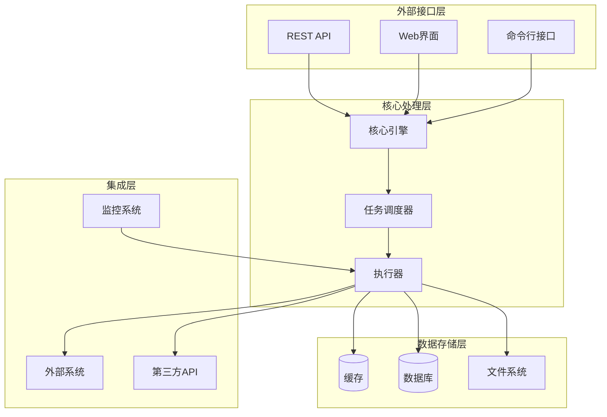
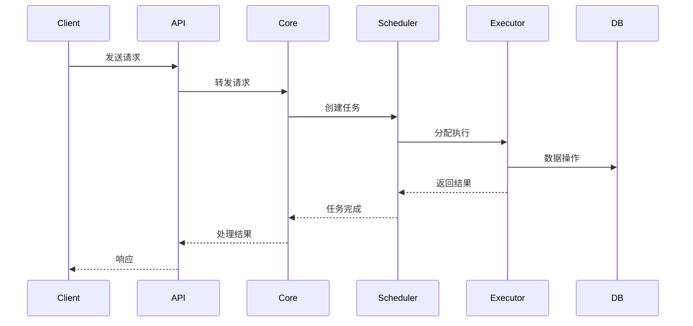
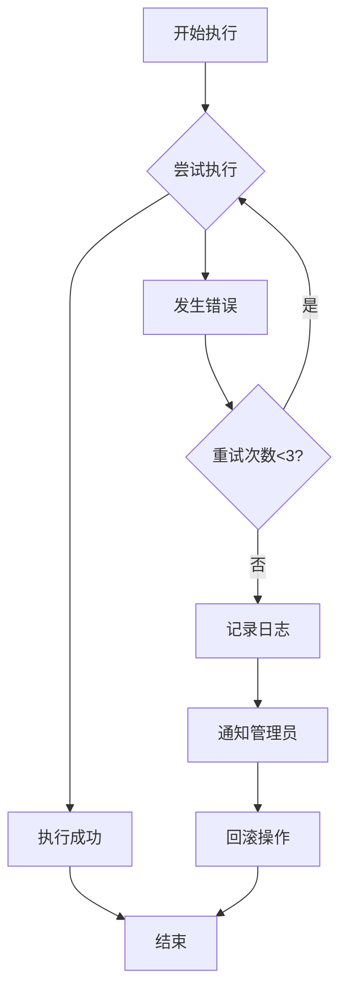

# Clawdbot架构设计

## 系统架构概览

### 整体架构


### 模块组件

#### 1. 核心引擎 (Core Engine)
- **功能**: 系统核心控制逻辑
- **职责**:
  - 统一请求处理
  - 模块间通信协调
  - 系统状态管理
  - 错误处理与恢复

#### 2. 任务调度器 (Task Scheduler)
- **功能**: 自动化任务管理与执行
- **职责**:
  - 任务队列管理
  - 调度策略实现
  - 并发控制
  - 超时管理

#### 3. 执行器 (Executor)
- **功能**: 具体任务执行
- **职责**:
  - 业务逻辑实现
  - 外部系统调用
  - 数据处理
  - 结果返回

#### 4. 存储管理 (Storage Manager)
- **功能**: 数据持久化
- **职责**:
  - 数据库操作
  - 缓存管理
  - 文件系统访问
  - 数据备份恢复

## 流程设计

### 请求处理流程


### 错误处理流程


## 技术选型

### 后端技术栈
| 组件 | 推荐技术 | 备选方案 | 说明 |
|------|----------|----------|------|
| 编程语言 | Python/Node.js | Go/Rust | 快速开发生态 |
| Web框架 | FastAPI/Express | Django/Flask | 高性能API |
| 消息队列 | Redis/Celery | RabbitMQ/NSQ | 任务异步处理 |
| 数据库 | PostgreSQL | MySQL/MongoDB | 关系型数据存储 |
| 缓存 | Redis | Memcached | 高性能缓存 |

### 前端技术栈
| 组件 | 推荐技术 | 备选方案 |
|------|----------|----------|
| 前端框架 | React/Vue | Angular |
| UI组件库 | Ant Design | Material-UI |
| 状态管理 | Redux/Vuex | Zustand |

## 部署架构

### 容器化部署
```yaml
# docker-compose.yml 草稿
version: '3.8'
services:
  clawdbot-api:
    image: clawdbot/api:latest
    ports:
      - "8000:8000"
    environment:
      - DATABASE_URL=postgresql://...
      - REDIS_URL=redis://redis:6379
  
  clawdbot-worker:
    image: clawdbot/worker:latest
    depends_on:
      - redis
      - postgres
  
  redis:
    image: redis:alpine
    
  postgres:
    image: postgres:14
    environment:
      POSTGRES_DB: clawdbot
```

### 云服务集成
- **计算资源**: AWS EC2 / 阿里云ECS
- **数据库**: AWS RDS / 阿里云RDS
- **消息队列**: AWS SQS / 阿里云消息队列
- **监控**: CloudWatch / 云监控

## 监控与运维

### 关键指标
- API响应时间
- 任务执行成功率
- 系统资源使用率
- 错误率统计

### 日志管理
- 结构化日志格式
- 集中式日志收集
- 实时日志分析
- 告警机制设置

## 安全设计

### 认证授权
- JWT令牌认证
- RBAC权限控制
- API访问限制
- 敏感数据加密

### 数据安全
- 数据传输加密(HTTPS)
- 数据库连接加密
- 敏感信息脱敏
- 定期安全审计

---

## 相关文档

- [[Clawdbot模块分解]] - 详细的模块设计
- [[Clawdbot数据流程]] - 数据流转设计
- [[Clawdbot部署文档]] - 部署指南
- [[API设计规范]] - 接口设计标准

---
*创建时间: 2024-01-30*
*分类: 1 Projects*