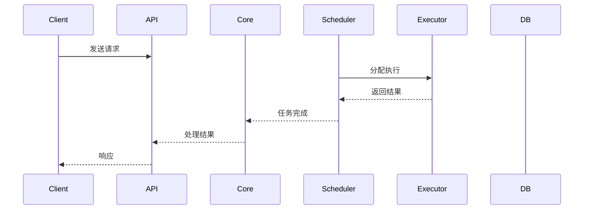

---
# 設計
status: in-progress
priority: high
tags: [architecture, clawdbot, design]
# 系統
created: 2024-01-30
---

# 設計

# 系統

### 整体架构
```mermaid
graph TB
    subgraph "外部接口层"
        API[REST API]
        WEB[Web界面]
        CLI[命令行接口]
    end
    
    subgraph "核心处理层"
        CORE[核心引擎]
        TASK[任务调度器]
        EXEC[执行器]
    end
    
# 數據
        CACHE[(缓存)]
# 數據
# 系統
    end
    
    subgraph "集成层"
# 系統
        API3[第三方API]
# 系統
    end
    
    API --> CORE
    WEB --> CORE
    CLI --> CORE
    
    CORE --> TASK
    TASK --> EXEC
    
    EXEC --> CACHE
    EXEC --> DB
    EXEC --> FILES
    
    EXEC --> EXT
    EXEC --> API3
    MONITOR --> EXEC
```

### 模块组件

#### 1. 核心引擎 (Core Engine)
# 系統
- **职责**:
  - 统一请求处理
# 通訊
# 系統
# 恢復

#### 2. 任务调度器 (Task Scheduler)
# 管理
- **职责**:
# 管理
  - 调度策略实现
  - 并发控制
# 管理

#### 3. 执行器 (Executor)
- **功能**: 具体任务执行
- **职责**:
  - 业务逻辑实现
# 系統
# 數據
  - 结果返回

# 管理
# 數據
- **职责**:
# 數據
# 管理
# 系統
# 備份

# 設計

### 请求处理流程


### 错误处理流程
```mermaid
flowchart TD
    START[开始执行] --> TRY{尝试执行}
    TRY --> SUCCESS[执行成功]
    TRY --> ERROR[发生错误]
    
    ERROR --> RETRY{重试次数<3?}
    RETRY -->|是| TRY
# 記錄
# 管理
    NOTIFY --> ROLLBACK[回滚操作]
    
    SUCCESS --> END[结束]
    ROLLBACK --> END
```

## 技术选型

### 后端技术栈
| 组件 | 推荐技术 | 备选方案 | 说明 |
|------|----------|----------|------|
# 開發
# 效能
| 消息队列 | Redis/Celery | RabbitMQ/NSQ | 任务异步处理 |
# 數據
# 效能

### 前端技术栈
| 组件 | 推荐技术 | 备选方案 |
|------|----------|----------|
| 前端框架 | React/Vue | Angular |
| UI组件库 | Ant Design | Material-UI |
# 管理

# 部署

# 部署
```yaml
# docker-compose.yml 草稿
version: '3.8'
services:
  clawdbot-api:
    image: clawdbot/api:latest
    ports:
      - "8000:8000"
    environment:
      - DATABASE_URL=postgresql://...
      - REDIS_URL=redis://redis:6379
  
  clawdbot-worker:
    image: clawdbot/worker:latest
    depends_on:
      - redis
      - postgres
  
  redis:
    image: redis:alpine
    
  postgres:
    image: postgres:14
    environment:
      POSTGRES_DB: clawdbot
```

### 云服务集成
# 資源
# 數據
- **消息队列**: AWS SQS / 阿里云消息队列
- **监控**: CloudWatch / 云监控

## 监控与运维

### 关键指标
- API响应时间
- 任务执行成功率
# 系統
- 错误率统计

# 管理
- 结构化日志格式
- 集中式日志收集
# 分析
# 設置

# 設計

### 认证授权
- JWT令牌认证
- RBAC权限控制
- API访问限制
# 數據

# 數據
# 數據
# 數據
# 資訊
- 定期安全审计

---

# 文檔

# 設計
# 設計
# 指南
# 設計

---
# 創建
# 分類