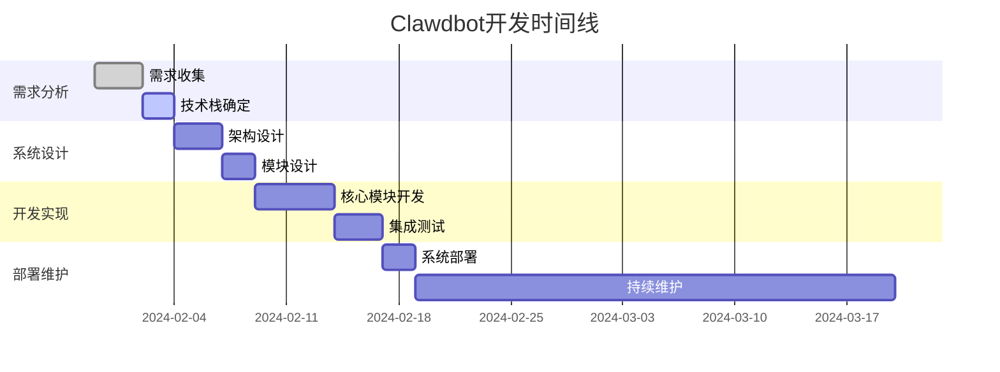

# Clawdbot自动化机器人项目

## 项目概述

Clawdbot是一个专注于执行自动化任务和工作流程的智能机器人系统。

### 主要功能
- 任务自动化执行
- 工作流程管理
- 系统集成与API调用
- 监控与报告
- 错误处理与恢复

## 项目结构

### 开发阶段

## 技术栈

### 核心技术
- **编程语言**: [待确定]
- **框架**: [待选择]
- **数据库**: [待评估]
- **消息队列**: [待考虑]
- **监控系统**: [待选择]

### 集成接口
- REST API
- WebSocket
- 数据库连接器
- 第三方服务API
- 文件系统接口

## 相关笔记

### 设计文档
- [[Clawdbot架构设计]]
- [[Clawdbot模块分解]]
- [[Clawdbot数据流程]]

### 开发记录
- [[Clawdbot开发日志]]
- [[Clawdbot测试报告]]
- [[Clawdbot部署文档]]

### 资源收集
- [[自动化工具对比]]
- [[机器人开发最佳实践]]
- [[API设计规范]]

## 任务清单

### 当前进度
- [x] 项目启动
- [x] 需求分析
- [ ] 技术栈选择
- [ ] 架构设计
- [ ] 核心模块开发
- [ ] 测试与部署

### 待办事项
- [ ] 确定目标平台和环境
- [ ] 选择合适的编程语言和框架
- [ ] 设计系统架构图
- [ ] 制定开发计划
- [ ] 设置开发环境

## 参考资料

- [[自动化系统设计模式]]
- [[企业级机器人开发]]
- [[微服务架构实践]]

---
*最后更新: 2024-01-30*
*分类: 1 Projects*