# OpenClaw项目

## 项目概述

OpenClaw是一个开源的智能自动化平台，致力于让每个人都能轻松构建自动化工作流程。

### 项目愿景
"让自动化触手可及" - 打造最易用、最强大的开源自动化解决方案

### 核心价值
- 🌟 **开源免费**: 完全开源，无功能限制
- 🚀 **简单易用**: 拖拽式界面，无需编程
- 🔧 **高度可扩展**: 插件架构，社区驱动
- 🛡️ **安全可靠**: 企业级安全标准
- 🌍 **面向全球**: 多语言支持，国际化设计

## 项目结构

### 组织架构

```mermaid
graph TB
    subgraph "核心团队"
        CORE[核心开发组]
        MAINTAINERS[维护者团队]
        SECURITY[安全团队]
    end
    
    subgraph "社区组织"
        CONTRIBUTORS[贡献者]
        AMBASSADORS[大使]
        PARTNERS[合作伙伴]
    end
    
    subgraph "产品架构"
        ENGINE[核心引擎]
        PLUGINS[插件生态]
        UI[用户界面]
        DOCS[文档系统]
    end
    
    CORE --> ENGINE
    CONTRIBUTORS --> PLUGINS
    MAINTAINERS --> UI
    PARTNERS --> DOCS
```


### 技术栈
| 组件 | 技术选型 | 说明 |
|------|----------|------|
| 后端 | Python + FastAPI | 高性能异步框架 |
| 前端 | React + TypeScript | 现代化Web界面 |
| 数据库 | PostgreSQL + Redis | 持久化+缓存 |
| 队列 | Celery + Redis | 任务调度 |
| 容器 | Docker + K8s | 部署与编排 |
| 监控 | Prometheus + Grafana | 性能监控 |

## 功能特性

### 核心功能

```mermaid
graph LR
    subgraph "自动化能力"
        WEB[Web自动化]
        API[API集成]
        FILE[文件处理]
        DATA[数据操作]
    end
    
    subgraph "用户界面"
        VISUAL[可视化编辑器]
        CODE[代码编辑器]
        MOBILE[移动端适配]
        API_UI[API界面]
    end
    
    subgraph "企业特性"
        ENTERPRISE[多租户]
        SSO[单点登录]
        RBAC[权限控制]
        AUDIT[审计日志]
    end
    
    VISUAL --> WEB
    CODE --> API
    MOBILE --> FILE
    API_UI --> DATA
```


### 工作流引擎
- **可视化设计**: 拖拽式流程设计器
- **条件分支**: 智能决策和分支逻辑
- **循环控制**: 多种循环模式支持
- **错误处理**: 异常捕获和恢复机制
- **实时监控**: 执行状态实时反馈

### 插件生态
```yaml
# 插件分类
categories:
  - name: "集成服务"
    plugins:
      - slack
      - gmail
      - jira
      - github
  
  - name: "数据处理"
    plugins:
      - excel-processor
      - pdf-parser
      - image-tools
      - csv-handler
  
  - name: "自动化工具"
    plugins:
      - web-scrapy
      - form-filler
      - api-caller
      - file-converter
```

## 开发计划

### 开发路线图

#### Phase 1: 核心基础 (Q1 2024)

```mermaid
gantt
    title OpenClaw Phase 1 开发计划
    dateFormat  YYYY-MM-DD
    section 基础架构
    项目初始化           :done, p1, 2024-01-30, 3d
    核心引擎开发         :active, p2, after p1, 10d
    基础API设计          :p3, after p2, 5d
    
    section 用户界面
    UI框架搭建           :p4, after p3, 7d
    可视化编辑器        :p5, after p4, 10d
    响应式设计          :p6, after p5, 5d
    
    section 核心功能
    任务执行引擎         :p7, after p6, 8d
    错误处理机制         :p8, after p7, 3d
    基础监控功能         :p9, after p8, 4d
```


#### Phase 2: 扩展能力 (Q2 2024)
- 插件系统架构
- 工作流编排引擎
- 企业级安全特性
- 多租户支持

#### Phase 3: 生态建设 (Q3 2024-Q4 2024)
- 插件市场
- 社区贡献平台
- 国际化支持
- 云服务集成

### 里程碑规划

| 版本 | 发布时间 | 主要特性 | 目标用户 |
|------|----------|----------|----------|
| v0.1.0 | 2024-03 | 基础Web自动化 | 开发者 |
| v0.2.0 | 2024-04 | 插件系统 | 个人用户 |
| v0.3.0 | 2024-05 | 工作流引擎 | 小团队 |
| v1.0.0 | 2024-06 | 企业特性 | 企业用户 |
| v2.0.0 | 2024-12 | 生态系统 | 全体用户 |

## 社区建设

### 贡献指南

#### 代码贡献
```bash
# 1. Fork项目
git clone https://github.com/username/openclaw.git
cd openclaw

# 2. 创建功能分支
git checkout -b feature/new-feature

# 3. 提交更改
git commit -am 'Add new feature'

# 4. 推送分支
git push origin feature/new-feature

# 5. 创建Pull Request
```

#### 文档贡献
- 更新API文档
- 撰写使用教程
- 翻译多语言版本
- 录制视频教程

#### 插件开发
```python
# 插件开发模板
from openclaw.plugins import BasePlugin, register_plugin

@register_plugin("example-plugin")
class ExamplePlugin(BasePlugin):
    """示例插件"""
    
    name = "Example Plugin"
    description = "A simple example plugin"
    version = "1.0.0"
    
    def execute(self, context):
        # 插件逻辑实现
        return {"status": "success", "data": {}}
    
    def validate(self, params):
        # 参数验证
        return True
```

### 社区活动
- **黑客松**: 季度线上编程比赛
- **贡献者月报**: 每月贡献者表彰
- **技术分享**: 定期技术直播
- **用户调研**: 社区需求和反馈收集

## 技术架构

### 系统设计

```mermaid
graph TB
    subgraph "前端层"
        WEBUI[Web界面]
        MOBILEUI[移动端]
        API_CLIENT[API客户端]
    end
    
    subgraph "网关层"
        GATEWAY[API网关]
        AUTH[认证服务]
        RATE_LIMIT[限流控制]
    end
    
    subgraph "应用层"
        WORKFLOW[工作流引擎]
        PLUGIN_MGR[插件管理器]
        TASK_SCHEDULER[任务调度器]
    end
    
    subgraph "数据层"
        MYSQL[(MySQL)]
        REDIS[(Redis)]
        MINIO[(MinIO)]
    end
    
    WEBUI --> GATEWAY
    MOBILEUI --> GATEWAY
    API_CLIENT --> GATEWAY
    
    GATEWAY --> AUTH
    GATEWAY --> WORKFLOW
    GATEWAY --> PLUGIN_MGR
    
    WORKFLOW --> MYSQL
    WORKFLOW --> REDIS
    PLUGIN_MGR --> MINIO
```


### 核心模块

#### 1. 工作流引擎
```python
# core/workflow/engine.py
class WorkflowEngine:
    """工作流执行引擎"""
    
    def __init__(self):
        self.store = RedisStore()
        self.scheduler = TaskScheduler()
        self.executor = ThreadPoolExecutor()
    
    async def execute_workflow(self, workflow: Workflow) -> Result:
        """执行工作流"""
        try:
            # 创建执行上下文
            context = ExecutionContext(workflow)
            
            # 按顺序执行步骤
            for step in workflow.steps:
                result = await self.execute_step(step, context)
                
                # 条件分支处理
                if result.status == "failed" and step.on_failure:
                    await self.handle_failure(step.on_failure, context)
                
                context.update_result(step.id, result)
            
            return Result(success=True, data=context.results)
            
        except Exception as e:
            return Result(success=False, error=str(e))
```

#### 2. 插件系统
```python
# core/plugins/manager.py
class PluginManager:
    """插件管理器"""
    
    def __init__(self):
        self.plugins = {}
        self.registry = PluginRegistry()
    
    def register_plugin(self, plugin_class: Type[BasePlugin]):
        """注册插件"""
        plugin = plugin_class()
        self.plugins[plugin.name] = plugin
        self.registry.register(plugin)
    
    def get_plugin(self, name: str) -> BasePlugin:
        """获取插件实例"""
        return self.plugins.get(name)
    
    def execute_plugin(self, name: str, params: dict) -> Result:
        """执行插件"""
        plugin = self.get_plugin(name)
        if not plugin:
            raise PluginNotFoundError(f"Plugin {name} not found")
        
        return plugin.execute(params)
```

#### 3. 任务调度
```python
# core/tasks/scheduler.py
class TaskScheduler:
    """任务调度器"""
    
    def __init__(self):
        self.queue = RedisDeque("task_queue")
        self.pool = ProcessPool()
    
    async def schedule_task(self, task: Task):
        """调度任务"""
        # 验证任务
        if not await self.validate_task(task):
            raise InvalidTaskError(f"Invalid task: {task}")
        
        # 添加到队列
        await self.queue.append(task)
        
        # 触发执行
        await self.trigger_execution()
    
    async def execute_task(self, task: Task):
        """执行任务"""
        try:
            # 获取插件
            plugin = self.plugin_manager.get_plugin(task.plugin_name)
            
            # 执行插件
            result = await plugin.execute(task.params)
            
            # 更新任务状态
            await self.update_task_status(task.id, "completed")
            
            return result
            
        except Exception as e:
            await self.update_task_status(task.id, "failed")
            raise
```

## 商业模式

### 开源策略
```yaml
# 许可证策略
license:
  core: MIT License
  enterprise: Commercial License
  
# 产品层级
tiers:
  community:
    - 核心功能
    - 社区支持
    - GitHub讨论
  
  professional:
    - 所有社区功能
    - 优先技术支持
    - 高级插件
    - SLA保证
  
  enterprise:
    - 所有专业功能
    - 定制开发
    - 部署支持
    - 培训服务
```

### 生态发展
- **Marketplace**: 插件和服务市场
- **Cloud Services**: 云端自动化服务
- **Training Program**: 认证和培训计划
- **Partnership**: 合作伙伴生态

## 质量保证

### 测试策略
```yaml
# 测试金字塔
testing:
  unit_tests:
    coverage: ">90%"
    tools: pytest, unittest
    
  integration_tests:
    coverage: ">80%"
    tools: pytest-django, testcontainers
    
  e2e_tests:
    coverage: ">70%"
    tools: selenium, playwright
    
  performance_tests:
    tools: locust, k6
    
  security_tests:
    tools: bandit, safety, semgrep
```

### CI/CD流程

```mermaid
graph LR
    COMMIT[代码提交] --> LINT[代码检查]
    LINT --> TEST[自动测试]
    TEST --> BUILD[构建镜像]
    BUILD --> DEPLOY[部署测试]
    DEPLOY --> QA[质量验证]
    QA --> RELEASE[发布上线]
```


### 监控与监控
```yaml
# 监控指标
metrics:
  performance:
    - response_time
    - throughput
    - error_rate
    
  business:
    - active_users
    - workflows_executed
    - plugins_installed
    
  infrastructure:
    - cpu_usage
    - memory_usage
    - storage_usage
```

## 相关文档

- [[OpenClaw技术架构]] - 详细技术设计
- [[OpenClaw开发指南]] - 开发者文档
- [[OpenClaw部署文档]] - 部署指南
- [[OpenClaw插件开发]] - 插件开发教程
- [[OpenClaw社区贡献]] - 社区参与指南

---
*最后更新: 2024-01-30*
*分类: 1 Projects*