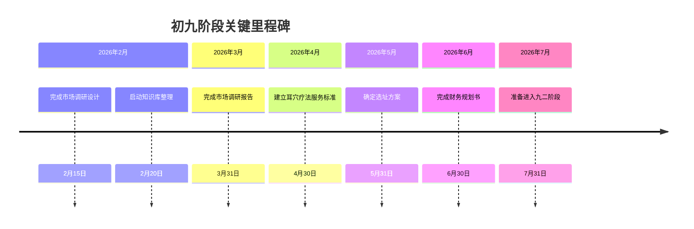

# 乾卦爻位诊断报告 - 耳一生健康养生馆

> [!info] 报告概述
> 本报告基于《易经》乾卦六爻智慧，对"耳一生健康养生馆"项目进行全面诊断分析，确定当前发展阶段，并为各阶段提供具体行动指南。

---

## 诊断结论

**当前定位**: 初九 - 潜龙勿用（规划筹备期）

**诊断时间**: 2026年2月10日

**核心判断**: 项目处于概念验证、知识库整理、市场调研、资源筹备阶段，时机尚未完全成熟，需积蓄力量。

---

## 一、六爻阶段定位诊断

| 爻位 | 爻辞 | 时间周期 | 养生馆阶段 | 状态 |
|------|------|----------|-----------|------|
| 初九 | 潜龙勿用 | 2026年2月-7月 | 规划筹备期 | 🟢 当前 |
| 九二 | 见龙在田 | 2026年8月-12月 | 试点启动期 | ⏳ 待启动 |
| 九三 | 终日乾乾 | 2027年1月-6月 | 稳定增长期 | ⏳ 待启动 |
| 九四 | 或跃在渊 | 2027年7月-12月 | 扩张转折期 | ⏳ 待启动 |
| 九五 | 飞龙在天 | 2028年1月-12月 | 成熟运营期 | ⏳ 待启动 |
| 上九 | 亢龙有悔 | 风险预警期 | 🚨 持续监控 | 🚨 持续监控 |

---

## 二、初九：潜龙勿用（规划筹备期）详细分析

### 2.1 核心含义

**时机未到，积蓄力量** - 此阶段不宜急于行动，而应扎实基础，完善准备。

### 2.2 四维分析框架

#### 时间维度：发展阶段

| 分析项 | 内容 | 输出成果 | 截止日期 | 状态 |
|--------|------|---------|----------|------|
| 概念验证 | 耳穴疗法市场可行性研究 | 市场调研报告 | 2026-03-31 | 🔴 进行中 |
| 商业模式设计 | 盈利模式验证 | 商业模式画布 | 2026-04-15 | 🔴 未开始 |
| 资金规划 | 3.7万元启动资金分配 | 财务规划书 | 2026-04-30 | 🔴 未开始 |

#### 空间维度：场地选址

| 分析项 | 内容 | 输出成果 | 截止日期 | 状态 |
|--------|------|---------|----------|------|
| 选址标准制定 | 27㎡场地评估标准 | 选址评估表 | 2026-05-15 | 🔴 未开始 |
| 区域调研 | 目标区域市场分析 | 区域分析报告 | 2026-05-31 | 🔴 未开始 |
| 场地谈判 | 租赁条件谈判 | 租赁合同草案 | 2026-06-30 | 🔴 未开始 |

#### 人事维度：团队建设

| 分析项 | 内容 | 输出成果 | 截止日期 | 状态 |
|--------|------|---------|----------|------|
| 技术培训 | 耳穴疗法技能培训 | 培训记录 | 2026-04-30 | 🔴 未开始 |
| 岗位设计 | 运营岗位职责定义 | 岗位说明书 | 2026-05-15 | 🔴 未开始 |
| 合伙协议 | 权责利益分配 | 合伙协议书 | 2026-06-15 | 🔴 未开始 |

#### 财务维度：资金配置

| 分析项 | 内容 | 输出成果 | 截止日期 | 状态 |
|--------|------|---------|----------|------|
| 启动资金分配 | 3.7万元分项预算 | 预算分配表 | 2026-03-31 | 🔴 未开始 |
| 成本结构分析 | 固定成本与可变成本测算 | 成本分析报告 | 2026-04-15 | 🔴 未开始 |
| 盈亏平衡点计算 | 收入目标设定 | 盈亏分析模型 | 2026-04-30 | 🔴 未开始 |

### 2.3 关键里程碑

---

## 三、九二：见龙在田（试点启动期）预分析

### 3.1 核心含义

**时机渐显，适度展现** - 从筹备转向小规模尝试，开始展现产品和服务。

### 3.2 行动要点

| 维度 | 分析内容 | 输出成果 | 截止日期 |
|------|---------|---------|----------|
| 服务测试 | 耳穴夹疗法效果验证 | 试运营报告 | 2026-10-15 |
| 客户开发 | 种子客户获取（20位） | 客户画像分析 | 2026-09-30 |
| 营销尝试 | 推广测试、转化率优化 | 营销优化方案 | 2026-11-30 |
| 团队磨合 | 流程演练、问题响应 | 团队优化计划 | 2026-10-31 |

### 3.3 关键里程碑

- 完成20位种子客户服务（2026-09-30）
- 收集并分析客户反馈（2026-10-31）
- 确定服务套餐价格体系（2026-12-31）

---

## 四、九三：终日乾乾（稳定增长期）预分析

### 4.1 核心含义

**勤勉不懈，时刻警醒** - 正式运营期，需要持续努力，不可松懈。

### 4.2 行动要点

| 维度 | 分析内容 | 输出成果 | 截止日期 |
|------|---------|---------|----------|
| 运营管理 | 每日运营标准化 | 运营管理手册 | 2027-02-28 |
| 财务监控 | 收入跟踪、盈亏分析 | 月度财务分析 | 持续 |
| 客户维护 | 复购率提升、会员体系 | 客户运营策略 | 2027-04-30 |
| 技术精进 | 耳穴疗法技术深化 | 技术升级方案 | 2027-06-30 |

### 4.3 关键里程碑

- 实现月度盈亏平衡（2027-04-30）
- 会员体系稳定运行（2027-05-31）
- 服务满意度达到90%以上（2027-06-30）

---

## 五、九四：或跃在渊（扩张转折期）预分析

### 5.1 核心含义

**关键转折，智慧选择** - 面临扩张决策，需要智慧判断是否跃进。

### 5.2 决策框架

| 决策项 | 选择因素 | 评估标准 |
|--------|---------|---------|
| 扩张vs稳健 | 资金充足性、团队能力、市场需求 | 综合评分法 |
| 多店vs单店 | 品牌影响力、管理能力、风险承受度 | SWOT分析 |
| 加盟vs直营 | 品牌成熟度、标准化程度、培训能力 | 可行性研究 |

### 5.3 关键里程碑

- 完成扩张可行性分析（2027-08-31）
- 做出扩张或深耕的战略决策（2027-09-30）

---

## 六、九五：飞龙在天（成熟运营期）预分析

### 6.1 核心含义

**时机成熟，大有作为** - 项目成熟，可以大展宏图。

### 6.2 发展方向

| 维度 | 发展方向 | 目标 |
|------|---------|------|
| 品牌建设 | 品牌影响力提升 | 成为区域内知名养生品牌 |
| 业务拓展 | 产品线延伸、培训业务 | 多元化收入来源 |
| 平台化 | 加盟体系、技术输出 | 可持续发展模式 |
| 资源整合 | 产业链整合 | 生态化发展 |

### 6.3 关键里程碑

- 成为区域内知名养生品牌（2028-06-30）
- 培训业务正式启动（2028-09-30）

---

## 七、上九：亢龙有悔（风险预警机制）

### 7.1 核心含义

**到达极点，应知进退** - 时刻警惕过度扩张和骄傲自满的风险。

### 7.2 风险识别与应对

| 风险类型 | 预警信号 | 风险等级 | 应对策略 |
|---------|---------|---------|---------|
| 市场饱和 | 客户增长率<5% | 🟡 中等 | 精细化运营、提升服务质量 |
| 竞争加剧 | 竞争者降价促销 | 🟡 中等 | 差异化定位、品牌升级 |
| 盲目扩张 | 资金链紧张、管理失控 | 🔴 高 | 及时止损、回归本业 |
| 创新乏力 | 客户满意度下降 | 🟡 中等 | 持续研发、技术升级 |
| 人才流失 | 核心技术人员离职 | 🔴 高 | 完善激励机制、梯队建设 |

### 7.3 关键预警指标

| 指标 | 预警阈值 | 监控频率 |
|------|---------|---------|
| 月度营收 | 连续3个月下降 | 每月 |
| 客户满意度 | 低于85% | 每季度 |
| 现金流 | 仅能维持3个月 | 每月 |
| 员工流失率 | 超过20% | 每季度 |
| 市场占有率 | 连续2个季度下降 | 每季度 |

---

## 八、爻位转换判断标准

### 8.1 从初九到九二的转换条件

- [ ] 完成市场调研报告并获得验证
- [ ] 建立完整的耳穴疗法服务标准
- [ ] 确定选址方案并签署意向协议
- [ ] 完成财务规划并获得启动资金
- [ ] 团队基本组建完成

### 8.2 从九二到九三的转换条件

- [ ] 完成20位种子客户服务并获得正面反馈
- [ ] 服务流程优化完成
- [ ] 价格体系确定并验证
- [ ] 团队磨合到位

### 8.3 从九三到九四的转换条件

- [ ] 连续3个月实现盈亏平衡
- [ ] 客户复购率达到30%以上
- [ ] 服务满意度稳定在90%以上
- [ ] 运营流程标准化

### 8.4 从九四到九五的转换条件

- [ ] 扩张决策完成（选择稳健或扩张路径）
- [ ] 人才梯队建立
- [ ] 资金储备充足

---

## 九、当前行动计划（初九阶段）

### 9.1 立即行动（本周完成）

- [ ] 市场调研框架设计
- [ ] 耳穴知识库整理启动
- [ ] 选址标准初步制定
- [ ] 财务规划初步框架

### 9.2 本月行动（2026年2月完成）

- [ ] 完成市场调研报告初稿
- [ ] 耳穴疗法服务标准草案
- [ ] 选址评估表模板
- [ ] 财务预算分配表

### 9.3 阶段行动（2026年2月-7月完成）

- [ ] 完成市场调研报告
- [ ] 建立耳穴疗法服务标准
- [ ] 确定选址方案
- [ ] 完成财务规划书
- [ ] 团队建设完成
- [ ] 准备进入九二阶段

---

## 十、附录

### 10.1 相关文件引用

| 文件路径 | 用途 |
|---------|------|
| `5 Zettels/📌 permanent/卦象/20260201-0001 乾卦.md` | 乾卦核心理论和六爻解读 |
| `1 Projects/02-Work/养生馆项目规划/耳穴疗法养生馆-PARA方案.md` | PARA框架和项目结构 |
| `3 Resources/01-Tech/🏥 专业知识/耳穴知识库/【中医穴位】93个国际耳穴图谱.md` | 耳穴知识和技术基础 |
| `5 Zettels/📌 permanent/易经/20260201-0008 八卦.md` | 易经核心概念 |
| `5 Zettels/📁 structures/易经/易经-核心概念.md` | 易经概念索引 |

### 10.2 爻位诊断检查清单

**初九阶段检查清单**

| 检查项 | 完成状态 | 完成日期 | 备注 |
|--------|---------|---------|------|
| 市场调研完成 | 🔴 | - | |
| 服务标准建立 | 🔴 | - | |
| 选址方案确定 | 🔴 | - | |
| 财务规划完成 | 🔴 | - | |
| 团队建设完成 | 🔴 | - | |
| 知识库整理完成 | 🔴 | - | |

---

> [!tip] 诊断说明
> 本报告基于乾卦理论框架，结合实际项目情况进行分析。爻位判断需要结合实际情况定期更新，建议每月进行一次诊断评估。

---

**报告版本**: v1.0
**报告作者**: Claude Code
**下次更新**: 2026-03-10
