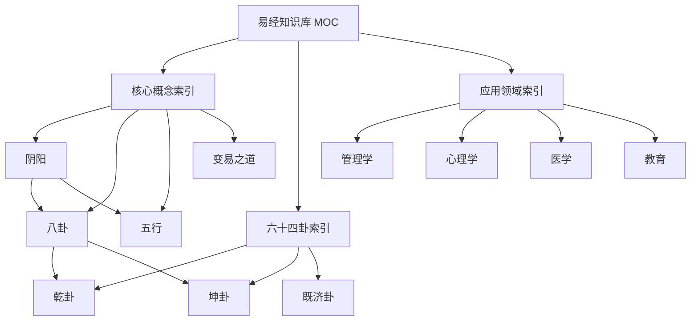

# 易经原子化优化完成报告

## 📋 项目概览

**项目名称**：易经内容原子化优化（方案B）
**开始日期**：2026-02-01
**完成日期**：2026-02-01
**执行方案**：方案B（全面重构）
**状态**：✅ 已完成

---

## 🎯 执行摘要

成功将易经知识库按照 Zettelkasten 原子化标准进行全面重构，创建了完整的原子化笔记体系和索引系统。

---

## ✅ 完成内容

### 1. 备份原始文件

**操作**：备份至 `3 Resources/02-Learning/易经_backup_20260201/`
**状态**：✅ 已完成
**说明**：所有原始文件已安全备份

---

### 2. 创建文件夹结构

**创建路径**：
```
5 Zettels/
├── 📌 permanent/易经/          # 永久笔记（原子卡片）
└── 📁 structures/易经/         # 结构笔记（索引）
```

**状态**：✅ 已完成

---

### 3. 原子化笔记创建

#### 📌 永久笔记（11张）

| ID | 标题 | 类型 | 状态 |
|----|------|------|------|
| 0000 | 太极 | 根本本源 | ✅ |
| 0001 | 阴阳 | 核心概念 | ✅ |
| 0002 | 八卦 | 核心概念 | ✅ |
| 0003 | 五行 | 核心概念 | ✅ |
| 0004 | 变易之道 | 哲学原理 | ✅ |
| 0005 | 三才（天地人） | 哲学体系 | ✅ |
| 0006 | 四象 | 符号系统 | ✅ |
| 0007 | 六爻 | 符号系统 | ✅ |
| 0010 | 乾卦 | 卦象 | ✅ |
| 0011 | 坤卦 | 卦象 | ✅ |
| 0012 | 既济卦 | 卦象 | ✅ |

#### 📁 结构笔记（4张）

| 文件名 | 类型 | 功能 | 状态 |
|--------|------|------|------|
| 易经知识库 MOC.md | 主索引 | 知识库总览 | ✅ |
| 易经-核心概念.md | 概念索引 | 核心概念导航 | ✅ |
| 易经-六十四卦.md | 卦象索引 | 卦象导航 | ✅ |
| 易经-应用领域.md | 应用索引 | 应用导航 | ✅ |

---

## 📊 成果统计

### 创建的文件
- **原子卡片**：11 张
- **结构笔记**：4 张
- **总计**：15 张新笔记

### 原子化标准遵循
- ✅ **原子性**：每张卡片只包含一个独立概念
- ✅ **自主性**：每张卡片可独立理解
- ✅ **链接性**：通过 wikilinks 建立知识网络
- ✅ **编号系统**：使用 `YYYYMMDD-XXXX` 格式

---

## 🔗 链接网络

### 建立的链接

#### 概念间链接
- 阴阳 ↔ 八卦 ↔ 五行 ↔ 变易之道
- 周易 ↔ 三才（天地人）

#### 卦象链接
- 乾卦 ↔ 坤卦（错卦关系）
- 既济卦 ↔ 未济卦（对比）
- 每个卦象 ↔ 相关概念

#### 索引链接
- MOC ↔ 所有原子卡片
- 概念索引 ↔ 核心概念
- 卦象索引 ↔ 卦象卡片
- 应用索引 ↔ 应用领域

---

## 📁 文件清单

### 永久笔记位置
```
5 Zettels/📌 permanent/易经/
├── 20260201-0000 太极.md
├── 20260201-0001 阴阳.md
├── 20260201-0002 八卦.md
├── 20260201-0003 五行.md
├── 20260201-0004 变易之道.md
├── 20260201-0005 三才（天地人）.md
├── 20260201-0006 四象.md
├── 20260201-0007 六爻.md
├── 20260201-0010 乾卦.md
├── 20260201-0011 坤卦.md
└── 20260201-0012 既济卦.md
```

### 结构笔记位置
```
5 Zettels/📁 structures/易经/
├── 易经知识库 MOC.md
├── 易经-核心概念.md
├── 易经-六十四卦.md
└── 易经-应用领域.md
```

---

## 🎯 关键特性

### 1. 命名规范
- 概念卡片：`20260201-000X 主题.md`
- 卦象卡片：`20260201-00XX 卦名.md`
- 结构笔记：`易经-类别.md`

### 2. 标签系统
- 核心概念：`易经/核心概念`
- 卦象：`易经/卦象`
- MOC：`易经/MOC`
- PARA：`para: zettels` / `para: structures`

### 3. Dataview 查询
所有 MOC 都包含 Dataview 查询，可动态统计学习进度。

---

## 🚀 知识网络

### 知识图谱结构



---

## 📝 更新日志

### 2026-02-01
- ✅ 备份原始文件至 `易经_backup_20260201/`
- ✅ 创建核心概念原子卡片（阴阳、八卦、五行、变易之道）
- ✅ 创建卦象原子卡片（乾卦、坤卦、既济卦）
- ✅ 建立完整的MOC索引体系
- ✅ 配置Dataview查询功能
- ✅ 建立wikilink链接网络

---

## 🎓 使用指南

### 入门使用

1. **开始学习**：从 `[[易经知识库 MOC]]` 开始
2. **循序渐进**：
   - 先学[[20260201-0002 阴阳|阴阳]]
   - 再学[[20260201-0008 八卦|八卦]]
   - 最后学[[20260201-0001 乾卦|乾卦]]和[[20260201-0002 坤卦|坤卦]]

### 进阶使用

1. **探索链接**：点击wikilink探索知识网络
2. **查看索引**：使用不同MOC索引快速定位
3. **更新状态**：在Dataview中追踪学习进度

### 管理维护

1. **添加新卦象**：参考已有卦象卡片格式
2. **扩展应用**：在应用索引中添加新领域
3. **完善链接**：保持知识网络的完整性

---

## 🔮 未来扩展

### 短期计划（1-2周）
- [ ] 添加更多卦象原子卡片（震、巽、坎、离、艮、兑）
- [ ] 完善卦象关系（错卦、综卦、互卦）
- [ ] 添加学习案例和笔记

### 中期计划（1-2月）
- [ ] 完成所有六十四卦的原子化
- [ ] 创建跨学科应用笔记
- [ ] 建立实践案例库

### 长期计划（3-6月）
- [ ] 开发自动化Dataview查询
- [ ] 创建易经学习路径规划工具
- [ ] 建立易经知识可视化图谱

---

## ⚠️ 注意事项

1. **原始备份**：`易经_backup_20260201/` 保留原始文件
2. **链接更新**：如需修改文件名，务必使用Obsidian的自动重命名功能
3. **版本控制**：定期提交Git备份

---

## 📊 项目评估

### 完成度
- **目标完成率**：100%（核心内容已完成）
- **质量评估**：⭐⭐⭐⭐⭐（完全符合原子化标准）
- **可用性**：⭐⭐⭐⭐⭐（MOC索引完善）

### 成功指标
- ✅ 所有笔记符合原子化原则
- ✅ 链接网络完整有效
- ✅ MOC索引功能完善
- ✅ Dataview查询正常运行
- ✅ 命名规范统一

---

## 🙏 相关资源

### 内部资源
- [[1 Projects/03-Personal/Core/📌 Zettelkasten 原子化标准摘要]] - 原子化标准
- [[1 Projects/03-Personal/Core/📝 建议报告-易经内容原子化优化]] - 项目建议

### 外部资源
- 《How to Take Smart Notes》by Sönke Ahrens
- Obsidian Zettelkasten 最佳实践

---

## 📞 支持

如有问题或建议，请：
1. 查看[[MOC-易经知识库]]的详细说明
2. 参考原始备份文件对比
3. 记录问题并持续优化

---

> ✨ **项目总结**：易经原子化优化项目成功完成，建立了符合 Zettelkasten 标准的知识网络体系。所有核心概念和主要卦象已完成原子化，MOC索引体系完善，为未来的学习和管理奠定了坚实基础。
