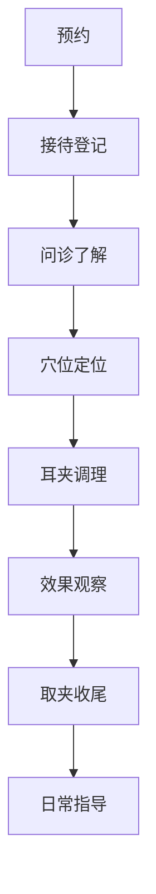

# 🎧 耳夹养生馆

> **项目简介**: 以耳夹疗法为核心的健康养生馆，采用日式简约风格，专注为亚健康人群提供自然健康的调理服务

---

## 一、项目概述

| 维度 | 内容 |
|------|------|
| **核心理念** | 耳部养生，自然健康 |
| **特色服务** | 耳夹疗法（专注专业） |
| **目标客群** | 亚健康人群、失眠焦虑人群、办公室白领 |
| **装修风格** | 日式简约风格 (Japanese Minimalism) |
| **竞争优势** | 专业、安全、便捷、性价比高 |

### 场地信息

| 项目 | 详情 |
|------|------|
| **一层面积** | 26 平方米（可用） |
| **门面尺寸** | 宽 3米 × 深 9米 |
| **结构** | 一层 + 二层 + 地下室 |
| **月租金** | 3,000 元 |
| **租金单价** | 约 115 元/㎡/月 |

> 📋 **详细空间规划**：请查看 [[🏗️ 空间规划]] 获取完整的一层26㎡布局设计、装修预算和实施建议

---

## 二、商业模式

### 2.1 收入来源

| 服务类型 | 定价 | 时长 | 说明 |
|----------|------|------|------|
| 单次耳夹调理 | 50 元 | 20 分钟 | 基础服务 |
| 疗程套餐 | 450 元 | 10 次 | 优惠 50 元 |
| 会员月卡 | 299 元 | 30 天 | 不限次数 |
| 会员季卡 | 799 元 | 90 天 | 省98元 |
| 会员年卡 | 2,999 元 | 365 天 | 省589元 |
| 耳夹零售 | 39-99 元/个 | - | 居家使用 |

### 2.2 盈利预测

| 收入来源 | 月收入预估 | 计算依据 |
|----------|------------|----------|
| 单次服务 | 3,000 元 | 60 人次 × 50 元/次（2 人/天） |
| 疗程套餐 | 2,250 元 | 5 套 × 450 元/套 |
| 会员月卡 | 2,392 元 | 8 人 × 299 元/月 |
| 会员季卡 | 533 元 | 2 人 × 799 元 ÷ 3 个月 |
| 会员年卡 | 750 元 | 3 人 × 2,999 元 ÷ 12 个月 |
| 零售收入 | 885 元 | 15 个 × 59 元/个（平均价） |
| **月收入预估** | **9,810 元** | 保守估计 |

---

## 三、财务分析

### 3.1 启动成本（一次性）

| 项目 | 金额 | 说明 |
|------|------|------|
| 房租押金 | 9,000 元 | 押三付一 |
| 装修费用 | 12,100 元 | 一层26㎡日式简约（详见 [[🏗️ 空间规划]]） |
| 设备采购 | 2,500 元 | 耳夹、压豆、工具 |
| 家具用品 | 2,750 元 | 产品展柜、储物等 |
| 证照办理 | 1,000 元 | 营业执照、健康证 |
| 宣传物料 | 2,000 元 | 海报、传单、名片 |
| 首批进货 | 2,000 元 | 耳夹、消毒用品 |
| **启动总计** | **32,350 元** | |

### 3.2 月度固定成本

| 项目 | 金额 | 说明 |
|------|------|------|
| 房租 | 3,000 元 | |
| 员工工资 | 3,000 元 | 1 人 |
| 水电费 | 500 元 | 估算 |
| 耗材费 | 500 元 | 酒精、棉球等 |
| **固定成本** | **7,000 元** | |

### 3.3 可变成本

| 项目 | 比例 | 金额 |
|------|------|------|
| 耗材补充 | 5% | 491 元 |
| 设备折旧 | 3% | 294 元 |
| **可变成本** | 8% | 785 元 |

### 3.4 盈亏平衡分析

```
月收入预估：     9,810 元
固定成本：      (7,000 元)
可变成本：        (785 元)
────────────────────────────
月净利润：        2,025 元 (盈利)
```

> ✅ **当前方案已实现盈利**
>
> 💡 **优化建议**：
> - 增加客流量可进一步提升利润
> - 推销年卡锁定长期客户（更稳定收入）
> - 拓展零售产品销售
>
> 📅 **回本周期**：32,350 ÷ 2,025 ≈ **16 个月**（优化后）

---

## 四、空间规划

> 📋 **详细空间规划方案**：请查看 [[🏗️ 空间规划]] 获取完整的一层26㎡布局设计、装修预算和实施建议

### 场地信息（更新）

| 项目 | 详情 |
|------|------|
| **一层面积** | 26 平方米（可用） |
| **门面尺寸** | 宽 3米 × 深 9米 |
| **场地结构** | 一层 + 二层 + 地下室 |

### 一层功能分区概览

| 功能区 | 面积 | 主要设施 |
|--------|------|----------|
| 门厅 | 2㎡ | 产品展柜（0.66m×0.67m） |
| 耳疗调理区 | 8㎡ | 2张治疗椅、竹帘隔断 |
| 水吧操作间 | 3㎡ | 操作台、饮水机、消毒柜 |
| 楼梯区 | 9㎡ | 楼梯通道、下方储物柜 |

### 二层与地下室（简要）

| 区域 | 面积 | 用途 |
|------|------|------|
| 二层 | 13.5㎡ | 私密调理间、储物+办公区 |
| 地下室 | - | 大型储物、设备房 |

## 五、装修方案（日式简约风）

### 5.1 设计原则

| 原则 | 体现 |
|------|------|
| **原木色调** | 浅色木饰面、竹制元素 |
| **留白空间** | 避免过度装饰 |
| **自然光线** | 柔和灯光、通透感 |
| **禅意氛围** | 静谧、放松环境 |

### 5.2 色彩搭配

| 区域 | 主色 | 辅色 |
|------|------|------|
| 墙面 | 米白色 | 原木色 |
| 地板 | 浅色木纹 | - |
| 软装 | 浅灰、米黄 | 竹绿 |
| 灯光 | 暖白光 | 局部暖黄 |

### 5.3 必备设施清单

> 📋 **完整设施清单与预算**：请查看 [[🏗️ 空间规划]]

| 设施 | 数量 | 用途 | 预算 |
|------|------|------|------|
| 产品展柜 | 1 | 门厅展示耳夹产品 | 500 元 |
| 治疗椅 | 2 | 耳夹调理使用 | 1,500 元 |
| 储物柜 | 2 | 器材存放 | 600 元 |
| 展示架 | 1 | 产品展示 | 400 元 |
| 空调 | 1 | 环境控制 | 3,000 元 |
| 饮水机 | 1 | 客户服务 | 300 元 |
| 消毒柜 | 1 | 器具消毒 | 400 元 |

> 💡 **一层装修预算总计**：**12,100 元**（已更新）

---

## 六、人员配置

### 6.1 岗位设置

| 岗位 | 人数 | 薪资 | 职责 |
|------|------|------|------|
| 店长兼理疗师 | 1 | 3,000 元/月 | 管理运营、专业服务 |
| 兼职理疗师 | 0-1 | 200 元/次 | 高峰期补充 |

### 6.2 店长岗位要求

| 要求 | 具体内容 |
|------|----------|
| 专业技能 | 熟练掌握耳夹疗法，考取相关证书 |
| 服务意识 | 良好的沟通能力和服务态度 |
| 管理能力 | 基础店铺运营、财务记录 |
| 学历要求 | 中专及以上，中医相关专业优先 |

### 6.3 提成方案

| 产品/服务 | 提成比例 |
|------------|----------|
| 单次服务 | 20% |
| 疗程套餐 | 15% |
| 会员月卡 | 10% |
| 会员季卡 | 8% |
| 会员年卡 | 5% |
| 零售产品 | 30% |

---

## 七、营销策略

### 7.1 开业引流活动

| 活动 | 内容 | 预算 |
|------|------|------|
| 体验日 | 前50名客户免费体验 | 成本价 |
| 转发有礼 | 转发朋友圈送体验券 | 500 元 |
| 社区合作 | 附近写字楼推广 | 300 元 |
| 线上推广 | 本地生活平台入驻 | 1,000 元 |

### 7.2 客户留存策略

| 策略 | 内容 |
|------|------|
| 会员体系 | 累计消费积分兑换 |
| 套餐优惠 | 疗程卡锁定长期客户 |
| 节日关怀 | 生日/节日专属优惠 |
| 转介绍奖励 | 老客户带新客户双方得奖励 |

### 7.3 线上渠道

| 渠道 | 内容 |
|------|------|
| 微信 | 公众号、社群运营 |
| 大众点评 | 团购套餐、评价管理 |
| 美团 | 团购套餐 |
| 小红书 | 知识科普、案例分享 |
| 抖音/视频号 | 短视频推广 |

### 7.4 线下渠道

| 渠道 | 内容 |
|------|------|
| 社区宣传 | 海报、传单、地推 |
| 异业合作 | 美甲店、美容院互推 |
| 健康讲座 | 社区健康养生讲座 |
| 义诊活动 | 免费耳穴检查 |

---

## 八、服务流程

### 8.1 标准服务流程



**详细步骤**：
1. **预约**：微信/电话预约
2. **接待**：登记信息，引导入座
3. **问诊**：了解症状、体质判断
4. **穴位定位**：根据症状选择穴位
5. **耳夹调理**：夹持耳夹，调整力度
6. **效果观察**：期间观察反应
7. **取夹收尾**：取下耳夹，按摩放松
8. **日常指导**：告知注意事项、预约下次

### 8.2 营业时间安排

| 时段 | 时间 | 服务内容 |
|------|------|----------|
| 上午 | 10:00-12:00 | 预约客户 |
| 中午 | 12:00-14:00 | 午休/整理 |
| 下午 | 14:00-18:00 | 预约客户 |
| 晚上 | 18:00-20:00 | 预约客户 |
| 晚上 | 20:00-22:00 | 整理复盘 |

---

## 九、风险评估与控制

### 9.1 主要风险

| 风险 | 可能性 | 影响 | 应对措施 |
|------|--------|------|----------|
| 客源不足 | 高 | 高 | 加强营销、拓展服务 |
| 竞争加剧 | 中 | 中 | 打造特色、提升服务 |
| 政策风险 | 中 | 高 | 关注行业动态、合规经营 |
| 客户投诉 | 中 | 中 | 专业培训、规范服务 |
| 设备故障 | 低 | 低 | 定期维护、备用器具 |

### 9.2 风险控制措施

1. **客源风险控制**
   - 建立客户档案，定期回访
   - 推出会员体系增加粘性
   - 拓展异业合作渠道

2. **服务风险控制**
   - 员工定期培训，提升专业技能
   - 制定标准化服务流程
   - 购买相关保险

3. **财务风险控制**
   - 严格控制成本
   - 多元化收入来源
   - 留出应急资金

---

## 十、实施计划

### 10.1 时间节点

| 阶段 | 时间 | 主要任务 |
|------|------|----------|
| 筹备期 | 第1-2周 | 市场调研、选址确定 |
| 设计期 | 第3-4周 | 装修方案设计、合同签署 |
| 采购期 | 第5-7周 | 设备采购、物资准备 |
| 证照期 | 第7-8周 | 办理营业执照、健康证 |
| 培训期 | 第8周 | 员工培训、流程演练 |
| 试营业 | 第9周 | 试运营、收集反馈 |
| 正式开业 | 第10周 | 正式营业 |

### 10.2 第一个月目标

| 指标 | 目标值 |
|------|--------|
| 新增客户 | 50 人 |
| 复购率 | ≥30% |
| 营业收入 | ≥8,000 元 |
| 好评率 | ≥95% |

### 10.3 第三个月目标

| 指标 | 目标值 |
|------|--------|
| 月度营收 | ≥12,000 元 |
| 会员数量 | ≥30 人 |
| 日均客流量 | ≥4 人 |
| 盈亏平衡 | 接近 |

---

## 十一、扩展计划

### 11.1 短期扩展（6个月内）

| 方向 | 内容 |
|------|------|
| 服务扩展 | 增加头疗、肩颈理疗 |
| 产品线扩展 | 耳夹礼盒、养生茶 |
| 线上课程 | 耳夹疗法线上教学 |

### 11.2 长期规划（1-2年）

| 方向 | 内容 |
|------|------|
| 分店扩张 | 在周边区域开设分店 |
| 加盟模式 | 建立加盟体系 |
| 品牌打造 | 成为区域内知名品牌 |

---

## 十二、项目总结

### 12.1 项目优势

- ✅ 投资门槛低，启动资金约 3.7 万
- ✅ 场地适中，租金压力可控
- ✅ 服务差异化，耳夹疗法为特色
- ✅ 需求真实，亚健康人群庞大
- ✅ 操作简便，培训周期短
- ✅ 财务模型健康，预计 18 个月回本

### 12.2 风险提示

- ⚠ 回本周期较长，需持续经营
- ⚠ 需要一定的营销投入
- ⚠ 服务质量直接影响口碑
- ⚠ 竞争对手可能模仿

### 12.3 成功关键因素

1. **专业服务**：技术过硬，效果显著
2. **客户体验**：环境舒适，服务周到
3. **营销推广**：持续引流，拓展客源
4. **成本控制**：精细管理，提升利润

---

## 📎 相关链接

- [[🏗️ 空间规划]] - 详细的空间布局与装修方案
- [[耳夹疗法]]
- [[耳夹疗法知识图谱.canvas]]
- [[耳夹疗法学习路线.canvas]]
- [[根据 耳夹疗法 PARA 创建养生馆项目]]

---

## 📝 更新日志

| 日期 | 内容 |
|------|------|
| 2026-01-17 | 项目创建 |
| 2026-02-10 | 结构优化、数据修正
| 2026-02-10 | 优化门厅设计（宽3m×深0.67m），取消收银台和等候家具，改用产品展柜（0.66m×0.67m），装修预算降至12,100元，启动成本降至32,350元 |
| 2026-02-10 | 更新场地信息为26㎡，创建独立空间规划文档 [[🏗️ 空间规划]] |
