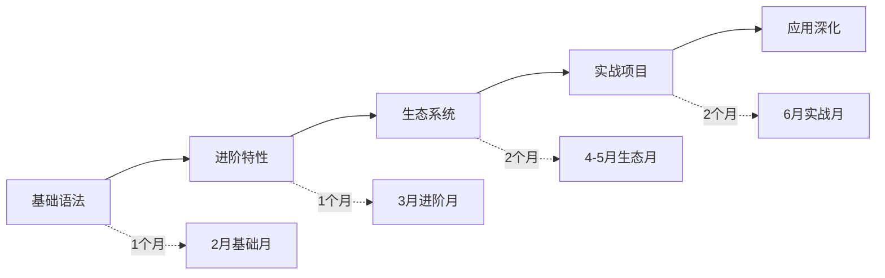
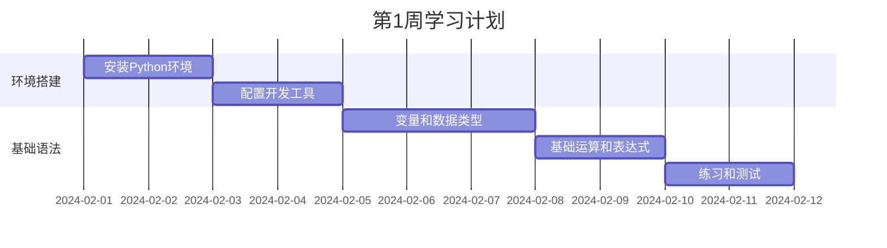

# 🐍 Python学习项目

> 🎯 **项目目标**：6个月内系统学习Python编程，从零基础达到中级开发水平。

## 📋 项目概览

### 项目类型
- **技能提升培训**：系统化Python编程学习
- **时间期限**：6个月（2024年2月1日 - 2024年6月30日）
- **投入时间**：平均每天1-2小时
- **预期成果**：能够独立完成Python开发项目

### 学习路径


## 🎯 里程碑规划

### 🥉 里程碑1：Python基础掌握（第1个月）
**时间**：2026-02-01 至 2026-03-01

**目标**：
- ✅ 掌握Python基础语法和数据类型
- ✅ 熟悉控制流和函数编程
- ✅ 学会模块化和包管理
- ✅ 搭建完整的开发环境

**验收标准**：
- [ ] 通过基础语法测试（90%以上准确率）
- [ ] 完成5个基础编程练习
- [ ] 搭建Python开发环境并熟练使用

### 🥈 里程碑2：Python进阶特性（第2个月）
**时间**：2026-03-01 至 2026-04-01

**目标**：
- ✅ 掌握面向对象编程
- ✅ 理解函数式编程特性
- ✅ 学会异常处理和调试
- ✅ 掌握文件操作和数据处理

**验收标准**：
- [ ] 独立完成一个OOP项目的代码架构设计
- [ ] 掌握至少3个Python高级特性
- [ ] 能够调试和优化基础代码性能

### 🥇 里程碑3：生态系统掌握（第3-4个月）
**时间**：2026-04-01 至 2026-05-01

**目标**：
- ✅ 熟悉数据分析库（NumPy, Pandas）
- ✅ 掌握Web开发框架（Flask或Django基础）
- ✅ 了解AI/ML基础库（TensorFlow入门）
- ✅ 学会API集成和数据处理

**验收标准**：
- [ ] 完成一个小型数据分析项目
- [ ] 开发一个简单的Web应用
- [ ] 集成第三方API获取和处理数据

### 🏆 里程碑4：综合实战应用（第5-6个月）
**时间**：2026-05-01 至 2026-06-30

**目标**：
- ✅ 完成一个中等复杂度的完整项目
- ✅ 掌握代码优化和性能调优
- ✅ 学会项目打包和部署
- ✅ 建立个人技术博客和学习社区参与

**验收标准**：
- [ ] 项目代码质量达到生产环境标准
- [ ] 项目部署到线上并可公开访问
- [ ] 通过项目掌握至少2个专业方向技能

## 📚 详细学习计划

### 第1阶段：Python基础（2月）

#### 第1周：环境搭建和基础语法


**每日任务**：
| 日期 | 学习内容 | 练习任务 | 预期成果 |
|------|----------|----------|----------|
| 2/1 | Python安装和环境配置 | 搭建开发环境 | 安装完成环境 |
| 2/2 | VS Code/PyCharm配置 | 编辑器插件配置 | 完整开发环境 |
| 2/3 | 变量和数据类型基础 | 编写简单程序 | 掌握数据类型 |
| 2/4 | 数字运算和字符串操作 | 练习计算题 | 基础运算能力 |
| 2-5 | 容器类型学习 | 数据结构练习 | 掌握list/tuple/set |
| 2-6 | 周末复习 | 综合练习 | 基础知识巩固 |

#### 第2周：控制流和函数
**重点内容**：
- 条件语句和循环
- 函数定义和调用
- 作用域和闭包基础
- 递归和迭代概念

#### 第3周：模块化和包管理
**重点内容**：
- 模块导入和使用
- 包管理工具（pip/conda）
- 虚拟环境管理
- 项目结构组织

#### 第4周：文件操作和异常处理
**重点内容**：
- 文件读写操作
- 异常处理机制
- 标准库常用模块
- 调试技巧和工具

### 第2阶段：Python进阶（3月）

#### 第5周：面向对象编程基础
**重点内容**：
- 类和对象概念
- 属性和方法
- 继承和多态
- 魔术方法

#### 第6周：面向对象进阶
**重点内容**：
- 私有属性和封装
- 抽象类和接口
- 设计模式简介
- 类方法和静态方法

#### 第7周：函数式编程特性
**重点内容**：
- 高阶函数
- Lambda函数和闭包
- 装饰器基础
- 迭代器和生成器

#### 第8周：异步编程入门
**重点内容**：
- async/await语法
- 异步I/O操作
- 并发编程概念
- 性能对比分析

### 第3-4阶段：生态系统和实战（4月-5月）

#### 数据分析方向
- **第9-10周**：NumPy和Pandas
- **第11周**：Matplotlib可视化
- **第12周**：数据分析项目

#### Web开发方向  
- **第9周**：Flask基础
- **第10周**：数据库集成
- **第11周**：前端模板和静态文件
- **第12周**：Web应用项目

### 第5-6阶段：实战应用（6月）

#### 项目选择（二选一）
**数据分析项目**：
- 数据获取和清洗
- 探索性数据分析
- 可视化和报告生成
- 预测模型初步

**Web开发项目**：
- REST API设计
- 数据库设计和操作
- 用户认证和授权
- 部署和上线

## 🛠️ 开发工具链

### 开发环境
```python
tools_config = {
    "editor": "VS Code",
    "extensions": [
        "Python",
        "Python Docstring Generator", 
        "Python Extended",
        "Live Share",
        "Bookmarks"
    ],
    "linter_formatter": [
        "pylint",
        "black", 
        "isort",
        "autopep8"
    ],
    "debugger": "Python Debugger for VS Code"
}
```

### 版本控制
```bash
# Git配置和管理
git init project_name
git add .
git commit -m "Initial commit"
git remote add origin origin_url
git push -u origin main
```

### 虚拟环境管理
```bash
# 基础虚拟环境
python -m venv venv
source venv/bin/activate  # Linux/Mac
# venv\Scripts\activate    # Windows

# 使用Poetry管理项目
pip install poetry
poetry init
poetry add requests
poetry install
poetry shell
```

## 📊 学习进度追踪

### 知识点检查清单

### Python基础
- [x] 变量和数据类型
- [x] 运算符和表达式  
- [x] 字符串处理
- [x] 控制流语句
- [x] 函数定义和调用
- [x] 模块和包管理
- [ ] 文件操作和异常处理

### 面向对象编程
- [ ] 类和对象概念
- [ ] 属性和方法定义
- [ ] 继承和多态
- [ ] 封装和私有属性
- [ ] 抽象类和接口
- [ ] 魔术方法

### 数据分析
- [ ] NumPy基础操作
- [ ] Pandas数据处理
- [ ] Matplotlib可视化
- [ ] 数据清洗和转换
- [ ] 统计分析基础

### Web开发
- [ ] HTTP协议基础
- [ ] Flask框架入门
- [ ] 路由和视图函数
- [ ] 模板和静态文件
- [ ] 数据库操作
- [ ] 用户认证

### 技进阶
- [ ] 性能优化技巧
- [ ] 内存管理
- [ ] 并发编程基础
- [ ] 网络编程
- [ ] 测试和调试

### 代码质量评估
```python
def evaluate_code_quality():
    metrics = {
        "readability": 0.8,      # 代码可读性
        "maintainability": 0.7,  # 可维护性  
        "test_coverage": 0.6,    # 测试覆盖率
        "performance": 0.7,      # 性能评分
        "documentation": 0.8     # 文档完整性
    }
    return sum(metrics.values()) / len(metrics)

print(f"当前代码质量评分: {evaluate_code_quality():.2f}/1.0")
```

## 🎯 实践项目计划

### 项目1：个人财务管理工具
**功能**：收入支出记录、预算管理、报表生成

**技术栈**：
- 数据存储：SQLite数据库
- 数据处理：Pandas
- 数据可视化：Matplotlib
- 用户界面：终端/命令行

**学习价值**：
- 综合应用Python基础知识
- 数据处理和分析实践
- 项目架构设计经验

### 项目2：简单Web爬虫
**功能**：网站数据抓取、数据清洗、数据存储

**技术栈**：
- 网络请求：Requests
- HTML解析：BeautifulSoup
- 数据存储：CSV/JSON/数据库
- 调度执行：APScheduler

**学习价值**：
- 网络编程基础
- 并发编程概念
- 数据处理流程

### 项目3：API客户端开发
**功能**：第三方服务集成、数据处理自动化、报表生成

**技术栈**：
- API调用：Requests
- 数据处理：Pandas
- 数据可视化：Plotly
- 部署：Docker（可选）

**学习价值**：
- API设计和使用
- 数据集成能力
- 现代化开发实践

## 📚 学习资源

### 必读文档
- [Python官方文档](https://docs.python.org/3/)（权威参考）
- [PEP 8风格指南](https://peps.python.org/pep-0008/)（代码风格）
- [Python教程](https://docs.python.org/zh-cn/3/tutorial/)（官方教程）

### 推荐书籍
- 《Python编程：从入门到实践》- 入门首选
- 《流畅的Python》- 进阶必读
- 《Python Cookbook》- 实用技巧集

### 在线资源
- [Real Python](https://realpython.com/) - 高质量教程
- [Python Weekly](https://www.pythonweekly.com/) - 周刊资讯
- [HackerRank Python](https://www.hackerrank.com/domains/python) - 编程练习

### 练习平台
- [LeetCode](https://leetcode.com/) - 算法练习
- [Codewars](https://www.codewars.com/) - 技能挑战
- [Pycheck](https://py.checkio.org/) - 游戏化学习

## 🔄 时间管理

### 每日学习计划
```python
daily_schedule = {
    "早晨（30分钟）": {
        "内容": "理论学习 - 阅读教程、文档",
        "时间": "07:00-07:30"
    },
    "晚上（45分钟）": {
        "内容": "实践编写 - 练习、小项目",
        "时间": "20:00-20:45"
    },
    "周末（2-3小时）": {
        "内容": "深度学习 - 专题研究、项目开发",
        "时间": "周六日灵活安排"
    }
}
```

### 学习节奏调整
```python
def adjust_learning_rhythm(week_number):
    if week_number <= 4:
        return "基础阶段：注重概念理解和基础练习"
    elif week_number <= 8:
        return "进阶阶段：加强项目实践和深度思考"
    elif week_number <= 12:
        return "应用阶段：专注特定方向的项目开发"
    else:
        return "巩固阶段：代码优化和最佳实践"
```

## 🤝 社区参与

### 技术社区
- **Stack Overflow**：提问和回答技术问题
- **Reddit r/python**：参与讨论和资源分享
- **GitHub**：关注优秀项目，学习代码风格
- **本地Python用户组**：线下学习和交流

### 知识分享
- **技术博客**：每周写一篇学习总结
- **代码开源**：将练习代码发布到GitHub
- **在线讨论**：参与Python技术论坛讨论

## 🎯 成功标准

### 技术能力指标
- ✅ **语法掌握**：95%以上基础语法准确应用
- **代码质量**：通过linter检查，符合PEP 8规范
- **问题解决**：能够独立分析和解决中等复杂度问题
- **项目经验**：完成1-2个完整的Python项目

### 学习效率指标
- ✅ **时间投入**：平均每天学习60分钟以上
- ✅ **实践比例**：理论学习与实践时间比3:7
- ✅ **知识输出**：每周输出1篇技术学习总结
- ✅ **社区参与**：每月参与2-3次技术社区讨论

### 项目成果指标
- ✅ **代码行数**：累计编写有效代码5000行以上
- ✅ **项目数量**：完成至少3个不同类型的项目
- ✅ **技术深度**：掌握1-2个专业方向的深入技能
- ✅ **代码质量**：项目代码达到可生产环境标准

## 🧪 测试与评估

### 技能测试
```python
def skill_assessment_test():
    """Python技能评估测试"""
    tests = [
        "basic_syntax",        # 基础语法测试
        "data_structures",    # 数据结构测试  
        "oop_concepts",       # 面向对象测试
        "problem_solving",    # 问题解决测试
        "code_quality"         # 代码质量测试
    ]
    
    results = {}
    for test in tests:
        score = run_assessment(test)  # 0-100分
        results[test] = score
    
    return results

# 每月底进行技能评估
monthly_assessment = skill_assessment_test()
```

### 项目评估标准
每个项目完成后，从以下维度评估：

| 维度 | 评分标准 | 说明 |
|------|----------|------|
| 功能完整性 | 0-100分 | 是否实现所有需求功能 |
| 代码质量 | 0-100分 | 代码规范性、可读性 |
| 技术复杂度 | 0-100分 | 技术难度和实现复杂度 |
| 学习收获 | 0-100分 | 通过项目学到的技能 |
| 项目完整性 | 0-100分 | 从设计到部署的完整度 |

## 📝 反思日志

### 每周反思要点
```markdown
# 第X周学习反思

## 主要成就
- 
- 
- 

## 困难点
- 
- 
- 

## 解决方案
- 
- 
- 

## 下周计划
- 
- 
- 

## 学习心得
```

### 月度总结
```markdown
# 2026年X月学习总结

## 目标完成情况
- ✅ 已完成
- 🔄 进行中  
- ❌ 未完成

## 具体成就
- 
- 
- 

## 技能提升
- 
- 
- 

## 经验教训
- 
- 
- 

## 下月调整计划
- 
- 
- 
```

## 🎉 项目成果预期

### 6个月后达到的水平
- **编程技能**：能够独立开发中等复杂度的Python应用
- **项目管理**：具备完整的项目规划和执行能力
- **技术视野**：了解Python生态系统的主流工具和框架
- **学习能力**：建立有效的Python学习和实践方法

### 长期发展路径
- **7-12个月**：深入特定应用领域专业化
- **1-2年**：成为Python某领域的专业开发者
- **2-3年**：具备技术领导和架构设计能力
- **长期**：成为Python技术专家和社区贡献者

## 🔗 相关资源

### 学习资源
- [[Python知识库导航]] - 完整学习资源体系
- [[Python安装与环境配置]] - 开发环境指南
- [[基础语法与数据类型]] - 核心语法知识
- [[面向对象编程]] - OOP编程范式

### 项目资源
- [[个人财务管理工具]] - 项目详细设计
- [[Web爬虫开发指南]] - 爬虫技术要点
- [[API客户端开发]] - 集成技术实践

### 学习社区
- [Python官方社区](https://www.python.org/community/)
- [PyPI包索引](https://pypi.org/)
- [Python Reddit](https://www.reddit.com/r/python/)
- [Stack Overflow Python标签](https://stackoverflow.com/questions/tagged/python)

---
*创建时间: 2026-02-01*  
*更新时间: 2026-02-01*  
*分类: 1 Projects*