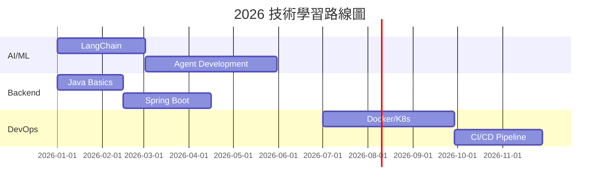

---
aliases:
  - 學習
  - Learning
para: areas
subtopic: 2 areas
---

# 05-Learning / 持續學習

> [!info] 區域定義
> 持續學習相關的責任領域，包含技術學習、方法論、資源管理等。
> Continuous learning area covering tech learning, methodologies, and resources.

---

## 📊 區域概覽

### 技術領域統計

| 領域 Domain | 狀態 Status | 筆記數 Notes |
|------------|------------|-------------|
| **🤖 AI-ML** | 🟡 進行中 | 1 |
| **🐍 Python 開發** | 🟢 熟悉中 | 1 |
| **☕ 後端開發** | 🟡 學習中 | 1 |
| **⚙️ DevOps** | 🔴 待開始 | 1 |

### 學習進度總覽

```dataview
TABLE
  file.link AS 筆記,
  status AS 狀態,
  priority AS 優先級
FROM "2 Areas/05-Learning"
WHERE file.name != "05-Learning"
SORT priority DESC
```

---

## 🗂️ 技術領域導覽

### 🤖 AI-ML 領域

> [[2 Areas/05-Learning/AI-ML 領域.md|查看完整筆記 →]]

**核心技術**：
- Machine Learning 基礎
- LangChain 框架
- Agent 開發
- RAG 知識庫

**2026 Q1-Q2 目標**：
- [ ] LangChain 核心概念掌握
- [ ] 構建 Multi-Agent 系統
- [ ] RAG 知識庫實現

**進度**：🟡 40%

---

### 🐍 Python 開發

> [[2 Areas/05-Learning/Python开发领域.md|查看完整筆記 →]]

**核心技能**：
- 語法精通
- 面向對象編程
- 數據處理與分析
- AI/ML 應用

**當前水平**：🟡 熟悉 → 目標：🟢 精通

**重點方向**：
- [ ] 高級特性（裝飾器、元類）
- [ ] 異步編程
- [ ] 數據科學工具

---

### ☕ 後端開發

> [[2 Areas/05-Learning/後端開發.md|查看完整筆記 →]]

**技術棧**：
- Java 基礎 → Spring Boot
- RESTful API 設計
- 數據庫設計

**學習路徑**：
```
Java Basics → OOP → Collections → Spring Boot → Microservices
```

**當前進度**：
- ✅ Java 環境搭建
- ✅ 基礎語法
- 🟡 集合框架（進行中）
- ⚪ Spring Boot（待開始）

---

### ⚙️ DevOps 運維

> [[2 Areas/05-Learning/DevOps 運維.md|查看完整筆記 →]]

**核心內容**：
- Docker 容器化
- Kubernetes 編排
- CI/CD 流水線
- 雲原生技術

**2026 Q3-Q4 計劃**：
| 階段 | 主題 | 目標 |
|------|------|------|
| Q3 | Docker | 容器化部署 |
| Q4 | K8s | 集群管理 |

**當前水平**：🔴 初學

---

## 🎯 年度學習目標

### 2026 主題：AI Agent 開發與系統設計



### 季度目標

| 季度 | 主題 | 核心目標 |
|------|------|---------|
| Q1 | Python + AI | LangChain 基礎、Agent 入門 |
| Q2 | Backend | Spring Boot 實踐項目 |
| Q3 | DevOps | Docker/K8s 部署上線 |
| Q4 | 深度專項 | Multi-Agent 系統完成 |

---

## 📚 學習資源

### 核心筆記

- [[2 Areas/05-Learning/持續學習.md|持續學習]] - 學習方法論與計劃
- [[2 Areas/05-Learning/技術學習.md|技術學習]] - 技術學習總覽

### 學習方法

| 方法 | 說明 | 應用 |
|------|------|------|
| **PDCA 循環** | 計劃→執行→檢查→改進 | 項目管理 |
| **費曼學習法** | 用簡單語言教學 | 概念理解 |
| **間隔重複** | 科學複習間隔 | 長期記憶 |
| **刻意練習** | 針對性高強度訓練 | 技能提升 |

### 外部資源

**官方文檔**：
- [Python Docs](https://docs.python.org/3/)
- [LangChain](https://python.langchain.com/)
- [Spring Boot](https://spring.io/projects/spring-boot)
- [Kubernetes](https://kubernetes.io/docs/)

**學習平台**：
- [Coursera](https://www.coursera.org/)
- [Udemy](https://www.udemy.com/)
- [GitHub Learning Lab](https://lab.github.com/)

---

## ✅ 定期檢查清單

### 每日

- [ ] 技術閱讀 30 分鐘
- [ ] 代碼實踐 1 小時
- [ ] 記錄學習筆記

### 每週

- [ ] 複習本週學習內容
- [ ] 實踐項目進展
- [ ] 技術文章閱讀 5 篇

### 每月

- [ ] 評估學習進度
- [ ] 調整學習計劃
- [ ] 輸出學習成果（博客/筆記）

---

## 📈 進度追蹤

### 技能評估矩陣

```python
skills_matrix = {
    "Python":    {"level": "intermediate", "score": 0.7},
    "AI/ML":     {"level": "beginner",     "score": 0.4},
    "Backend":   {"level": "beginner",     "score": 0.3},
    "DevOps":    {"level": "beginner",     "score": 0.2}
}
```

### 時間分配

| 領域 | 每週時間 | 比例 |
|------|---------|------|
| AI/ML | 10h | 40% |
| 後端開發 | 6h | 25% |
| 系統設計 | 5h | 20% |
| DevOps | 4h | 15% |

---

## 🔗 相關連結

### 相關區域

- [[2 Areas/02-Career/02-Career.md|02-Career 職業發展]] - 技能提升規劃
- [[5 Zettels|Zettels]] - 知識卡片系統

### 相關資源

```dataview
LIST
FROM "3 Resources"
WHERE contains(tags, "learning") OR contains(tags, "tech")
SORT file.mtime DESC
LIMIT 10
```

---

## 📌 注意事項

> [!tip] 學習原則
> - **主動學習**：提問、實踐、輸出
> - **深度工作**：90 分鐘專注 + 15 分鐘休息
> - **項目驅動**：以實際項目帶動學習

> [!warning] 待處理
> - 持續學習筆記存在格式問題，需清理孤立標籤
> - Python 開發領域筆記格式需優化

---

## 📅 更新日誌

| 日期 | 更新內容 |
|------|----------|
| 2026-05-26 | 優化入口頁面結構 |

---

*分類: 2 Areas/05-Learning*
*語言: 繁體中文為主，術語使用英文*
