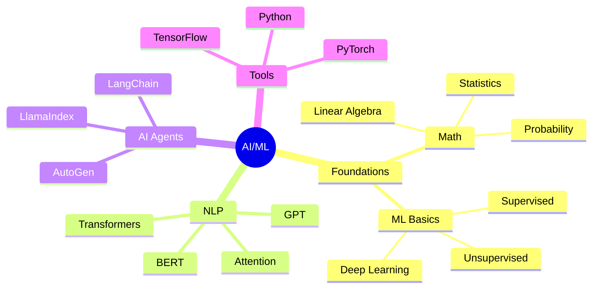

# AI-ML 領域 Artificial Intelligence & Machine Learning

> AI 與 Machine Learning 是當前最具發展潛力的技術領域。
> AI and Machine Learning are the most promising technology fields today.

---

## 📋 目錄 Table of Contents

- [[AI-ML-Overview|領域總覽]]
- [[AI-ML-Foundations|基礎概念]]
- [[AI-ML-LangChain|LangChain 學習]]
- [[AI-ML-Agents|Agent 開發]]
- [[AI-ML-Practice|實踐項目]]

---

## 🎯 學習目標 Learning Goals

### 2026 Q1-Q2 目標

| 階段 Phase | 主題 Topic | 目標 Goal |
|-----------|-----------|----------|
| Q1 | LangChain Basics | 掌握核心概念 |
| Q1 | RAG 應用 | 構建知識庫 |
| Q2 | Multi-Agent | 多代理系統 |
| Q2 | Agent Memory | 記憶機制 |

### 技能樹 Skill Tree



---

## 📚 核心內容 Core Content

### 1. 基礎概念 Foundations

**必備知識 Required Knowledge**:
- [ ] 線性代數 Linear Algebra
- [ ] 概率論 Probability
- [ ] 統計學 Statistics
- [ ] 機器學習基礎 ML Basics

**學習資源 Learning Resources**:
- [[Machine Learning 基礎]]
- [[深度學習導論]]

### 2. LangChain 學習

**核心模塊 Core Modules**:
- Chains 鏈
- Agents 代理
- Memory 記憶
- Embeddings 嵌入
- Vector Stores 向量存儲
- Callbacks 回調

**相關筆記 Related Notes**:
- [[LangChain-Getting-Started]]
- [[LangChain-Chains]]
- [[LangChain-Agents]]
- [[LangChain-Memory]]
- [[LangChain-RAG]]

### 3. Agent 開發 Agent Development

**核心概念 Core Concepts**:
- Tool Use 工具使用
- Planning 規劃
- Reasoning 推理
- Memory 記憶
- Reflection 反思

**實踐項目 Practice Projects**:
- [ ] 單一 Agent 系統
- [ ] 多 Agent 協作
- [ ] RAG 增強系統

### 4. 實踐項目 Projects

| 項目 Project | 描述 Description | 狀態 Status |
|-------------|------------------|-------------|
| AI Assistant | LangChain + OpenAI | ✅ 完成 |
| Multi-Agent System | 多代理協作 | 🔄 進行中 |
| RAG Knowledge Base | 知識庫系統 | 📋 計劃中 |

---

## 📖 學習筆記 Learning Notes

### 重要概念 Key Concepts

| 概念 Concept | 說明 Description | 筆記 Link |
|-------------|------------------|----------|
| Transformer | 自注意力機制 | [[Transformer]] |
| RAG | 檢索增強生成 | [[RAG]] |
| Fine-tuning | 微調技術 | [[Fine-tuning]] |
| Prompt Engineering | 提示工程 | [[Prompt-Engineering]] |

### 技術棧 Tech Stack

```python
# AI/ML 技術棧
ai_ml_stack = {
    "languages": ["Python"],
    "frameworks": ["LangChain", "LlamaIndex", "AutoGen"],
    "llms": ["OpenAI", "Claude", "Gemini", "Local Models"],
    "vector_db": ["Chroma", "Pinecone", "Weaviate"],
    "embedding": ["OpenAI Embeddings", "Sentence Transformers"]
}
```

---

## 🔗 相關連結 Related Links

### 內部 Internal

- [[技術學習]] - 技術學習總覽
- [[Python 開發]] - Python 開發技術
- [[持續學習]] - 學習方法論

### 外部 External

- [LangChain Documentation](https://python.langchain.com/)
- [LangChain GitHub](https://github.com/langchain-ai/langchain)
- [Hugging Face](https://huggingface.co/)

---

## 📝 筆記模板 Note Template

### 概念筆記 Concept Note

```markdown
---
title: [概念名稱]
tags: [ai/ml/, concept/]
status: 
---

# [概念名稱] Concept Name

## 定義 Definition
> 一句話說明 Brief definition

## 詳細說明 Detailed Explanation

### 原理 Principle
### 應用场景 Use Cases
### 優勢 Advantages
### 局限性 Limitations

## 代碼範例 Code Example

```python
# Example code
```

## 相關概念 Related Concepts

## 參考資料 References
```

---

## 🏆 成就 Achievements

### 已完成 Completed

- [ ] Python AI 基礎
- [ ] LangChain 基礎
- [ ] 1 個 AI 助手項目

### 進行中 In Progress

- [ ] Multi-Agent 系統開發

---

## 更新日誌 Update Log

### 2026-02-16
- ✅ 創建 AI-ML 領域索引

---

*分類: 2 Areas/05-Learning/AI-ML*
*語言: 繁體中文為主，術語使用英文*
