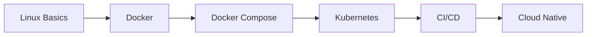
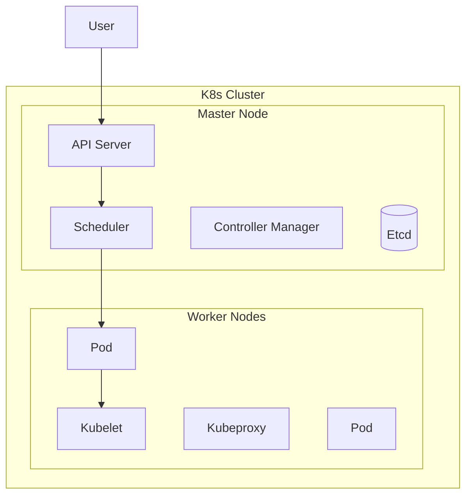

# DevOps 運維 DevOps & Cloud

> DevOps 是開發與運維的融合，強調自動化、協作與持續交付。
> DevOps is the fusion of development and operations, emphasizing automation, collaboration, and continuous delivery.

---

## 📋 目錄 Table of Contents

- [[DevOps-Overview|領域總覽]]
- [[DevOps-Docker|Docker 容器化]]
- [[DevOps-K8s|Kubernetes]]
- [[DevOps-CICD|CI/CD]]
- [[DevOps-Cloud|雲原生技術]]

---

## 🎯 學習目標 Learning Goals

### 2026 Q3-Q4 目標

| 階段 Phase | 主題 Topic | 目標 Goal |
|-----------|-----------|----------|
| Q3 | Docker | 容器化部署 |
| Q3 | Docker Compose | 多容器編排 |
| Q4 | Kubernetes | 集群管理 |
| Q4 | CI/CD | 自動化流水線 |

### 學習路徑 Learning Path



---

## 📚 核心內容 Core Content

### 1. Docker 容器化

**核心概念 Core Concepts**:
- Image 鏡像
- Container 容器
- Volume 卷
- Network 網絡
- Dockerfile

**常用命令 Commands**:
```bash
# 基本操作
docker build -t image-name .
docker run -d -p 8080:80 image-name
docker ps -a
docker logs container-id
docker exec -it container-id bash

# 鏡像管理
docker images
docker rmi image-id
docker pull image-name

# 容器管理
docker start/stop/restart container-id
docker rm container-id
```

### 2. Kubernetes (K8s)

**核心概念 Core Concepts**:
- Pod
- Deployment
- Service
- Ingress
- ConfigMap/Secret
- StatefulSet
- DaemonSet

**架構 Architecture**:


### 3. CI/CD 流水線

**工具 Tools**:
- Jenkins
- GitHub Actions
- GitLab CI
- ArgoCD

**流水線階段 Pipeline Stages**:
1. Build 構建
2. Test 測試
3. Security Scan 安全掃描
4. Deploy 部署

### 4. 雲原生技術 Cloud Native

**主要平台 Platforms**:
- AWS
- GCP
- Azure
- 阿里雲

**核心服務 Core Services**:
- Compute 計算
- Storage 存儲
- Network 網絡
- Database 數據庫

---

## 📖 學習筆記 Learning Notes

### 技能評估 Skills Assessment

| 技能 Skill | 當前等級 Level | 目標等級 Target |
|-----------|---------------|----------------|
| Linux | 🟡 熟悉 | 🟢 精通 |
| Docker | 🟠 了解 | 🟡 熟悉 |
| K8s | 🔴 初學 | 🟠 了解 |
| CI/CD | 🔴 初學 | 🟠 了解 |
| Cloud | 🔴 初學 | 🟠 了解 |

### 技術棧 Tech Stack

```python
devops_stack = {
    "containerization": ["Docker", "Podman"],
    "orchestration": ["Kubernetes", "Docker Compose"],
    "ci_cd": ["GitHub Actions", "Jenkins", "ArgoCD"],
    "cloud": ["AWS", "GCP", "Azure"],
    "monitoring": ["Prometheus", "Grafana", "ELK"],
    "infrastructure": ["Terraform", "Ansible"]
}
```

---

## 🔗 相關連結 Related Links

### 內部 Internal

- [[技術學習]] - 技術學習總覽
- [[系統架構]] - 系統設計

### 外部 External

- [Docker Documentation](https://docs.docker.com/)
- [Kubernetes Documentation](https://kubernetes.io/docs/)
- [GitHub Actions Documentation](https://docs.github.com/en/actions)

---

## 📝 筆記模板 Note Template

### 運維筆記 Operations Note

```markdown
---
title: [主題]
tags: [devops/, topic/]
status: 
---

# [標題] Title

## 概述 Overview
> 簡要說明

## 環境 Environment
- OS:
- Version:

## 配置 Configuration

```yaml
# Configuration example
```

## 命令 Commands

```bash
# Commands
```

## 故障排查 Troubleshooting

### 問題 Problem
### 解決方案 Solution

## 參考資料 References
```

---

## 🏆 成就 Achievements

### 待開始 To Start

- [ ] Docker 基礎學習
- [ ] K8s 入門

---

## 更新日誌 Update Log

### 2026-02-16
- ✅ 創建 DevOps 領域索引

---

*分類: 2 Areas/05-Learning/DevOps*
*語言: 繁體中文為主，術語使用英文*
