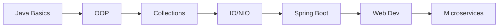

# 後端開發 Backend Development

> 後端開發是構建現代應用系統的核心技術。
> Backend development is the core technology for building modern application systems.

---

## 📋 目錄 Table of Contents

- [[Backend-Overview|領域總覽]]
- [[Backend-Java|Java 開發]]
- [[Backend-SpringBoot|Spring Boot]]
- [[Backend-Database|數據庫設計]]
- [[Backend-API|RESTful API]]

---

## 🎯 學習目標 Learning Goals

### 2026 Q1-Q2 目標

| 階段 Phase | 主題 Topic | 目標 Goal |
|-----------|-----------|----------|
| Q1 | Java Basics | 掌握語法 |
| Q1 | OOP 編程 | 面向對象 |
| Q2 | Spring Boot | 快速開發 |
| Q2 | RESTful API | 接口設計 |

### 學習路徑 Learning Path



---

## 📚 核心內容 Core Content

### 1. Java 開發 Java Development

**基礎語法 Syntax**:
- [x] 環境搭建 Environment Setup
- [x] 基礎語法 Basic Syntax
- [x] 數據類型 Data Types
- [x] 控制流 Control Flow
- [ ] 函數 Methods

**進階特性 Advanced Features**:
- [ ] 泛型 Generics
- [ ] 集合框架 Collections
- [ ] 多線程 Multithreading
- [ ] IO/NIO
- [ ] Lambda 表達式
- [ ] Stream API

### 2. Spring Boot

**核心概念 Core Concepts**:
- IoC/DI 容器
- AOP 面向切面
- 事務管理 Transaction
- MVC 架構

**常用模塊 Modules**:
- Spring Web
- Spring Data JPA
- Spring Security
- Spring Boot Test

### 3. RESTful API 設計

**設計原則 Principles**:
- 資源導向 Resource-oriented
- 統一接口 Uniform Interface
- 無狀態 Stateless
- 分層系統 Layered System

**最佳實踐 Best Practices**:
```java
// RESTful API 示例
@RestController
@RequestMapping("/api/users")
public class UserController {
    
    @GetMapping
    public List<User> getAllUsers() { ... }
    
    @GetMapping("/{id}")
    public User getUserById(@PathVariable Long id) { ... }
    
    @PostMapping
    public ResponseEntity<User> createUser(@RequestBody User user) { ... }
    
    @PutMapping("/{id}")
    public ResponseEntity<User> updateUser(@PathVariable Long id, @RequestBody User user) { ... }
    
    @DeleteMapping("/{id}")
    public ResponseEntity<Void> deleteUser(@PathVariable Long id) { ... }
}
```

### 4. 數據庫設計 Database Design

**必備知識 Knowledge**:
- [ ] SQL 基礎
- [ ] 數據庫範式 Normalization
- [ ] 索引優化 Indexing
- [ ] 事務隔離 Isolation Levels

---

## 📖 學習筆記 Learning Notes

### 技能評估 Skills Assessment

| 技能 Skill | 當前等級 Level | 目標等級 Target |
|-----------|---------------|----------------|
| Java Basic | 🟡 熟悉 | 🟢 精通 |
| OOP | 🟡 熟悉 | 🟢 精通 |
| Collections | 🟠 了解 | 🟡 熟悉 |
| Spring Boot | 🔴 初學 | 🟠 了解 |
| RESTful API | 🔴 初學 | 🟡 熟悉 |

### 技術棧 Tech Stack

```python
backend_stack = {
    "languages": ["Java", "Python"],
    "frameworks": ["Spring Boot", "FastAPI"],
    "databases": ["PostgreSQL", "MySQL", "Redis"],
    "orms": ["JPA/Hibernate", "SQLAlchemy"],
    "tools": ["Maven", "Gradle", "Docker"]
}
```

---

## 🔗 相關連結 Related Links

### 內部 Internal

- [[技術學習]] - 技術學習總覽
- [[Python 開發]] - Python 開發技術

### 外部 External

- [Java SE Documentation](https://docs.oracle.com/javase/)
- [Spring Boot Documentation](https://spring.io/projects/spring-boot)
- [RESTful API Design Best Practices](https://restfulapi.net/)

---

## 📝 筆記模板 Note Template

### 技術筆記 Technical Note

```markdown
---
title: [技術主題]
tags: [backend/, topic/]
status: 
---

# [標題] Title

## 概述 Overview
> 簡要說明 Brief description

## 詳細內容 Detailed Content

### 語法 Syntax
```java
// Code example
```

### 使用場景 Use Cases
### 注意事項 Considerations

## 範例 Examples

## 相關資源 Related Resources
```

---

## 🏆 成就 Achievements

### 已完成 Completed

- [x] Java 環境搭建
- [x] Java 基礎語法

### 進行中 In Progress

- [ ] Java 集合框架
- [ ] Spring Boot 入門

---

## 更新日誌 Update Log

### 2026-02-16
- ✅ 創建後端開發領域索引

---

*分類: 2 Areas/05-Learning/後端開發*
*語言: 繁體中文為主，術語使用英文*
