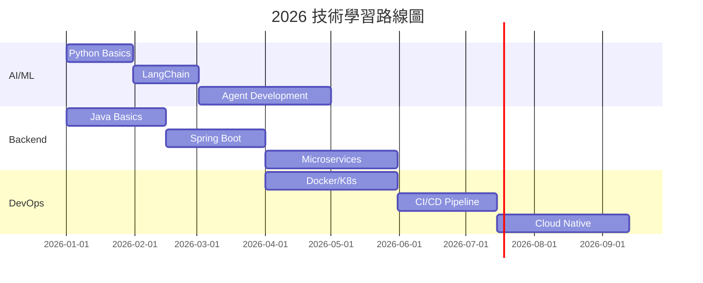

# 技術學習 Tech Learning

> 技術學習是一個持續的過程，需要系統化的方法和不斷的實踐。
> Technology learning is a continuous process that requires systematic approach and constant practice.

---

## 📋 目錄 Table of Contents

### 學習領域 Learning Domains

| 領域 Domain | 描述 Description | 進度 Progress |
|------------|------------------|---------------|
| [[AI-ML 領域]] | AI 與 Machine Learning | 🟡 進行中 |
| [[Python 開發]] | Python 開發技術 | 🟢 精通中 |
| [[後端開發]] | Backend Development | 🟡 進行中 |
| [[系統架構]] | System Architecture | 🟠 學習中 |
| [[DevOps]] | CI/CD, Cloud, K8s | 🔴 待開始 |

### 學習資源 Resources

- [[學習資源庫]] - 書籍、課程、工具
- [[專案實踐]] - 實戰項目記錄
- [[技術筆記]] - 學習筆記整理

---

## 🎯 學習目標 Learning Goals

### 2026 年度目標

| 季度 Quarter | 主題 Topic | 目標 Goal |
|-------------|-----------|----------|
| Q1 | Python + AI Basics | 掌握基礎 |
| Q2 | Backend + System Design | 實踐項目 |
| Q3 | Cloud + DevOps | 部署上線 |
| Q4 | 深度專項 | 專業化 |

### 每月主題 Monthly Themes



---

## 📚 核心領域 Core Domains

### 1. AI-ML 領域

**核心技術 Core Technologies**:
- Machine Learning 基礎
- Deep Learning 深度學習
- NLP 自然語言處理
- Agent 開發

**相關筆記 Related Notes**:
- [[LangChain 學習筆記]]
- [[AI Agent 實踐]]
- [[Python AI 庫]]

### 2. Python 開發

**核心技能 Core Skills**:
- 基礎語法 Syntax
- 面向對象 OOP
- 函數式編程 Functional Programming
- 異步編程 Async

**相關筆記 Related Notes**:
- [[Python 進階特性]]
- [[Python 專案實踐]]

### 3. 後端開發 Backend

**核心領域 Core Areas**:
- Java 開發
- Spring Boot
- RESTful API
- 數據庫設計

**相關筆記 Related Notes**:
- [[Java 學習筆記]]
- [[Spring Boot 實踐]]

### 4. 系統架構 System Architecture

**學習內容 Learning Topics**:
- 分散式系統
- 微服務架構
- 緩存策略
- 消息隊列

### 5. DevOps

**技能清單 Skills**:
- Docker 容器化
- Kubernetes 編排
- CI/CD 流水線
- 雲原生技術

---

## 📈 進度追蹤 Progress Tracking

### 本週進度 This Week

| 日期 Date | 主題 Topic | 時長 Hours | 筆記 Notes |
|----------|-----------|-----------|-----------|
| 週一 | | | |
| 週二 | | | |
| 週三 | | | |
| 週四 | | | |
| 週五 | | | |
| 週末 | | | |

### 技能評估 Skills Assessment

```python
# 技能評估矩陣
skills_matrix = {
    "Python": {
        "level": "intermediate",  # beginner/intermediate/advanced/expert
        "score": 0.7,
        "focus_areas": ["async", "decorators", "metaprogramming"]
    },
    "AI/ML": {
        "level": "beginner",
        "score": 0.4,
        "focus_areas": ["LangChain", "Agent", "RAG"]
    },
    "Backend": {
        "level": "beginner",
        "score": 0.3,
        "focus_areas": ["Java", "Spring Boot", "API Design"]
    },
    "DevOps": {
        "level": "beginner",
        "score": 0.2,
        "focus_areas": ["Docker", "K8s", "CI/CD"]
    }
}
```

---

## 🔗 相關連結 Related Links

### 內部連結 Internal Links

- [[持續學習]] - 學習方法論
- [[Python开发领域]] - Python 技能發展
- [[AI知识库]] - AI 知識整合

### 外部資源 External Resources

- [Python Documentation](https://docs.python.org/3/)
- [Spring Framework](https://spring.io/projects/spring-framework)
- [LangChain Docs](https://python.langchain.com/)
- [Kubernetes Docs](https://kubernetes.io/docs/)

---

## 📝 筆記模板 Note Templates

### 技術筆記模板 Tech Note Template

```markdown
---
title: 
tags: [tech/, language/, concept/]
status: 
created: 
---

# 標題 Title

## 概念 Concept
> 簡要說明 Brief Description

## 重點 Key Points

### 1. 
### 2. 
### 3. 

## 代碼範例 Code Example

```python
# 範例 code
```

## 應用場景 Use Cases

## 相關連結 Related

## 筆記 Notes
```

### 項目筆記模板 Project Note Template

```markdown
---
title: 
tags: [project/, tech-stack/]
status: 
due: 
---

# 項目名稱 Project Name

## 項目目標 Project Goal

## 技術棧 Tech Stack

## 進度 Progress
- [ ] Task 1
- [ ] Task 2

## 記錄 Logs
```

---

## 🏆 成就記錄 Achievements

### 已完成 Completed

| 項目 Project | 技術棧 Tech Stack | 日期 Date |
|-------------|------------------|----------|
| | | |

### 進行中 In Progress

| 項目 Project | 進度 Progress | 預計完成 ETA |
|-------------|---------------|-------------|
| | | |

---

## 更新日誌 Update Log

### 2026-02-16
- ✅ 創建技術學習領域索引
- ✅ 整合現有學習資源
- ✅ 建立進度追蹤框架

---

*分類: 2 Areas/05-Learning*
*語言: 繁體中文為主，術語使用英文*
