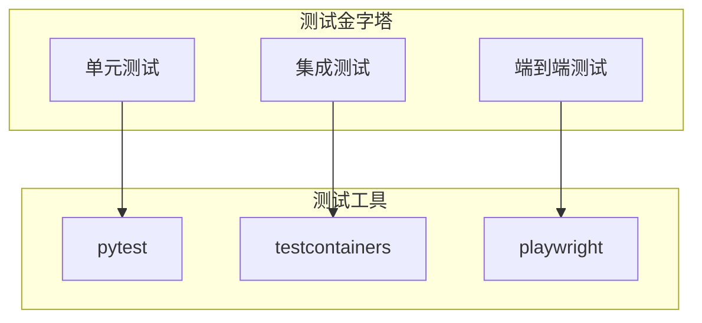

# OpenClaw开发指南

## 快速开始开发环境

### 环境要求

#### 开发工具
```yaml
# 基础环境
python: "3.9+"
node: "16+"
git: "2.30+"
docker: "20.10+"
docker-compose: "2.2+"

# 开发工具
vscode: "推荐"
postman: "API测试"
```

#### 系统依赖
```bash
# Ubuntu/Debian
sudo apt-get update
sudo apt-get install -y python3-dev build-essential libpq-dev

# macOS
brew install postgresql redis python@3.9

# Windows
# 安装Visual Studio Build Tools
# 安装PostgreSQL和Redis
```

### 项目本地搭建

#### 1. 克隆仓库
```bash
# 克隆主仓库
git clone https://github.com/openclaw/openclaw.git
cd openclaw

# 克隆示例插件仓库（可选）
git clone https://github.com/openclaw/plugin-examples.git
```

#### 2. 创建虚拟环境
```bash
# 创建虚拟环境
python3 -m venv venv
source venv/bin/activate  # Linux/macOS
# 或
venv\Scripts\activate     # Windows

# 安装依赖
pip install -r requirements.txt
pip install -r requirements-dev.txt
```

#### 3. 数据库设置
```bash
# 创建数据库
createdb openclaw_dev

# 配置环境变量
cp .env.example .env
# 编辑.env文件设置数据库连接

# 运行数据迁移
alembic upgrade head

# 创建初始数据
python scripts/create_initial_data.py
```

#### 4. 启动开发环境
```bash
# 启动基础服务
docker-compose -f docker-compose.dev.yml up -d

# 启动API服务
export FLASK_ENV=development
export FLASK_DEBUG=1
python run.py

# 启动前端服务（新终端）
cd frontend
npm install
npm run dev
```

## 代码结构与架构

### 项目结构
```
openclaw/
├── core/                   # 核心模块
│   ├── auth/              # 认证授权
│   ├── blockchain/        # 区块链集成
│   ├── cryptos/           # 加密资产
│   ├── database/          # 数据库操作
│   ├── events/            # 事件处理
│   ├── files/             # 文件管理
│   ├── finance/           # 财务管理
│   ├── http/              # HTTP服务
│   ├── kyc/               # KYC处理
│   ├── log/               # 日志管理
│   ├── maintenance/       # 维护模式
│   ├── networks/          # 网络配置
│   ├── payments/          # 支付处理
│   ├── plugins/           # 插件系统
│   ├── restful/           # REST API
│   ├── shell/             # Shell命令
│   ├── testnet_faucets/   # 测试网水龙头
│   ├── trading/           # 交易功能
│   ├── unit_of_account/   # 记账单位
│   ├── users/             # 用户管理
│   ├── utils/             # 工具函数
│   └── wallets/           # 钱包管理
├── cli/                   # 命令行工具
├── docs/                  # 文档
├── frontend/              # 前端应用
├── plugins/               # 插件目录
├── tests/                 # 测试代码
├── tools/                 # 开发工具
└── scripts/              # 脚本工具
```

### 核心模块详解

#### 1. 工作流引擎
```python
# core/workflow/engine.py
class WorkflowEngine:
    """工作流执行引擎"""
    
    def __init__(self, plugin_manager, task_scheduler):
        self.plugin_manager = plugin_manager
        self.task_scheduler = task_scheduler
        self.state_manager = WorkflowStateManager()
    
    async def execute_workflow(self, workflow, inputs):
        """执行工作流"""
        context = ExecutionContext(workflow, inputs)
        
        try:
            # 创建执行记录
            execution = await self.state_manager.create_execution(
                workflow.id, inputs
            )
            
            # 按顺序执行步骤
            for step in workflow.steps:
                result = await self._execute_step(step, context)
                context.add_step_result(step.id, result)
            
            # 完成执行
            await self.state_manager.complete_execution(
                execution.id, context.get_outputs()
            )
            
            return ExecutionResult(
                success=True,
                outputs=context.get_outputs(),
                execution_id=execution.id
            )
            
        except Exception as e:
            # 处理执行错误
            await self._handle_error(e, context)
            raise
```

#### 2. 插件系统
```python
# core/plugins/manager.py
class PluginManager:
    """插件管理器"""
    
    def __init__(self):
        self.registry = PluginRegistry()
        self.loader = PluginLoader()
        self.sandbox = PluginSandbox()
    
    async def load_plugin_from_file(self, plugin_path: str):
        """从文件加载插件"""
        # 验证插件签名
        if not await self._verify_signature(plugin_path):
            raise PluginError("Invalid plugin signature")
        
        # 解析插件信息
        metadata = await self.loader.parse_metadata(plugin_path)
        
        # 创建沙箱环境
        sandbox_context = self.sandbox.create_context(metadata)
        
        # 加载插件代码
        plugin_code = await self.loader.load_code(plugin_path)
        
        # 在沙箱中执行插件代码
        return await self.sandbox.execute(
            plugin_code, 
            context=sandbox_context
        )
    
    async def execute_plugin(self, plugin_id: str, inputs: Dict):
        """执行插件"""
        plugin = await self.get_plugin(plugin_id)
        
        # 验证插件权限
        if not await self._check_permissions(plugin):
            raise PermissionError("Insufficient permissions")
        
        # 执行插件
        return await plugin.execute(inputs)
```

#### 3. 任务调度
```python
# core/tasks/scheduler.py
class TaskScheduler:
    """任务调度器"""
    
    def __init__(self, redis_client, backend):
        self.redis = redis_client
        self.backend = backend
        self.queue = RedisQueue("task_queue")
    
    async def schedule_task(self, task: Task):
        """调度任务"""
        # 验证任务
        if not await self._validate_task(task):
            raise ValueError("Invalid task")
        
        # 添加到队列
        await self.queue.push(task.serialize())
        
        # 触发执行
        await self._trigger_execution()
    
    async def execute_task(self, task_id: str):
        """执行任务"""
        # 获取任务详情
        task = await self._get_task(task_id)
        
        # 获取插件实例
        plugin = await self.plugin_manager.get_plugin(task.plugin_name)
        
        # 执行插件
        result = await plugin.execute(task.inputs)
        
        # 更新任务状态
        await self._update_task_status(task_id, "completed", result)
        
        return result
```

## 开发流程

### 1. 功能开发流程

#### 环境准备
```bash
# 创建功能分支
git checkout -b feature/awesome-feature

# 启动开发服务
make dev-setup

# 运行测试确保环境正常
make test-lint
```

#### 代码开发
```python
# 开发新功能示例
def feature_implementation():
    """功能实现示例"""
    # 1. 定义数据模型
    class NewFeatureModel(BaseModel):
        name: str
        config: Dict[str, Any]
    
    # 2. 实现服务层
    class NewFeatureService:
        async def create_feature(self, data: NewFeatureModel) -> Feature:
            # 业务逻辑实现
            pass
    
    # 3. 实现API端点
    @router.post("/api/v1/features")
    async def create_feature_endpoint(data: NewFeatureModel):
        # API逻辑实现
        pass
```

#### 测试编写
```python
# tests/test_feature.py
import pytest
from openclaw.core.feature import NewFeatureService

class TestNewFeature:
    """新功能测试类"""
    
    @pytest.fixture
    def service(self):
        return NewFeatureService()
    
    async def test_create_feature(self, service):
        """测试创建功能"""
        data = {"name": "test", "config": {}}
        result = await service.create_feature(data)
        
        assert result.name == "test"
        assert result.id is not None
    
    async def test_invalid_data(self, service):
        """测试无效数据处理"""
        invalid_data = {}
        
        with pytest.raises(ValueError):
            await service.create_feature(invalid_data)
```

#### 提交代码
```bash
# 代码格式化
make format
make lint

# 运行测试
make test-unit
make test-integration

# 提交代码
git add .
git commit -m "feat: add awesome feature"

# 推送分支
git push origin feature/awesome-feature
```

### 2. 插件开发流程

#### 创建插件项目
```bash
# 使用CLI工具创建插件
openclaw create-plugin my-plugin --template basic

# 插件项目结构
my-plugin/
├── src/
│   └── my_plugin/
│       ├── __init__.py
│       ├── plugin.py      # 主插件文件
│       └── models.py      # 数据模型
├── tests/
│   └── test_plugin.py
├── README.md
├── setup.py
└── openclaw.yaml
```

#### 插件实现
```python
# src/my_plugin/plugin.py
from openclaw.plugins import BasePlugin, PluginMetadata

class MyPlugin(BasePlugin):
    """我的自定义插件"""
    
    metadata = PluginMetadata(
        name="my-plugin",
        version="1.0.0",
        description="自定义插件示例",
        category="custom",
        tags=["example", "custom"]
    )
    
    async def execute(self, inputs: Dict, context: ExecutionContext) -> Dict:
        """执行插件逻辑"""
        # 验证输入
        self._validate_inputs(inputs)
        
        # 执行业务逻辑
        result = await self._process_inputs(inputs)
        
        return result
    
    async def _process_inputs(self, inputs: Dict) -> Dict:
        """处理输入数据"""
        # 实现具体业务逻辑
        processed_data = {}
        for key, value in inputs.items():
            processed_data[key] = self._transform_value(value)
        
        return {"processed_data": processed_data}
    
    def _transform_value(self, value):
        """转换数据值"""
        return value.upper() if isinstance(value, str) else value
```

#### 插件测试
```python
# tests/test_plugin.py
import pytest
from openclaw_sdk.testing import PluginTestHarness
from src.my_plugin.plugin import MyPlugin

class TestMyPlugin:
    """插件测试类"""
    
    @pytest.fixture
    def plugin(self):
        config = {"setting1": "value1"}
        return MyPlugin(config)
    
    async def test_basic_execution(self, plugin):
        """测试基本执行"""
        inputs = {"text": "hello"}
        context = PluginTestHarness().create_mock_context()
        
        result = await plugin.execute(inputs, context)
        
        assert "processed_data" in result
        assert result["processed_data"]["text"] == "HELLO"
    
    async def test_error_handling(self, plugin):
        """测试错误处理"""
        invalid_inputs = {}  # 空输入
        
        with pytest.raises(ValidationError):
            await plugin.execute(invalid_inputs, None)
```

#### 插件发布
```bash
# 构建插件包
openclaw build-plugin

# 发布到插件市场
openclaw publish-plugin
```

## 测试策略

### 测试分层


### 测试配置
```python
# tests/conftest.py
import pytest
from openclaw.database import Database
from testcontainers.postgres import PostgresContainer

@pytest.fixture(scope="session")
def test_db():
    """测试数据库"""
    with PostgresContainer("postgres:14") as pg:
        db = Database(
            host=pg.get_container_host_ip(),
            port=pg.get_exposed_port(5432),
            database="test",
            username="test",
            password="test"
        )
        yield db

@pytest.fixture
async def test_client(test_db):
    """测试客户端"""
    app = create_app().test_client()
    app.app_context.push()
    yield app
    app.app_context.pop()
```

### 测试运行
```bash
# 单元测试
make test-unit

# 集成测试
make test-integration

# 端到端测试
make test-e2e

# 性能测试
make test-performance

# 安全测试
make test-security
```

## 贡献指南

### 代码贡献流程

#### 1. 选择任务
```bash
# 查看开放任务
openclaw list-tasks --state open

# 认领任务
openclaw claim-task TASK_ID
```

#### 2. 开发规范

#### 代码风格
```python
# 遵循PEP 8规范
# 使用类型提示
def process_data(data: List[Dict]) -> Dict[str, Any]:
    """处理数据
    
    Args:
        data: 输入数据列表
        
    Returns:
        处理后的数据字典
    """
    # 实现...
    pass

# 使用文档字符串
class DataProcessor:
    """数据处理器"""
    
    def __init__(self, config: Dict[str, Any]):
        """初始化处理器
        
        Args:
            config: 配置参数
        """
        self.config = config
```

#### 提交规范
```bash
# 提交信息格式
feat: 添加新功能
fix: 修复bug
docs: 更新文档
style: 代码格式调整
refactor: 重构代码
test: 添加测试
chore: 构建工具或辅助工具的变动

# 提交示例
git commit -m "feat: 添加工作流步骤验证功能"
git commit -m "fix: 修复插件加载失败问题"
```

### Pull Request流程

#### 1. 创建PR
```bash
# 推送分支
git push origin feature/awesome-feature

# 创建Pull Request
# 在GitHub上创建Pull Request
# 填写PR模板
```

#### 2. PR模板
```markdown
## 变更描述
简要描述这个PR的内容和目的

## 变更类型
- [ ] 新功能
- [ ] bug修复
- [ ] 文档更新
- [ ] 重构
- [ ] 性能优化
- [ ] 其他

## 测试
- [ ] 单元测试通过
- [ ] 集成测试通过
- [ ] 手动测试完成

## 检查清单
- [ ] 代码遵循规范
- [ ] 文档已更新
- [ ] 测试覆盖充分
- [ ] 无安全漏洞
```

#### 3. 代码审查
```yaml
# 审查要点
requirements:
  functional:
    - 功能是否正确实现
    - 边界情况是否考虑
    - 错误处理是否完善
  
  code_quality:
    - 代码风格是否一致
    - 命名是否清晰
    - 注释是否充分
    
  performance:
    - 是否存在性能问题
    - 是否添加了性能测试
    
  security:
    - 是否存在安全漏洞
    - 敏感信息是否妥善处理
```

### 社区参与

#### 问题报告
```yaml
# Bug报告模板
title: "[Bug] 简要描述问题"
labels:
  - "bug"
  - "needs-triage"

## 问题描述
详细描述遇到的问题

## 复现步骤
1. 打开系统
2. 执行操作
3. 点击某按钮
4. 看到错误

## 期望结果
描述期望的正常行为

## 实际结果
描述实际发生的情况

## 环境信息
- 操作系统:
- Python版本:
- 浏览器:
- OpenClaw版本:

## 附加信息
截图、日志等
```

#### 功能请求
```yaml
# Feature请求模板
title: "[Feature] 新功能描述"
labels:
  - "enhancement"
  - "needs-discussion"

## 问题描述
描述要解决的用户需求

## 解决方案
描述期望的解决方案

## 替代方案
描述其他可能的解决方案

## 附加信息
相关文档、参考资料等
```

## 调试与诊断

### 开发调试

#### API调试
```python
# 使用调试断点
import pdb; pdb.set_trace()

# 使用日志
import logging
logger = logging.getLogger(__name__)
logger.info(f"调试信息: {variable}")

# 使用性能分析
import cProfile
cProfile.run('your_function()', 'profile_output.prof')

# 分析性能结果
import pstats
p = pstats.Stats('profile_output.prof')
p.sort_stats('cumulative').print_stats(10)
```

#### 数据库调试
```bash
# 查看查询日志
tail -f logs/postgres.log

# 使用数据库客户端
psql -h localhost -U postgres -d openclaw_dev

# 分析慢查询
SELECT query, mean_time, calls
FROM pg_stat_statements
ORDER BY mean_time DESC
LIMIT 10;
```

### 性能优化

#### API性能
```python
# 添加缓存
from functools import lru_cache

@lru_cache(maxsize=128)
def expensive_function(param):
    # 耗时操作
    return result

# 异步处理
import asyncio

async def process_data_async(data_list):
    tasks = [process_item(item) for item in data_list]
    return await asyncio.gather(*tasks)
```

#### 数据库优化
```sql
-- 添加索引
CREATE INDEX idx_user_email ON users(email);

-- 分析查询计划
EXPLAIN ANALYZE SELECT * FROM workflows WHERE user_id = 1;

-- 优化表结构
VACUUM ANALYZE workflows;
```

## 参考资源

### 开发文档
- [API文档](https://api.openclaw.dev)
- [插件开发指南](https://docs.openclaw.dev/plugins)
- [架构设计文档](https://docs.openclaw.dev/architecture)

### 社区资源
- [GitHub仓库](https://github.com/openclaw/openclaw)
- [Discord社区](https://discord.gg/openclaw)
- [Stack Overflow标签](https://stackoverflow.com/questions/tagged/openclaw)

### 开发工具
- [VS Code插件](https://marketplace.visualstudio.com/items?itemName=openclaw.vscode)
- [Docker镜像](https://hub.docker.com/r/openclaw/runtime)
- [云IDE集成](https://github.com/openclaw/cloudide)

---
*创建时间: 2024-01-30*
*更新时间: 2024-01-30*
*分类: 2 Areas*