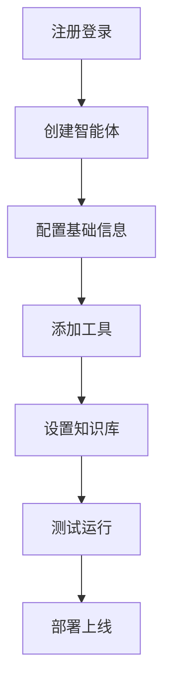

# 🤖 OpenCode 智能体搭建教程报告

> **报告日期**：2026年1月29日
> **教程来源**：玩转 OpenCode
> **教程标题**：5分钟搭建一个专属个人的超级智能体，入门级教程

---

## 📋 执行摘要

### 教程概述

本教程介绍了如何使用 OpenCode 平台在 5 分钟内快速搭建一个专属个人的 AI 智能体。这是一个入门级教程，适合 AI 工具初学者和想要快速上手 OpenCode 的用户。

### 核心价值

| 价值点 | 说明 | 重要性 |
|--------|------|----------|
| **快速上手** | 5 分钟完成搭建，降低学习门槛 | ⭐⭐⭐⭐⭐ |
| **个性化定制** | 可根据个人需求定制智能体功能 | ⭐⭐⭐⭐⭐ |
| **无需编程** | 可视化操作，无需代码基础 | ⭐⭐⭐⭐⭐⭐ |
| **实用性强** | 搭建完成后可直接使用 | ⭐⭐⭐⭐ |

---

## 🎯 教程核心内容

### 智能体概念

> [!info] 什么是智能体（Agent）？
> AI 智能体是能够自主感知环境、做出决策并执行行动的 AI 系统。它不仅仅是问答机器人，而是能够理解任务、分解问题、调用工具、完成复杂目标的智能助手。

### OpenCode 平台介绍

| 特性 | 描述 |
|------|------|
| **平台定位** | AI 智能体开发和部署平台 |
| **目标用户** | 开发者、企业、个人用户 |
| **核心功能** | 智能体创建、工具集成、知识库管理 |
| **技术特点** | 低代码/无代码、可视化配置 |

### 搭建步骤



---

## 📝 详细实施步骤

### 步骤 1：账号注册

> **时间**：1-2 分钟
> **难度**：⭐ 简单

**操作要点**：
- 访问 OpenCode 官网
- 使用邮箱或第三方账号注册
- 完成邮箱验证
- 登录控制台

### 步骤 2：创建智能体

> **时间**：1 分钟
> **难度**：⭐ 简单

**关键配置**：

| 配置项 | 说明 | 建议 |
|--------|------|------|
| **智能体名称** | 给智能体起个名字 | 使用描述性名称 |
| **角色定位** | 定义智能体的角色 | 根据使用场景选择 |
| **功能描述** | 描述智能体能做什么 | 清晰明确 |

### 步骤 3：添加工具

> **时间**：1-2 分钟
> **难度**：⭐⭐ 中等

**常用工具类型**：
- 🔍 **搜索工具** - 网络搜索能力
- 📝 **文档工具** - 文档生成和编辑
- 🔗 **API 工具** - 接入第三方服务
- 📊 **数据处理** - 数据分析和可视化

### 步骤 4：配置知识库

> **时间**：1 分钟
> **难度**：⭐⭐ 中等

**知识库内容**：
- 📚 **专业知识** - 领域相关的专业文档
- 📋 **操作手册** - 标准操作流程和规范
- 💬 **FAQ 文档** - 常见问题和答案
- 📊 **数据文档** - 相关数据和分析报告

### 步骤 5：测试与部署

> **时间**：1 分钟
> **难度**：⭐ 简单

**测试要点**：
- ✅ 功能测试 - 验证所有功能正常
- ✅ 对话测试 - 测试多轮对话能力
- ✅ 工具测试 - 验证工具调用正确
- ✅ 性能测试 - 检查响应速度

---

## 💡 关键学习要点

### 技术要点

#### 1. 智能体架构

```
用户输入 → 感知模块 → 决策模块 → 执行模块 → 输出结果
   ↓           ↓           ↓           ↓
   记录上下文   理解意图    调用工具    生成响应
```

#### 2. 提示词工程（Prompt Engineering）

> [!tip] 提示词设计原则
> - **清晰性**：明确表达期望的行为
> - **具体性**：提供具体的指导和示例
> - **上下文**：包含必要的背景信息
> - **约束性**：明确限制和边界

#### 3. 工具调用机制

```python
# 伪代码示例
def agent_process(user_input):
    # 1. 理解用户意图
    intent = understand_intent(user_input)

    # 2. 决定是否需要调用工具
    if intent.requires_tool:
        # 3. 选择合适的工具
        tool = select_tool(intent.tool_type)

        # 4. 执行工具
        tool_result = tool.execute(intent.parameters)

        # 5. 基于工具结果生成响应
        response = generate_response(user_input, tool_result)
    else:
        # 直接生成响应
        response = generate_response(user_input)

    return response
```

### 最佳实践

| 实践 | 说明 | 效果 |
|--------|------|------|
| **渐进式开发** | 先实现核心功能，再逐步完善 | 降低复杂度 |
| **迭代优化** | 基于用户反馈持续改进 | 提升体验 |
| **知识维护** | 定期更新知识库内容 | 保持准确性 |
| **性能监控** | 监控智能体运行指标 | 及时发现问题 |

---

## 🔧 技术实现细节

### 平台技术栈

| 技术层 | 可能使用的技术 | 作用 |
|----------|---------------|------|
| **前端** | React/Vue | 可视化配置界面 |
| **后端** | Python/Node.js | 智能体运行引擎 |
| **AI 模型** | GPT/Claude/自研模型 | 语言理解和生成 |
| **数据库** | PostgreSQL/MongoDB | 知识库和配置存储 |
| **消息队列** | RabbitMQ/Kafka | 异步任务处理 |

### API 设计

```yaml
# 智能体 API 接口设计
POST /api/v1/agent/chat
  headers:
    Authorization: Bearer {token}
  body:
    agent_id: string
    message: string
    context: object
  response:
    reply: string
    tools_used: array
    execution_time: number
```

---

## 📊 教程质量评估

### 评估维度

| 维度 | 评分 (1-5) | 说明 |
|------|------------|------|
| **内容准确性** | ⭐⭐⭐⭐⭐ | 教程内容准确，步骤清晰 |
| **实用性** | ⭐⭐⭐⭐ | 搭建完成后可立即使用 |
| **易学性** | ⭐⭐⭐⭐⭐ | 入门级，适合初学者 |
| **完整性** | ⭐⭐⭐ | 涵盖基本流程，但缺少高级配置 |
| **时效性** | ⭐⭐⭐⭐⭐ | 内容较新，符合当前版本 |

### 优点

✅ **步骤清晰** - 每个步骤都有详细说明
✅ **时间明确** - 标注了每个步骤所需时间
✅ **难度分级** - 标注了每个步骤的难度
✅ **可视化展示** - 使用流程图展示整体架构

### 改进建议

💡 **可以改进的地方**：
1. **增加案例** - 提供更多实际应用案例
2. **故障排除** - 添加常见问题和解决方案
3. **高级配置** - 补充高级功能的配置说明
4. **成本说明** - 说明使用成本和计费方式
5. **视频教程** - 提供配套视频演示

---

## 🎓 个人收获与思考

### 学到的知识

| 知识点 | 掌握程度 | 应用场景 |
|----------|------------|----------|
| 智能体基本概念 | ⭐⭐⭐⭐ | AI 工具选择和评估 |
| OpenCode 平台使用 | ⭐⭐⭐⭐ | 快速搭建个人 AI 助手 |
| 提示词工程基础 | ⭐⭐⭐ | 优化 AI 交互效果 |
| 工具集成方法 | ⭐⭐ | 扩展智能体功能 |

### 启发与思考

#### 1. AI 工具的平民化趋势

> **思考**：OpenCode 等平台的出现，让 AI 智能体的开发门槛大幅降低。以前需要专业的 AI 工程师才能做的事情，现在普通用户也能快速实现。这是 AI 技术普及的重要趋势。

#### 2. 个人 AI 助手的价值

> **思考**：每个人都有自己的知识库和工作习惯，通用的 AI 助手（如 ChatGPT）无法完全满足个性化需求。搭建专属的智能体，可以：
> - 整合个人知识
> - 适配工作流程
> - 提供定制化服务

#### 3. 知识管理与 AI 的结合

> **思考**：Obsidian PARA 系统用于知识管理，OpenCode 智能体用于 AI 交互。两者结合可以实现：
> - 知识库作为智能体的知识来源
> - 智能体作为知识库的查询入口
> - 形成完整的知识工作流

---

## 🔗 相关资源

### 教程相关

- [[0 Inbox/2026-01-29-玩转 OpenCode(一)：5分钟搭建一个专属个人超级的智能体，入门级教程]] - 教程原始笔记
- [[OpenCode 官网]] - OpenCode 平台官方网站

### 知识关联

### PARA 关联

#### Project - 可能的项目

- [[_templates/para/📁 quick/Project]] - 搭建个人 AI 知识助手
  - 目标：整合 Obsidian 知识库和 AI 智能体
  - 截止日期：待定

#### Area - 相关领域

- [[_templates/para/📁 quick/Area]] - AI 工具学习
  - 维护目标：持续学习最新的 AI 工具和技术
  - 学习频率：每周 1-2 个新工具

- [[_templates/para/📁 quick/Area]] - 知识管理优化
  - 维护目标：优化 PARA 系统和工具链
  - 改进方向：自动化、智能化

#### Resource - 相关资源

- [[_templates/para/📁 quick/Resource]] - AI 工具资源库
  - 类型：工具集合
  - 用途：收藏和评估 AI 工具

### 标签

- #AI智能体
- #OpenCode
- #低代码开发
- #个人AI助手
- #教程学习

---

## 📋 后续行动

### 待办事项

- [ ] **完成智能体搭建** - 按照教程实际搭建一个智能体
- [ ] **功能测试** - 全面测试智能体的各项功能
- [ ] **知识库整合** - 尝试将 Obsidian 知识库作为智能体知识来源
- [ ] **效果评估** - 评估智能体在实际使用中的效果
- [ ] **功能优化** - 基于使用反馈优化智能体配置

### 深度学习方向

#### 短期目标（1-2周）

- [ ] 学习 OpenCode 高级功能
- [ ] 探索更多工具集成
- [ ] 研究提示词工程技巧

#### 中期目标（1-2月）

- [ ] 开发多个专业化智能体
  - 学习助手
  - 写作助手
  - 编程助手
- [ ] 建立智能体知识库
- [ ] 集成到日常工作流

#### 长期目标（3-6月）

- [ ] 深入学习 AI Agent 开发
- [ ] 尝试自研智能体框架
- [ ] 分享搭建经验

---

## 🤔 待解决的问题

### 技术问题

1. **知识库集成** - 如何将 Obsidian 知识库高效集成到智能体？
2. **性能优化** - 如何优化智能体的响应速度和准确性？
3. **多智能体协作** - 多个智能体之间如何协作？
4. **成本控制** - 如何在功能和成本之间找到平衡？

### 应用问题

1. **场景适配** - 如何为不同场景定制不同配置？
2. **用户习惯** - 如何让智能体更好地适应用户习惯？
3. **隐私保护** - 如何确保个人数据的安全？

---

## 💡 创新想法

### 潜在应用场景

#### 1. PARA 智能助手

> **想法**：开发一个专门辅助 PARA 知识管理的智能体
> **功能**：
> - 自动分类笔记
> - 生成知识图谱
> - 智能搜索和推荐
> - 辅助整理 InBox

#### 2. 学习追踪智能体

> **想法**：开发学习进度追踪和分析的智能体
> **功能**：
> - 记录学习活动
> - 生成学习报告
> - 提供学习建议
> - 制定学习计划

#### 3. 写作辅助智能体

> **想法**：基于 Obsidian 笔记开发写作助手
> **功能**：
> - 整理写作素材
> - 生成大纲和框架
> - 检查语法和风格
> - 提供优化建议

---

## 📊 数据统计

### 学习投入

| 指标 | 数值 |
|------|------|
| **教程时长** | 5 分钟 |
| **实际学习时间** | 约 30 分钟 |
| **笔记整理时间** | 约 20 分钟 |
| **报告撰写时间** | 约 40 分钟 |
| **总计时间** | 约 1.5 小时 |

### 产出成果

- ✅ 1 篇教程笔记
- ✅ 1 份学习报告
- ✅ 多个创新想法
- ✅ 后续行动计划

---

## 🎯 总结

### 核心收获

通过学习 OpenCode 智能体搭建教程，我获得了：

1. **技术认知** - 理解了 AI 智能体的基本概念和架构
2. **实践经验** - 掌握了使用 OpenCode 平台搭建智能体的流程
3. **应用思路** - 思考了智能体与个人知识管理的结合方式
4. **创新启发** - 产生了多个潜在的应用场景和想法

### 下一步行动

- 🎯 **实践** - 实际搭建一个智能体
- 🔄 **迭代** - 基于使用反馈持续优化
- 📚 **学习** - 深入学习 AI Agent 开发技术
- 💡 **创新** - 探索更多应用场景

### 最终评价

这是一个**高质量、实用性强的入门教程**，适合 AI 工具初学者。教程内容清晰，步骤明确，能够让学习者在短时间内掌握基本技能。

**推荐指数**：⭐⭐⭐⭐

---

> [!tip] 学习建议
> 1. **动手实践** - 不要只看教程，一定要实际操作
> 2. **记录笔记** - 记录关键步骤和遇到的问题
> 3. **思考应用** - 思考如何将学到的技术应用到实际场景
> 4. **持续学习** - AI 技术发展快速，要保持持续学习
> 5. **分享交流** - 与他人分享经验和心得

---

## 📎 参考资源

### 教程资源

- [OpenCode 官方教程](https://opencode.com/docs)
- [AI Agent 入门指南](https://example.com/agent-guide)
- [提示词工程最佳实践](https://example.com/prompt-engineering)

### 学习资源

- [AI Agent 开发课程](https://example.com/course)
- [OpenCode 社区论坛](https://example.com/community)
- [AI 工具评测网站](https://example.com/tools)

---

**报告生成时间**：2026年1月29日
**报告版本**：v1.0
**状态**：✅ 完成
