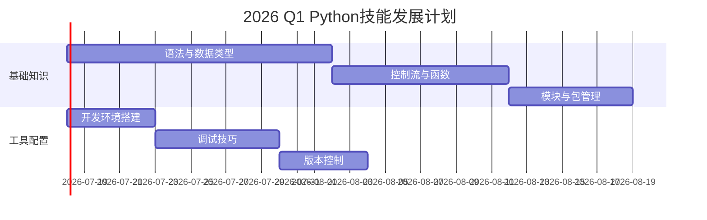

# Python开发领域

> 🌳这是一个长期维护的技术领域，涵盖Python编程技能的持续学习和实践。

## 🎯 领域范围

### 核心技能栈
- **Python语言精通**：从基础到高级特性
- **开发工具链**：IDE、调试、版本控制
- **项目架构**：代码组织、模块化设计
- **性能优化**：代码质量和执行效率

### 技术应用方向
- **数据分析**：NumPy、Pandas、Matplotlib
- **Web开发**：Flask、Django、FastAPI
- **AI/ML应用**：TensorFlow、PyTorch、Scikit-learn
- **自动化脚本**：系统管理、数据处理工具

## 📈 技能发展规划

### 当前阶段 (2026年)
#### Q1 - 基础夯实


#### Q2 - 应用探索
- 数据分析基础技能
- 简单Web应用开发
- 自动化脚本编写

#### Q3-Q4 - 深度实践
- 实际项目开发
- 性能优化技巧
- 开源贡献尝试

### 中期目标 (2027-2028年)
- **精通领域**：选择1-2个专业方向深入发展
- **项目经验**：完成中大型项目并开源
- **技术分享**：技术博客或社区贡献
- **持续学习**：跟上Python发展趋势

### 长期愿景 (2029年+)
- **技术专家**：成为特定领域的Python专家
- **团队领导**：带领开发团队，技术决策
- **开源贡献**：活跃的Python开源社区贡献者
- **知识传承**：培养其他开发者，技术讲座分享

## 🛠️ 技能矩阵

| 技能分类 | 当前水平 | 目标水平 | 学习优先级 |
|---------|----------|----------|------------|
| Python基础语法 | 🟡 熟悉 | 🟢 精通 | ⭐⭐⭐⭐⭐ |
| 面向对象编程 | 🟡 熟悉 | 🟢 精通 | ⭐⭐⭐⭐ |
| 数据分析 | 🟠 了解 | 🟡 熟悉 | ⭐⭐⭐⭐⭐ |
| Web开发 | 🟠 了解 | 🟡 熟悉 | ⭐⭐⭐ |
| AI/ML应用 | 🟠 了解 | 🟡 熟悉 | ⭐⭐⭐⭐ |
| 性能优化 | 🔴 初学 | 🟡 熟悉 | ⭐⭐⭐ |
| 系统架构 | 🔴 初学 | 🟠 了解 | ⭐⭐ |
| 开源贡献 | 🔴 初学 | 🟠 了解 | ⭐⭐ |

**技能等级说明**：
- 🟢 精通 - 能够独立解决复杂问题，可以教导他人
- 🟡 熟悉 - 熟练应用，能独立完成大多数任务
- 🟠 了解 - 理解概念，需要指导和参考
- 🔴 初学 - 刚开始学习，需要系统学习

## 📚 学习资源管理

### 必读书籍
- [ ] 《Python编程：从入门到实践》- Eric Matthes
- [ ] 《流畅的Python》- Luciano Ramalho
- [ ] 《Python深度学习》-  Francois Chollet
- [ ] 《Python高性能编程》- Micha Gorelick

### 在线课程
- [ ] Python官方教程
- [ ] Real Python网站教程
- [ ] Coursera/edX Python课程
- [ ] YouTube视频教程

### 练习平台
```python
# 刷题网站和练习平台
practice_platforms = [
    "LeetCode Python题库",
    "Codewars Python挑战", 
    "HackerRank练习",
    "Project Euler数学编程",
    "Kaggle数据科学竞赛"
]
```

## 🎯 实践项目规划

### 初级项目 (已完成的技能巩固)
- [ ] ✅ 环境搭建和基础语法练习
- [ ] 📚 文件管理脚本开发
- [ ] 📅 简单数据分析脚本
- [ ] 🌐 个人博客静态站点

### 中级项目 (正在进行的技能提升)
- [ ] 🕸️ Flask Web应用开发
- [ ] 📊 数据分析和可视化工具
- [ ] 🤖 API客户端开发
- [ ] 🔄 数据处理流程自动化

### 高级项目 (未来规划)
- [ ] 🚀 分布式爬虫系统
- [ ] 📈 机器学习预测模型
- [ ] 🏗️ 大型Web应用架构
- [ ] 🔧 开发工具和框架贡献

## 📊 学习追踪

### 月度目标检查
| 月份 | 主要目标 | 完成情况 | 技能提升 |
|------|---------|---------|----------|
| 2026-01 | 环境配置 | ✅ 完成 | Python基础安装 |
| 2026-02 | 基础语法 | 🔄 进行中 | 数据类型和控制流 |
| 2026-03 | 进阶特性 | 📋 计划 | 面向对象和函数式编程 |
| 2026-04 | 实际应用 | 📋 计划 | 数据分析或Web开发 |

### 技能评估指标
```python
# 技能评估函数
def assess_python_skills():
    skills = {
        'syntax_mastery': 0.8,      # 语法掌握度 (0-1)
        'problem_solving': 0.6,    # 问题解决能力
        'code_quality': 0.7,       # 代码质量
        'project_experience': 0.5, # 项目经验
        'community_engagement': 0.3 # 社区参与度
    }
    
    overall_score = sum(skills.values()) / len(skills)
    return overall_score

print(f"当前技能评分: {assess_python_skills():.2f}/1.0")
```

## 🔄 日常学习流程

### 每日学习计划
```python
# 学习时间分配
daily_schedule = {
    "morning": {
        "时长": "30分钟",
        "内容": "理论学习 - 阅读文档、博客、教程"
    },
    "evening": {
        "时长": "45分钟", 
        "内容": "实践编写 - 练习题、小项目、代码实验"
    },
    "weekend": {
        "时长": "2-3小时",
        "内容": "项目开发或深度专题学习"
    }
}
```

### 周末深度学习
- **周六上午**：专题技术学习
- **周六下午**：项目开发实践
- **周日上午**：代码 review 和重构
- **周日下午**：技术总结和规划

## 🤝 社区参与

### 技术社区
- **Stack Overflow**：问题和答案贡献
- **GitHub**：项目参与和开源贡献
- **Reddit r/python**：讨论和资源分享
- **本地Python用户组**：线下会议和分享

### 知识分享
- **技术博客**：定期写技术文章
- **代码开源**：将练习代码开源分享
- **在线分享**：参与线上技术会议或直播

## 🎯 成功指标

### 量化目标
- ✅ **代码量**：每周编写500行+有效Python代码
- ✅ **项目数**：每月完成1个小项目或功能模块
- ✅ **学习时间**：平均每天学习60分钟
- ✅ **技术文章**：每月发布2篇技术学习笔记

### 质量指标
- 🎯 **代码质量**：100%代码通过静态代码检查
- 🎯 **测试覆盖**：关键业务逻辑100%测试覆盖
- 🎯 **文档完善**：所有公共函数都有详细文档
- 🎯 **性能优化**：关键代码经过性能测试

## 🧠 反思与调整

### 月度回顾要点
1. **学习成效**：哪些目标完成，哪些未完成？
2. **方法评估**：当前学习方法是否有效？
3. **时间规划**：时间分配是否合理？
4. **技能短板**：需要加强的技能领域
5. **调整计划**：下月重点改进方向

### 年度总结
```markdown
# Python学习年度总结

## 主要成就
- 
- 
- 

## 技能提升
- 
- 
- 

## 项目成果
- 
- 
- 

## 挑战与反思
- 
- 
- 

## 下年度计划
- 
- 
- 
```

## 🔗 相关资源

### 笔记链接
- [[Python知识库导航]] - 完整学习资源地图
- [[Python安装与环境配置]] - 开发环境搭建
- [[基础语法与数据类型]] - 核心语法知识
- [[面向对象编程]] - OOP编程范式

### 外部链接
- [Python官方文档](https://docs.python.org/3/)
- [Real Python教程](https://realpython.com/)
- [Python Weekly](https://www.pythonweekly.com/)
- [PyPI包索引](https://pypi.org/)

---
*创建日期: 2026-02-01*  
*最后更新: 2026-02-01*  
*分类: 2 Areas*