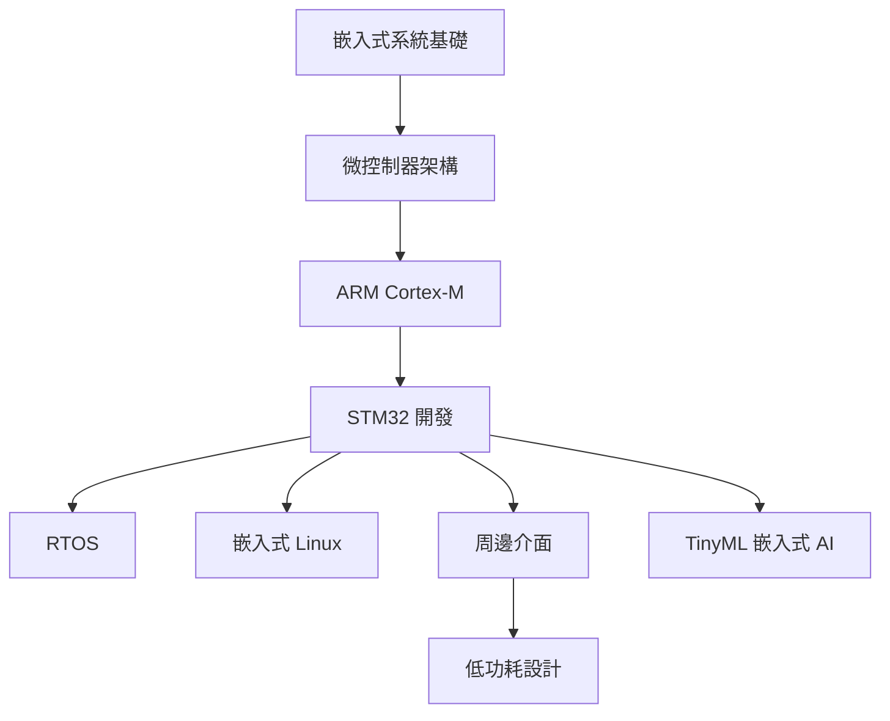

# 嵌入式系統知識地圖

## 核心技能樹
| 層級 | 技能 | 對應章節 |
|:--:|------|:-------:|
| L1 基礎 | C/C++、電路基礎、GPIO 控制 | 01, 02 |
| L2 MCU | ARM 架構、中斷、定時器、PWM | 02, 03 |
| L3 平台 | STM32 HAL、CubeIDE、除錯 | 04 |
| L4 系統 | FreeRTOS、任務排程、IPC | 05 |
| L5 進階 | Linux 驅動、通訊協議、功耗 | 06, 07, 08 |
| L6 前沿 | TinyML、邊緣 AI | 09 |
