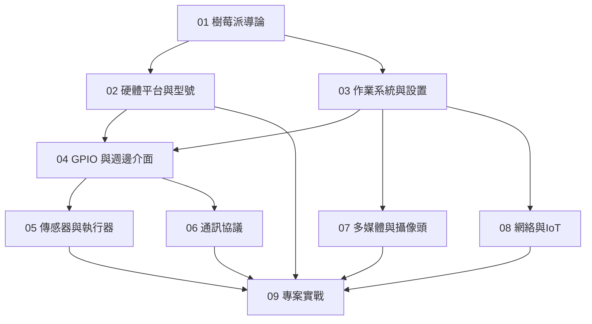

# 樹莓派知識地圖

| 層級 | 技能 | 對應章節 |
|:--:|------|:--:|
| L1 | 認識 SBC、理解 Pi 生態、選購第一塊 Pi | 01–02 |
| L2 | 刷機、SSH 連接、GPIO 點亮 LED、基本傳感器讀取 | 03–05 |
| L3 | I²C/SPI 通訊、Camera 模組、MQTT 聯網 | 06–08 |
| L4 | 完整專案整合：氣象站、機器人、智慧家居中樞 | 09 |
