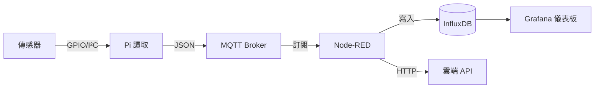

# 08 網絡與IoT Networking & IoT

## 網絡硬體規格

| 型號 | WiFi | 藍牙 | 乙太網 |
|------|:----:|:----:|:------:|
| **Pi 5** | 802.11ac (WiFi 5) | BT 5.0 / BLE | Gigabit |
| **Pi 4B** | 802.11ac (WiFi 5) | BT 5.0 / BLE | Gigabit |
| **Pi Zero 2 W** | 802.11n (WiFi 4) | BT 4.2 / BLE | — |
| **Pi 3B+** | 802.11ac | BT 4.2 | Gigabit (USB 2.0 限速 ~300Mbps) |

> Pi 4B/5 的乙太網為真實 Gigabit (非 USB 橋接)，Pi 5 的 WiFi/BT 由 RP1 晶片內建。

## 網絡設置

```bash
# 靜態 IP (NetworkManager / nmcli — Pi Bookworm 預設)
nmcli con show                          # 查看連線
nmcli con mod "Wired connection 1" \
  ipv4.addresses 192.168.1.100/24 \
  ipv4.gateway 192.168.1.1 \
  ipv4.dns 8.8.8.8 \
  ipv4.method manual

# 或使用 dhcpcd (傳統方法)
sudo nano /etc/dhcpcd.conf
# interface wlan0
# static ip_address=192.168.1.100/24
# static routers=192.168.1.1
# static domain_name_servers=8.8.8.8
```

## MQTT 訊息協議

適合 IoT 場景的輕量級發布/訂閱協議。

### Mosquitto Broker 安裝與配置

```bash
sudo apt install -y mosquitto mosquitto-clients

# 測試
mosquitto_sub -h localhost -t "sensors/temp" &
mosquitto_pub -h localhost -t "sensors/temp" -m "23.5"
```

### Python MQTT 客戶端 (paho-mqtt)

```python
import paho.mqtt.client as mqtt
import json
import time

# 發布者 — 傳感器數據
client = mqtt.Client()
client.connect("localhost", 1883)
while True:
    data = {"temp": 23.5, "humidity": 65.0, "timestamp": time.time()}
    client.publish("sensors/room1", json.dumps(data))
    time.sleep(5)

# 訂閱者 — 接收並處理
def on_message(client, userdata, msg):
    payload = json.loads(msg.payload)
    print(f"[{msg.topic}] {payload}")

client = mqtt.Client()
client.on_message = on_message
client.connect("localhost", 1883)
client.subscribe("sensors/#")
client.loop_forever()
```

### MQTT 主題設計規範

| 模式 | 範例 | 用途 |
|------|------|------|
| `location/device/reading` | `home/living_room/temperature` | 層級化數據組織 |
| `device/command` | `relay1/set` | 控制指令 |
| `device/status` | `relay1/status` | 狀態回報 |
| `#` (通配) | `home/#` | 訂閱所有子主題 |

> MQTT 預設 port 1883 (無加密)，8883 (TLS)。生產環境務必設定使用者認證與 TLS。

## Node-RED — 流程化 IoT 編程

```bash
# 安裝
sudo apt install -y nodered
sudo systemctl enable nodered
sudo systemctl start nodered

# 訪問 http://<pi-ip>:1880
```

**典型流程範例**：MQTT in → 邏輯判斷 → GPIO out / 資料庫寫入。

```
[MQTT in: sensors/+/temp]
    → [Function: 平均計算]
    → [Dashboard Gauge: 即時溫度顯示]
    → [MQTT out: alerts/temp_high (if >30°C)]
```

> Node-RED 自帶大量節點：mqtt, gpio, http, dashboard, database, email... 非常適合快速原型。

## Home Assistant on Pi

樹莓派是最受歡迎的 Home Assistant 平台之一。

### 安裝方式

```bash
# 方法一：直接在 Pi 上安裝 HA OS (推薦)
# 使用 Raspberry Pi Imager → Home Assistant OS → 燒錄 microSD

# 方法二：Docker (與其他服務共存)
docker run -d \
  --name homeassistant \
  --privileged \
  --restart=unless-stopped \
  -v /opt/ha-config:/config \
  -v /run/dbus:/run/dbus:ro \
  --network=host \
  ghcr.io/home-assistant/home-assistant:stable
```

### Pi 型號選擇

| 型號 | 適合 HA 嗎？ | 建議 |
|------|:-----------:|------|
| Pi 5 (8GB) + NVMe | ✅ 最佳 | 大型智慧家居 (>50 設備) |
| Pi 4B (4GB+) | ✅ 很好 | 一般家庭使用 |
| Pi 3B+ | ⚠️ 可用 | 輕量場景 |
| Pi Zero 2 W | ❌ 不推薦 | 性能不足、無乙太網 |

## 傳感器數據 → 雲端管線



### 典型技術棧

| 層 | 工具 | 作用 |
|----|------|------|
| 數據採集 | Python + gpiozero | 讀取傳感器 |
| 訊息傳遞 | Mosquitto MQTT | 解耦發布/訂閱 |
| 流程處理 | Node-RED | 邏輯判斷/轉發 |
| 時序存儲 | InfluxDB | 高效時間序列數據庫 |
| 可視化 | Grafana | 即時儀表板 |
| 遠端存取 | Tailscale / Cloudflare Tunnel | 安全遠端連接 |

## 常用 IoT 協議對比

| 協議 | 模式 | QoS | 適合 |
|------|:----:|:---:|------|
| **MQTT** | Pub/Sub | 0/1/2 | 傳感器數據、低頻寬 |
| **HTTP/REST** | Request/Response | — | Web API、配置管理 |
| **CoAP** | Request/Response | 0/1 | 極低功耗設備 |
| **WebSocket** | 雙向長連接 | — | 即時控制、儀表板 |
| **gRPC** | RPC | — | 高效內部服務 |

> 樹莓派 IoT 場景：首選 MQTT + InfluxDB + Grafana 組合。
