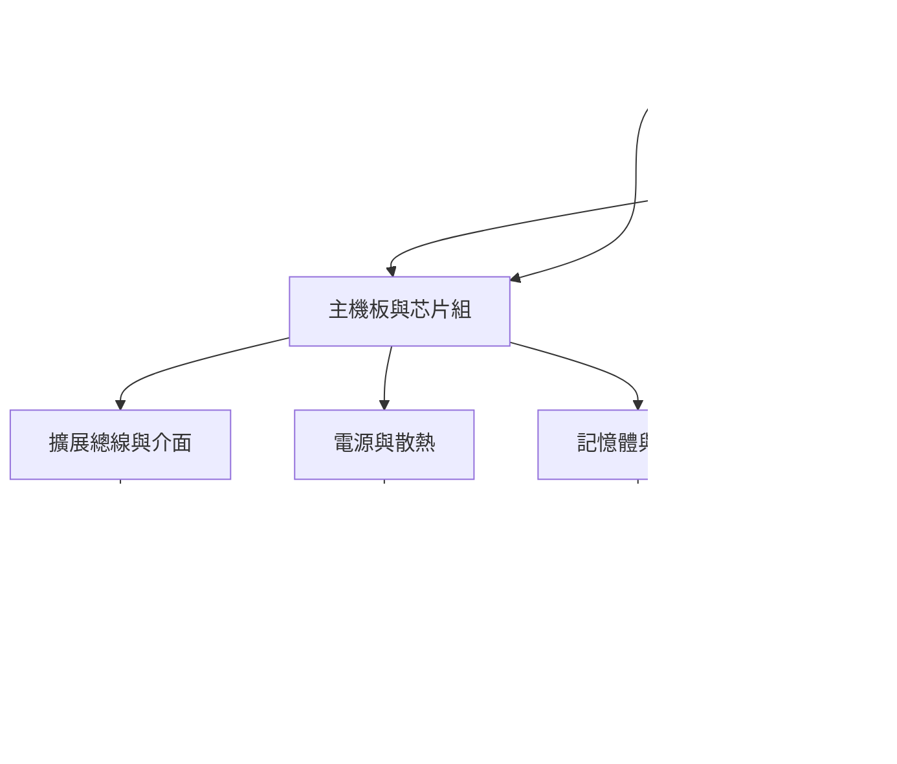

# 計算機硬件知識地圖

```mermaid
graph TD
    A[硬件導論] --> B[CPU 處理器]
    A --> C[主機板與芯片組]
    B --> C
    C --> D[記憶體與存儲]
    C --> E[電源與散熱]
    C --> F[擴展總線與介面]
    F --> G[輸入輸出設備]
    B --> H[硬件選型與性能評估]
    D --> H
    E --> H
    H --> I[組裝與診斷]
```

| 層級 | 技能 | 對應章節 |
|:--:|------|:--:|
| L1 | 識別硬件組件、理解基本規格 | 01–02 |
| L2 | 主機板/記憶體/存儲選型、介面標準 | 03–06 |
| L3 | 散熱/電源計算、I/O 設備匹配 | 05, 07 |
| L4 | DIY 組裝、故障診斷、性能調優 | 08–09 |
