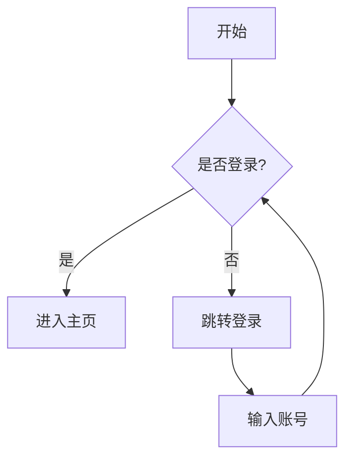
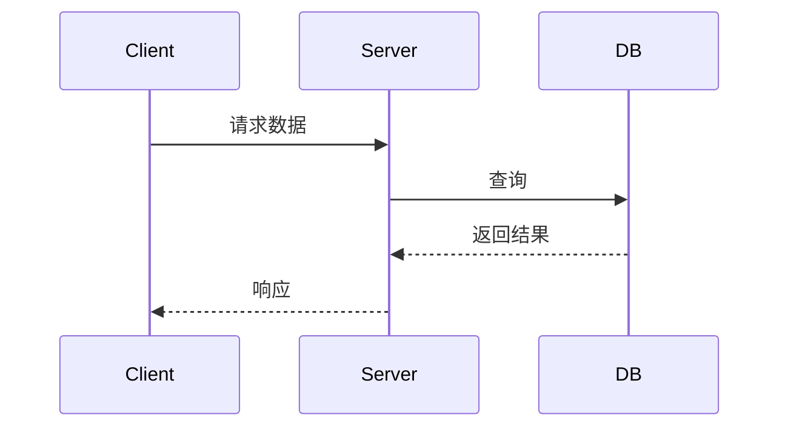
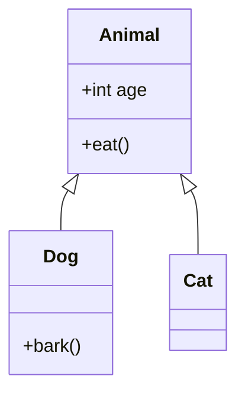
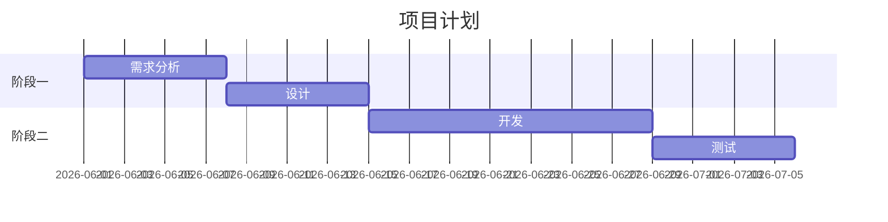

# 04 - Markdown 高级技巧

## 数学公式 (LaTeX)

### 行内公式

```markdown
勾股定理：$a^2 + b^2 = c^2$
```

$a^2 + b^2 = c^2$

### 块级公式

```markdown
$$
\frac{-b \pm \sqrt{b^2 - 4ac}}{2a}
$$

$$
\sum_{i=0}^{n} x_i = x_0 + x_1 + \cdots + x_n
$$

$$
\int_{0}^{\infty} e^{-x^2} dx = \frac{\sqrt{\pi}}{2}
$$
```

**常用符号**：

| 语法 | 效果 | 说明 |
|------|------|------|
| `x^2` | $x^2$ | 上标 |
| `x_2` | $x_2$ | 下标 |
| `\sqrt{x}` | $\sqrt{x}$ | 平方根 |
| `\frac{a}{b}` | $\frac{a}{b}$ | 分数 |
| `\pm` | $\pm$ | 正负号 |
| `\alpha \beta \theta` | $\alpha \beta \theta$ | 希腊字母 |
| `\infty` | $\infty$ | 无穷 |
| `\sum` | $\sum$ | 求和 |
| `\int` | $\int$ | 积分 |

## Mermaid 图表

### 流程图

````markdown

````

### 时序图

````markdown

````

### 类图

````markdown

````

### 甘特图

````markdown

````

## HTML 混用

```markdown
Markdown 可以直接嵌入 HTML：

<details>
<summary>点击展开</summary>
隐藏内容
</details>

<div align="center">
  
</div>

<kbd>Ctrl</kbd> + <kbd>C</kbd>
```

实际效果：<kbd>Ctrl</kbd> + <kbd>C</kbd>

## YAML Frontmatter 进阶

```yaml
---
title: 高级技巧
tags: [a, b]
aliases: [别名]
cssclasses: [wide, dark]
created: 2026-05-25
updated: 2026-05-26
publish: false
---
```

## 模板复用

```markdown
使用 Templater 插件：
<% tp.date.now("YYYY-MM-DD") %>
<% tp.file.title %>
<% tp.file.cursor() %>
```

## 内部链接最佳实践

```markdown
<!-- 不要这样 -->
[点击这里](./folder/file.md)

<!-- 推荐 Obsidian 风格 -->
[[file]]

<!-- 带别名 -->
[[长文件名|简称]]
```

---

## 相关笔记

- [[02-扩展语法]] — 表格与代码块
- [[03-Obsidian 语法]] — Wikilink 与 Callout
- [[Markdown 速查表]]
