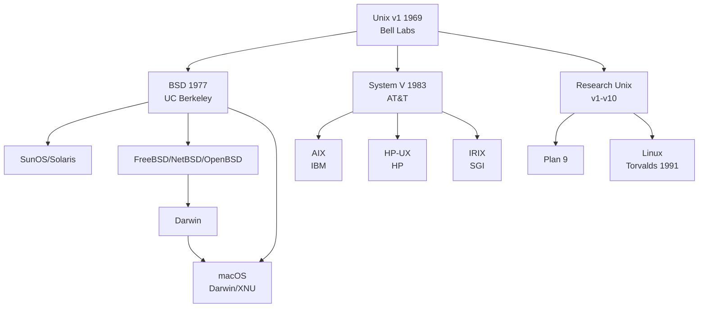

# Unix 知識庫總覽 — Unix Knowledge Base MOC

> [!info] 關於
> Unix 作業系統完整知識庫，涵蓋歷史淵源、技術架構、商業演進與現代遺產。Unix is the grand ancestor of modern operating systems — its design philosophy still shapes everything from Linux to macOS.

## 知識庫結構 Knowledge Base Structure

```
004.451-Unix/
├── 004.451-Unix.md            ← MOC (本文件)
├── README.md                  簡介與導航
├── 01-Unix-概述与历史.md       Bell Labs 1969, Philosophy, Family Tree
├── 02-System-V-与BSD.md       System V vs BSD 分裂史
├── 03-Unix-文件系统.md        UFS, inode, links, mount
├── 04-Shell与工具链.md        Shell, awk/sed/grep, pipe pattern
├── 05-进程与信号.md            fork/exec, signals, daemon
├── 06-网络与IPC.md            Sockets, TCP/IP, Pipes, SysV IPC
├── 07-安全与权限.md            UID/GID, setuid, chroot
├── 08-商用Unix.md             Solaris, AIX, HP-UX, macOS
├── 09-Unix的遗产.md           Linux, POSIX, BSD, Modern Impact
└── 99-資源收集/
    ├── FAQ.md                  常見問題
    └── 資源總覽.md             參考資源彙整
```

## 快速導航 Quick Navigation

| # | 文件 | 主題 | 關鍵字 |
|---|------|------|--------|
| 01 | [[01-Unix-概述与历史]] | Bell Labs 1969, Unix Philosophy, POSIX | Thompson, Ritchie, KISS |
| 02 | [[02-System-V-与BSD]] | System V vs BSD Split, SVR4, STREAMS | init, TCP/IP, sockets |
| 03 | [[03-Unix-文件系统]] | UFS, inode, hard/sym links, procfs | VFS, mount, /dev |
| 04 | [[04-Shell与工具链]] | Bourne Shell, awk/sed/grep, pipes | make, lex, yacc, troff |
| 05 | [[05-进程与信号]] | fork/exec, signals, daemon, nice | SIGKILL, zombie, orphan |
| 06 | [[06-网络与IPC]] | Berkeley Sockets, TCP/IP, SysV IPC | FIFO, shm, semaphores |
| 07 | [[07-安全与权限]] | UID/GID, setuid, rwx, chroot | syslog, permissions |
| 08 | [[08-商用Unix]] | Solaris, AIX, HP-UX, macOS lineage | ZFS, DTrace, SMIT |
| 09 | [[09-Unix的遗产]] | Linux, POSIX, BSD, Modern Philosophy | embedded, containers |

## Unix 家族樹 Unix Family Tree



## 核心哲學 Unix Philosophy

1. **KISS** — Keep It Simple, Stupid：每個程式只做一件事並做好
2. **Everything is a file** — 一切皆檔案，統一的 I/O 模型
3. **Small is beautiful** — 小工具通過 pipe 組合出強大功能
4. **Portability** — 用 C 語言重寫，實現跨平台可移植性

## 外部資源 External Resources

- [The Unix Heritage Society](https://www.tuhs.org/)
- [IEEE POSIX Standards](https://pubs.opengroup.org/onlinepubs/9699919799/)
- [The Art of Unix Programming — ESR](http://www.catb.org/esr/writings/taoup/)

---

> 📚 Unix is not just an OS — it's a culture, a philosophy, and the foundation of modern computing.
