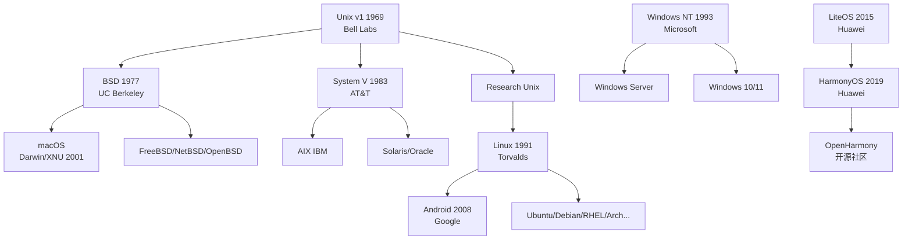

# 004.451 操作系统總覽 — Operating System Overview

> 跨六大作業系統的全景對比知識庫：Windows Server · Linux · Unix · macOS · Android · HarmonyOS。
> A panoramic comparison knowledge base spanning six major operating systems: Windows Server, Linux, Unix, macOS, Android, HarmonyOS.

---

## 作業系統家族樹 OS Family Tree



---

## 子庫導航 Sub-KB Navigation

| DDC | 作業系統 | MOC 連結 | 內核類型 | 首發 | 主要領域 |
|:---:|------|------|------|:---:|------|
| 004.451.8 | **Windows Server** | [[../004.451.8-Windows-Server/004.451.8-Windows-Server\|Windows Server]] | Hybrid (NT) | 1993 | 企業伺服器、AD 域控、Hyper-V |
| 004.451 | **Linux** | [[../004.451-Linux/004.451-Linux\|Linux]] | Monolithic | 1991 | 伺服器、雲端、嵌入式、桌面 |
| 004.451 | **Unix** | [[../004.451-Unix/004.451-Unix\|Unix]] | Monolithic | 1969 | 遺產與哲學、商用 Unix、macOS 根基 |
| 004.451 | **macOS** | [[../004.451-macOS/004.451-macOS\|macOS]] | Hybrid (XNU) | 2001 | Apple 桌面、開發者生態、創意產業 |
| 004.451 | **Android** | [[../004.451-Android/004.451-Android\|Android]] | Monolithic (Linux) | 2008 | 行動裝置、IoT、車載、穿戴 |
| 004.451 | **HarmonyOS** | [[../004.451-HarmonyOS/004.451-HarmonyOS\|HarmonyOS]] | Microkernel (自研) | 2019 | 全場景分散式、手機/IoT/車機 |

---

## 六大作業系統速覽 Six OSes at a Glance

| 維度 | Windows Server | Linux | Unix | macOS | Android | HarmonyOS |
|------|:---:|:---:|:---:|:---:|:---:|:---:|
| **內核** | NT Hybrid | Linux Monolithic | Varies Monolithic | XNU Hybrid | Linux Monolithic | HarmonyOS Microkernel |
| **授權** | Proprietary | GPLv2 | Proprietary/Open | Proprietary (Darwin APSL) | Apache 2.0 + GPLv2 | Apache 2.0 |
| **主要語言** | C/C++/C# | C | C | C/C++/Swift | Java/Kotlin/C++ | ArkTS/C/C++ |
| **套件管理** | winget/Chocolatey | apt/dnf/pacman | pkg/SVR4 | Homebrew/Mac App Store | Google Play/AOSP | AppGallery |
| **檔案系統** | NTFS/ReFS | ext4/XFS/Btrfs/ZFS | UFS/ZFS | APFS/HFS+ | ext4/f2fs | HMFS (自研) |
| **預設 Shell** | PowerShell/cmd | Bash | ksh/sh | zsh | sh (adb shell) | — (hdc shell) |
| **虛擬化** | Hyper-V | KVM/Xen | LPAR/Zone | Hypervisor.framework | — | — |
| **市佔率 (2025)** | ~15% server | ~70% server / ~3% desktop | <1% (legacy) | ~15% desktop | ~70% mobile | ~20% mobile (China) |

---

## 章節導航 Chapter Navigation

| 章 | 主題 Topic | English | 核心內容 |
|:--:|------|---------|------|
| 01 | [[01-操作系统谱系]] — 系譜與歷史 | OS Genealogy | Unix→Linux/macOS, Windows NT, Android/Linux, HarmonyOS, timeline |
| 02 | [[02-架构对比]] — 架構對比 | Architecture Comparison | Kernel types, scheduler, memory, FS, security — 6 OS comparison tables |
| 03 | [[03-命令行对比]] — 命令列對比 | CLI Comparison | Bash/zsh vs PowerShell vs hdc vs adb equivalent commands |
| 04 | [[04-开发环境对比]] — 開發環境對比 | Dev Environment | IDE, toolchain, package manager, debugger matrix across 6 OSes |
| 05 | [[05-部署与运维对比]] — 部署與運維 | Deployment & Ops | Docker/Podman, virtualization, Ansible, CI/CD by OS |
| 06 | [[06-安全模型对比]] — 安全模型對比 | Security Models | Permission models, sandboxing, SELinux/AppArmor/SIP, secure boot, signing |
| 07 | [[07-选型指南]] — 選型指南 | Selection Guide | OS recommendation by scenario, TCO analysis, decision matrix |
| 08 | [[08-互操作性]] — 互操作性 | Interoperability | SMB/NFS, RDP/VNC, WSL, virtualization nesting, AD/LDAP |
| 09 | [[09-未来趋势]] — 未來趨勢 | Future Trends | Cloud-native OS, AI OS, RISC-V OS, HarmonyOS cross-device |
<<<<<<< HEAD
| 99 | [[3 Resources/000 Knowledge/004 Computer Science & technology/004.8-人工智能/99-資源收集/FAQ\|FAQ]] | FAQ | 常見問題與解答 |
| 99 | [[3 Resources/000 Knowledge/004 Computer Science & technology/004.8-人工智能/99-資源收集/資源總覽\|資源總覽]] | Resources | 官方資源、社群、學習路徑彙總 |
=======
| 99 | [[99-資源收集/FAQ\|FAQ]] | FAQ | 常見問題與解答 |
| 99 | [[99-資源收集/資源總覽\|資源總覽]] | Resources | 官方資源、社群、學習路徑彙總 |
>>>>>>> origin/main

---

## 學習路徑 Learning Path

```
入門 (Beginner) → 01 系譜 → 07 選型 → 03 命令列對比
中級 (Intermediate) → 02 架構對比 → 06 安全模型 → 04 開發環境
進階 (Advanced) → 05 部署運維 → 08 互操作性 → 09 未來趨勢
```

---

## 核心對比矩陣 Core Comparison Matrix

| 特性 Feature | Windows Server | Linux | Unix | macOS | Android | HarmonyOS |
|------|:---:|:---:|:---:|:---:|:---:|:---:|
| **行程排程** | Priority-based preemptive | CFS/EEVDF (Linux 6.6+) | SVR4 scheduler | Mach + BSD scheduler | CFS (modified) | Deterministic latency engine |
| **記憶體管理** | Demand paging + VAS | Demand paging + MMU | Demand paging | Mach VM + UBC | ashmem + LMK | 分散式記憶體管理 |
| **安全框架** | Defender + Credential Guard | SELinux/AppArmor | POSIX ACL | SIP + Sandbox + TCC | SELinux + Permissions | 分級安全 + TEE |
| **容器支援** | Docker/Hyper-V containers | Docker/Podman/LXC | Zones (Solaris) | Docker Desktop (VM-backed) | — | — |
| **GPU 加速** | DirectX/WDDM | Mesa/DRM | Vendor-specific | Metal | Vulkan/OpenGL ES | ArkGraphics |
| **IPC 機制** | ALPC, COM, RPC | D-Bus, Unix sockets | SysV IPC, sockets | Mach ports, XPC | Binder | 分散式軟總線 |

---

## 相關條目 Related

- [[../04-操作系统\|04-操作系统]] — 作業系統原理總類
- [[004.45-嵌入式與即時操作系統]] — RTOS 對比
- [[DDC 004]] — 電腦科學總類

> 📚 Understanding OS differences is key to making informed architectural decisions. This KB is your cross-OS compass.
