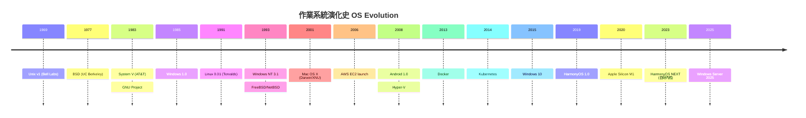

# 01 — 作業系統譜系 OS Genealogy

> 從 Unix 誕生到 HarmonyOS 全場景分散式，六大作業系統的血緣關係、時間線與市場版圖。
> From Unix's birth to HarmonyOS's distributed ecosystem — the genealogy, timeline, and market landscape of six major OSes.

---

## 作業系統演化時間線 OS Evolution Timeline

---

## 六大 OS 血緣關係 Genealogy

| 世系 Lineage | 始祖 | 關鍵分叉 | 現代代表 | 核心特徵 |
|------|:---:|------|------|------|
| **Unix → BSD → macOS** | Unix v1 (1969) | BSD 4.3 → NeXTSTEP → Darwin | macOS 15 Sequoia | Mach + BSD 混合內核 |
| **Unix → System V** | System V (1983) | Solaris, AIX, HP-UX | AIX 7.3 (IBM Power) | 商業級穩定性 |
| **Unix → Linux** | Linux 0.01 (1991) | Debian→Ubuntu, RHEL→Fedora, Slackware→SUSE | Ubuntu 24.04 LTS / RHEL 9 | 開源生態主導 |
| **Windows NT** | NT 3.1 (1993) | NT 5→2000/XP, NT 6→Vista/7, NT 10→10/11 | Windows Server 2025 | 混合內核 + GUI 深度整合 |
| **Linux → Android** | Android 1.0 (2008) | Linux kernel + Binder + ART | Android 15 | 修改 Linux 內核 + Java 框架 |
| **LiteOS → HarmonyOS** | HarmonyOS 1.0 (2019) | Linux→HarmonyOS microkernel (2023) | HarmonyOS 5 NEXT | 全場景分散式微內核 |

---

## 市場佔有率演進 Market Share Evolution

### 伺服器作業系統 Server OS Market (2020-2025)

| 年份 | Linux | Windows Server | Unix | 其他 |
|:---:|:---:|:---:|:---:|:---:|
| 2020 | 45% | 32% | 3% | 20% |
| 2021 | 50% | 29% | 2% | 19% |
| 2022 | 56% | 26% | 2% | 16% |
| 2023 | 61% | 23% | 1% | 15% |
| 2024 | 67% | 19% | 1% | 13% |
| 2025 | 72% | 15% | <1% | 13% |

> 雲端原生時代，Linux 在伺服器領域持續增長，Windows Server 轉向 Azure hybrid 策略。

### 桌面作業系統 Desktop OS Market (2020-2025)

| 年份 | Windows | macOS | Linux | ChromeOS |
|:---:|:---:|:---:|:---:|:---:|
| 2020 | 76% | 17% | 2% | 4% |
| 2022 | 73% | 16% | 3% | 6% |
| 2024 | 70% | 16% | 4.5% | 7% |
| 2025 | 68% | 15% | 5% | 9% |

### 行動作業系統 Mobile OS Market (2020-2025)

| 年份 | Android (Global) | iOS | HarmonyOS (China) | 其他 |
|:---:|:---:|:---:|:---:|:---:|
| 2020 | 72% | 27% | <1% | <1% |
| 2022 | 71% | 28% | 4% | <1% |
| 2024 | 69% | 29% | 17% | <1% |
| 2025 | 68% | 28% | ~20% | <1% |

> HarmonyOS 在中國市場快速增長，已超越 iOS 成為第二大行動 OS。

---

## 關鍵技術分岔點 Key Technical Forks

| 年份 | 事件 | 影響 |
|:---:|------|------|
| 1969 | Unix 誕生於 Bell Labs | 現代作業系統的祖父 |
| 1973 | C 語言重寫 Unix V4 | 可移植性革命 |
| 1983 | GNU 專案啟動 | 自由軟體運動開端 |
| 1987 | MINIX (Tanenbaum) | 教學用微內核，啟發 Linux |
| 1991 | Linux 0.01 | 開源 Unix-like 內核革命 |
| 1993 | Windows NT 3.1 | Microsoft 從 DOS 轉向現代內核 |
| 2001 | Mac OS X (Darwin) | Apple 從 Classic Mac OS 轉向 Unix 根基 |
| 2007 | iPhone + iOS | 行動時代開端 |
| 2008 | Android 1.0 + HTC Dream | 開源行動 OS 崛起 |
| 2013 | Docker 釋出 | 容器革命，改變伺服器部署 |
| 2019 | HarmonyOS 釋出 | 中國自主 OS 生態起步 |
| 2023 | HarmonyOS NEXT | 完全自研內核，脫離 Linux |

---

## OS 設計哲學對比 Design Philosophy

| OS | 哲學 Philosophy | 設計原則 |
|------|------|------|
| **Unix** | KISS — 一切皆檔案 | 小工具通過 pipe 組合，C 語言可移植 |
| **Linux** | "Just for fun" → 實用主義 | 開源協作、模組化、POSIX 相容 |
| **Windows** | 向後相容 + 整合體驗 | 生態相容性優先、GUI 深度整合 |
| **macOS** | 使用者體驗 + Unix 底層 | 封閉生態、軟硬整合、Unix 認證 |
| **Android** | 開放手機平台 | 開放原始碼、OEM 生態、Google 服務 |
| **HarmonyOS** | 全場景分散式 | 一次開發多設備部署、確定性延遲 |

---

## 相關條目 Related

- [[02-架构对比|架構對比]] — 深入六大 OS 的內核架構
- [[07-选型指南|選型指南]] — 場景化選擇建議
- [[../004.451-Unix/004.451-Unix|Unix MOC]] — Unix 完整知識庫
- [[../004.451-Linux/004.451-Linux|Linux MOC]] — Linux 完整知識庫
