# WSL 學習路徑

> [!info] 學習建議
> 本頁提供 WSL 的學習路徑建議，幫助您從入門到進階逐步掌握 WSL。

## 學習路徑總覽

```mermaid
flowchart LR
    subgraph 入門階段
        A[什麼是 WSL] --> B[比較 WSL 版本]
        B --> C[安裝 WSL]
    end

    subgraph 基礎階段
        C --> D[基本 WSL 命令]
        D --> E[開始使用 Linux 和 Bash]
        E --> F[設定最佳實務做法]
    end

    subgraph 開發階段
        F --> G[開始使用 VS Code]
        G --> H[開始使用 Git]
        H --> I[跨文件系統工作]
    end

    subgraph 進階階段
        I --> J[進階設定組態]
        J --> K[檔案存取權和許可權]
        K --> L[網路相關考量]
    end

    subgraph 專業階段
        L --> M[Docker 容器]
        M --> N[GPU 加速]
        N --> O[企業安全性]
    end
```



## 階段一：入門 (1-2 天)

適合完全沒有 Linux 或 WSL 經驗的使用者。

| 順序 | 主題 | 文件 | 預估時間 |
|------|------|------|----------|
| 1 | 了解 WSL 是什麼 | [[什麼是WSL]] | 30 分鐘 |
| 2 | 理解版本差異 | [[比較WSL版本]] | 30 分鐘 |
| 3 | 安裝 WSL | [[安裝WSL]] | 1 小時 |

**學習目標:**
- ✅ 能夠說明 WSL 的用途和優勢
- ✅ 理解 WSL 1 和 WSL 2 的主要差異
- ✅ 成功在 Windows 上安裝 WSL

---

## 階段二：基礎 (2-3 天)

建立 Linux 命令列和 WSL 環境的基礎能力。

| 順序 | 主題 | 文件 | 預估時間 |
|------|------|------|----------|
| 4 | 基本命令 | [[基本WSL命令]] | 1 小時 |
| 5 | Linux 和 Bash 入門 | [[開始使用Linux和Bash]] | 2 小時 |
| 6 | 環境設定最佳實務 | [[設定最佳實務做法]] | 1 小時 |

**學習目標:**
- ✅ 熟悉常用 WSL 管理命令
- ✅ 能夠使用 Bash 執行基本操作
- ✅ 完成開發環境的基本設定

---

## 階段三：開發環境 (3-5 天)

設定完整的開發工作流程。

| 順序 | 主題 | 文件 | 預估時間 |
|------|------|------|----------|
| 7 | VS Code 整合 | [[開始使用VSCode]] | 2 小時 |
| 8 | Git 版本控制 | [[開始使用Git]] | 1 小時 |
| 9 | 檔案系統操作 | [[跨文件系統工作]] | 1 小時 |
| 10 | 權限管理 | [[檔案存取權和許可權]] | 1 小時 |

**學習目標:**
- ✅ 能夠使用 VS Code 遠端開發
- ✅ 理解 Git 在 WSL 中的設定
- ✅ 掌握跨系統檔案操作

---

## 階段四：進階主題 (1 週)

深入理解 WSL 的運作機制。

| 順序 | 主題 | 文件 | 預估時間 |
|------|------|------|----------|
| 11 | 進階設定 | [[進階設定組態]] | 2 小時 |
| 12 | 網路概念 | [[網路相關考量]] | 1 小時 |
| 13 | systemd 管理 | [[使用systemd來管理服務]] | 1 小時 |
| 14 | 磁碟管理 | [[在WSL2中掛接磁碟]] | 1 小時 |

**學習目標:**
- ✅ 能夠自訂 .wslconfig 設定
- ✅ 理解 WSL 網路架構
- ✅ 能夠管理系統服務

---

## 階段五：專業應用 (持續學習)

特定領域的深度應用。

### 路徑 A：容器開發
- [[開始使用Docker遠端容器]]
- [[開始使用資料庫]]

### 路徑 B：AI/ML 開發
- [[設定GPU加速]]
- [[在WSL上安裝NodeJS]]

### 路徑 C：企業部署
- [[為您的公司設定WSL]]
- [[WSL的Intune設定]]

### 路徑 D：桌面應用
- [[執行LinuxGUI應用程式]]
- [[開始使用VisualStudio進行C++開發]]

---

## 快速參考卡片

### 常用命令速查

```bash
# 安裝 WSL
wsl --install

# 列出可用發行版
wsl --list --online

# 安裝特定發行版
wsl --install -d Ubuntu-22.04

# 列出已安裝發行版
wsl --list --verbose

# 設定預設版本
wsl --set-default-version 2

# 關閉 WSL
wsl --shutdown

# 更新 WSL
wsl --update
```

### 故障排除快速連結

| 問題類型 | 解決方案 |
|----------|----------|
| 安裝失敗 | [[故障排除#安裝問題]] |
| 網路問題 | [[故障排除#網路問題]] |
| 效能問題 | [[故障排除#效能問題]] |
| 權限問題 | [[故障排除#權限問題]] |

---

## 學習資源

### 官方資源
- [Microsoft Learn WSL](https://learn.microsoft.com/zh-tw/windows/wsl/)
- [WSL GitHub](https://github.com/microsoft/WSL)

### 社群資源
- [Stack Overflow - WSL](https://stackoverflow.com/questions/tagged/wsl)
- [Reddit - r/bashonubuntuonwindows](https://www.reddit.com/r/bashonubuntuonwindows/)

---
> 📚 返回 [[0 Inbox/_processed/01-Tech/WSL/00-MOCs/MOC-總覽|WSL 知識庫總覽]]
