# WSL 知識庫總覽

> [!info] 關於
> 適用於 Linux 的 Windows 子系統 (WSL) 知識庫，基於 [Microsoft 官方文檔](https://learn.microsoft.com/zh-tw/windows/wsl/) 整理。

## 知識庫結構

```mermaid
graph TD
    A[WSL 知識庫] --> B[01-概觀]
    A --> C[02-安裝]
    A --> D[03-教程]
    A --> E[04-概念]
    A --> F[05-操作說明]
    A --> G[06-企業安全性]
    A --> H[07-參考]

    B --> B1[什麼是 WSL]
    B --> B2[比較 WSL 版本]
    B --> B3[基本 WSL 命令]
    B --> B4[WSL 開放原始碼]

    C --> C1[安裝 WSL]
    C --> C2[舊版手動安裝]
    C --> C3[Windows Server 安裝]

    D --> D1[VS Code]
    D --> D2[Git]
    D --> D3[資料庫]
    D --> D4[Docker]
    D --> D5[GPU 加速]
    D --> D6[GUI 應用程式]

    E --> E1[跨文件系統工作]
    E --> E2[進階設定]
    E --> E3[檔案權限]
    E --> E4[網路考量]
    E --> E5[systemd]

    F --> F1[自訂發行版]
    F --> F2[掛接磁碟]
    F --> F3[USB 裝置]
    F --> F4[磁碟空間管理]

    G --> G1[企業設定]
    G --> G2[Intune 設定]

    H --> H1[常見問題]
    H --> H2[故障排除]
    H --> H3[發行說明]
```

## 快速導航

### 概觀
- [[什麼是WSL]] - WSL 簡介與核心功能
- [[比較WSL版本]] - WSL 1 與 WSL 2 的差異
- [[基本WSL命令]] - 常用命令速查
- [[WSL開放原始碼]] - 開源社群資源

### 安裝
- [[安裝WSL]] - 官方推薦安裝方式
- [[舊版手動安裝步驟]] - 舊版 Windows 手動安裝
- [[在WindowsServer上安裝]] - 伺服器環境安裝

### 教程
- [[設定最佳實務做法]] - 環境設定建議
- [[開始使用VSCode]] - VS Code 整合開發
- [[開始使用Git]] - 版本控制設定
- [[開始使用資料庫]] - 資料庫開發環境
- [[開始使用Docker遠端容器]] - 容器化開發
- [[開始使用VisualStudio進行C++開發]] - C++ 開發環境
- [[設定GPU加速]] - CUDA/DirectML 設定
- [[執行LinuxGUI應用程式]] - GUI 應用支援
- [[在WSL上安裝NodeJS]] - Node.js 開發環境
- [[開始使用Linux和Bash]] - Linux 基礎入門

### 概念
- [[跨文件系統工作]] - Windows/Linux 檔案互操作
- [[進階設定組態]] - .wslconfig 設定詳解
- [[檔案存取權和許可權]] - 權限管理
- [[網路相關考量]] - 網路架構說明
- [[使用systemd來管理服務]] - systemd 支援

### 操作說明
- [[匯入任何Linux發行版]] - 自訂發行版匯入
- [[建置自訂發行版]] - 建立自己的發行版
- [[在WSL2中掛接磁碟]] - 磁碟掛接操作
- [[連接USB裝置]] - USB 裝置支援
- [[調整區分大小寫]] - 檔案名大小寫設定
- [[管理可用的磁碟空間]] - 磁碟空間優化
- [[建立WSL外掛程式]] - 外掛程式開發

### 企業安全性
- [[為您的公司設定WSL]] - 企業部署指南
- [[WSL的Intune設定]] - Intune 組態管理

### 參考
- [[常見問題]] - FAQ
- [[故障排除]] - 問題診斷與解決
- [[一般版本資訊]] - 版本更新記錄
- [[Linux核心版本資訊]] - 核心更新說明
- [[Microsoft商店發佈說明]] - 商店版本資訊

## 學習路徑

請參考 [[0 Inbox/_processed/01-Tech/WSL/00-MOCs/MOC-學習路徑]] 了解推薦的學習順序。

## 外部資源

- [Microsoft 官方文檔](https://learn.microsoft.com/zh-tw/windows/wsl/)
- [WSL GitHub Repository](https://github.com/microsoft/WSL)
- [WSL Issues](https://github.com/microsoft/WSL/issues)

---
> 📚 相關知識庫: [[../Networking/README|Networking]] | [[../LLM-Tech/README|LLM-Tech]]
