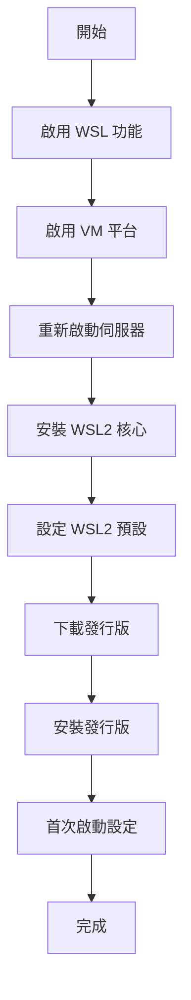

# 在 Windows Server 上安裝 WSL

> [!info] 適用版本
> - Windows Server 2022
> - Windows Server 2019

## 安裝步驟

### 步驟 1：啟用 WSL 功能

```powershell
# 以系統管理員身分執行 PowerShell
Enable-WindowsOptionalFeature -Online -FeatureName Microsoft-Windows-Subsystem-Linux -NoRestart
```

### 步驟 2：啟用虛擬機器平台 (WSL 2)

```powershell
Enable-WindowsOptionalFeature -Online -FeatureName VirtualMachinePlatform -NoRestart
```

### 步驟 3：重新啟動伺服器

```powershell
Restart-Computer
```

### 步驟 4：下載並安裝 WSL 2 核心更新

```powershell
# 下載核心更新套件
Invoke-WebRequest -Uri "https://wslstorestorage.blob.core.windows.net/wslblob/wsl_update_x64.msi" -OutFile "wsl_update_x64.msi"

# 安裝
Start-Process msiexec.exe -ArgumentList "/i wsl_update_x64.msi /quiet" -Wait
```

### 步驟 5：設定 WSL 2 為預設

```powershell
wsl --set-default-version 2
```

### 步驟 6：安裝 Linux 發行版

#### 方法 A：使用 PowerShell 下載

```powershell
# 下載 Ubuntu
Invoke-WebRequest -Uri https://aka.ms/wslubuntu2204 -OutFile Ubuntu.appx -UseBasicParsing

# 重新命名 (解壓縮)
Rename-Item Ubuntu.appx Ubuntu.zip

# 解壓縮
Expand-Archive Ubuntu.zip Ubuntu

# 執行安裝程式
cd Ubuntu
.\ubuntu2204.exe
```

#### 方法 B：直接使用 curl (Windows Server 2022)

```powershell
# 下載
curl.exe -L -o ubuntu.appx https://aka.ms/wslubuntu2204

# 安裝
Add-AppxPackage .\ubuntu.appx
```

## 安裝流程圖



## 企業部署

### 使用群組原則部署

1. 建立 GPO (群組原則物件)
2. 設定電腦設定 → 系統管理範本 → Windows 元件 → Windows 子系統 Linux 版
3. 啟用「允許 Windows 子系統 Linux 版」

### 使用 PowerShell DSC

```powershell
Configuration WSLInstall {
    Node "localhost" {
        WindowsFeature WSL {
            Ensure = "Enable"
            Name = "Microsoft-Windows-Subsystem-Linux"
        }

        WindowsFeature VMP {
            Ensure = "Enable"
            Name = "VirtualMachinePlatform"
        }

        Script InstallWSLKernel {
            GetScript = { @{} }
            SetScript = {
                Invoke-WebRequest -Uri "https://wslstorestorage.blob.core.windows.net/wslblob/wsl_update_x64.msi" -OutFile "wsl_update.msi"
                Start-Process msiexec.exe -ArgumentList "/i wsl_update.msi /quiet" -Wait
            }
            TestScript = { $false }
        }
    }
}
```

### 使用 Chocolatey 自動化

```powershell
# 安裝 Chocolatey
Set-ExecutionPolicy Bypass -Scope Process -Force
[System.Net.ServicePointManager]::SecurityProtocol = [System.Net.ServicePointManager]::SecurityProtocol -bor 3072
iex ((New-Object System.Net.WebClient).DownloadString('https://chocolatey.org/install.ps1'))

# 安裝 WSL 和 Ubuntu
choco install wsl2 -y
choco install ubuntu -y
```

## 伺服器特定設定

### 記憶體限制

建立 `%UserProfile%\.wslconfig`：

```ini
[wsl2]
memory=4GB
processors=2
swap=2GB
```

### 自動啟動

```powershell
# 建立 Windows 服務啟動腳本
$trigger = New-ScheduledTaskTrigger -AtStartup
$action = New-ScheduledTaskAction -Execute "wsl.exe" -Argument "-d Ubuntu"
Register-ScheduledTask -TaskName "StartWSL" -Trigger $trigger -Action $action -User "SYSTEM"
```

### 網路設定

```powershell
# 設定靜態 IP (需要在 .wslconfig 中設定)
# %UserProfile%\.wslconfig
[wsl2]
networkingMode=mirrored
```

## 遠端管理

### 使用 PowerShell Remoting

```powershell
# 在伺服器上啟用遠端
Enable-PSRemoting -Force

# 從用戶端連線
Enter-PSSession -ComputerName server01 -Credential admin

# 執行 WSL 命令
wsl --list --verbose
```

### 使用 SSH

```bash
# 在 Windows Server 上安裝 OpenSSH
Add-WindowsCapability -Online -Name OpenSSH.Server~~~~0.0.1.0

# 啟動服務
Start-Service sshd
Set-Service -Name sshd -StartupType 'Automatic'

# 從用戶端連線
ssh admin@server01
```

## 安全性考量

### 防火牆設定

```powershell
# 允許 WSL 網路存取
New-NetFirewallRule -DisplayName "WSL" -Direction Inbound -InterfaceAlias "vEthernet (WSL)" -Action Allow
```

### Windows Defender 排除

```powershell
# 排除 WSL 檔案
Add-MpPreference -ExclusionPath "C:\Users\*\AppData\Local\Packages\CanonicalGroupLimited*"
Add-MpPreference -ExclusionPath "C:\Program Files\WindowsApps\CanonicalGroupLimited*"
```

## 疑難排解

### WSL 服務無法啟動

```powershell
# 檢查服務狀態
Get-Service LxssManager

# 重新啟動服務
Restart-Service LxssManager

# 檢查事件日誌
Get-WinEvent -LogName "Microsoft-Windows-Subsystem-Linux/Operational" | Select-Object -First 10
```

### 核心安裝失敗

```powershell
# 手動安裝核心
msiexec /i wsl_update_x64.msi /l*v install.log

# 檢查安裝日誌
Get-Content install.log | Select-String "Error"
```

## 相關主題

- [[安裝WSL]] - Windows 10/11 安裝
- [[為您的公司設定WSL]] - 企業部署指南
- [[WSL的Intune設定]] - Intune 組態管理

---
> 📚 返回 [[0 Inbox/_processed/01-Tech/WSL/00-MOCs/MOC-總覽|WSL 知識庫總覽]]
