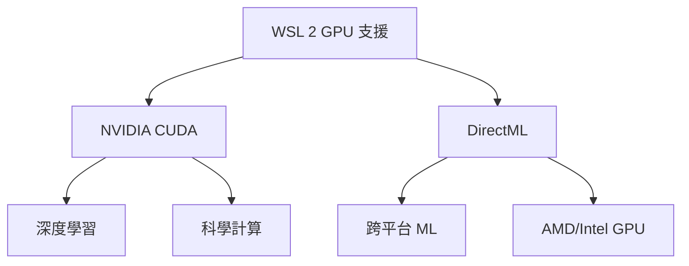

# 設定 GPU 加速

> [!info] 說明
> 在 WSL 2 中啟用 GPU 加速，支援 NVIDIA CUDA 和 DirectML。

## 支援的 GPU 架構



## NVIDIA CUDA 設定

### 系統需求

| 需求 | 版本 |
|------|------|
| Windows | 10 21H2+ / 11 |
| WSL | 2 |
| NVIDIA 驅動程式 | 510.x+ |
| GPU | Pascal 架構以上 |

### 安裝驅動程式

1. 下載 [NVIDIA 驅動程式 for WSL](https://www.nvidia.com/Download/index.aspx)
2. 選擇對應的 GPU 型號
3. 安裝 Windows 驅動程式

> [!important] 注意
> 不需要在 WSL 內安裝 NVIDIA 驅動程式，Windows 驅動程式會自動穿透到 WSL。

### 驗證 CUDA 支援

```bash
# 檢查 NVIDIA 驅動程式
nvidia-smi

# 輸出範例:
# +-----------------------------------------------------------------------------+
# | NVIDIA-SMI 535.86.10    Driver Version: 535.86.10    CUDA Version: 12.2     |
# |-------------------------------+----------------------+----------------------+
```

### 安裝 CUDA Toolkit

```bash
# 下載並安裝 CUDA Toolkit
wget https://developer.download.nvidia.com/compute/cuda/repos/wsl-ubuntu/x86_64/cuda-keyring_1.0-1_all.deb
sudo dpkg -i cuda-keyring_1.0-1_all.deb
sudo apt update
sudo apt install cuda-toolkit-12-2 -y
```

### 設定環境變數

```bash
# 加入到 ~/.bashrc
export PATH=/usr/local/cuda/bin:$PATH
export LD_LIBRARY_PATH=/usr/local/cuda/lib64:$LD_LIBRARY_PATH

# 重新載入
source ~/.bashrc
```

### 驗證 CUDA Toolkit

```bash
# 檢查 CUDA 版本
nvcc --version

# 編譯並執行範例
cd /usr/local/cuda/samples/1_Utilities/deviceQuery
sudo make
./deviceQuery
```

## PyTorch GPU 設定

### 安裝 PyTorch

```bash
# 使用 conda (推薦)
conda install pytorch torchvision torchaudio pytorch-cuda=12.1 -c pytorch -c nvidia

# 或使用 pip
pip install torch torchvision torchaudio --index-url https://download.pytorch.org/whl/cu121
```

### 驗證 GPU 支援

```python
import torch

# 檢查 CUDA 是否可用
print(f"CUDA available: {torch.cuda.is_available()}")
print(f"CUDA version: {torch.version.cuda}")
print(f"GPU count: {torch.cuda.device_count()}")
print(f"GPU name: {torch.cuda.get_device_name(0)}")

# 簡單測試
x = torch.rand(1000, 1000).cuda()
y = torch.rand(1000, 1000).cuda()
z = torch.matmul(x, y)
print(f"Result shape: {z.shape}")
```

## TensorFlow GPU 設定

### 安裝 TensorFlow

```bash
# 使用 pip
pip install tensorflow[and-cuda]
```

### 驗證 GPU 支援

```python
import tensorflow as tf

# 列出 GPU
print("GPUs:", tf.config.list_physical_devices('GPU'))

# 簡單測試
with tf.device('/GPU:0'):
    a = tf.constant([[1.0, 2.0], [3.0, 4.0]])
    b = tf.constant([[1.0, 2.0], [3.0, 4.0]])
    c = tf.matmul(a, b)
    print(c)
```

## DirectML 設定

DirectML 支援 AMD 和 Intel GPU。

### 安裝 DirectML

```bash
# 安裝 DirectML for TensorFlow
pip install tensorflow-directml

# 安裝 DirectML for PyTorch
pip install torch-directml
```

### PyTorch DirectML

```python
import torch
import torch_directml

# 使用 DirectML 裝置
dml = torch_directml.device()

# 建立張量
x = torch.rand(3, 3).to(dml)
y = torch.rand(3, 3).to(dml)
z = x + y
print(z)
```

## Docker GPU 支援

### 安裝 NVIDIA Container Toolkit

```bash
# 設定套件庫
curl -fsSL https://nvidia.github.io/libnvidia-container/gpgkey | sudo gpg --dearmor -o /usr/share/keyrings/nvidia-container-toolkit-keyring.gpg

curl -s -L https://nvidia.github.io/libnvidia-container/stable/deb/nvidia-container-toolkit.list | \
  sed 's#deb https://#deb [signed-by=/usr/share/keyrings/nvidia-container-toolkit-keyring.gpg] https://#g' | \
  sudo tee /etc/apt/sources.list.d/nvidia-container-toolkit.list

# 安裝
sudo apt update
sudo apt install -y nvidia-container-toolkit

# 設定 Docker
sudo nvidia-ctk runtime configure --runtime=docker
sudo systemctl restart docker
```

### 執行 GPU 容器

```bash
# 測試 NVIDIA 容器
docker run --gpus all nvidia/cuda:12.1-base-ubuntu22.04 nvidia-smi

# 使用 PyTorch GPU 容器
docker run --gpus all -it pytorch/pytorch:latest python -c "import torch; print(torch.cuda.is_available())"
```

### Docker Compose GPU

```yaml
version: '3.8'

services:
  ml:
    image: pytorch/pytorch:latest
    deploy:
      resources:
        reservations:
          devices:
            - driver: nvidia
              count: 1
              capabilities: [gpu]
    volumes:
      - ./src:/app
    working_dir: /app
    command: python train.py
```

## 效能優化

### CUDA 效能調整

```bash
# 設定 CUDA 可見裝置
export CUDA_VISIBLE_DEVICES=0,1

# 設定 TF32 精度 (Ampere GPU)
export NVIDIA_TF32_OVERRIDE=1
```

### 記憶體管理

```python
# PyTorch 清除 GPU 快取
import torch
torch.cuda.empty_cache()

# 設定記憶體增長
import tensorflow as tf
gpus = tf.config.experimental.list_physical_devices('GPU')
for gpu in gpus:
    tf.config.experimental.set_memory_growth(gpu, True)
```

## 疑難排解

### nvidia-smi 找不到

```bash
# 檢查 Windows 驅動程式
# 確保已安裝 WSL 版本的驅動程式

# 檢查 PATH
echo $PATH | grep nvidia
```

### CUDA 版本不符

```bash
# 檢查驅動程式支援的 CUDA 版本
nvidia-smi

# 檢查安裝的 CUDA Toolkit 版本
nvcc --version

# 確保版本相容
```

### 記憶體不足

```bash
# 監控 GPU 記憶體使用
watch -n 1 nvidia-smi

# 設定 PyTorch 記憶體限制
import torch
torch.cuda.set_per_process_memory_fraction(0.5, 0)
```

## 相關主題

- [[開始使用Docker遠端容器]] - Docker 容器
- [[進階設定組態]] - WSL 設定
- [[故障排除]] - 常見問題

---
> 📚 返回 [[0 Inbox/_processed/01-Tech/WSL/00-MOCs/MOC-總覽|WSL 知識庫總覽]]
