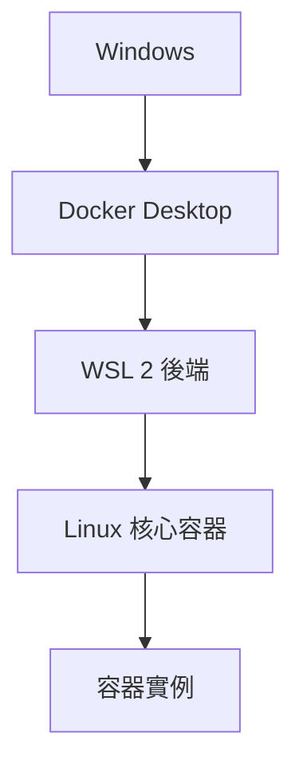

# 開始使用 Docker 遠端容器

> [!info] 說明
> 在 WSL 2 中使用 Docker 進行容器化開發。

## Docker 與 WSL 2



### 為什麼選擇 WSL 2 + Docker？

| 優勢 | 說明 |
|------|------|
| ✅ 原生 Linux 核心 | Docker 需要真實 Linux 核心 |
| ✅ 效能接近原生 | 無需傳統 VM 開銷 |
| ✅ 無縫整合 | Windows <-> Linux <-> Docker |
| ✅ 完整功能支援 | 包括 Kubernetes |

## 安裝 Docker

### 方法 A：Docker Desktop (推薦)

1. 下載 [Docker Desktop for Windows](https://www.docker.com/products/docker-desktop/)
2. 安裝時選擇 "Use WSL 2 instead of Hyper-V"
3. 安裝完成後重新啟動

### 方法 B：在 WSL 中安裝 Docker Engine

```bash
# 更新套件索引
sudo apt update

# 安裝相依套件
sudo apt install ca-certificates curl gnupg lsb-release -y

# 加入 Docker GPG 金鑰
sudo install -m 0755 -d /etc/apt/keyrings
curl -fsSL https://download.docker.com/linux/ubuntu/gpg | \
  sudo gpg --dearmor -o /etc/apt/keyrings/docker.gpg
sudo chmod a+r /etc/apt/keyrings/docker.gpg

# 加入 Docker 套件庫
echo \
  "deb [arch=$(dpkg --print-architecture) signed-by=/etc/apt/keyrings/docker.gpg] https://download.docker.com/linux/ubuntu \
  $(lsb_release -cs) stable" | sudo tee /etc/apt/sources.list.d/docker.list > /dev/null

# 安裝 Docker Engine
sudo apt update
sudo apt install docker-ce docker-ce-cli containerd.io docker-buildx-plugin docker-compose-plugin -y
```

### 設定權限

```bash
# 將使用者加入 docker 群組
sudo usermod -aG docker $USER

# 重新登入或執行
newgrp docker
```

### 啟動服務

```bash
# 如果使用 systemd
sudo systemctl start docker
sudo systemctl enable docker

# 或手動啟動
sudo service docker start
```

## 驗證安裝

```bash
# 檢查 Docker 版本
docker --version

# 執行測試容器
docker run hello-world

# 檢查 Docker 資訊
docker info
```

## Docker 基本操作

### 映像檔管理

```bash
# 搜尋映像檔
docker search nginx

# 拉取映像檔
docker pull nginx:latest
docker pull python:3.11-slim

# 列出本機映像檔
docker images

# 刪除映像檔
docker rmi nginx:latest
```

### 容器管理

```bash
# 執行容器
docker run -d --name mynginx -p 8080:80 nginx

# 列出執行中的容器
docker ps

# 列出所有容器
docker ps -a

# 停止容器
docker stop mynginx

# 啟動容器
docker start mynginx

# 刪除容器
docker rm mynginx

# 強制刪除執行中的容器
docker rm -f mynginx
```

### 進入容器

```bash
# 執行命令
docker exec mynginx ls /etc/nginx

# 互動式終端機
docker exec -it mynginx bash

# 附加到容器
docker attach mynginx
```

## Docker Compose

### 安裝 (如果使用 Docker Engine)

```bash
# Docker Compose V2 已包含在 docker-ce-cli 中
docker compose version
```

### docker-compose.yml 範例

```yaml
version: '3.8'

services:
  web:
    build: .
    ports:
      - "8000:8000"
    volumes:
      - .:/app
    environment:
      - DEBUG=1
    depends_on:
      - db
      - redis

  db:
    image: postgres:15
    environment:
      POSTGRES_USER: user
      POSTGRES_PASSWORD: password
      POSTGRES_DB: mydb
    volumes:
      - postgres_data:/var/lib/postgresql/data

  redis:
    image: redis:7
    volumes:
      - redis_data:/data

volumes:
  postgres_data:
  redis_data:
```

### 使用 Docker Compose

```bash
# 啟動服務
docker compose up -d

# 查看日誌
docker compose logs -f

# 停止服務
docker compose down

# 重建並啟動
docker compose up -d --build
```

## 開發工作流程

### 開發環境設定

```dockerfile
# Dockerfile.dev
FROM python:3.11-slim

WORKDIR /app

COPY requirements.txt .
RUN pip install -r requirements.txt

COPY . .

CMD ["python", "manage.py", "runserver", "0.0.0.0:8000"]
```

```yaml
# docker-compose.dev.yml
version: '3.8'
services:
  app:
    build:
      context: .
      dockerfile: Dockerfile.dev
    ports:
      - "8000:8000"
    volumes:
      - .:/app
    environment:
      - DEBUG=1
```

### VS Code 整合

安裝 Docker 擴充功能：

```bash
code --install-extension ms-azuretools.vscode-docker
```

功能：
- 容器管理
- 映像檔管理
- Docker Compose 支援
- 直接附加到容器開發

## 效能優化

### 使用 .dockerignore

```dockerignore
# .dockerignore
__pycache__
*.pyc
*.pyo
*.pyd
.Python
*.so
.env
.venv
venv/
node_modules/
.git
.gitignore
README.md
.dockerignore
Dockerfile
docker-compose*.yml
```

### 多階段建置

```dockerfile
# 建置階段
FROM node:18 AS builder
WORKDIR /app
COPY package*.json ./
RUN npm ci
COPY . .
RUN npm run build

# 執行階段
FROM nginx:alpine
COPY --from=builder /app/dist /usr/share/nginx/html
EXPOSE 80
CMD ["nginx", "-g", "daemon off;"]
```

## 常見設定

### 網路設定

```bash
# 建立自訂網路
docker network create mynetwork

# 容器加入網路
docker run --network mynetwork --name app1 myimage
docker run --network mynetwork --name app2 myimage

# 容器間通訊
# app1 可以通過主機名 "app2" 連線到 app2
```

### 磁碟區管理

```bash
# 建立磁碟區
docker volume create mydata

# 掛載磁碟區
docker run -v mydata:/data myimage

# 掛載本機目錄
docker run -v $(pwd)/data:/data myimage

# 列出磁碟區
docker volume ls

# 刪除磁碟區
docker volume rm mydata
```

## Kubernetes 支援

### 啟用 Kubernetes (Docker Desktop)

1. 開啟 Docker Desktop 設定
2. 選擇 "Kubernetes"
3. 啟用 "Enable Kubernetes"
4. 等待啟動完成

### 使用 kubectl

```bash
# 檢查叢集狀態
kubectl cluster-info

# 部署應用
kubectl create deployment nginx --image=nginx

# 暴露服務
kubectl expose deployment nginx --port=80 --type=NodePort

# 取得服務
kubectl get services
```

## 疑難排解

### Docker daemon 未啟動

```bash
# 檢查服務狀態
sudo service docker status

# 啟動服務
sudo service docker start
```

### 權限問題

```bash
# 確保使用者在 docker 群組
groups $USER

# 如果沒有 docker 群組
sudo usermod -aG docker $USER
newgrp docker
```

### 磁碟空間問題

```bash
# 清理未使用的資源
docker system prune -a

# 查看磁碟使用
docker system df
```

## 相關主題

- [[開始使用資料庫]] - 資料庫設定
- [[設定GPU加速]] - GPU 加速容器
- [[網路相關考量]] - 網路設定

---
> 📚 返回 [[0 Inbox/_processed/01-Tech/WSL/00-MOCs/MOC-總覽|WSL 知識庫總覽]]
