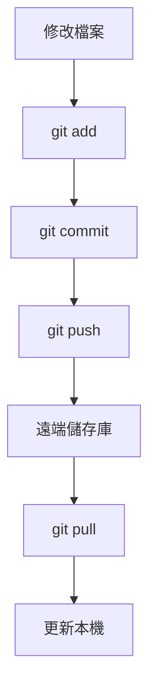

# 開始使用 Git

> [!info] 說明
> 在 WSL 中設定和使用 Git 進行版本控制。

## 安裝 Git

### 在 Linux 發行版中安裝

```bash
# Ubuntu/Debian
sudo apt update
sudo apt install git -y

# 驗證安裝
git --version
```

## 基本設定

### 使用者資訊

```bash
# 設定使用者名稱
git config --global user.name "Your Name"

# 設定電子郵件
git config --global user.email "your@email.com"

# 設定預設分支名稱
git config --global init.defaultBranch main
```

### 編輯器設定

```bash
# 使用 VS Code 作為預設編輯器
git config --global core.editor "code --wait"

# 使用 Nano
git config --global core.editor "nano"

# 使用 Vim
git config --global core.editor "vim"
```

### 查看設定

```bash
# 查看所有設定
git config --list

# 查看特定設定
git config user.name
```

## 憑證管理

### 使用 Windows 憑證管理員

```bash
# 設定 Git 使用 Windows 憑證管理員
git config --global credential.helper "/mnt/c/Program\ Files/Git/mingw64/bin/git-credential-manager.exe"
```

### 使用 Git Credential Manager Core

```bash
# 較新的方式
git config --global credential.helper manager-core
```

## SSH 金鑰設定

### 產生 SSH 金鑰

```bash
# 產生 ED25519 金鑰 (推薦)
ssh-keygen -t ed25519 -C "your@email.com"

# 或產生 RSA 金鑰
ssh-keygen -t rsa -b 4096 -C "your@email.com"
```

### 設定 SSH Agent

```bash
# 啟動 SSH Agent
eval "$(ssh-agent -s)"

# 加入金鑰
ssh-add ~/.ssh/id_ed25519

# 設定自動啟動 (加入 ~/.bashrc 或 ~/.zshrc)
echo 'eval "$(ssh-agent -s)"' >> ~/.bashrc
echo 'ssh-add ~/.ssh/id_ed25519 2>/dev/null' >> ~/.bashrc
```

### 複製公鑰

```bash
# 顯示公鑰
cat ~/.ssh/id_ed25519.pub

# 或複製到剪貼簿
cat ~/.ssh/id_ed25519.pub | clip.exe
```

### 加入到 GitHub/GitLab

1. 前往 GitHub/GitLab 設定頁面
2. 選擇 SSH and GPG keys
3. 新增 SSH key，貼上公鑰內容

### 測試連線

```bash
# 測試 GitHub
ssh -T git@github.com

# 測試 GitLab
ssh -T git@gitlab.com
```

## 常用 Git 命令

### 初始化與複製

```bash
# 初始化新儲存庫
git init

# 複製現有儲存庫 (HTTPS)
git clone https://github.com/user/repo.git

# 複製現有儲存庫 (SSH)
git clone git@github.com:user/repo.git
```

### 日常工作流程



```bash
# 查看狀態
git status

# 加入檔案到暫存區
git add .
git add file.txt

# 提交變更
git commit -m "描述變更內容"

# 推送到遠端
git push origin main

# 從遠端拉取
git pull origin main
```

### 分支管理

```bash
# 建立分支
git branch feature-branch

# 切換分支
git checkout feature-branch
# 或
git switch feature-branch

# 建立並切換
git checkout -b feature-branch
# 或
git switch -c feature-branch

# 合併分支
git checkout main
git merge feature-branch

# 刪除分支
git branch -d feature-branch
```

## Git 別名設定

```bash
# 設定常用別名
git config --global alias.co checkout
git config --global alias.br branch
git config --global alias.ci commit
git config --global alias.st status
git config --global alias.unstage 'reset HEAD --'
git config --global alias.last 'log -1 HEAD'
git config --global alias.visual 'log --oneline --graph --all'
```

## .gitignore 設定

```bash
# 建立全域 .gitignore
git config --global core.excludesfile ~/.gitignore_global
```

常用的 `.gitignore_global` 內容：

```gitignore
# OS generated files
.DS_Store
.DS_Store?
._*
.Spotlight-V100
.Trashes
ehthumbs.db
Thumbs.db

# Editor directories and files
.idea
.vscode
*.swp
*.swo
*~

# Logs
*.log
logs/
```

## Git 工具推薦

### 命令列工具

```bash
# 安裝 tig (文字介面 Git 瀏覽器)
sudo apt install tig

# 安裝 lazygit
# https://github.com/jesseduffield/lazygit
```

### VS Code 整合

```bash
# 安裝 GitLens 擴充功能
code --install-extension eamodio.gitlens
```

## Git 工作流程範例

```bash
# 1. 複製專案
git clone git@github.com:user/project.git
cd project

# 2. 建立功能分支
git checkout -b feature/new-feature

# 3. 進行開發...
# 修改檔案

# 4. 查看變更
git status
git diff

# 5. 提交變更
git add .
git commit -m "Add new feature"

# 6. 推送分支
git push -u origin feature/new-feature

# 7. 建立 Pull Request (在 GitHub/GitLab)

# 8. 合併後更新本機
git checkout main
git pull origin main

# 9. 刪除功能分支
git branch -d feature/new-feature
```

## 疑難排解

### 權限問題

```bash
# 修正 .ssh 目錄權限
chmod 700 ~/.ssh
chmod 600 ~/.ssh/id_ed25519
chmod 644 ~/.ssh/id_ed25519.pub
```

### LF/CRLF 問題

```bash
# 設定自動轉換
git config --global core.autocrlf input

# 或停用自動轉換
git config --global core.autocrlf false
```

### 清除快取憑證

```bash
# 如果憑證有問題
git credential-cache exit
```

## 相關主題

- [[開始使用VSCode]] - VS Code 整合
- [[設定最佳實務做法]] - 開發環境設定
- [[跨文件系統工作]] - 檔案系統考量

---
> 📚 返回 [[0 Inbox/_processed/01-Tech/WSL/00-MOCs/MOC-總覽|WSL 知識庫總覽]]
