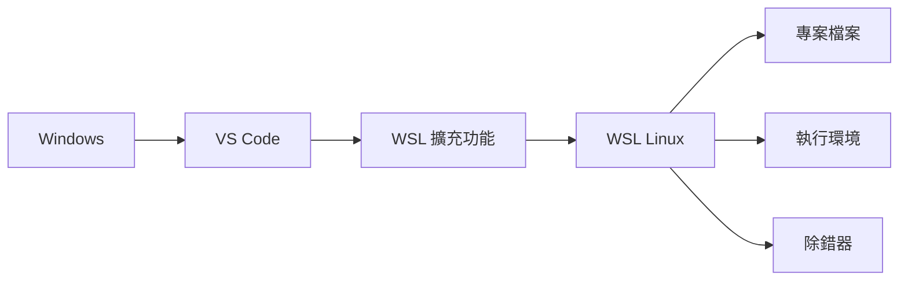
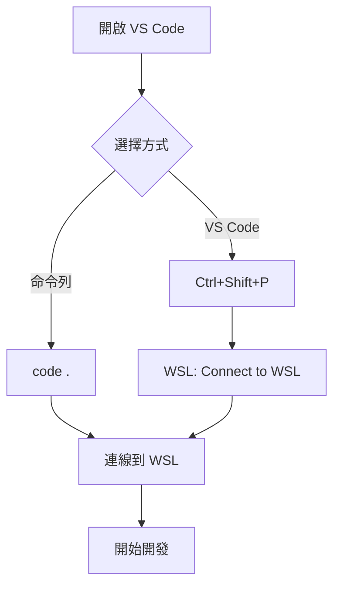

# 開始使用 VS Code

> [!info] 說明
> 使用 Visual Studio Code 的遠端開發功能，在 WSL 中進行開發。

## 為什麼使用 VS Code + WSL？



### 優勢

| 特點 | 說明 |
|------|------|
| 🚀 **原生效能** | 在 Linux 檔案系統中執行 |
| 🔗 **無縫整合** | Windows UI + Linux 後端 |
| 🐛 **完整除錯** | 直接在 Linux 環境除錯 |
| 🔌 **擴充功能** | 自動安裝 Linux 版擴充功能 |

## 安裝設定

### 1. 安裝 VS Code

從 [code.visualstudio.com](https://code.visualstudio.com/) 下載並安裝。

### 2. 安裝 WSL 擴充功能

在 VS Code 中：

1. 按 `Ctrl+Shift+X` 開啟擴充功能
2. 搜尋 "WSL"
3. 安裝 "WSL" 擴充功能 (ms-vscode-remote.remote-wsl)

或使用命令列：

```bash
code --install-extension ms-vscode-remote.remote-wsl
```

## 開始使用

### 從 WSL 啟動 VS Code

```bash
# 在 Linux 終端機中
cd ~/projects/myapp
code .
```

VS Code 會：
1. 啟動 Windows 版 VS Code
2. 連線到 WSL
3. 開啟 Linux 檔案系統中的專案

### 從 VS Code 連線到 WSL

1. 按 `F1` 或 `Ctrl+Shift+P`
2. 輸入 "WSL"
3. 選擇以下選項：
   - **WSL: Connect to WSL** - 連線到預設發行版
   - **WSL: Connect to WSL using Distro** - 選擇特定發行版
   - **WSL: Reopen Folder in WSL** - 在 WSL 中重新開啟資料夾

### 狀態列指示器

連線成功後，VS Code 左下角會顯示：

```
WSL: Ubuntu
```

## 遠端開發工作流程

### 開啟專案



### 終端機整合

在 VS Code 中開啟 WSL 終端機：

```bash
# 按 Ctrl+` 開啟終端機
# 終端機會自動在 WSL 環境中執行

# 驗證
uname -a
# Linux ...
```

### 除錯

設定除錯環境 (`.vscode/launch.json`)：

```json
{
    "version": "0.2.0",
    "configurations": [
        {
            "name": "Python: Current File",
            "type": "python",
            "request": "launch",
            "program": "${file}",
            "console": "integratedTerminal"
        }
    ]
}
```

## 擴充功能管理

### 在 WSL 中安裝擴充功能

VS Code 擴充功能分為兩類：

| 類型 | 安裝位置 | 範例 |
|------|----------|------|
| UI 擴充功能 | Windows | 主題、鍵盤快捷鍵 |
| 工作區擴充功能 | WSL | 語言伺服器、除錯器 |

### 查看已安裝的擴充功能

1. 開啟擴充功能面板 (`Ctrl+Shift+X`)
2. 查看 "Local" 和 "WSL: Ubuntu" 區段

### 推薦擴充功能

```json
// .vscode/extensions.json
{
    "recommendations": [
        "ms-vscode-remote.remote-wsl",
        "ms-python.python",
        "dbaeumer.vscode-eslint",
        "esbenp.prettier-vscode",
        "ms-azuretools.vscode-docker",
        "eamodio.gitlens"
    ]
}
```

## 常見設定

### settings.json (工作區)

```json
{
    "terminal.integrated.defaultProfile.linux": "bash",
    "files.eol": "\n",
    "editor.formatOnSave": true,
    "editor.defaultFormatter": "esbenp.prettier-vscode"
}
```

### Git 設定

```json
{
    "git.path": "/usr/bin/git",
    "git.autofetch": true
}
```

## 效能優化

### 使用 Linux 檔案系統

```bash
# ✅ 正確 - 在 Linux 檔案系統中
code ~/projects/myapp

# ❌ 避免 - 從 Windows 開啟 WSL 檔案
code \\wsl$\Ubuntu\home\user\projects\myapp
```

### 排除不需要的檔案

```json
{
    "files.watcherExclude": {
        "**/.git/**": true,
        "**/node_modules/**": true,
        "**/dist/**": true
    },
    "search.exclude": {
        "**/node_modules": true,
        "**/bower_components": true,
        "**/*.code-search": true
    }
}
```

## 常見問題

### 連線失敗

```bash
# 重新安裝 VS Code Server
rm -rf ~/.vscode-server
code .
```

### 擴充功能不相容

```bash
# 檢查擴充功能是否支援 Linux
# 在擴充功能頁面查看詳細資訊
```

### 效能問題

```json
// 增加 VS Code 記憶體限制
{
    "files.maxMemoryForLargeFilesMB": 8192
}
```

## 鍵盤快捷鍵

| 快捷鍵 | 功能 |
|--------|------|
| `Ctrl+Shift+P` | 命令面板 |
| `Ctrl+`` | 開啟終端機 |
| `F1` | 命令面板 |
| `Ctrl+K Ctrl+O` | 開啟資料夾 |
| `Ctrl+Shift+` ` | 新終端機 |

## 相關主題

- [[設定最佳實務做法]] - 環境設定建議
- [[開始使用Git]] - Git 整合
- [[開始使用Docker遠端容器]] - Docker 開發

---
> 📚 返回 [[0 Inbox/_processed/01-Tech/WSL/00-MOCs/MOC-總覽|WSL 知識庫總覽]]
