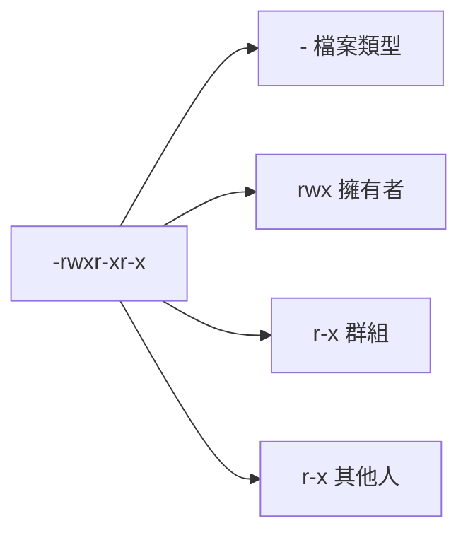

# 檔案存取權和許可權

> [!info] 說明
> 了解 WSL 中的檔案權限系統和跨系統權限管理。

## Linux 權限基礎

### 權限表示法

```bash
ls -l file.txt
# -rwxr-xr-x 1 user group 123 Jan 1 file.txt
```



### 權限數值

| 權限 | 數值 | 說明 |
|------|------|------|
| `r` | 4 | 讀取 |
| `w` | 2 | 寫入 |
| `x` | 1 | 執行 |
| `-` | 0 | 無權限 |

### 常見權限組合

| 數值 | 權限 | 說明 |
|------|------|------|
| 7 | `rwx` | 完整權限 |
| 6 | `rw-` | 讀寫 |
| 5 | `r-x` | 讀取和執行 |
| 4 | `r--` | 唯讀 |
| 0 | `---` | 無權限 |

### 常用設定

```bash
# 755 - 目錄預設
# 擁有者: rwx, 群組/其他: r-x
chmod 755 directory/

# 644 - 檔案預設
# 擁有者: rw-, 群組/其他: r--
chmod 644 file.txt

# 700 - 私人目錄
# 僅擁有者有完整權限
chmod 700 private/

# 600 - 私人檔案
# 僅擁有者可讀寫
chmod 600 secret.txt
```

## chmod 命令

### 數字模式

```bash
# 設定權限
chmod 755 script.sh
chmod 644 config.txt
chmod 700 ~/.ssh

# 遞迴設定
chmod -R 755 /var/www/
```

### 符號模式

```bash
# 加入權限
chmod +x script.sh      # 所有人可執行
chmod u+x script.sh     # 擁有者可執行
chmod g+w file.txt      # 群組可寫
chmod o+r file.txt      # 其他人可讀

# 移除權限
chmod -x script.sh      # 移除執行權限
chmod go-w file.txt     # 群組和其他人不可寫

# 設定權限
chmod u=rwx,g=rx,o=r file.txt

# 參考另一個檔案設定
chmod --reference=source.txt target.txt
```

## chown 和 chgrp

### 變更擁有者

```bash
# 變更擁有者
chown user file.txt
chown user:group file.txt

# 僅變更群組
chgrp group file.txt

# 遞迴變更
chown -R user:group directory/
```

### 特殊權限

```bash
# SUID (4) - 執行時以擁有者身份
chmod 4755 /usr/bin/sudo
# -rwsr-xr-x

# SGID (2) - 目錄中新檔案繼承群組
chmod 2775 /shared/
# drwxrwsr-x

# Sticky bit (1) - 僅擁有者可刪除
chmod 1777 /tmp/
# drwxrwxrwt
```

## WSL 權限特殊考量

### DrvFs (Windows 磁碟) 權限

Windows 磁碟掛載在 `/mnt/` 下時，權限由掛載選項決定。

```bash
# 查看掛載選項
mount | grep drvfs
# C: on /mnt/c type drvfs (rw,noatime,uid=1000,gid=1000)
```

### 啟用 metadata 選項

```ini
# /etc/wsl.conf
[automount]
options = "metadata,umask=22,fmask=11"
```

啟用後可以在 Windows 檔案上設定 Linux 權限：

```bash
# 設定執行權限
chmod +x /mnt/c/scripts/myscript.sh

# 查看權限
ls -la /mnt/c/scripts/
```

### umask 設定

```bash
# 查看當前 umask
umask
# 0022

# 設定 umask
umask 022  # 新檔案: 644, 新目錄: 755
umask 077  # 新檔案: 600, 新目錄: 700

# 永久設定 (加入 ~/.bashrc)
echo "umask 022" >> ~/.bashrc
```

## 特殊檔案權限

### SSH 金鑰權限

```bash
# 私鑰必須是 600
chmod 600 ~/.ssh/id_ed25519

# 公鑰和設定檔
chmod 644 ~/.ssh/id_ed25519.pub
chmod 644 ~/.ssh/authorized_keys
chmod 644 ~/.ssh/known_hosts

# .ssh 目錄
chmod 700 ~/.ssh
```

### 腳本檔案

```bash
# 使腳本可執行
chmod +x script.sh

# 執行腳本
./script.sh
```

### 設定檔

```bash
# 敏感設定檔
chmod 600 .env
chmod 600 config/secrets.yml
```

## ACL (存取控制清單)

### 安裝 ACL 工具

```bash
sudo apt install acl
```

### 使用 ACL

```bash
# 查看 ACL
getfacl file.txt

# 設定 ACL
setfacl -m u:username:rw file.txt
setfacl -m g:groupname:rx directory/

# 移除 ACL
setfacl -x u:username file.txt

# 設定預設 ACL (目錄)
setfacl -d -m u:username:rw directory/
```

## 權限繼承

### 目錄預設權限

```bash
# 設定目錄的預設 ACL
setfacl -d -m u::rwx,g::r-x,o::r-x shared/

# 新建立的檔案會繼承這些權限
touch shared/newfile.txt
getfacl shared/newfile.txt
```

### SGID 目錄

```bash
# 設定 SGID - 新檔案繼承目錄群組
chmod 2775 /shared/
chown :developers /shared/

# 所有新檔案會屬於 developers 群組
```

## 疑難排解

### 權限被拒

```bash
# 檢查權限
ls -la file.txt

# 檢查擁有者
stat file.txt

# 檢查父目錄權限
ls -la .. | grep directory
```

### Windows 檔案權限問題

```bash
# 確認 metadata 已啟用
mount | grep metadata

# 如果沒有，編輯 /etc/wsl.conf
# [automount]
# options = "metadata"
```

### 執行權限問題

```bash
# 檢查檔案類型
file script.sh

# 檢查 shebang
head -1 script.sh
#!/bin/bash

# 使用明確的解譯器
bash script.sh
```

## 最佳實務

### 權限設定建議

| 檔案類型 | 建議權限 |
|----------|----------|
| 私人檔案 | 600 |
| 私人目錄 | 700 |
| 腳本 | 755 |
| 設定檔 | 644 |
| 共用目錄 | 775 |
| 網頁目錄 | 755 |

### 安全性檢查

```bash
# 尋找世界可寫的檔案
find /path -perm -o+w

# 尋找 SUID 檔案
find /path -perm -4000

# 尋找無擁有者的檔案
find /path -nouser -o -nogroup
```

## 相關主題

- [[跨文件系統工作]] - 跨系統檔案操作
- [[進階設定組態]] - WSL 設定選項
- [[故障排除]] - 常見問題

---
> 📚 返回 [[0 Inbox/_processed/01-Tech/WSL/00-MOCs/MOC-總覽|WSL 知識庫總覽]]
