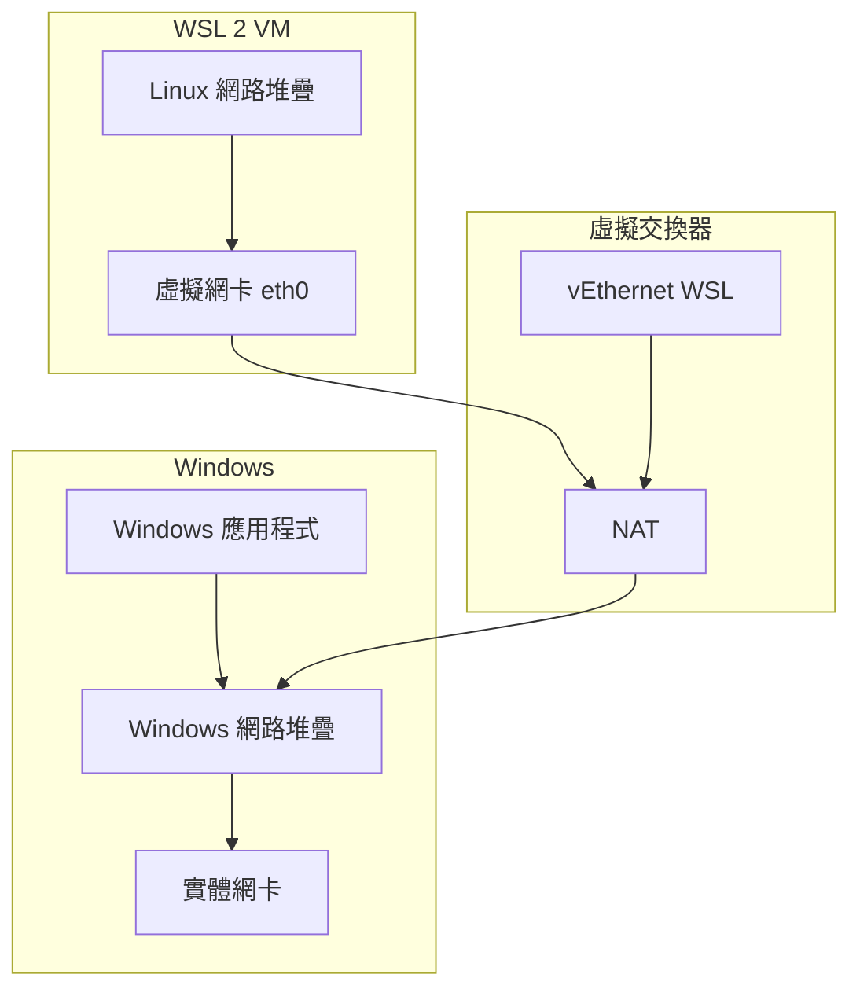

# 網路相關考量

> [!info] 說明
> 了解 WSL 的網路架構和設定選項。

## WSL 網路架構

### NAT 模式 (預設)



### 網路模式

| 模式 | 說明 | 使用場景 |
|------|------|----------|
| NAT (預設) | WSL 有獨立 IP | 一般開發 |
| Mirrored | WSL 與 Windows 共用 IP | 需要相同網路位址 |
| Bridged | WSL 直接連接實體網路 | 伺服器應用 |

## IP 位址

### 查看 WSL IP

```bash
# 在 WSL 中
ip addr show eth0

# 或
hostname -I

# 簡短輸出
ip -4 addr show eth0 | grep -oP '(?<=inet\s)\d+(\.\d+){3}'
```

### 從 Windows 連線到 WSL

```bash
# WSL 服務預設會轉送到 localhost
# 在 WSL 啟動服務
python -m http.server 8000

# 在 Windows 瀏覽器
# http://localhost:8000
```

### 從 WSL 連線到 Windows

```bash
# Windows 主機 IP
cat /etc/resolv.conf | grep nameserver | awk '{print $2}'

# 或使用特殊主機名稱
ping $(hostname).local
```

## 連接埠轉送

### 自動轉送

WSL 2 會自動將 WSL 內的服務轉送到 Windows localhost。

```bash
# 在 WSL 啟動服務
npm run dev  # 假設在 port 3000

# 從 Windows 存取
# http://localhost:3000
```

### 手動設定連接埠轉送

```powershell
# 在 Windows PowerShell (系統管理員)
# 轉送 WSL 服務到外部網路
netsh interface portproxy add v4tov4 `
    listenport=80 `
    listenaddress=0.0.0.0 `
    connectport=80 `
    connectaddress=$(wsl hostname -I)
```

### 查看轉送規則

```powershell
netsh interface portproxy show all
```

### 刪除轉送規則

```powershell
netsh interface portproxy delete v4tov4 listenport=80 listenaddress=0.0.0.0
```

## 防火牆設定

### Windows 防火牆

```powershell
# 允許 WSL 連入連線
New-NetFirewallRule -DisplayName "WSL" `
    -Direction Inbound `
    -InterfaceAlias "vEthernet (WSL)" `
    -Action Allow
```

### WSL 防火牆 (ufw)

```bash
# 安裝 ufw
sudo apt install ufw -y

# 允許 SSH
sudo ufw allow 22

# 允許 HTTP
sudo ufw allow 80

# 啟用防火牆
sudo ufw enable

# 查看狀態
sudo ufw status
```

## DNS 設定

### 自動 DNS

WSL 預設會自動產生 `/etc/resolv.conf`。

### 自訂 DNS

```ini
# /etc/wsl.conf
[network]
generateResolvConf=false
```

```bash
# 編輯 resolv.conf
sudo nano /etc/resolv.conf

# 加入自訂 DNS
nameserver 8.8.8.8
nameserver 8.8.4.4
```

### 防止覆蓋

```bash
# 設定不可變屬性
sudo chattr +i /etc/resolv.conf

# 移除不可變屬性
sudo chattr -i /etc/resolv.conf
```

## 進階網路設定

### Mirrored 模式

```ini
# %UserProfile%\.wslconfig
[wsl2]
networkingMode=mirrored

[experimental]
hostAddressLoopback=true
```

### Bridged 模式

```ini
# %UserProfile%\.wslconfig
[wsl2]
networkingMode=bridged
vmSwitch=ExternalSwitch
```

### Proxy 設定

```bash
# 設定環境變數
export http_proxy="http://proxy.company.com:8080"
export https_proxy="http://proxy.company.com:8080"
export no_proxy="localhost,127.0.0.1,*.company.com"

# 永久設定 (加入 ~/.bashrc)
echo 'export http_proxy="http://proxy.company.com:8080"' >> ~/.bashrc
echo 'export https_proxy="http://proxy.company.com:8080"' >> ~/.bashrc
```

## 網路工具

### 檢查連線

```bash
# 檢查網路介面
ip link show

# 檢查路由
ip route show

# 檢查連接埠
ss -tuln

# 網路診斷
ping google.com
traceroute google.com
nslookup google.com
```

### 網路監控

```bash
# 安裝工具
sudo apt install net-tools nload nethogs -y

# 即時流量監控
nload

# 按程序監控流量
sudo nethogs

# 連線狀態
netstat -tuln
```

## VPN 相容性

### VPN 問題

某些 VPN 軟體可能會影響 WSL 網路連線。

### 解決方案

1. **使用 Split Tunneling**
   - 設定 VPN 排除 WSL 網路

2. **設定 DNS**
   ```bash
   # 手動設定 DNS
   sudo nano /etc/resolv.conf
   nameserver 8.8.8.8
   ```

3. **停用自動 DNS**
   ```ini
   # /etc/wsl.conf
   [network]
   generateResolvConf=false
   ```

## 常見問題

### 無法從外部連線 WSL

```powershell
# 1. 設定連接埠轉送
netsh interface portproxy add v4tov4 listenport=80 listenaddress=0.0.0.0 connectport=80 connectaddress=<WSL_IP>

# 2. 開啟防火牆
New-NetFirewallRule -DisplayName "WSL HTTP" -Direction Inbound -LocalPort 80 -Action Allow
```

### DNS 解析失敗

```bash
# 檢查 DNS 設定
cat /etc/resolv.conf

# 測試 DNS
nslookup google.com

# 如有問題，手動設定
sudo rm /etc/resolv.conf
echo "nameserver 8.8.8.8" | sudo tee /etc/resolv.conf
```

### 網路效能問題

```bash
# 檢查 MTU
ip link show eth0

# 調整 MTU (如需要)
sudo ip link set dev eth0 mtu 1400
```

## 相關主題

- [[進階設定組態]] - WSL 設定選項
- [[為您的公司設定WSL]] - 企業網路設定
- [[故障排除]] - 常見問題

---
> 📚 返回 [[0 Inbox/_processed/01-Tech/WSL/00-MOCs/MOC-總覽|WSL 知識庫總覽]]
