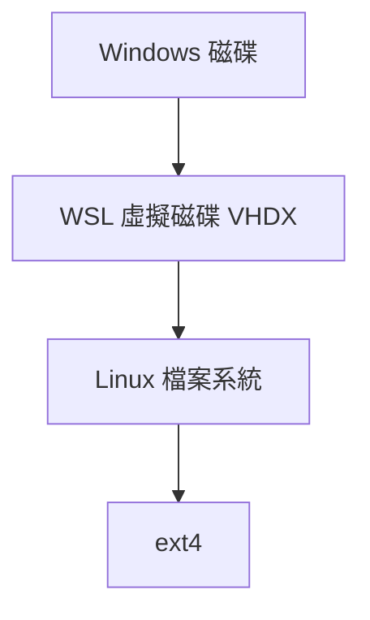

# 管理可用的磁碟空間

> [!info] 說明
> 管理 WSL 的磁碟空間使用和虛擬磁碟維護。

## WSL 磁碟架構



## 查看磁碟使用

### 在 WSL 中查看

```bash
# 查看檔案系統使用量
df -h

# 查看目錄大小
du -sh /home/*
du -sh /var/*

# 查看最大檔案
find / -type f -size +100M 2>/dev/null | head -20

# 使用 ncdu (互動式工具)
sudo apt install ncdu
ncdu /
```

### 在 Windows 中查看

```powershell
# 找到 WSL 虛擬磁碟位置
$env:LOCALAPPDATA\Packages\CanonicalGroupLimited*

# 或
Get-ChildItem -Path "$env:LOCALAPPDATA\Packages" -Filter "*Ubuntu*" -Directory
```

### 查看 VHDX 大小

```powershell
# 查看 VHDX 檔案大小
Get-ChildItem "C:\Users\*\AppData\Local\Packages\CanonicalGroupLimited*\LocalState\ext4.vhdx" |
    Select-Object FullName, @{Name="Size(GB)";Expression={[math]::Round($_.Length/1GB,2)}}
```

## 清理磁碟空間

### 清理 Linux 系統

```bash
# 清理套件快取
sudo apt clean
sudo apt autoclean

# 移除不需要的套件
sudo apt autoremove

# 清理日誌
sudo journalctl --vacuum-size=100M

# 清理暫存檔
sudo rm -rf /tmp/*
sudo rm -rf /var/tmp/*

# 清理 Docker (如果有使用)
docker system prune -a
docker volume prune
```

### 清理套件管理器

```bash
# APT
sudo apt clean
sudo apt autoclean
rm -rf /var/lib/apt/lists/*

# npm
npm cache clean --force

# pip
pip cache purge

# yarn
yarn cache clean
```

### 清理開發工具

```bash
# 清理 Node modules (多個專案)
find . -name "node_modules" -type d -prune -exec rm -rf {} \;

# 清理 Python 虛擬環境
find . -name "venv" -type d -prune -exec rm -rf {} \;
find . -name ".venv" -type d -prune -exec rm -rf {} \;

# 清理編譯產物
find . -name "__pycache__" -type d -exec rm -rf {} +
find . -name "*.pyc" -delete
find . -name "dist" -type d -exec rm -rf {} +
find . -name "build" -type d -exec rm -rf {} +
```

## 壓縮 WSL 虛擬磁碟

### 方法一：使用 diskpart

```powershell
# 1. 關閉 WSL
wsl --shutdown

# 2. 使用 diskpart 壓縮
diskpart
# 在 diskpart 中:
select vdisk file="C:\Users\username\AppData\Local\Packages\CanonicalGroupLimited.UbuntuonWindows_79rhkp1fndgsc\LocalState\ext4.vhdx"
compact vdisk
exit
```

### 方法二：使用 PowerShell

```powershell
# 關閉 WSL
wsl --shutdown

# 找到 VHDX 路徑
$vhdx = Get-ChildItem "$env:LOCALAPPDATA\Packages\CanonicalGroupLimited*\LocalState\ext4.vhdx" | Select-Object -First 1

# 壓縮
Optimize-VHD -Path $vhdx.FullName -Mode Full
```

### 方法三：手動腳本

```powershell
# compress-wsl.ps1
wsl --shutdown
Start-Sleep -Seconds 5

$vhdxPath = "C:\Users\$env:USERNAME\AppData\Local\Packages\CanonicalGroupLimited.UbuntuonWindows_79rhkp1fndgsc\LocalState\ext4.vhdx"

$before = (Get-Item $vhdxPath).Length / 1GB

$diskpartScript = @"
select vdisk file="$vhdxPath"
compact vdisk
exit
"@

$diskpartScript | diskpart

$after = (Get-Item $vhdxPath).Length / 1GB

Write-Host "Before: $([math]::Round($before, 2)) GB"
Write-Host "After: $([math]::Round($after, 2)) GB"
Write-Host "Saved: $([math]::Round($before - $after, 2)) GB"
```

## 擴充 WSL 虛擬磁碟

### 設定最大大小

WSL 2 虛擬磁碟預設最大 1TB (實際按需增長)。

### 強制擴充

如果需要預先分配空間：

```powershell
wsl --shutdown

diskpart
select vdisk file="path\to\ext4.vhdx"
expand vdisk maximum=500GB
exit

# 在 WSL 中擴充檔案系統
wsl
sudo resize2fs /dev/sda 500G
```

## 移動 WSL 到其他磁碟

### 匯出並重新匯入

```powershell
# 1. 匯出發行版
wsl --export Ubuntu D:\backup\ubuntu.tar

# 2. 取消註冊
wsl --unregister Ubuntu

# 3. 匯入到新位置
wsl --import Ubuntu D:\WSL\Ubuntu D:\backup\ubuntu.tar

# 4. 設定預設使用者
# (參考匯入發行版的說明)

# 5. 清理備份
del D:\backup\ubuntu.tar
```

## 監控磁碟使用

### 定期檢查腳本

```bash
#!/bin/bash
# disk-monitor.sh

THRESHOLD=80
usage=$(df -h / | awk 'NR==2 {print $5}' | sed 's/%//')

if [ $usage -gt $THRESHOLD ]; then
    echo "Warning: Disk usage is ${usage}%"
    # 可以發送通知或執行清理
fi
```

### 使用 cron 定期執行

```bash
# 編輯 crontab
crontab -e

# 每天早上 8 點執行
0 8 * * * /home/user/scripts/disk-monitor.sh
```

## 磁碟空間規劃建議

### 建議配置

| 使用類型 | 建議空間 |
|----------|----------|
| 基本使用 | 20-30 GB |
| 開發環境 | 50-100 GB |
| 機器學習 | 100+ GB |
| 容器開發 | 100+ GB |

### 最佳實務

1. **定期清理**: 每週執行清理腳本
2. **監控使用**: 設定警報閾值
3. **專案管理**: 完成的專案移到歸檔或刪除
4. **Docker 清理**: 定期清理未使用的映像檔和容器

## 相關主題

- [[在WSL2中掛接磁碟]] - 磁碟掛接
- [[跨文件系統工作]] - 檔案系統操作
- [[故障排除]] - 常見問題

---
> 📚 返回 [[0 Inbox/_processed/01-Tech/WSL/00-MOCs/MOC-總覽|WSL 知識庫總覽]]
