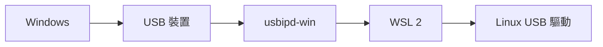

# 連接 USB 裝置

> [!info] 說明
> 在 WSL 2 中連接和使用 USB 裝置。

## USB 裝置支援



## 使用 usbipd-win

### 安裝 usbipd-win

```powershell
# 使用 winget 安裝
winget install usbipd

# 或使用 PowerShell (系統管理員)
# 從 GitHub 下載 MSI 安裝
# https://github.com/dorssel/usbipd-win/releases
```

### 查看連接的 USB 裝置

```powershell
# 列出所有 USB 裝置
usbipd list

# 輸出範例:
# BUSID  DEVICE                                                        STATE
# 1-2    USB Serial Device                                             Not shared
# 1-3    Logitech USB Receiver                                         Not shared
# 2-1    Samsung SSD                                                   Not shared
```

### 共用 USB 裝置

```powershell
# 共用裝置 (需要系統管理員權限)
usbipd bind --busid 1-2

# 查看狀態
usbipd list
# BUSID  DEVICE                    STATE
# 1-2    USB Serial Device         Shared
```

### 將裝置附加到 WSL

```powershell
# 附加裝置到 WSL
usbipd attach --wsl --busid 1-2

# 附加到特定發行版
usbipd attach --wsl --distribution Ubuntu-22.04 --busid 1-2
```

### 在 WSL 中使用裝置

```bash
# 查看已連接的 USB 裝置
lsusb

# 查看 USB 裝置詳情
lsusb -v

# 查看裝置節點
ls -la /dev/ttyUSB*
ls -la /dev/bus/usb/
```

## 常見 USB 裝置使用

### USB 序列埠

```bash
# 安裝序列埠工具
sudo apt install minicom screen

# 連接序列埠
sudo minicom -D /dev/ttyUSB0

# 或使用 screen
sudo screen /dev/ttyUSB0 115200

# 設定權限
sudo usermod -aG dialout $USER
```

### USB 儲存裝置

```bash
# 查看磁碟
lsblk

# 掛接
sudo mkdir /mnt/usb
sudo mount /dev/sdx1 /mnt/usb
```

### USB 網路裝置

```bash
# 查看網路介面
ip link show

# 設定 USB 網卡
sudo ip link set usb0 up
sudo dhclient usb0
```

### USB 音訊裝置

```bash
# 安裝音訊工具
sudo apt install pulseaudio alsa-utils

# 查看音訊裝置
aplay -l
arecord -l
```

## 自動附加 USB 裝置

### 使用 PowerShell 腳本

```powershell
# auto-attach-usb.ps1
$busid = "1-2"
$distro = "Ubuntu"

# 確保裝置已共用
usbipd bind --busid $busid

# 附加到 WSL
usbipd attach --wsl --distribution $distro --busid $busid

Write-Host "USB device attached successfully"
```

### 在 WSL 啟動時自動附加

```bash
# 建立 udev 規則
sudo nano /etc/udev/rules.d/99-usb-serial.rules

# 加入規則
SUBSYSTEM=="tty", ATTRS{idVendor}=="10c4", ATTRS{idProduct}=="ea60", SYMLINK+="usb_serial", MODE="0666"

# 重新載入規則
sudo udevadm control --reload-rules
sudo udevadm trigger
```

## 斷開 USB 裝置

### 從 WSL 分離

```powershell
# 分離裝置
usbipd detach --busid 1-2

# 分離所有裝置
usbipd detach --all
```

### 停止共用

```powershell
# 解除共用
usbipd unbind --busid 1-2
```

## 疑難排解

### 裝置無法附加

```powershell
# 檢查 WSL 是否執行
wsl --list --verbose

# 確保 usbipd 服務執行中
Get-Service usbipd

# 如果服務未執行
Start-Service usbipd
```

### WSL 中看不到裝置

```bash
# 檢查 USB 子系統
lsusb
# 如果沒有輸出，確保 usbipd attach 成功

# 檢查核心模組
lsmod | grep usb

# 載入必要模組
sudo modprobe usbcore
```

### 權限問題

```bash
# 查看裝置權限
ls -la /dev/ttyUSB0

# 加入使用者到適當群組
sudo usermod -aG dialout $USER  # 序列埠
sudo usermod -aG plugdev $USER  # USB 裝置

# 重新登入後生效
```

### 裝置忙碌

```bash
# 查看誰在使用裝置
fuser /dev/ttyUSB0

# 終止使用程序
sudo fuser -k /dev/ttyUSB0
```

## 支援的裝置類型

| 裝置類型 | 支援程度 | 備註 |
|----------|----------|------|
| USB 序列埠 | ✅ 完整 | 需要權限設定 |
| USB 儲存裝置 | ✅ 完整 | |
| USB 網卡 | ✅ 完整 | |
| USB 音訊 | ⚠️ 部分 | 需要 PulseAudio 設定 |
| USB 印表機 | ⚠️ 部分 | 需要 CUPS 設定 |
| USB 轉接器 | ✅ 完整 | |

## 相關主題

- [[在WSL2中掛接磁碟]] - 磁碟掛接
- [[故障排除]] - 常見問題
- [[設定GPU加速]] - GPU 裝置支援

---
> 📚 返回 [[0 Inbox/_processed/01-Tech/WSL/00-MOCs/MOC-總覽|WSL 知識庫總覽]]
