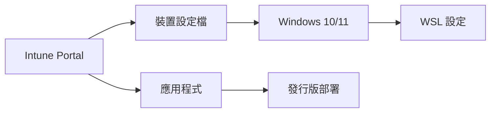

# WSL 的 Intune 設定

> [!info] 說明
> 使用 Microsoft Intune 管理企業中的 WSL 部署和設定。

## Intune 管理概覽



## 設定裝置設定檔

### 建立設定檔

1. 登入 [Microsoft Endpoint Manager 系統管理中心](https://endpoint.microsoft.com/)
2. 選擇「裝置」→「設定檔」→「建立設定檔」
3. 選擇平台: Windows 10 及更新版本
4. 設定檔類型: 範本 → 自訂

### 自訂 OMA-URI 設定

#### 啟用 WSL

| 設定 | 值 |
|------|-----|
| 名稱 | Enable WSL |
| OMA-URI | `./Vendor/MSFT/Policy/Config/Windows/System/AllowSubsystemLinux` |
| 資料類型 | Integer |
| 值 | `1` |

#### 啟用虛擬機器平台

| 設定 | 值 |
|------|-----|
| 名稱 | Enable VM Platform |
| OMA-URI | `./Vendor/MSFT/Policy/Config/Windows/System/AllowVirtualization` |
| 資料類型 | Integer |
| 值 | `1` |

## 部署 .wslconfig 設定

### 使用 PowerShell 腳本

```powershell
# Deploy-WslConfig.ps1
# Intune PowerShell 腳本

# 建立 .wslconfig 內容
$wslConfigContent = @"
[wsl2]
memory=4GB
processors=2
swap=1GB
localhostForwarding=true
guiApplications=true

[experimental]
autoMemoryReclaim=gradual
"@

# 部署設定檔
$configPath = "$env:USERPROFILE\.wslconfig"
Set-Content -Path $configPath -Value $wslConfigContent -Force

# 寫入偵測標記
New-Item -Path "HKCU:\Software\Company\WSL" -Force
Set-ItemProperty -Path "HKCU:\Software\Company\WSL" -Name "ConfigDeployed" -Value 1

Write-Output "WSL config deployed successfully"
```

### 上傳腳本到 Intune

1. Microsoft Endpoint Manager → 裝置 → PowerShell 指令碼
2. 新增 → Windows 10 及更新版本
3. 上傳腳本檔案
4. 指派給目標群組

## 部署發行版

### 使用 WinGet 部署

```json
// winget-configuration.dsc.yaml
properties:
  configurationVersion: 0.2
  resources:
    - resource: Microsoft.Windows/WindowsFeature
      directives:
        description: Enable WSL
      settings:
        name: Microsoft-Windows-Subsystem-Linux
        ensure: Present

    - resource: Microsoft.Windows/WindowsFeature
      directives:
        description: Enable Virtual Machine Platform
      settings:
        name: VirtualMachinePlatform
        ensure: Present

    - resource: Microsoft.WinGet/DSC
      directives:
        description: Install Ubuntu
      settings:
        id: Canonical.Ubuntu.2204
        source: winget
```

### 使用 Intune 應用程式

1. 將發行版封裝為 Win32 應用程式
2. 使用 IntuneWinAppUtil 工具
3. 上傳並部署

## 合規性政策

### 建立合規性規則

```powershell
# 檢測腳本 - 合規性
# Check-WSLCompliance.ps1

$wslFeature = Get-WindowsOptionalFeature -Online -FeatureName Microsoft-Windows-Subsystem-Linux

if ($wslFeature.State -eq "Enabled") {
    # 檢查是否有核准的發行版
    $distros = wsl --list --quiet 2>$null
    $approvedDistros = @("Ubuntu-22.04", "Debian")

    $compliant = $false
    foreach ($distro in $distros) {
        if ($approvedDistros -contains $distro) {
            $compliant = $true
            break
        }
    }

    if ($compliant) {
        Write-Output "Compliant"
        exit 0
    }
}

Write-Output "Non-Compliant"
exit 1
```

### 修復腳本

```powershell
# Remediate-WSL.ps1

# 移除未核准的發行版
$approvedDistros = @("Ubuntu-22.04", "Debian")
$installedDistros = wsl --list --quiet 2>$null

foreach ($distro in $installedDistros) {
    if ($approvedDistros -notcontains $distro) {
        wsl --unregister $distro
    }
}

# 確保有核准的發行版
$hasApproved = $false
foreach ($distro in $installedDistros) {
    if ($approvedDistros -contains $distro) {
        $hasApproved = $true
        break
    }
}

if (-not $hasApproved) {
    wsl --install -d Ubuntu-22.04 --no-launch
}
```

## 設定設定目錄

### 使用設定目錄

1. Microsoft Endpoint Manager → 裝置 → 設定目錄
2. 建立新設定檔
3. 搜尋 "Linux" 或 "Subsystem"
4. 選取並設定

### 可用設定

| 設定 | 說明 |
|------|------|
| AllowSubsystemLinux | 允許/封鎖 WSL |
| AllowVirtualization | 允許虛擬化功能 |

## 指派與部署

### 指派原則


### 部署順序

1. 啟用 WSL 功能原則
2. 啟用虛擬化原則
3. 部署 .wslconfig 腳本
4. 部署發行版應用程式

## 監控與報告

### 查看部署狀態

```powershell
# 使用 Intune PowerShell 模組
Connect-MSGraph

# 查看裝置合規性
Get-IntuneDeviceCompliancePolicy | Select-Object displayName, lastSyncDateTime
```

### 報告儀表板

在 Microsoft Endpoint Manager 中：
1. 報告 → 裝置合規性
2. 選擇原則
3. 查看部署狀態

## 安全性基準

### 建議的安全性設定

```ini
# .wslconfig 安全性建議
[wsl2]
# 限制資源
memory=4GB
processors=2

# 網路設定
localhostForwarding=true

[experimental]
# 啟用防火牆
firewall=true
```

### 網路隔離

使用 Intune 網路設定限制 WSL 的網路存取。

## 疑難排解

### 同步問題

```powershell
# 強制同步 Intune 原則
# 在用戶端執行
Start-Process -FilePath "C:\Windows\System32\deviceenroller.exe" -ArgumentList "/c /AutoEnrollMDM"
```

### 設定未套用

```powershell
# 檢查原則狀態
Get-ItemProperty -Path "HKLM:\SOFTWARE\Microsoft\PolicyManager\current\device\Windows"

# 檢查腳本執行狀態
Get-ChildItem "C:\ProgramData\Microsoft\IntuneManagementExtension\Logs"
```

## 相關主題

- [[為您的公司設定WSL]] - 企業部署概覽
- [[進階設定組態]] - WSL 設定選項
- [[網路相關考量]] - 網路安全設定

---
> 📚 返回 [[0 Inbox/_processed/01-Tech/WSL/00-MOCs/MOC-總覽|WSL 知識庫總覽]]
