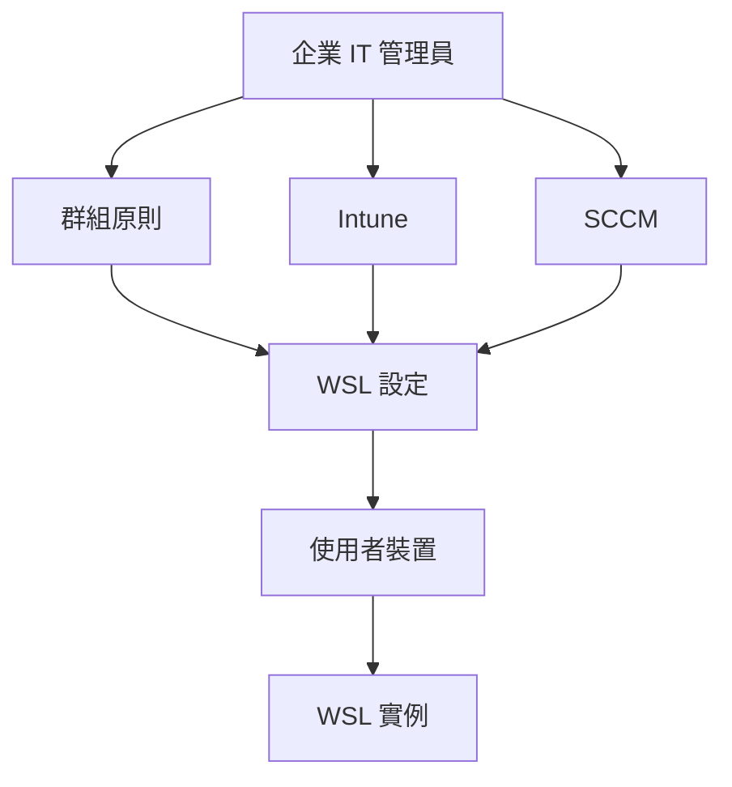

# 為您的公司設定 WSL

> [!info] 說明
> 在企業環境中部署和管理 WSL。

## 企業部署架構



## 企業部署考量

### 安全性需求

| 需求 | 說明 |
|------|------|
| 存取控制 | 限制誰可以安裝和使用 WSL |
| 網路隔離 | 控制 WSL 的網路存取 |
| 資料保護 | 確保敏感資料安全 |
| 稽核追蹤 | 記錄 WSL 活動 |

### 合規性考量

- 資料駐留要求
- 加密需求
- 存取日誌
- 變更管理

## 使用群組原則管理

### 啟用/停用 WSL

```powershell
# 群組原則路徑:
# 電腦設定 -> 系統管理範本 -> Windows 元件 -> Windows 子系統 Linux 版

# 或使用登錄檔
# 啟用 WSL
Set-ItemProperty -Path "HKLM:\SOFTWARE\Microsoft\Windows\CurrentVersion\Lxss" -Name "Enable" -Value 1

# 停用 WSL
Set-ItemProperty -Path "HKLM:\SOFTWARE\Microsoft\Windows\CurrentVersion\Lxss" -Name "Enable" -Value 0
```

### 控制發行版安裝

```powershell
# 限制可安裝的發行版
# 建立允許清單
$allowedDistros = @("Ubuntu-22.04", "Debian")

# 在安裝腳本中檢查
$requestedDistro = $args[0]
if ($allowedDistros -contains $requestedDistro) {
    wsl --install -d $requestedDistro
} else {
    Write-Error "Distribution not allowed"
}
```

## Intune 設定

### 裝置設定檔

建立自訂 OMA-URI 設定：

```
設定名稱: WSL Enable
OMA-URI: ./Vendor/MSFT/Policy/Config/Windows/System/AllowSubsystemLinux
資料類型: Integer
值: 1 (啟用) 或 0 (停用)
```

### 部署 .wslconfig 設定

```xml
<!-- 自訂設定 XML -->
<CustomSettings>
    <Setting Name="CopyWslConfig" Type="REG_DWORD">1</Setting>
</CustomSettings>
```

### 使用 PowerShell 腳本部署

```powershell
# Intune 部署腳本
# Install-WSL.ps1

# 檢查 WSL 是否已安裝
$wslInstalled = Get-WindowsOptionalFeature -Online -FeatureName Microsoft-Windows-Subsystem-Linux

if ($wslInstalled.State -ne "Enabled") {
    # 安裝 WSL
    Enable-WindowsOptionalFeature -Online -FeatureName Microsoft-Windows-Subsystem-Linux -NoRestart
    Enable-WindowsOptionalFeature -Online -FeatureName VirtualMachinePlatform -NoRestart

    # 設定 WSL 2 為預設
    wsl --set-default-version 2
}

# 部署企業設定
$wslConfig = @"
[wsl2]
memory=4GB
processors=2
"@

Set-Content -Path "$env:USERPROFILE\.wslconfig" -Value $wslConfig

# 安裝核准的發行版
wsl --install -d Ubuntu-22.04 --no-launch
```

## SCCM 部署

### 建立應用程式

```powershell
# SCCM 應用程式偵測腳本
# Detection.ps1

$wslFeature = Get-WindowsOptionalFeature -Online -FeatureName Microsoft-Windows-Subsystem-Linux
if ($wslFeature.State -eq "Enabled") {
    Write-Output "WSL Installed"
}
```

### 部署順序

1. 啟用 WSL 功能
2. 安裝 WSL 2 核心更新
3. 安裝核准的發行版
4. 套用企業設定

## 標準化發行版映像

### 建立企業標準映像

```powershell
# 建立 WSL 設定檔
$wslConfig = @"
[wsl2]
memory=4GB
processors=2

[network]
hostname=corp-wsl
"@

# 建立 Linux 設定腳本
$setupScript = @"
#!/bin/bash
# 企業標準設定

# 更新系統
apt update && apt upgrade -y

# 安裝企業工具
apt install -y git curl wget vim

# 設定企業 CA 憑證
# ...

# 設定 Proxy
export http_proxy=http://proxy.company.com:8080
export https_proxy=http://proxy.company.com:8080

# 設定 Git
git config --global user.name "Employee"
git config --global user.email "employee@company.com"
"@

# 匯出標準映像
wsl --export Ubuntu-Base corporate-ubuntu.tar.gz
```

### 部署標準映像

```powershell
# 部署腳本
$downloadUrl = "https://internal-repo/company/ubuntu-corporate.tar.gz"
$downloadPath = "$env:TEMP\ubuntu-corporate.tar.gz"

# 下載映像
Invoke-WebRequest -Uri $downloadUrl -OutFile $downloadPath

# 匯入
wsl --import Ubuntu-Corp "C:\WSL\Ubuntu-Corp" $downloadPath

# 設定預設使用者
# ...

# 清理
Remove-Item $downloadPath
```

## 網路設定

### Proxy 設定

```bash
# 在 Linux 中設定 Proxy
# /etc/environment
http_proxy="http://proxy.company.com:8080"
https_proxy="http://proxy.company.com:8080"
no_proxy="localhost,127.0.0.1,*.company.com"
```

### 防火牆規則

```powershell
# 限制 WSL 網路存取
New-NetFirewallRule -DisplayName "WSL Outbound" `
    -Direction Outbound `
    -InterfaceAlias "vEthernet (WSL)" `
    -Action Block `
    -RemoteAddress "0.0.0.0/0"

# 允許特定目的地
New-NetFirewallRule -DisplayName "WSL Allow Corporate" `
    -Direction Outbound `
    -InterfaceAlias "vEthernet (WSL)" `
    -Action Allow `
    -RemoteAddress "10.0.0.0/8"
```

## 監控與稽核

### 記錄 WSL 使用

```powershell
# 啟用進階稽核
auditpol /set /subcategory:"Process Creation" /success:enable

# 建立 WSL 使用報告
Get-WinEvent -LogName Security |
    Where-Object { $_.Message -like "*wsl.exe*" } |
    Select-Object TimeCreated, Message
```

### 效能監控

```powershell
# 監控 WSL 資源使用
Get-Counter "\Processor(_Total)\% Processor Time" -SampleInterval 5 -MaxSamples 12
```

## 災難復原

### 備份策略

```powershell
# 定期備份 WSL 發行版
$backupPath = "\\fileserver\wsl-backups\$env:USERNAME"
$date = Get-Date -Format "yyyyMMdd"

wsl --export Ubuntu-22.04 "$backupPath\ubuntu-$date.tar.gz"

# 清理舊備份 (保留 30 天)
Get-ChildItem $backupPath |
    Where-Object { $_.LastWriteTime -lt (Get-Date).AddDays(-30) } |
    Remove-Item
```

### 復原程序

```powershell
# 從備份復原
$backupFile = Get-ChildItem "\\fileserver\wsl-backups\$env:USERNAME\ubuntu-*.tar.gz" |
    Sort-Object LastWriteTime -Descending |
    Select-Object -First 1

wsl --import Ubuntu-Restored "C:\WSL\Ubuntu-Restored" $backupFile.FullName
```

## 相關主題

- [[WSL的Intune設定]] - Intune 詳細設定
- [[在WindowsServer上安裝]] - Windows Server 部署
- [[進階設定組態]] - WSL 設定選項

---
> 📚 返回 [[0 Inbox/_processed/01-Tech/WSL/00-MOCs/MOC-總覽|WSL 知識庫總覽]]
