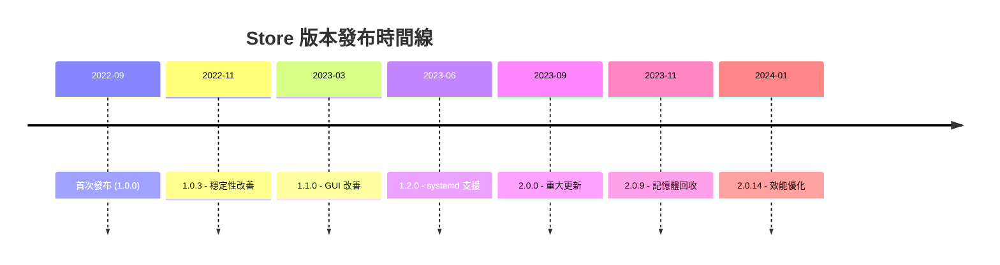

# Microsoft 商店發佈說明

> [!info] 說明
> Microsoft Store 版本 WSL 的發佈資訊。

## Store 版本優勢

| 優勢 | 說明 |
|------|------|
| 獨立更新 | 不依賴 Windows Update |
| 快速發布 | 新功能更快推出 |
| 預覽版 | 可提前體驗新功能 |
| 回復 | 可回復到舊版本 |

## 安裝 Store 版本

### 方法一：從 Microsoft Store 安裝

1. 開啟 Microsoft Store
2. 搜尋 "Windows Subsystem for Linux"
3. 點選「取得」

### 方法二：使用命令列

```powershell
winget install Microsoft.WSL
```

## 版本歷史

### 最新版本

#### 2.0.14.0 (2024年1月)

**新功能**:
- 改善自動記憶體回收
- 網路模式改善
- 效能優化

**修正**:
- 修正網路連線問題
- 修正 GUI 應用程式問題

#### 2.0.9.0 (2023年11月)

**新功能**:
- 自動記憶體回收
- 改善穩定性

**修正**:
- 修正安裝問題
- 修正權限問題

### 版本演進



## 預覽版本

### 加入預覽計畫

1. 開啟 Microsoft Store
2. 找到 WSL 頁面
3. 啟用「取得預覽版」

或使用命令：

```powershell
wsl --update --pre-release
```

### 預覽版功能

預覽版可能包含：
- 實驗性功能
- 新 API
- 效能改善
- Bug 修正

## 更新機制

### 自動更新

Store 版本會自動透過 Microsoft Store 更新。

### 手動更新

```powershell
# 檢查更新
wsl --update

# 或透過 Microsoft Store
# 開啟 Store → 程式庫 → 取得更新
```

### 查看版本

```powershell
wsl --version
```

## 回復到舊版本

### 方法一：透過 Microsoft Store

1. 開啟 Microsoft Store
2. 找到 WSL
3. 選擇「進階選項」
4. 選擇「回復」

### 方法二：手動安裝舊版本

1. 從 [GitHub Releases](https://github.com/microsoft/WSL/releases) 下載舊版 .msixbundle
2. 以系統管理員執行 PowerShell
3. 執行安裝：

```powershell
Add-AppxPackage WSL_x.x.x_x64.msixbundle
```

## 與內建版本比較

| 功能 | 內建版本 | Store 版本 |
|------|----------|------------|
| 更新方式 | Windows Update | Store/命令列 |
| 更新頻率 | 較慢 | 較快 |
| 預覽版 | 無 | 有 |
| 回復 | 困難 | 容易 |
| 安裝 | 內建 | 需手動 |

## 已知問題

### 安裝失敗

**解決方案**:

```powershell
# 重設 Microsoft Store
wsreset.exe

# 重新安裝
winget install Microsoft.WSL --force
```

### 版本衝突

**解決方案**:

```powershell
# 移除舊版本
Remove-AppxPackage Microsoft.WSL

# 重新安裝
winget install Microsoft.WSL
```

### 更新卡住

**解決方案**:

```powershell
# 重設 Store 快取
wsreset.exe

# 手動更新
wsl --update --web-download
```

## 相關主題

- [[一般版本資訊]] - WSL 更新記錄
- [[Linux核心版本資訊]] - 核心更新
- [[安裝WSL]] - 安裝指南

---
> 📚 返回 [[../00-MOCs/MOC-總覽|WSL 知識庫總覽]]
