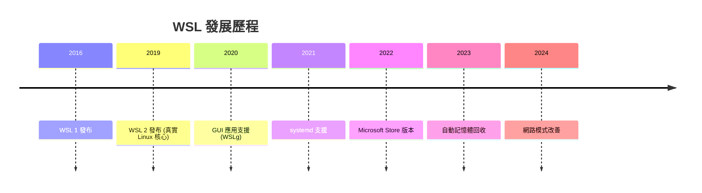

# 一般版本資訊

> [!info] 說明
> WSL 的版本更新記錄和新功能。

## 如何查看版本

```powershell
wsl --version
```

輸出範例：
```
WSL 版本： 2.0.14.0
核心版本： 5.15.133.1-1
WSLg 版本： 1.0.59
MSRDC 版本： 1.2.10586.1
Direct3D 版本： 1.608.2-61064218
DXCore 版本： 10.0.25131.1002-220531-1700.rs-onecore-base2-hyp
Windows 版本： 10.0.22631.3007
```

## 如何更新

```powershell
# 更新 WSL
wsl --update

# 更新到預覽版本
wsl --update --pre-release

# 查看當前版本
wsl --version
```

## 版本歷史

### WSL 2.0.x (最新)

#### 2.0.14 (2024年1月)

**新功能**:
- 改善自動記憶體回收
- 網路模式改善
- 效能優化

**修正**:
- 修正網路連線問題
- 修正檔案系統效能問題

#### 2.0.9 (2023年11月)

**新功能**:
- 自動記憶體回收功能
- 改善網路穩定性
- 支援更多 Linux 發行版

**修正**:
- 修正 GUI 應用程式閃爍問題
- 修正 USB 裝置連線問題

#### 2.0.0 (2023年9月)

**重要變更**:
- 正式版發布
- 完整 GUI 支援
- systemd 支援

### WSL 1.0.x

#### 1.0.0 (2022年9月)

**新功能**:
- Microsoft Store 發布
- 獨立更新機制
- 改善安裝體驗

## 主要功能里程碑



## 新功能詳解

### 自動記憶體回收

```ini
# .wslconfig
[experimental]
autoMemoryReclaim=gradual
```

自動釋放未使用的記憶體回 Windows。

### 網路模式

```ini
# .wslconfig
[wsl2]
networkingMode=mirrored
```

WSL 與 Windows 共用相同 IP 位址。

### systemd 支援

```ini
# /etc/wsl.conf
[boot]
systemd=true
```

完整 systemd 支援，可使用 systemctl 管理服務。

## 更新管道

| 管道 | 說明 |
|------|------|
| Windows Update | 系統更新時自動更新 |
| Microsoft Store | 手動更新 |
| 命令列 | `wsl --update` |
| 預覽版 | `wsl --update --pre-release` |

## 相容性

### Windows 版本需求

| WSL 版本 | Windows 最低版本 |
|----------|------------------|
| 2.0.x | Windows 10 19044+ |
| 1.0.x | Windows 10 19041+ |

### 發行版相容性

所有主要發行版都支援最新版 WSL：
- Ubuntu
- Debian
- Kali Linux
- openSUSE
- Fedora
- Alpine

## 相關主題

- [[Linux核心版本資訊]] - Linux 核心更新
- [[Microsoft商店發佈說明]] - 商店版本資訊
- [[安裝WSL]] - 安裝指南

---
> 📚 返回 [[../00-MOCs/MOC-總覽|WSL 知識庫總覽]]
